# Documentación del Proyecto OOPDesing

## 📋 Descripción del Proyecto

Este proyecto es una colección de ejemplos prácticos que demuestran los principios y conceptos fundamentales de la Programación Orientada a Objetos (OOP) en Java 21.

**Tecnologías:**
- Java 21
- Gradle 8.5
- Lombok 1.18.30
- JUnit 5
- Mockito

**Paquete base:** `ec.com.desing.oop`

---

## 📚 Conceptos de Programación Orientada a Objetos

### 1. Abstracción (Abstraction)

#### ¿Qué es la Abstracción?

La **abstracción** es el proceso de ocultar los detalles de implementación y mostrar solo la funcionalidad esencial al usuario. En Java, esto se logra mediante:

- **Clases abstractas**: Clases que no pueden ser instanciadas directamente y pueden contener métodos abstractos (sin implementación) y métodos concretos (con implementación).
- **Interfaces**: Contratos que definen qué métodos debe implementar una clase, sin especificar cómo.

#### Características de las Clases Abstractas:

1. ✅ Pueden tener métodos abstractos (sin implementación)
2. ✅ Pueden tener métodos concretos (con implementación)
3. ✅ Pueden tener variables de instancia
4. ✅ Pueden tener constructores
5. ❌ **NO pueden ser instanciadas directamente**
6. ✅ Deben ser extendidas por clases concretas

#### Ventajas de la Abstracción:

- **Reducción de complejidad**: Oculta detalles innecesarios
- **Reutilización de código**: Define comportamiento común
- **Flexibilidad**: Permite diferentes implementaciones
- **Mantenibilidad**: Facilita cambios futuros

---

## 🎨 Diagramas UML

### Diagrama de Clases - Abstracción (Animal)

```mermaid
classDiagram
    class Animal {
        <<abstract>>
        #String name
        #int age
        +Animal(String name, int age)
        +String getName()
        +int getAge()
        +void sleep()
        +void displayInfo()
        +{abstract} void makeSound()
        +{abstract} void move()
        +{abstract} String getType()
    }
    
    class Dog {
        -String breed
        +Dog(String name, int age, String breed)
        +void makeSound()
        +void move()
        +String getType()
        +String getBreed()
        +void setBreed(String breed)
    }
    
    class Cat {
        -boolean isIndoor
        +Cat(String name, int age, boolean isIndoor)
        +void makeSound()
        +void move()
        +String getType()
        +boolean isIndoor()
        +void setIndoor(boolean indoor)
    }
    
Animal <|-- Dog : extends
Animal <|-- Cat : extends
```

### Diagrama de Clases - Encapsulación (BankAccount)

```mermaid
classDiagram
    class BankAccount {
        -String accountNumber
        -String accountHolder
        -double balance
        -String accountType
        +BankAccount(String, String, double, String)
        +String getAccountNumber()
        +String getAccountHolder()
        +double getBalance()
        +String getAccountType()
        +void setAccountHolder(String)
        +void setAccountType(String)
        +boolean deposit(double)
        +boolean withdraw(double)
        +boolean transfer(BankAccount, double)
        +void displayAccountInfo()
    }
    
    class Student {
        -String studentId
        -String name
        -int age
        -List~String~ courses
        -double gpa
        +Student(String, String, int)
        +String getStudentId()
        +String getName()
        +int getAge()
        +List~String~ getCourses()
        +double getGpa()
        +void setName(String)
        +void setAge(int)
        +void enrollCourse(String)
        +void dropCourse(String)
        +void updateGpa(double)
        +int getCourseCount()
        +boolean isEnrolledIn(String)
        +void displayStudentInfo()
    }
    
    note for BankAccount "Los atributos son privados.\nSolo se acceden mediante métodos públicos."
    note for Student "Encapsulación con validación\ny protección de datos."
```



### Diagrama de Clases - Descomposición (Person)


### Diagrama de Clases - Generalización (Vehicle)

```mermaid
classDiagram
    class Vehicle {
        #String brand
        #String model
        #int year
        #double price
        #String color
        +Vehicle(String, String, int, double, String)
        +void start()
        +void stop()
        +void displayInfo()
        +String getBrand()
        +double getPrice()
        +void setPrice(double)
    }
    
    class Car {
        -int numberOfDoors
        -String fuelType
        -boolean hasSunroof
        +Car(...)
        +void openTrunk()
        +void honk()
        +void start()
        +void displayInfo()
    }
    
    class Motorcycle {
        -int engineCapacity
        -boolean hasSidecar
        -String bikeType
        +Motorcycle(...)
        +void wheelie()
        +void revEngine()
        +void start()
        +void displayInfo()
    }
    
    Vehicle <|-- Car : extends
    Vehicle <|-- Motorcycle : extends
    
    note for Vehicle "Clase generalizada\ncon características comunes"
    note for Car "Especialización de Vehicle\ncon características de automóvil"
    note for Motorcycle "Especialización de Vehicle\ncon características de motocicleta"
```



#### Leyenda del Diagrama:

- **`<<abstract>>`**: Indica que la clase es abstracta
- **`#`**: Modificador `protected` (accesible en la clase y subclases)
- **`-`**: Modificador `private` (accesible solo en la clase)
- **`+`**: Modificador `public` (accesible desde cualquier lugar)
- **`{abstract}`**: Método abstracto (debe ser implementado)
- **`<|--`**: Relación de herencia (extends)

---

## 🔷 Símbolos de Relación en Diagramas UML

### Relaciones con Rombos

En los diagramas UML, los rombos se usan para representar diferentes tipos de relaciones entre clases:

#### 1. Rombo Lleno (Composición) - `*--`

**Símbolo:** Rombo relleno/negro (diamante sólido)  
**Notación:** `*--` o `*` del lado del rombo

**¿Qué es?**
- Relación de **composición** (parte-de)
- Relación **muy fuerte** donde el objeto contenedor es **dueño** del objeto contenido
- El objeto contenido **no puede existir** sin el objeto contenedor
- Si se destruye el contenedor, se destruyen sus partes

**Características:**
- ✅ Relación **todo-parte**
- ✅ El objeto parte **no puede existir independientemente**
- ✅ **Ciclo de vida dependiente**: Si se elimina el todo, se eliminan las partes
- ✅ **Pertenencia exclusiva**: Una parte pertenece a un solo todo

**Cuándo usar:**
- Cuando una clase **contiene** otra clase y la parte **no tiene sentido sin el todo**
- Ejemplo: `Person` tiene un `Heart` - el corazón no existe sin la persona
- Ejemplo: `Order` tiene `OrderItem` - el item no existe sin la orden

**Ejemplo en código:**
```java
public class Person {
    private Heart heart; // Composición: Person crea y destruye Heart
    
    public Person() {
        this.heart = new Heart(); // Se crea junto con Person
    }
    // Si Person se destruye, Heart también se destruye
}
```

**En diagrama UML:**
```
Person *-- Heart : composition
```

---

#### 2. Rombo Vacío (Agregación) - `o--`

**Símbolo:** Rombo vacío/sin relleno (diamante hueco)  
**Notación:** `o--` o `o` del lado del rombo

**¿Qué es?**
- Relación de **agregación** (tiene-un)
- Relación **débil** donde el objeto contenedor **usa** el objeto contenido
- El objeto contenido **puede existir independientemente**
- Si se destruye el contenedor, las partes **pueden seguir existiendo**

**Características:**
- ✅ Relación **todo-parte**
- ✅ El objeto parte **puede existir independientemente**
- ✅ **Ciclo de vida independiente**: Las partes pueden sobrevivir al todo
- ✅ **Pertenencia compartida**: Una parte puede pertenecer a múltiples todos

**Cuándo usar:**
- Cuando una clase **usa** otra clase pero la parte **tiene sentido por sí sola**
- Ejemplo: `University` tiene `Student` - el estudiante existe sin la universidad
- Ejemplo: `Team` tiene `Player` - el jugador puede cambiar de equipo
- Ejemplo: `Person` tiene `Address` - la dirección puede existir independientemente

**Ejemplo en código:**
```java
public class Person {
    private Address address; // Agregación: Address puede existir sin Person
    
    public Person(Address address) {
        this.address = address; // Se recibe desde afuera
    }
    // Si Person se destruye, Address puede seguir existiendo
}
```

**En diagrama UML:**
```
Person o-- Address : aggregation
```

---

#### 3. Relación de Herencia - `<|--`

**Símbolo:** Flecha con triángulo hueco  
**Notación:** `<|--`

**¿Qué es?**
- Relación de **herencia** o **generalización**
- Una clase **hereda** de otra clase
- La clase hija **es un tipo de** la clase padre

**Cuándo usar:**
- Cuando una clase **es una especialización** de otra
- Ejemplo: `Car extends Vehicle` - Car es un tipo de Vehicle
- Ejemplo: `Student extends Person` - Student es un tipo de Person

**En diagrama UML:**
```
Vehicle <|-- Car : extends
```

---

#### 4. Relación de Implementación - `<|..`

**Símbolo:** Flecha con línea punteada y triángulo hueco  
**Notación:** `<|..` o `..|>`

**¿Qué es?**
- Relación de **implementación de interfaz**
- Una clase **implementa** una interfaz
- La clase debe implementar todos los métodos de la interfaz

**Cuándo usar:**
- Cuando una clase **implementa** una interfaz
- Ejemplo: `class Car implements Drivable`
- Ejemplo: `class Dog implements Animal`

**En diagrama UML:**
```
Drivable <|.. Car : implements
```

---

### Tabla Comparativa de Relaciones

| Tipo | Símbolo | Fuerza | Ciclo de Vida | Ejemplo |
|------|---------|--------|---------------|---------|
| **Composición** | `*--` (rombo lleno) | Muy fuerte | Dependiente | `Person *-- Heart` |
| **Agregación** | `o--` (rombo vacío) | Débil | Independiente | `Person o-- Address` |
| **Herencia** | `<|--` (flecha) | Muy fuerte | Heredado | `Vehicle <|-- Car` |
| **Implementación** | `<|..` (flecha punteada) | Contrato | Independiente | `Drivable <|.. Car` |

---

### Reglas para Decidir qué Relación Usar

#### Usa Composición (Rombo Lleno) cuando:
- ✅ La parte **no tiene sentido sin el todo**
- ✅ La parte **no puede existir independientemente**
- ✅ El todo **crea y destruye** la parte
- ✅ La parte **pertenece exclusivamente** a un todo
- ✅ Ejemplo: `Order *-- OrderItem`, `House *-- Room`, `Car *-- Engine`

#### Usa Agregación (Rombo Vacío) cuando:
- ✅ La parte **tiene sentido por sí sola**
- ✅ La parte **puede existir independientemente**
- ✅ El todo **usa** la parte pero no la crea
- ✅ La parte **puede pertenecer a múltiples todos**
- ✅ Ejemplo: `Person o-- Address`, `Team o-- Player`, `University o-- Student`

#### Usa Herencia cuando:
- ✅ La clase hija **es un tipo de** la clase padre
- ✅ Hay una relación **"es-un"** clara
- ✅ La clase hija **hereda** comportamiento y atributos
- ✅ Ejemplo: `Car extends Vehicle`, `Student extends Person`

#### Usa Implementación cuando:
- ✅ La clase **implementa un contrato** (interfaz)
- ✅ Hay una relación **"puede-hacer"** o **"se comporta-como"**
- ✅ La clase debe **implementar métodos** específicos
- ✅ Ejemplo: `Car implements Drivable`, `Dog implements Animal`

---

### Ejemplos Visuales en Diagramas

#### Ejemplo 1: Composición


#### Ejemplo 2: Agregación


#### Ejemplo 3: Herencia


#### Ejemplo 4: Implementación


---

## 💡 Ejemplos de Código

### Abstracción

#### Ejemplo 1: Clase Abstracta

```java
public abstract class Animal {
    protected String name;
    protected int age;
    
    // Método concreto
    public void sleep() {
        System.out.println(name + " está durmiendo...");
    }
    
    // Métodos abstractos (sin implementación)
    public abstract void makeSound();
    public abstract void move();
    public abstract String getType();
}
```

#### Ejemplo 2: Implementación Concreta

```java
public class Dog extends Animal {
    private String breed;
    
    public Dog(String name, int age, String breed) {
        super(name, age);  // Llama al constructor de la clase padre
        this.breed = breed;
    }
    
    // Implementación obligatoria de métodos abstractos
    @Override
    public void makeSound() {
        System.out.println("Guau guau!");
    }
    
    @Override
    public void move() {
        System.out.println("El perro está corriendo");
    }
    
    @Override
    public String getType() {
        return "Perro";
    }
}
```

#### Ejemplo 3: Uso de Polimorfismo

```java
// Crear instancias
Animal dog = new Dog("Max", 3, "Labrador");
Animal cat = new Cat("Luna", 2, true);

// Usar polimorfismo
List<Animal> animals = new ArrayList<>();
animals.add(dog);
animals.add(cat);

// Iterar usando la abstracción
for (Animal animal : animals) {
    animal.makeSound();  // Cada uno hace su sonido específico
    animal.move();       // Cada uno se mueve de forma diferente
}
```

### Encapsulación

#### Ejemplo 1: Clase con Encapsulación (BankAccount)

```java
public class BankAccount {
    // Atributos privados - no accesibles directamente
    private String accountNumber;
    private String accountHolder;
    private double balance;
    
    // Constructor
    public BankAccount(String accountNumber, String accountHolder, double initialBalance) {
        this.accountNumber = accountNumber;
        this.accountHolder = accountHolder;
        this.balance = initialBalance >= 0 ? initialBalance : 0; // Validación
    }
    
    // Getters - acceso controlado a los datos
    public double getBalance() {
        return balance;
    }
    
    // Setters con validación
    public void setAccountHolder(String accountHolder) {
        if (accountHolder != null && !accountHolder.trim().isEmpty()) {
            this.accountHolder = accountHolder;
        }
    }
    
    // Métodos de negocio - encapsulan la lógica
    public boolean deposit(double amount) {
        if (amount > 0) {
            balance += amount;
            return true;
        }
        return false;
    }
    
    public boolean withdraw(double amount) {
        if (amount > 0 && amount <= balance) {
            balance -= amount;
            return true;
        }
        return false;
    }
}
```

#### Ejemplo 2: Uso de Encapsulación

```java
// Crear instancia
BankAccount account = new BankAccount("ACC001", "Juan Pérez", 1000.0);

// ❌ ERROR: No se puede acceder directamente
// account.balance = 5000; // Error de compilación

// ✅ CORRECTO: Acceso mediante métodos públicos
account.deposit(500.0);
account.withdraw(200.0);

// ✅ CORRECTO: Lectura mediante getter
double currentBalance = account.getBalance();
```

#### Ejemplo 3: Protección de Datos (Student)

```java
public class Student {
    private List<String> courses;
    
    // Retornar una copia para evitar modificación externa
    public List<String> getCourses() {
        return new ArrayList<>(courses); // Copia defensiva
    }
    
    // Controlar cómo se agregan cursos
    public void enrollCourse(String courseName) {
        if (courseName != null && !courses.contains(courseName)) {
            courses.add(courseName);
        }
    }
}
```

### Descomposición

#### Ejemplo 1: Clase Principal con Objeto Descompuesto

```java
public class Person {
    private String id;
    private String firstName;
    private String lastName;
    private Address address; // Objeto descompuesto
    
    public Person(String id, String firstName, String lastName, Address address) {
        this.id = id;
        this.firstName = firstName;
        this.lastName = lastName;
        this.address = address;
    }
    
    public Address getAddress() {
        return address;
    }
}
```

#### Ejemplo 2: Clase Descompuesta Reutilizable

```java
public class Address {
    private String street;
    private String city;
    private String state;
    private String zipCode;
    private String country;
    
    public String getFullAddress() {
        return street + ", " + city + ", " + state + " " + zipCode + ", " + country;
    }
}
```

#### Ejemplo 3: Clase Hija que Reutiliza Descomposición

```java
public class Student extends Person {
    private String studentId;
    private String major;
    
    public Student(String id, String firstName, String lastName, 
                   Address address, String studentId, String major) {
        super(id, firstName, lastName, address);
        this.studentId = studentId;
        this.major = major;
    }
}
```

### Generalización

#### Ejemplo 1: Clase Generalizada (Superclase)

```java
public class Vehicle {
    protected String brand;
    protected String model;
    protected int year;
    protected double price;
    
    public Vehicle(String brand, String model, int year, double price) {
        this.brand = brand;
        this.model = model;
        this.year = year;
        this.price = price;
    }
    
    public void start() {
        System.out.println(brand + " " + model + " está encendiendo...");
    }
    
    public void stop() {
        System.out.println(brand + " " + model + " se ha detenido.");
    }
}
```

#### Ejemplo 2: Clase Especializada (Subclase)

```java
public class Car extends Vehicle {
    private int numberOfDoors;
    private String fuelType;
    
    public Car(String brand, String model, int year, double price,
               int numberOfDoors, String fuelType) {
        super(brand, model, year, price);
        this.numberOfDoors = numberOfDoors;
        this.fuelType = fuelType;
    }
    
    @Override
    public void start() {
        super.start();
        System.out.println("El automóvil está listo para conducir.");
    }
    
    public void openTrunk() {
        System.out.println("Abriendo el maletero");
    }
}
```

#### Ejemplo 3: Uso de Polimorfismo con Generalización

```java
// Crear instancias
Vehicle car = new Car("Toyota", "Camry", 2023, 35000.0, 4, "Gasolina");
Vehicle motorcycle = new Motorcycle("Honda", "CBR600RR", 2023, 12000.0, 600, false, "Sport");

// Usar polimorfismo
List<Vehicle> vehicles = new ArrayList<>();
vehicles.add(car);
vehicles.add(motorcycle);

// Tratar diferentes vehículos de manera uniforme
for (Vehicle vehicle : vehicles) {
    vehicle.start(); // Cada uno ejecuta su propia implementación
    vehicle.stop();
}
```

---

## 📁 Estructura del Proyecto

```
OPPDesing/
├── src/
│   ├── main/
│   │   └── java/
│   │       └── ec/
│   │           └── com/
│   │               └── desing/
│   │                   └── oop/
│   │                       ├── Main.java
│   │                       ├── abstraction/
│   │                           ├── Animal.java          (Clase abstracta)
│   │                           ├── Dog.java             (Implementación concreta)
│   │                           ├── Cat.java             (Implementación concreta)
│   │                           └── AbstractionExample.java
│   │                       ├── encapsulation/
│   │                           ├── BankAccount.java     (Ejemplo de encapsulación)
│   │                           ├── Student.java         (Ejemplo de encapsulación)
│   │                           └── EncapsulationExample.java
│   │                       ├── descomposition/
│   │                           ├── Person.java          (Objeto principal)
│   │                           ├── Address.java         (Objeto descompuesto)
│   │                           ├── Student.java         (Clase hija)
│   │                           └── DecompositionExample.java
│   │                       └── generalization/
│   │                           ├── Vehicle.java         (Clase generalizada)
│   │                           ├── Car.java             (Clase especializada)
│   │                           ├── Motorcycle.java     (Clase especializada)
│   │                           └── GeneralizationExample.java
│   └── test/
│       └── java/
│           └── ec/
│               └── com/
│                   └── desing/
│                       └── oop/
│                           ├── MainTest.java
│                           ├── abstraction/
│                           │   └── AnimalTest.java
│                           ├── encapsulation/
│                           │   ├── BankAccountTest.java
│                           │   └── StudentTest.java
│                           ├── descomposition/
│                           │   └── PersonTest.java
│                           └── generalization/
│                               └── VehicleTest.java
├── build.gradle
├── settings.gradle
└── DOCUMENTACION.md
```

### 2. Encapsulación (Encapsulation)

#### ¿Qué es la Encapsulación?

La **encapsulación** es el mecanismo que oculta los detalles internos de una clase y controla el acceso a los datos mediante métodos públicos (getters y setters). Es uno de los pilares fundamentales de la POO.

#### Características de la Encapsulación:

1. ✅ **Ocultamiento de datos**: Los atributos son privados (`private`)
2. ✅ **Acceso controlado**: Se accede mediante métodos públicos (`public`)
3. ✅ **Validación**: Los setters pueden validar datos antes de asignarlos
4. ✅ **Protección**: Los datos no pueden ser modificados directamente desde fuera
5. ✅ **Flexibilidad**: Permite cambiar la implementación interna sin afectar el código externo

#### Modificadores de Acceso en Java:

| Modificador | Alcance | Descripción |
|-------------|---------|-------------|
| **`private`** | Solo dentro de la clase | No accesible desde fuera |
| **`protected`** | Clase y subclases | Accesible en herencia |
| **`public`** | Cualquier lugar | Accesible desde cualquier parte |
| **`package-private`** | Mismo paquete | Sin modificador (default) |

#### Ventajas de la Encapsulación:

- **Seguridad**: Protege los datos de modificaciones no autorizadas
- **Validación**: Permite validar datos antes de asignarlos
- **Mantenibilidad**: Facilita cambios internos sin afectar código externo
- **Control**: Permite agregar lógica adicional en getters/setters
- **Debugging**: Facilita el seguimiento de cambios en los datos

---

### 3. Descomposición (Decomposition)

#### ¿Qué es la Descomposición?

La **descomposición** es el proceso de dividir un problema complejo en partes más pequeñas y manejables. En lugar de tener una clase monolítica con todas las responsabilidades, dividimos el sistema en clases más pequeñas y especializadas.

#### Características de la Descomposición:

1. ✅ **Separación de responsabilidades**: Cada clase tiene una responsabilidad única
2. ✅ **Reutilización**: Las clases descompuestas pueden usarse en diferentes contextos
3. ✅ **Mantenibilidad**: Cambios en una parte no afectan otras
4. ✅ **Testabilidad**: Cada componente se puede probar de forma independiente
5. ✅ **Legibilidad**: Código más fácil de entender

#### Ventajas de la Descomposición:

- **Modularidad**: Sistema dividido en módulos manejables
- **Reutilización**: Componentes reutilizables en diferentes contextos
- **Mantenibilidad**: Fácil de mantener y modificar
- **Testabilidad**: Componentes probables de forma independiente
- **Colaboración**: Múltiples desarrolladores pueden trabajar en paralelo

---

### 4. Generalización (Generalization)

#### ¿Qué es la Generalización?

La **generalización** es el proceso de crear una clase base (superclase) que contiene características comunes de varias clases relacionadas. Es el proceso inverso de la especialización.

#### Características de la Generalización:

1. ✅ **Clase base común**: Contiene atributos y métodos compartidos
2. ✅ **Herencia**: Las clases hijas heredan características de la superclase
3. ✅ **Especialización**: Las clases hijas agregan características específicas
4. ✅ **Polimorfismo**: Permite tratar diferentes tipos de manera uniforme
5. ✅ **Reutilización**: Evita duplicación de código

#### Ventajas de la Generalización:

- **Reutilización de código**: Características comunes definidas una vez
- **Consistencia**: Diseño consistente entre clases relacionadas
- **Mantenibilidad**: Cambios en la superclase afectan a todas las subclases
- **Polimorfismo**: Permite tratar diferentes tipos de manera uniforme
- **Reducción de duplicación**: Evita código duplicado

---

## 🎨 Diagramas UML

### Diagrama de Clases - Abstracción (Animal)

```java
public abstract class Animal {
    protected String name;
    protected int age;
    
    // Método concreto
    public void sleep() {
        System.out.println(name + " está durmiendo...");
    }
    
    // Métodos abstractos (sin implementación)
    public abstract void makeSound();
    public abstract void move();
    public abstract String getType();
}
```

#### Ejemplo 2: Implementación Concreta

```java
public class Dog extends Animal {
    private String breed;
    
    public Dog(String name, int age, String breed) {
        super(name, age);  // Llama al constructor de la clase padre
        this.breed = breed;
    }
    
    // Implementación obligatoria de métodos abstractos
    @Override
    public void makeSound() {
        System.out.println("Guau guau!");
    }
    
    @Override
    public void move() {
        System.out.println("El perro está corriendo");
    }
    
    @Override
    public String getType() {
        return "Perro";
    }
}
```

#### Ejemplo 3: Uso de Polimorfismo

```java
// Crear instancias
Animal dog = new Dog("Max", 3, "Labrador");
Animal cat = new Cat("Luna", 2, true);

// Usar polimorfismo
List<Animal> animals = new ArrayList<>();
animals.add(dog);
animals.add(cat);

// Iterar usando la abstracción
for (Animal animal : animals) {
    animal.makeSound();  // Cada uno hace su sonido específico
    animal.move();       // Cada uno se mueve de forma diferente
}
```

---

## 🔑 Conceptos Clave - Ayuda Memoria

### Abstracción

| Concepto | Descripción | Ejemplo |
|----------|-------------|---------|
| **Clase Abstracta** | Clase que no puede instanciarse. Puede tener métodos abstractos y concretos. | `abstract class Animal` |
| **Método Abstracto** | Método sin implementación que debe ser sobrescrito por las clases hijas. | `public abstract void makeSound();` |
| **Método Concreto** | Método con implementación completa en la clase abstracta. | `public void sleep() { ... }` |
| **Polimorfismo** | Capacidad de tratar objetos de diferentes clases de manera uniforme. | `Animal animal = new Dog(...);` |
| **@Override** | Anotación que indica que un método sobrescribe un método de la clase padre. | `@Override public void makeSound()` |

### Encapsulación

| Concepto | Descripción | Ejemplo |
|----------|-------------|---------|
| **Atributo Privado** | Variable accesible solo dentro de la clase. | `private double balance;` |
| **Getter** | Método público que retorna el valor de un atributo privado. | `public double getBalance()` |
| **Setter** | Método público que modifica un atributo privado con validación. | `public void setAge(int age)` |
| **Copia Defensiva** | Retornar una copia de una colección para evitar modificación externa. | `return new ArrayList<>(list);` |
| **Validación** | Verificar datos antes de asignarlos en setters. | `if (age >= 0) this.age = age;` |

### Descomposición

| Concepto | Descripción | Ejemplo |
|----------|-------------|---------|
| **Descomposición** | Dividir un problema complejo en partes más pequeñas y manejables. | `Person` usa `Address` |
| **Objeto Descompuesto** | Clase separada que representa una parte del sistema. | `Address` en `Person` |
| **Reutilización** | Usar el mismo objeto descompuesto en diferentes clases. | `Address` en `Person` y `Student` |
| **Separación de Responsabilidades** | Cada clase tiene una responsabilidad única y clara. | `Person` maneja datos personales, `Address` maneja direcciones |
| **Composición** | Relación "tiene-un" donde un objeto contiene otro. | `Person` tiene un `Address` |

### Generalización

| Concepto | Descripción | Ejemplo |
|----------|-------------|---------|
| **Clase Generalizada** | Clase base que contiene características comunes. | `Vehicle` |
| **Clase Especializada** | Clase hija que hereda y agrega características específicas. | `Car extends Vehicle` |
| **Herencia** | Mecanismo por el cual una clase adquiere características de otra. | `class Car extends Vehicle` |
| **@Override** | Anotación que indica sobrescritura de método de la superclase. | `@Override public void start()` |
| **super** | Referencia a la clase padre para acceder a sus miembros. | `super.start()` |

### Reglas Importantes - Abstracción

1. ❌ **NO se puede instanciar una clase abstracta:**
   ```java
   // ERROR: No se puede hacer esto
   Animal animal = new Animal("Test", 1);
   ```

2. ✅ **SÍ se puede crear una referencia de tipo abstracto:**
   ```java
   // CORRECTO: Referencia de tipo Animal apuntando a un Dog
   Animal animal = new Dog("Max", 3, "Labrador");
   ```

3. ✅ **Las clases concretas DEBEN implementar todos los métodos abstractos:**
   ```java
   // Si Animal tiene 3 métodos abstractos, Dog DEBE implementar los 3
   ```

4. ✅ **Se puede tener una mezcla de métodos abstractos y concretos:**
   ```java
   abstract class Animal {
       public void sleep() { ... }        // Método concreto
       public abstract void makeSound();  // Método abstracto
   }
   ```

### Reglas Importantes - Encapsulación

1. ❌ **NO se puede acceder directamente a atributos privados:**
   ```java
   // ERROR: No se puede hacer esto
   BankAccount account = new BankAccount(...);
   account.balance = 5000; // Error de compilación
   ```

2. ✅ **SÍ se debe usar getters y setters:**
   ```java
   // CORRECTO: Acceso mediante métodos públicos
   double balance = account.getBalance();
   account.setAccountHolder("Nuevo Nombre");
   ```

3. ✅ **Los setters deben validar datos:**
   ```java
   public void setAge(int age) {
       if (age >= 0 && age <= 120) {
           this.age = age;
       }
   }
   ```

4. ✅ **Retornar copias defensivas de colecciones:**
   ```java
   public List<String> getCourses() {
       return new ArrayList<>(courses); // Copia, no la lista original
   }
   ```

5. ✅ **No todos los atributos necesitan setters:**
   ```java
   // accountNumber no tiene setter porque no debería cambiar
   private String accountNumber; // Solo getter, sin setter
   ```

### Reglas Importantes - Descomposición

1. ✅ **Separar responsabilidades claramente:**
   ```java
   // Person maneja datos personales
   // Address maneja información de dirección
   Person person = new Person(..., address);
   ```

2. ✅ **Reutilizar objetos descompuestos:**
   ```java
   // Address puede usarse en Person, Student, Employee, etc.
   Address address = new Address(...);
   Person person = new Person(..., address);
   Student student = new Student(..., address);
   ```

3. ✅ **Mantener objetos descompuestos simples:**
   ```java
   // Address solo maneja información de dirección
   // No debe tener lógica de negocio compleja
   ```

### Reglas Importantes - Generalización

1. ✅ **La superclase contiene características comunes:**
   ```java
   // Vehicle tiene brand, model, year, price (común a todos)
   public class Vehicle { ... }
   ```

2. ✅ **Las subclases heredan y especializan:**
   ```java
   // Car hereda de Vehicle y agrega numberOfDoors, fuelType
   public class Car extends Vehicle { ... }
   ```

3. ✅ **Usar @Override para sobrescribir métodos:**
   ```java
   @Override
   public void start() {
       super.start(); // Llamar al método de la superclase
       // Agregar comportamiento específico
   }
   ```

4. ✅ **Acceder a la superclase con super:**
   ```java
   super.start(); // Llama al método start() de Vehicle
   super.getBrand(); // Accede a atributos/métodos de la superclase
   ```

5. ✅ **Usar polimorfismo con la clase generalizada:**
   ```java
   Vehicle vehicle = new Car(...); // Referencia de tipo Vehicle
   vehicle.start(); // Ejecuta el método de Car
   ```

---

## 🧪 Ejecutar el Proyecto

### Compilar el proyecto:
```bash
./gradlew build
```

### Ejecutar las pruebas:
```bash
./gradlew test
```

### Ejecutar el ejemplo de abstracción:
```bash
./gradlew run -PmainClass=ec.com.desing.oop.abstraction.AbstractionExample
```

### Ejecutar el ejemplo de encapsulación:
```bash
./gradlew run -PmainClass=ec.com.desing.oop.encapsulation.EncapsulationExample
```

### Ejecutar el ejemplo de descomposición:
```bash
./gradlew run -PmainClass=ec.com.desing.oop.descomposition.DecompositionExample
```

### Ejecutar el ejemplo de generalización:
```bash
./gradlew run -PmainClass=ec.com.desing.oop.generalization.GeneralizationExample
```

### Ver reporte de pruebas:
```bash
./gradlew test --info
```

---

## 📝 Notas Adicionales

### Diferencias entre Clase Abstracta e Interfaz

| Característica | Clase Abstracta | Interfaz |
|----------------|----------------|----------|
| **Instanciación** | ❌ No se puede instanciar | ❌ No se puede instanciar |
| **Métodos abstractos** | ✅ Puede tener | ✅ Solo métodos abstractos (antes de Java 8) |
| **Métodos concretos** | ✅ Puede tener | ✅ Desde Java 8 (default, static) |
| **Variables** | ✅ Puede tener variables de instancia | ❌ Solo constantes (public static final) |
| **Constructores** | ✅ Puede tener | ❌ No puede tener |
| **Herencia múltiple** | ❌ No soporta | ✅ Soporta (múltiples interfaces) |
| **Modificadores de acceso** | ✅ Cualquier modificador | ✅ Solo public (implícito) |

### Cuándo usar Clase Abstracta vs Interfaz

**Usa Clase Abstracta cuando:**
- Quieres compartir código común entre clases relacionadas
- Necesitas definir variables de instancia no estáticas
- Quieres proporcionar implementaciones por defecto
- Las clases hijas comparten una relación "es-un" fuerte

**Usa Interfaz cuando:**
- Quieres definir un contrato que múltiples clases no relacionadas pueden implementar
- Necesitas herencia múltiple
- Quieres especificar comportamiento sin implementación
- Las clases implementadoras tienen una relación "puede-hacer" o "se comporta-como"

---

## 🔄 Próximos Conceptos a Implementar

- [x] Encapsulación (Encapsulation) ✅
- [x] Descomposición (Decomposition) ✅
- [x] Generalización (Generalization) ✅
- [ ] Herencia (Inheritance) - Cubierto parcialmente en Generalización
- [ ] Polimorfismo (Polymorphism) - Cubierto parcialmente en Generalización
- [ ] Interfaces
- [ ] Composición vs Herencia
- [ ] Principios SOLID

---

## 📖 Referencias

- [Oracle Java Documentation - Abstract Classes](https://docs.oracle.com/javase/tutorial/java/IandI/abstract.html)
- [Java 21 Documentation](https://docs.oracle.com/en/java/javase/21/)
- [Gradle User Guide](https://docs.gradle.org/)

---

**Última actualización:** 2024

