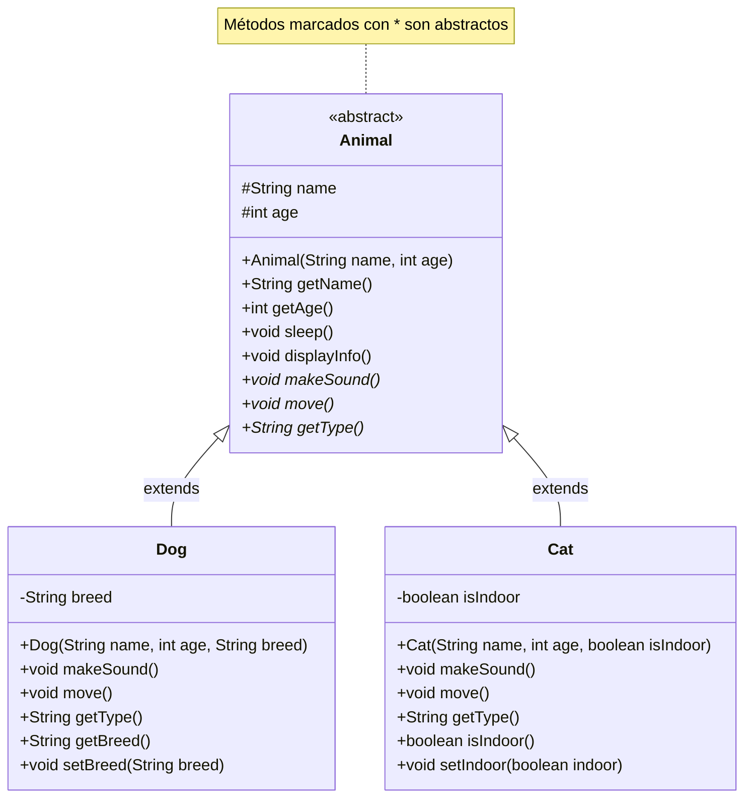
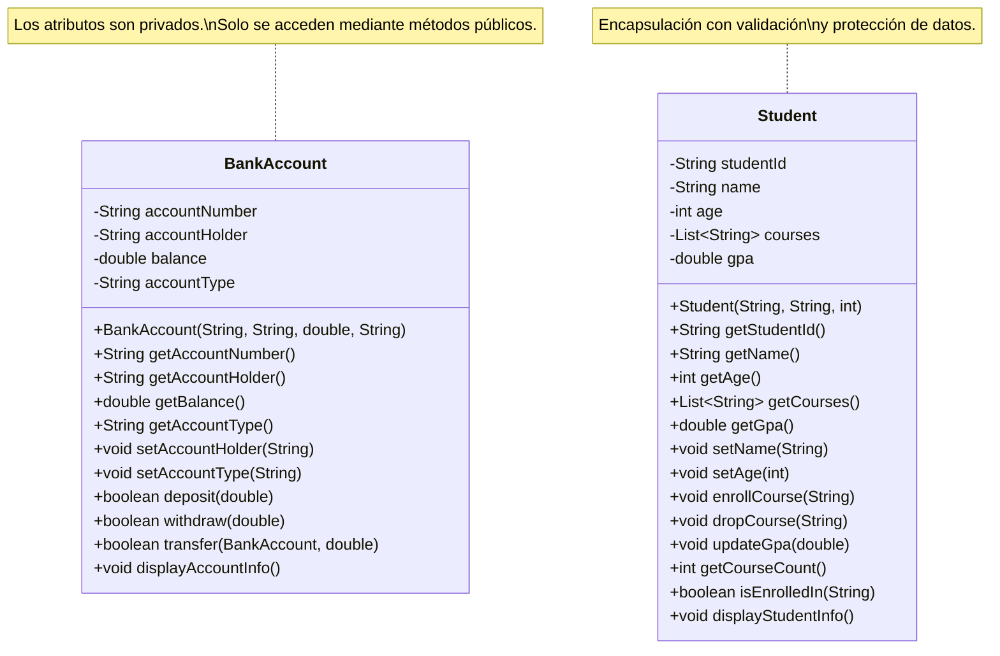
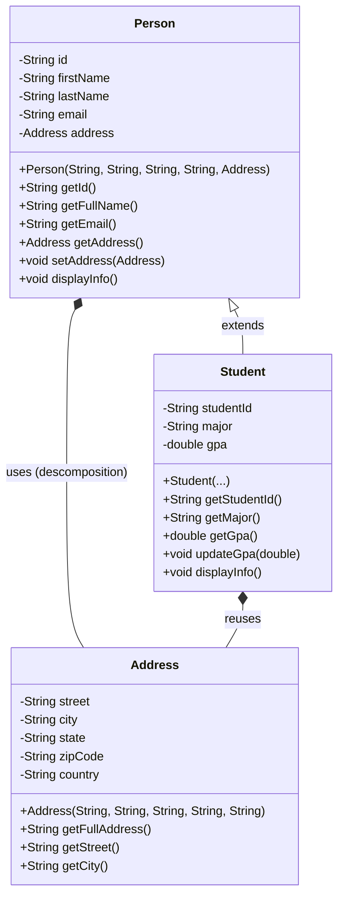
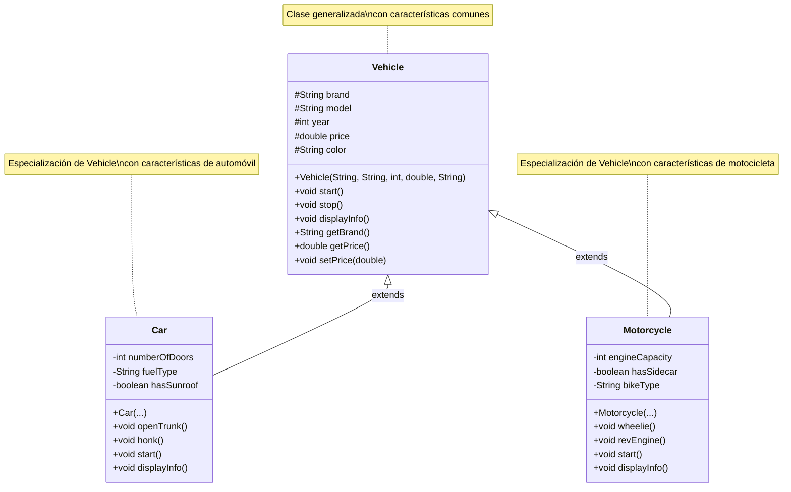
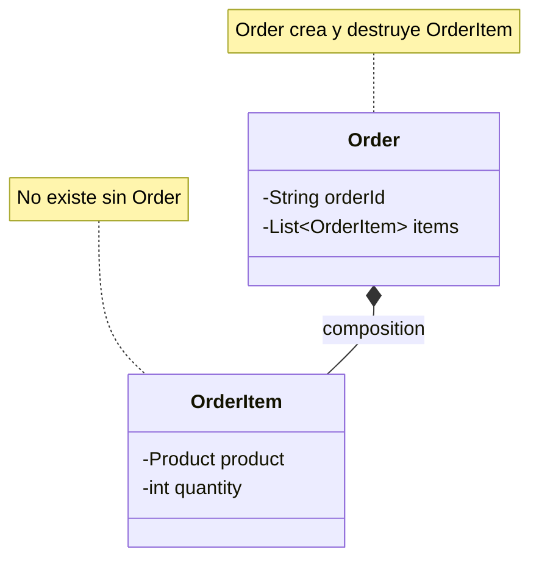
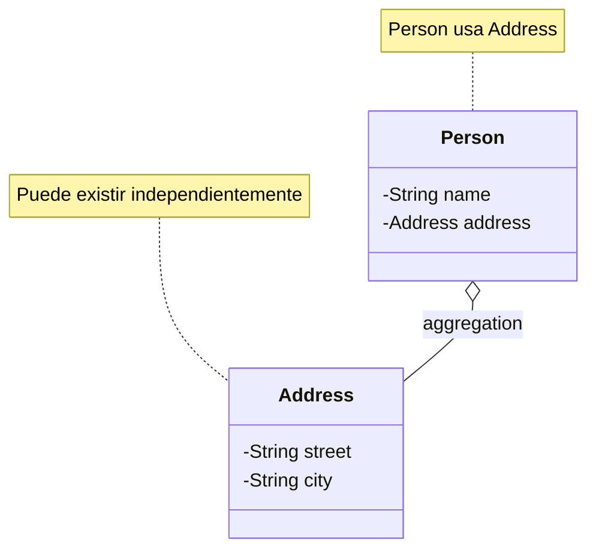
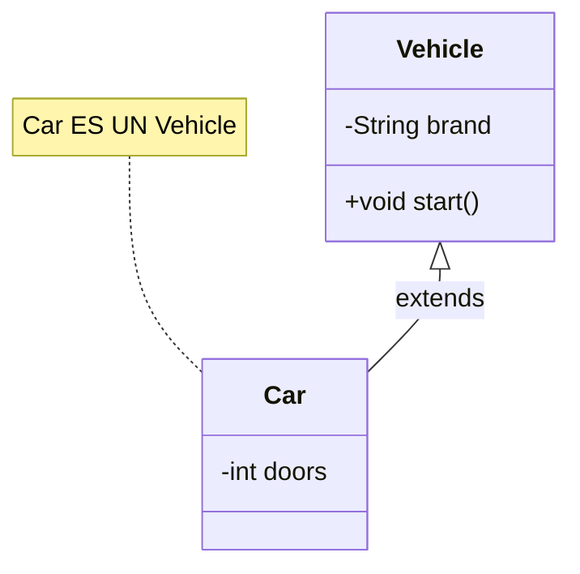
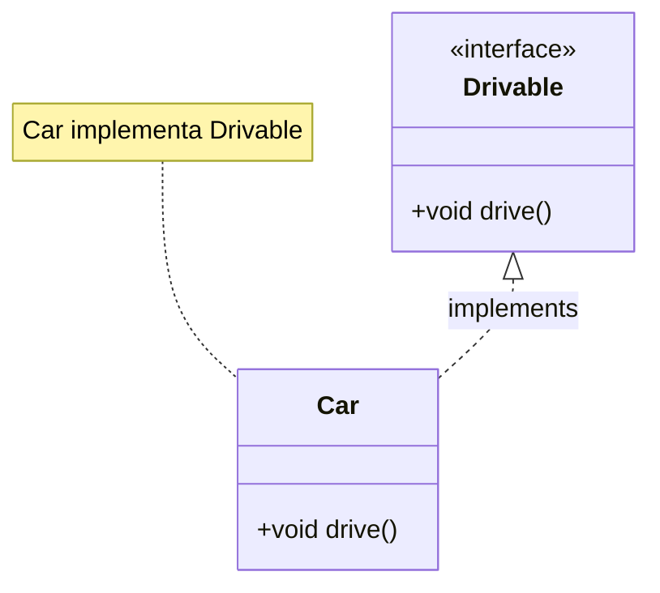

# Documentación del Proyecto OOPDesing

## 📋 Descripción del Proyecto

Este proyecto es una colección de ejemplos prácticos que demuestran los principios y conceptos fundamentales de la Programación Orientada a Objetos (OOP) en Java 21.

**Tecnologías:**
- Java 21
- Gradle 8.5
- Lombok 1.18.30
- JUnit 5
- Mockito

**Paquete base:** `ec.com.desing.oop`

---

## 📑 Índice / Menú de Navegación

### 🔰 Conceptos Fundamentales (Básicos)
1. [🔗 Cohesión y Acoplamiento](#-cohesión-y-acoplamiento)
   - [Cohesión (Cohesion)](#cohesión-cohesion)
   - [Acoplamiento (Coupling)](#acoplamiento-coupling)
   - [Relación entre Cohesión y Acoplamiento](#relación-entre-cohesión-y-acoplamiento)
   - [Ejemplos Rápidos](#ejemplos-rápidos)

### 🏛️ Pilares de la Programación Orientada a Objetos
2. [📦 Encapsulación (Encapsulation)](#2-encapsulación-encapsulation)
3. [🔍 Abstracción (Abstraction)](#3-abstracción-abstraction)
4. [🧩 Descomposición (Decomposition)](#4-descomposición-decomposition)
- [🔀 Separación de Responsabilidades (Separation of Concerns)](#separación-de-responsabilidades-separation-of-concerns)
5. [🔺 Generalización (Generalization)](#5-generalización-generalization)

### 🎨 Diagramas y Relaciones UML
6. [🎨 Diagramas UML](#-diagramas-uml)
   - [Diagrama de Clases - Abstracción](#diagrama-de-clases---abstracción-animal)
   - [Diagrama de Clases - Encapsulación](#diagrama-de-clases---encapsulación-bankaccount)
   - [Diagrama de Clases - Descomposición](#diagrama-de-clases---descomposición-person)
   - [Diagrama de Clases - Generalización](#diagrama-de-clases---generalización-vehicle)
7. [🔷 Símbolos de Relación en Diagramas UML](#-símbolos-de-relación-en-diagramas-uml)
   - [Rombo Lleno (Composición)](#1-rombo-lleno-composición----)
   - [Rombo Vacío (Agregación)](#2-rombo-vacío-agregación----)
   - [Relación de Herencia](#3-relación-de-herencia----)
   - [Relación de Implementación](#4-relación-de-implementación----)

### 💻 Ejemplos y Código
8. [💡 Ejemplos de Código](#-ejemplos-de-código)
9. [📁 Estructura del Proyecto](#-estructura-del-proyecto)
10. [🔑 Conceptos Clave - Ayuda Memoria](#-conceptos-clave---ayuda-memoria)

### 🛠️ Guías Prácticas
11. [🧪 Ejecutar el Proyecto](#-ejecutar-el-proyecto)
12. [📝 Notas Adicionales](#-notas-adicionales)
   - [Diferencias entre Clase Abstracta e Interfaz](#diferencias-entre-clase-abstracta-e-interfaz)
   - [Cuándo usar Clase Abstracta vs Interfaz](#cuándo-usar-clase-abstracta-vs-interfaz)
13. [🔄 Próximos Conceptos a Implementar](#-próximos-conceptos-a-implementar)
14. [📖 Referencias](#-referencias)

---

## 📚 Conceptos de Programación Orientada a Objetos

### 🔰 Conceptos Fundamentales

## 🔗 Cohesión y Acoplamiento

### 3. Abstracción (Abstraction)

#### ¿Qué es la Abstracción?

La **abstracción** es el proceso de ocultar los detalles de implementación y mostrar solo la funcionalidad esencial al usuario. En Java, esto se logra mediante:

- **Clases abstractas**: Clases que no pueden ser instanciadas directamente y pueden contener métodos abstractos (sin implementación) y métodos concretos (con implementación).
- **Interfaces**: Contratos que definen qué métodos debe implementar una clase, sin especificar cómo.

#### Características de las Clases Abstractas:

1. ✅ Pueden tener métodos abstractos (sin implementación)
2. ✅ Pueden tener métodos concretos (con implementación)
3. ✅ Pueden tener variables de instancia
4. ✅ Pueden tener constructores
5. ❌ **NO pueden ser instanciadas directamente**
6. ✅ Deben ser extendidas por clases concretas

#### Ventajas de la Abstracción:

- **Reducción de complejidad**: Oculta detalles innecesarios
- **Reutilización de código**: Define comportamiento común
- **Flexibilidad**: Permite diferentes implementaciones
- **Mantenibilidad**: Facilita cambios futuros

---

## 🎨 Diagramas UML

### Diagrama de Clases - Abstracción (Animal)



### Diagrama de Clases - Encapsulación (BankAccount)



### Diagrama de Clases - Descomposición (Person)



### Diagrama de Clases - Generalización (Vehicle)



#### Leyenda del Diagrama:

- **`<<abstract>>`**: Indica que la clase es abstracta
- **`#`**: Modificador `protected` (accesible en la clase y subclases)
- **`-`**: Modificador `private` (accesible solo en la clase)
- **`+`**: Modificador `public` (accesible desde cualquier lugar)
- **`*` al final del método**: Indica método abstracto (debe ser implementado)
- **`<|--`**: Relación de herencia (extends)

---

## 🔷 Símbolos de Relación en Diagramas UML

### Relaciones con Rombos

En los diagramas UML, los rombos se usan para representar diferentes tipos de relaciones entre clases:

#### 1. Rombo Lleno (Composición) - `*--`

**Símbolo:** Rombo relleno/negro (diamante sólido)  
**Notación:** `*--` o `*` del lado del rombo

**¿Qué es?**
- Relación de **composición** (parte-de)
- Relación **muy fuerte** donde el objeto contenedor es **dueño** del objeto contenido
- El objeto contenido **no puede existir** sin el objeto contenedor
- Si se destruye el contenedor, se destruyen sus partes

**Características:**
- ✅ Relación **todo-parte**
- ✅ El objeto parte **no puede existir independientemente**
- ✅ **Ciclo de vida dependiente**: Si se elimina el todo, se eliminan las partes
- ✅ **Pertenencia exclusiva**: Una parte pertenece a un solo todo

**Cuándo usar:**
- Cuando una clase **contiene** otra clase y la parte **no tiene sentido sin el todo**
- Ejemplo: `Person` tiene un `Heart` - el corazón no existe sin la persona
- Ejemplo: `Order` tiene `OrderItem` - el item no existe sin la orden

**Ejemplo en código:**
```java
public class Person {
    private Heart heart; // Composición: Person crea y destruye Heart
    
    public Person() {
        this.heart = new Heart(); // Se crea junto con Person
    }
    // Si Person se destruye, Heart también se destruye
}
```

**En diagrama UML:**
```
Person *-- Heart : composition
```

---

#### 2. Rombo Vacío (Agregación) - `o--`

**Símbolo:** Rombo vacío/sin relleno (diamante hueco)  
**Notación:** `o--` o `o` del lado del rombo

**¿Qué es?**
- Relación de **agregación** (tiene-un)
- Relación **débil** donde el objeto contenedor **usa** el objeto contenido
- El objeto contenido **puede existir independientemente**
- Si se destruye el contenedor, las partes **pueden seguir existiendo**

**Características:**
- ✅ Relación **todo-parte**
- ✅ El objeto parte **puede existir independientemente**
- ✅ **Ciclo de vida independiente**: Las partes pueden sobrevivir al todo
- ✅ **Pertenencia compartida**: Una parte puede pertenecer a múltiples todos

**Cuándo usar:**
- Cuando una clase **usa** otra clase pero la parte **tiene sentido por sí sola**
- Ejemplo: `University` tiene `Student` - el estudiante existe sin la universidad
- Ejemplo: `Team` tiene `Player` - el jugador puede cambiar de equipo
- Ejemplo: `Person` tiene `Address` - la dirección puede existir independientemente

**Ejemplo en código:**
```java
public class Person {
    private Address address; // Agregación: Address puede existir sin Person
    
    public Person(Address address) {
        this.address = address; // Se recibe desde afuera
    }
    // Si Person se destruye, Address puede seguir existiendo
}
```

**En diagrama UML:**
```
Person o-- Address : aggregation
```

---

#### 3. Relación de Herencia - `<|--`

**Símbolo:** Flecha con triángulo hueco  
**Notación:** `<|--`

**¿Qué es?**
- Relación de **herencia** o **generalización**
- Una clase **hereda** de otra clase
- La clase hija **es un tipo de** la clase padre

**Cuándo usar:**
- Cuando una clase **es una especialización** de otra
- Ejemplo: `Car extends Vehicle` - Car es un tipo de Vehicle
- Ejemplo: `Student extends Person` - Student es un tipo de Person

**En diagrama UML:**
```
Vehicle <|-- Car : extends
```

---

#### 4. Relación de Implementación - `<|..`

**Símbolo:** Flecha con línea punteada y triángulo hueco  
**Notación:** `<|..` o `..|>`

**¿Qué es?**
- Relación de **implementación de interfaz**
- Una clase **implementa** una interfaz
- La clase debe implementar todos los métodos de la interfaz

**Cuándo usar:**
- Cuando una clase **implementa** una interfaz
- Ejemplo: `class Car implements Drivable`
- Ejemplo: `class Dog implements Animal`

**En diagrama UML:**
```
Drivable <|.. Car : implements
```

---

### Tabla Comparativa de Relaciones

| Tipo | Símbolo | Fuerza | Ciclo de Vida | Ejemplo |
|------|---------|--------|---------------|---------|
| **Composición** | `*--` (rombo lleno) | Muy fuerte | Dependiente | `Person *-- Heart` |
| **Agregación** | `o--` (rombo vacío) | Débil | Independiente | `Person o-- Address` |
| **Herencia** | `<|--` (flecha) | Muy fuerte | Heredado | `Vehicle <|-- Car` |
| **Implementación** | `<|..` (flecha punteada) | Contrato | Independiente | `Drivable <|.. Car` |

---

### Reglas para Decidir qué Relación Usar

#### Usa Composición (Rombo Lleno) cuando:
- ✅ La parte **no tiene sentido sin el todo**
- ✅ La parte **no puede existir independientemente**
- ✅ El todo **crea y destruye** la parte
- ✅ La parte **pertenece exclusivamente** a un todo
- ✅ Ejemplo: `Order *-- OrderItem`, `House *-- Room`, `Car *-- Engine`

#### Usa Agregación (Rombo Vacío) cuando:
- ✅ La parte **tiene sentido por sí sola**
- ✅ La parte **puede existir independientemente**
- ✅ El todo **usa** la parte pero no la crea
- ✅ La parte **puede pertenecer a múltiples todos**
- ✅ Ejemplo: `Person o-- Address`, `Team o-- Player`, `University o-- Student`

#### Usa Herencia cuando:
- ✅ La clase hija **es un tipo de** la clase padre
- ✅ Hay una relación **"es-un"** clara
- ✅ La clase hija **hereda** comportamiento y atributos
- ✅ Ejemplo: `Car extends Vehicle`, `Student extends Person`

#### Usa Implementación cuando:
- ✅ La clase **implementa un contrato** (interfaz)
- ✅ Hay una relación **"puede-hacer"** o **"se comporta-como"**
- ✅ La clase debe **implementar métodos** específicos
- ✅ Ejemplo: `Car implements Drivable`, `Dog implements Animal`

---

### Ejemplos Visuales en Diagramas

#### Ejemplo 1: Composición


#### Ejemplo 2: Agregación


#### Ejemplo 3: Herencia


#### Ejemplo 4: Implementación


---

## 💡 Ejemplos de Código

### Abstracción

#### Ejemplo 1: Clase Abstracta

```java
public abstract class Animal {
    protected String name;
    protected int age;
    
    // Método concreto
    public void sleep() {
        System.out.println(name + " está durmiendo...");
    }
    
    // Métodos abstractos (sin implementación)
    public abstract void makeSound();
    public abstract void move();
    public abstract String getType();
}
```

#### Ejemplo 2: Implementación Concreta

```java
public class Dog extends Animal {
    private String breed;
    
    public Dog(String name, int age, String breed) {
        super(name, age);  // Llama al constructor de la clase padre
        this.breed = breed;
    }
    
    // Implementación obligatoria de métodos abstractos
    @Override
    public void makeSound() {
        System.out.println("Guau guau!");
    }
    
    @Override
    public void move() {
        System.out.println("El perro está corriendo");
    }
    
    @Override
    public String getType() {
        return "Perro";
    }
}
```

#### Ejemplo 3: Uso de Polimorfismo

```java
// Crear instancias
Animal dog = new Dog("Max", 3, "Labrador");
Animal cat = new Cat("Luna", 2, true);

// Usar polimorfismo
List<Animal> animals = new ArrayList<>();
animals.add(dog);
animals.add(cat);

// Iterar usando la abstracción
for (Animal animal : animals) {
    animal.makeSound();  // Cada uno hace su sonido específico
    animal.move();       // Cada uno se mueve de forma diferente
}
```

### Encapsulación

#### Ejemplo 1: Clase con Encapsulación (BankAccount)

```java
public class BankAccount {
    // Atributos privados - no accesibles directamente
    private String accountNumber;
    private String accountHolder;
    private double balance;
    
    // Constructor
    public BankAccount(String accountNumber, String accountHolder, double initialBalance) {
        this.accountNumber = accountNumber;
        this.accountHolder = accountHolder;
        this.balance = initialBalance >= 0 ? initialBalance : 0; // Validación
    }
    
    // Getters - acceso controlado a los datos
    public double getBalance() {
        return balance;
    }
    
    // Setters con validación
    public void setAccountHolder(String accountHolder) {
        if (accountHolder != null && !accountHolder.trim().isEmpty()) {
            this.accountHolder = accountHolder;
        }
    }
    
    // Métodos de negocio - encapsulan la lógica
    public boolean deposit(double amount) {
        if (amount > 0) {
            balance += amount;
            return true;
        }
        return false;
    }
    
    public boolean withdraw(double amount) {
        if (amount > 0 && amount <= balance) {
            balance -= amount;
            return true;
        }
        return false;
    }
}
```

#### Ejemplo 2: Uso de Encapsulación

```java
// Crear instancia
BankAccount account = new BankAccount("ACC001", "Juan Pérez", 1000.0);

// ❌ ERROR: No se puede acceder directamente
// account.balance = 5000; // Error de compilación

// ✅ CORRECTO: Acceso mediante métodos públicos
account.deposit(500.0);
account.withdraw(200.0);

// ✅ CORRECTO: Lectura mediante getter
double currentBalance = account.getBalance();
```

#### Ejemplo 3: Protección de Datos (Student)

```java
public class Student {
    private List<String> courses;
    
    // Retornar una copia para evitar modificación externa
    public List<String> getCourses() {
        return new ArrayList<>(courses); // Copia defensiva
    }
    
    // Controlar cómo se agregan cursos
    public void enrollCourse(String courseName) {
        if (courseName != null && !courses.contains(courseName)) {
            courses.add(courseName);
        }
    }
}
```

### Descomposición

#### Ejemplo 1: Clase Principal con Objeto Descompuesto

```java
public class Person {
    private String id;
    private String firstName;
    private String lastName;
    private Address address; // Objeto descompuesto
    
    public Person(String id, String firstName, String lastName, Address address) {
        this.id = id;
        this.firstName = firstName;
        this.lastName = lastName;
        this.address = address;
    }
    
    public Address getAddress() {
        return address;
    }
}
```

#### Ejemplo 2: Clase Descompuesta Reutilizable

```java
public class Address {
    private String street;
    private String city;
    private String state;
    private String zipCode;
    private String country;
    
    public String getFullAddress() {
        return street + ", " + city + ", " + state + " " + zipCode + ", " + country;
    }
}
```

#### Ejemplo 3: Clase Hija que Reutiliza Descomposición

```java
public class Student extends Person {
    private String studentId;
    private String major;
    
    public Student(String id, String firstName, String lastName, 
                   Address address, String studentId, String major) {
        super(id, firstName, lastName, address);
        this.studentId = studentId;
        this.major = major;
    }
}
```

### Generalización

#### Ejemplo 1: Clase Generalizada (Superclase)

```java
public class Vehicle {
    protected String brand;
    protected String model;
    protected int year;
    protected double price;
    
    public Vehicle(String brand, String model, int year, double price) {
        this.brand = brand;
        this.model = model;
        this.year = year;
        this.price = price;
    }
    
    public void start() {
        System.out.println(brand + " " + model + " está encendiendo...");
    }
    
    public void stop() {
        System.out.println(brand + " " + model + " se ha detenido.");
    }
}
```

#### Ejemplo 2: Clase Especializada (Subclase)

```java
public class Car extends Vehicle {
    private int numberOfDoors;
    private String fuelType;
    
    public Car(String brand, String model, int year, double price,
               int numberOfDoors, String fuelType) {
        super(brand, model, year, price);
        this.numberOfDoors = numberOfDoors;
        this.fuelType = fuelType;
    }
    
    @Override
    public void start() {
        super.start();
        System.out.println("El automóvil está listo para conducir.");
    }
    
    public void openTrunk() {
        System.out.println("Abriendo el maletero");
    }
}
```

#### Ejemplo 3: Uso de Polimorfismo con Generalización

```java
// Crear instancias
Vehicle car = new Car("Toyota", "Camry", 2023, 35000.0, 4, "Gasolina");
Vehicle motorcycle = new Motorcycle("Honda", "CBR600RR", 2023, 12000.0, 600, false, "Sport");

// Usar polimorfismo
List<Vehicle> vehicles = new ArrayList<>();
vehicles.add(car);
vehicles.add(motorcycle);

// Tratar diferentes vehículos de manera uniforme
for (Vehicle vehicle : vehicles) {
    vehicle.start(); // Cada uno ejecuta su propia implementación
    vehicle.stop();
}
```

---

## 📁 Estructura del Proyecto

```
OPPDesing/
├── src/
│   ├── main/
│   │   └── java/
│   │       └── ec/
│   │           └── com/
│   │               └── desing/
│   │                   └── oop/
│   │                       ├── Main.java
│   │                       ├── abstraction/
│   │                           ├── Animal.java          (Clase abstracta)
│   │                           ├── Dog.java             (Implementación concreta)
│   │                           ├── Cat.java             (Implementación concreta)
│   │                           └── AbstractionExample.java
│   │                       ├── encapsulation/
│   │                           ├── BankAccount.java     (Ejemplo de encapsulación)
│   │                           ├── Student.java         (Ejemplo de encapsulación)
│   │                           └── EncapsulationExample.java
│   │                       ├── descomposition/
│   │                           ├── Person.java          (Objeto principal)
│   │                           ├── Address.java         (Objeto descompuesto)
│   │                           ├── Student.java         (Clase hija)
│   │                           └── DecompositionExample.java
│   │                       └── generalization/
│   │                           ├── Vehicle.java         (Clase generalizada)
│   │                           ├── Car.java             (Clase especializada)
│   │                           ├── Motorcycle.java     (Clase especializada)
│   │                           └── GeneralizationExample.java
│   └── test/
│       └── java/
│           └── ec/
│               └── com/
│                   └── desing/
│                       └── oop/
│                           ├── MainTest.java
│                           ├── abstraction/
│                           │   └── AnimalTest.java
│                           ├── encapsulation/
│                           │   ├── BankAccountTest.java
│                           │   └── StudentTest.java
│                           ├── descomposition/
│                           │   └── PersonTest.java
│                           └── generalization/
│                               └── VehicleTest.java
├── build.gradle
├── settings.gradle
└── DOCUMENTACION.md
```

### 2. Encapsulación (Encapsulation)

#### ¿Qué es la Encapsulación?

La **encapsulación** es el mecanismo que oculta los detalles internos de una clase y controla el acceso a los datos mediante métodos públicos (getters y setters). Es uno de los pilares fundamentales de la POO.

#### Características de la Encapsulación:

1. ✅ **Ocultamiento de datos**: Los atributos son privados (`private`)
2. ✅ **Acceso controlado**: Se accede mediante métodos públicos (`public`)
3. ✅ **Validación**: Los setters pueden validar datos antes de asignarlos
4. ✅ **Protección**: Los datos no pueden ser modificados directamente desde fuera
5. ✅ **Flexibilidad**: Permite cambiar la implementación interna sin afectar el código externo

#### Modificadores de Acceso en Java:

| Modificador | Alcance | Descripción |
|-------------|---------|-------------|
| **`private`** | Solo dentro de la clase | No accesible desde fuera |
| **`protected`** | Clase y subclases | Accesible en herencia |
| **`public`** | Cualquier lugar | Accesible desde cualquier parte |
| **`package-private`** | Mismo paquete | Sin modificador (default) |

#### Ventajas de la Encapsulación:

- **Seguridad**: Protege los datos de modificaciones no autorizadas
- **Validación**: Permite validar datos antes de asignarlos
- **Mantenibilidad**: Facilita cambios internos sin afectar código externo
- **Control**: Permite agregar lógica adicional en getters/setters
- **Debugging**: Facilita el seguimiento de cambios en los datos

---

### 4. Descomposición (Decomposition)

#### ¿Qué es la Descomposición?

La **descomposición** es el proceso de dividir un problema complejo en partes más pequeñas y manejables. En lugar de tener una clase monolítica con todas las responsabilidades, dividimos el sistema en clases más pequeñas y especializadas.

#### Características de la Descomposición:

1. ✅ **Separación de responsabilidades**: Cada clase tiene una responsabilidad única
2. ✅ **Reutilización**: Las clases descompuestas pueden usarse en diferentes contextos
3. ✅ **Mantenibilidad**: Cambios en una parte no afectan otras
4. ✅ **Testabilidad**: Cada componente se puede probar de forma independiente
5. ✅ **Legibilidad**: Código más fácil de entender

#### Ventajas de la Descomposición:

- **Modularidad**: Sistema dividido en módulos manejables
- **Reutilización**: Componentes reutilizables en diferentes contextos
- **Mantenibilidad**: Fácil de mantener y modificar
- **Testabilidad**: Componentes probables de forma independiente
- **Colaboración**: Múltiples desarrolladores pueden trabajar en paralelo

---

### 🔀 Separación de Responsabilidades (Separation of Concerns)

Separation of concerns is a design principle that helps us organize complex problems by breaking them down into smaller, manageable parts. Imagine a supermarket: it has different departments for butchering meat, baking bread, and stocking shelves. Each department focuses on its specific task, making the whole operation run smoothly. In software design, we do something similar by dividing a program into different sections, each responsible for a specific function. This way, we can tackle each part without getting overwhelmed by the entire problem.

For example, think about a smartphone. It can take photos, make calls, and send messages. Instead of putting all these functions into one big class, we can create separate classes for the camera and the phone. This allows us to change or improve one part without affecting the others. By using separation of concerns, we create a system that is flexible, reusable, and easier to maintain, just like how a well-organized supermarket serves its customers efficiently.

**Implementation in this project:** See `src/main/java/ec/com/desing/oop/separationOfConcerns` for example classes: `Camera.java`, `FirstGenCamera.java`, `Phone.java`, `SmartPhone.java`, `TraditionalPhone.java`.

**¿Necesitas más explicaciones?** Are there any other concepts within the content that you need an explanation for?

**Follow-up suggestions:** If you want to continue exploring this topic, try one of these follow-up questions:

- How would you refactor the phone and camera classes to use interfaces?
- How to apply dependency inversion here?
- How to test separation of concerns using unit tests?

---

### 5. Generalización (Generalization)

#### ¿Qué es la Generalización?

La **generalización** es el proceso de crear una clase base (superclase) que contiene características comunes de varias clases relacionadas. Es el proceso inverso de la especialización.

#### Características de la Generalización:

1. ✅ **Clase base común**: Contiene atributos y métodos compartidos
2. ✅ **Herencia**: Las clases hijas heredan características de la superclase
3. ✅ **Especialización**: Las clases hijas agregan características específicas
4. ✅ **Polimorfismo**: Permite tratar diferentes tipos de manera uniforme
5. ✅ **Reutilización**: Evita duplicación de código

#### Ventajas de la Generalización:

- **Reutilización de código**: Características comunes definidas una vez
- **Consistencia**: Diseño consistente entre clases relacionadas
- **Mantenibilidad**: Cambios en la superclase afectan a todas las subclases
- **Polimorfismo**: Permite tratar diferentes tipos de manera uniforme
- **Reducción de duplicación**: Evita código duplicado

---

## 🎨 Diagramas UML

### Diagrama de Clases - Abstracción (Animal)

```java
public abstract class Animal {
    protected String name;
    protected int age;
    
    // Método concreto
    public void sleep() {
        System.out.println(name + " está durmiendo...");
    }
    
    // Métodos abstractos (sin implementación)
    public abstract void makeSound();
    public abstract void move();
    public abstract String getType();
}
```

#### Ejemplo 2: Implementación Concreta

```java
public class Dog extends Animal {
    private String breed;
    
    public Dog(String name, int age, String breed) {
        super(name, age);  // Llama al constructor de la clase padre
        this.breed = breed;
    }
    
    // Implementación obligatoria de métodos abstractos
    @Override
    public void makeSound() {
        System.out.println("Guau guau!");
    }
    
    @Override
    public void move() {
        System.out.println("El perro está corriendo");
    }
    
    @Override
    public String getType() {
        return "Perro";
    }
}
```

#### Ejemplo 3: Uso de Polimorfismo

```java
// Crear instancias
Animal dog = new Dog("Max", 3, "Labrador");
Animal cat = new Cat("Luna", 2, true);

// Usar polimorfismo
List<Animal> animals = new ArrayList<>();
animals.add(dog);
animals.add(cat);

// Iterar usando la abstracción
for (Animal animal : animals) {
    animal.makeSound();  // Cada uno hace su sonido específico
    animal.move();       // Cada uno se mueve de forma diferente
}
```

---

## 🔑 Conceptos Clave - Ayuda Memoria

### Abstracción

| Concepto | Descripción | Ejemplo |
|----------|-------------|---------|
| **Clase Abstracta** | Clase que no puede instanciarse. Puede tener métodos abstractos y concretos. | `abstract class Animal` |
| **Método Abstracto** | Método sin implementación que debe ser sobrescrito por las clases hijas. | `public abstract void makeSound();` |
| **Método Concreto** | Método con implementación completa en la clase abstracta. | `public void sleep() { ... }` |
| **Polimorfismo** | Capacidad de tratar objetos de diferentes clases de manera uniforme. | `Animal animal = new Dog(...);` |
| **@Override** | Anotación que indica que un método sobrescribe un método de la clase padre. | `@Override public void makeSound()` |

### Encapsulación

| Concepto | Descripción | Ejemplo |
|----------|-------------|---------|
| **Atributo Privado** | Variable accesible solo dentro de la clase. | `private double balance;` |
| **Getter** | Método público que retorna el valor de un atributo privado. | `public double getBalance()` |
| **Setter** | Método público que modifica un atributo privado con validación. | `public void setAge(int age)` |
| **Copia Defensiva** | Retornar una copia de una colección para evitar modificación externa. | `return new ArrayList<>(list);` |
| **Validación** | Verificar datos antes de asignarlos en setters. | `if (age >= 0) this.age = age;` |

### Descomposición

| Concepto | Descripción | Ejemplo |
|----------|-------------|---------|
| **Descomposición** | Dividir un problema complejo en partes más pequeñas y manejables. | `Person` usa `Address` |
| **Objeto Descompuesto** | Clase separada que representa una parte del sistema. | `Address` en `Person` |
| **Reutilización** | Usar el mismo objeto descompuesto en diferentes clases. | `Address` en `Person` y `Student` |
| **Separación de Responsabilidades** | Cada clase tiene una responsabilidad única y clara. | `Person` maneja datos personales, `Address` maneja direcciones |
| **Composición** | Relación "tiene-un" donde un objeto contiene otro. | `Person` tiene un `Address` |

### Generalización

| Concepto | Descripción | Ejemplo |
|----------|-------------|---------|
| **Clase Generalizada** | Clase base que contiene características comunes. | `Vehicle` |
| **Clase Especializada** | Clase hija que hereda y agrega características específicas. | `Car extends Vehicle` |
| **Herencia** | Mecanismo por el cual una clase adquiere características de otra. | `class Car extends Vehicle` |
| **@Override** | Anotación que indica sobrescritura de método de la superclase. | `@Override public void start()` |
| **super** | Referencia a la clase padre para acceder a sus miembros. | `super.start()` |

### Reglas Importantes - Abstracción

1. ❌ **NO se puede instanciar una clase abstracta:**
   ```java
   // ERROR: No se puede hacer esto
   Animal animal = new Animal("Test", 1);
   ```

2. ✅ **SÍ se puede crear una referencia de tipo abstracto:**
   ```java
   // CORRECTO: Referencia de tipo Animal apuntando a un Dog
   Animal animal = new Dog("Max", 3, "Labrador");
   ```

3. ✅ **Las clases concretas DEBEN implementar todos los métodos abstractos:**
   ```java
   // Si Animal tiene 3 métodos abstractos, Dog DEBE implementar los 3
   ```

4. ✅ **Se puede tener una mezcla de métodos abstractos y concretos:**
   ```java
   abstract class Animal {
       public void sleep() { ... }        // Método concreto
       public abstract void makeSound();  // Método abstracto
   }
   ```

### Reglas Importantes - Encapsulación

1. ❌ **NO se puede acceder directamente a atributos privados:**
   ```java
   // ERROR: No se puede hacer esto
   BankAccount account = new BankAccount(...);
   account.balance = 5000; // Error de compilación
   ```

2. ✅ **SÍ se debe usar getters y setters:**
   ```java
   // CORRECTO: Acceso mediante métodos públicos
   double balance = account.getBalance();
   account.setAccountHolder("Nuevo Nombre");
   ```

3. ✅ **Los setters deben validar datos:**
   ```java
   public void setAge(int age) {
       if (age >= 0 && age <= 120) {
           this.age = age;
       }
   }
   ```

4. ✅ **Retornar copias defensivas de colecciones:**
   ```java
   public List<String> getCourses() {
       return new ArrayList<>(courses); // Copia, no la lista original
   }
   ```

5. ✅ **No todos los atributos necesitan setters:**
   ```java
   // accountNumber no tiene setter porque no debería cambiar
   private String accountNumber; // Solo getter, sin setter
   ```

### Reglas Importantes - Descomposición

1. ✅ **Separar responsabilidades claramente:**
   ```java
   // Person maneja datos personales
   // Address maneja información de dirección
   Person person = new Person(..., address);
   ```

2. ✅ **Reutilizar objetos descompuestos:**
   ```java
   // Address puede usarse en Person, Student, Employee, etc.
   Address address = new Address(...);
   Person person = new Person(..., address);
   Student student = new Student(..., address);
   ```

3. ✅ **Mantener objetos descompuestos simples:**
   ```java
   // Address solo maneja información de dirección
   // No debe tener lógica de negocio compleja
   ```

### Reglas Importantes - Generalización

1. ✅ **La superclase contiene características comunes:**
   ```java
   // Vehicle tiene brand, model, year, price (común a todos)
   public class Vehicle { ... }
   ```

2. ✅ **Las subclases heredan y especializan:**
   ```java
   // Car hereda de Vehicle y agrega numberOfDoors, fuelType
   public class Car extends Vehicle { ... }
   ```

3. ✅ **Usar @Override para sobrescribir métodos:**
   ```java
   @Override
   public void start() {
       super.start(); // Llamar al método de la superclase
       // Agregar comportamiento específico
   }
   ```

4. ✅ **Acceder a la superclase con super:**
   ```java
   super.start(); // Llama al método start() de Vehicle
   super.getBrand(); // Accede a atributos/métodos de la superclase
   ```

5. ✅ **Usar polimorfismo con la clase generalizada:**
   ```java
   Vehicle vehicle = new Car(...); // Referencia de tipo Vehicle
   vehicle.start(); // Ejecuta el método de Car
   ```

---

## 🧪 Ejecutar el Proyecto

### Compilar el proyecto:
```bash
./gradlew build
```

### Ejecutar las pruebas:
```bash
./gradlew test
```

### Ejecutar el ejemplo de abstracción:
```bash
./gradlew run -PmainClass=ec.com.desing.oop.abstraction.AbstractionExample
```

### Ejecutar el ejemplo de encapsulación:
```bash
./gradlew run -PmainClass=ec.com.desing.oop.encapsulation.EncapsulationExample
```

### Ejecutar el ejemplo de descomposición:
```bash
./gradlew run -PmainClass=ec.com.desing.oop.descomposition.DecompositionExample
```

### Ejecutar el ejemplo de generalización:
```bash
./gradlew run -PmainClass=ec.com.desing.oop.generalization.GeneralizationExample
```

### Ver reporte de pruebas:
```bash
./gradlew test --info
```

---

## 📝 Notas Adicionales

### Diferencias entre Clase Abstracta e Interfaz

| Característica | Clase Abstracta | Interfaz |
|----------------|----------------|----------|
| **Instanciación** | ❌ No se puede instanciar | ❌ No se puede instanciar |
| **Métodos abstractos** | ✅ Puede tener | ✅ Solo métodos abstractos (antes de Java 8) |
| **Métodos concretos** | ✅ Puede tener | ✅ Desde Java 8 (default, static) |
| **Variables** | ✅ Puede tener variables de instancia | ❌ Solo constantes (public static final) |
| **Constructores** | ✅ Puede tener | ❌ No puede tener |
| **Herencia múltiple** | ❌ No soporta | ✅ Soporta (múltiples interfaces) |
| **Modificadores de acceso** | ✅ Cualquier modificador | ✅ Solo public (implícito) |

### Cuándo usar Clase Abstracta vs Interfaz

**Usa Clase Abstracta cuando:**
- Quieres compartir código común entre clases relacionadas
- Necesitas definir variables de instancia no estáticas
- Quieres proporcionar implementaciones por defecto
- Las clases hijas comparten una relación "es-un" fuerte

**Usa Interfaz cuando:**
- Quieres definir un contrato que múltiples clases no relacionadas pueden implementar
- Necesitas herencia múltiple
- Quieres especificar comportamiento sin implementación
- Las clases implementadoras tienen una relación "puede-hacer" o "se comporta-como"

---

### Cohesión (Cohesion)

#### ¿Qué es la Cohesión?

La **cohesión** mide qué tan relacionadas y enfocadas están las responsabilidades dentro de una clase o módulo. Una clase con **alta cohesión** tiene métodos y atributos que trabajan juntos para un propósito común y bien definido.

#### Tipos de Cohesión (de mejor a peor):

1. **Cohesión Funcional** ✅ (Mejor)
   - Todos los elementos trabajan juntos para una sola función
   - Ejemplo: Clase `Calculator` con métodos matemáticos

2. **Cohesión Secuencial**
   - Los elementos procesan datos en secuencia
   - Ejemplo: Clase que lee, procesa y escribe datos

3. **Cohesión Comunicacional**
   - Los elementos operan sobre los mismos datos
   - Ejemplo: Clase que maneja un archivo (abrir, leer, cerrar)

4. **Cohesión Procedimental**
   - Los elementos están relacionados por el orden de ejecución
   - Ejemplo: Clase con pasos de un proceso

5. **Cohesión Temporal**
   - Los elementos se ejecutan al mismo tiempo
   - Ejemplo: Clase que inicializa múltiples componentes

6. **Cohesión Lógica**
   - Los elementos están relacionados lógicamente pero no funcionalmente
   - Ejemplo: Clase que maneja diferentes tipos de utilidades

7. **Cohesión Casual** ❌ (Peor)
   - Los elementos no tienen relación clara
   - Ejemplo: Clase que hace muchas cosas sin relación

#### Ejemplo: Alta Cohesión ✅

```java
// ✅ ALTA COHESIÓN: Todos los métodos están relacionados con operaciones bancarias
public class BankAccount {
    private String accountNumber;
    private double balance;
    
    public void deposit(double amount) { ... }
    public void withdraw(double amount) { ... }
    public void transfer(BankAccount target, double amount) { ... }
    public double getBalance() { ... }
    // Todos los métodos trabajan juntos para un propósito: manejar una cuenta bancaria
}
```

#### Ejemplo: Baja Cohesión ❌

```java
// ❌ BAJA COHESIÓN: La clase hace demasiadas cosas sin relación
public class Utility {
    public void sendEmail() { ... }
    public void calculateTax() { ... }
    public void formatDate() { ... }
    public void validatePassword() { ... }
    // Estos métodos no tienen relación entre sí - deberían estar en clases separadas
}
```

#### Ventajas de Alta Cohesión:

- ✅ **Fácil de entender**: La clase tiene un propósito claro
- ✅ **Fácil de mantener**: Cambios afectan solo una responsabilidad
- ✅ **Reutilizable**: Clases enfocadas son más fáciles de reutilizar
- ✅ **Testeable**: Más fácil escribir pruebas unitarias

---

### Acoplamiento (Coupling)

#### ¿Qué es el Acoplamiento?

El **acoplamiento** mide qué tan dependiente es una clase de otras clases. **Bajo acoplamiento** significa que una clase tiene pocas dependencias y puede funcionar de forma relativamente independiente.

#### Tipos de Acoplamiento (de mejor a peor):

1. **Sin Acoplamiento** ✅ (Ideal)
   - No hay dependencias entre módulos

2. **Acoplamiento por Datos**
   - Los módulos comparten solo datos primitivos
   - Ejemplo: Método que recibe `int`, `String`, etc.

3. **Acoplamiento por Estructura**
   - Los módulos comparten estructuras de datos
   - Ejemplo: Compartir un objeto `Person`

4. **Acoplamiento por Control**
   - Un módulo controla el flujo de otro
   - Ejemplo: Pasar flags o parámetros de control

5. **Acoplamiento Externo**
   - Los módulos dependen de interfaces externas
   - Ejemplo: Depender de APIs externas

6. **Acoplamiento Común**
   - Los módulos comparten datos globales
   - Ejemplo: Variables globales compartidas

7. **Acoplamiento por Contenido** ❌ (Peor)
   - Un módulo modifica directamente el contenido de otro
   - Ejemplo: Acceder a atributos privados de otra clase

#### Ejemplo: Bajo Acoplamiento ✅

```java
// ✅ BAJO ACOPLAMIENTO: Usa interfaces, no implementaciones concretas
public class OrderService {
    private PaymentProcessor paymentProcessor; // Interfaz, no clase concreta
    
    public OrderService(PaymentProcessor processor) {
        this.paymentProcessor = processor; // Inyección de dependencia
    }
    
    public void processOrder(Order order) {
        paymentProcessor.process(order.getAmount()); // Solo depende de la interfaz
    }
}

// Puede usar cualquier implementación de PaymentProcessor
interface PaymentProcessor {
    void process(double amount);
}
```

#### Ejemplo: Alto Acoplamiento ❌

```java
// ❌ ALTO ACOPLAMIENTO: Depende de implementaciones concretas
public class OrderService {
    private CreditCardProcessor processor; // Depende de clase concreta
    
    public OrderService() {
        this.processor = new CreditCardProcessor(); // Crea dependencia directa
    }
    
    public void processOrder(Order order) {
        processor.chargeCard(order.getAmount()); // Método específico de CreditCardProcessor
    }
}

// Si cambia CreditCardProcessor, OrderService se rompe
```

#### Ventajas de Bajo Acoplamiento:

- ✅ **Flexibilidad**: Fácil cambiar implementaciones
- ✅ **Mantenibilidad**: Cambios en una clase no afectan otras
- ✅ **Testeable**: Fácil crear mocks y stubs
- ✅ **Reutilizable**: Clases independientes son más reutilizables

---

### Relación entre Cohesión y Acoplamiento

| Cohesión | Acoplamiento | Resultado |
|----------|--------------|-----------|
| **Alta** ✅ | **Bajo** ✅ | **Ideal** - Clases bien diseñadas |
| Alta ✅ | Alto ❌ | Bueno pero difícil de cambiar |
| Baja ❌ | Bajo ✅ | Flexible pero difícil de entender |
| Baja ❌ | Alto ❌ | **Peor** - Código difícil de mantener |

**Regla de oro:** Buscar **alta cohesión** y **bajo acoplamiento**.

---

### Ejemplos Rápidos

#### Ejemplo 1: Alta Cohesión + Bajo Acoplamiento ✅

```java
// ✅ INTERFAZ: Define el contrato sin implementación (Bajo Acoplamiento)
public interface IEmailService {
    void sendEmail(String to, String subject, String body);
    void validateEmail(String email);
    void formatEmailBody(String body);
}

// ✅ ALTA COHESIÓN: Todos los métodos manejan emails
// Implementación concreta de la interfaz
public class EmailService implements IEmailService {
    @Override
    public void sendEmail(String to, String subject, String body) { 
        // Implementación específica
    }
    
    @Override
    public void validateEmail(String email) { 
        // Implementación específica
    }
    
    @Override
    public void formatEmailBody(String body) { 
        // Implementación específica
    }
}

// ✅ BAJO ACOPLAMIENTO: Depende de la interfaz, no de la implementación concreta
public class UserService {
    private IEmailService emailService; // Depende de la INTERFAZ, no de la clase
    
    // Inyección de dependencia: recibe la interfaz
    public UserService(IEmailService emailService) {
        this.emailService = emailService;
    }
    
    public void registerUser(String email) {
        emailService.sendEmail(email, "Welcome", "Thanks for joining!");
    }
}

// Uso: Puedes cambiar la implementación sin afectar UserService
UserService userService = new UserService(new EmailService());
// O usar otra implementación:
// UserService userService = new UserService(new MockEmailService());
```

#### Ejemplo 2: Baja Cohesión + Alto Acoplamiento ❌

```java
// ❌ BAJA COHESIÓN: Hace demasiadas cosas
public class Utility {
    public void sendEmail() { ... }
    public void calculateTax() { ... }
    public void formatDate() { ... }
    public void processPayment() { ... }
}

// ❌ ALTO ACOPLAMIENTO: Depende de implementación concreta
public class OrderService {
    private Utility utility = new Utility(); // Dependencia directa
    
    public void processOrder() {
        utility.processPayment(); // Si Utility cambia, esto se rompe
        utility.sendEmail(); // Demasiadas responsabilidades
    }
}
```

#### Ejemplo 3: Mejorando el Diseño

```java
// ❌ ANTES: Baja cohesión, alto acoplamiento
public class OrderProcessor {
    public void processOrder(Order order) {
        // Calcula impuestos
        double tax = order.getAmount() * 0.15;
        
        // Procesa pago
        CreditCardProcessor processor = new CreditCardProcessor();
        processor.charge(order.getAmount() + tax);
        
        // Envía email
        EmailService email = new EmailService();
        email.send(order.getCustomerEmail(), "Order confirmed");
        
        // Guarda en base de datos
        Database.save(order);
    }
}

// ✅ DESPUÉS: Alta cohesión, bajo acoplamiento
public class OrderProcessor {
    private TaxCalculator taxCalculator;
    private PaymentProcessor paymentProcessor;
    private EmailService emailService;
    private OrderRepository orderRepository;
    
    public OrderProcessor(TaxCalculator tax, PaymentProcessor payment,
                          EmailService email, OrderRepository repository) {
        this.taxCalculator = tax;
        this.paymentProcessor = payment;
        this.emailService = email;
        this.orderRepository = repository;
    }
    
    public void processOrder(Order order) {
        double tax = taxCalculator.calculate(order);
        paymentProcessor.process(order.getAmount() + tax);
        emailService.sendConfirmation(order);
        orderRepository.save(order);
    }
}
```

---

### Resumen - Ayuda Memoria

| Concepto | Objetivo | Cómo Lograrlo |
|----------|----------|---------------|
| **Cohesión** | Alta ✅ | Una clase = una responsabilidad |
| **Acoplamiento** | Bajo ✅ | Usar interfaces, inyección de dependencias |
| **Regla de Oro** | Alta cohesión + Bajo acoplamiento | Clases enfocadas e independientes |

**Preguntas para evaluar:**

1. **Cohesión:** ¿Todos los métodos de la clase trabajan para el mismo propósito?
2. **Acoplamiento:** ¿La clase depende de muchas otras clases concretas?

---

## 🔄 Próximos Conceptos a Implementar

- [x] Encapsulación (Encapsulation) ✅
- [x] Descomposición (Decomposition) ✅
- [x] Generalización (Generalization) ✅
- [x] Cohesión y Acoplamiento ✅
- [ ] Herencia (Inheritance) - Cubierto parcialmente en Generalización
- [ ] Polimorfismo (Polymorphism) - Cubierto parcialmente en Generalización
- [ ] Interfaces
- [ ] Composición vs Herencia
- [ ] Principios SOLID

---

## 📖 Referencias

- [Oracle Java Documentation - Abstract Classes](https://docs.oracle.com/javase/tutorial/java/IandI/abstract.html)
- [Java 21 Documentation](https://docs.oracle.com/en/java/javase/21/)
- [Gradle User Guide](https://docs.gradle.org/)

---

**Última actualización:** 2024

