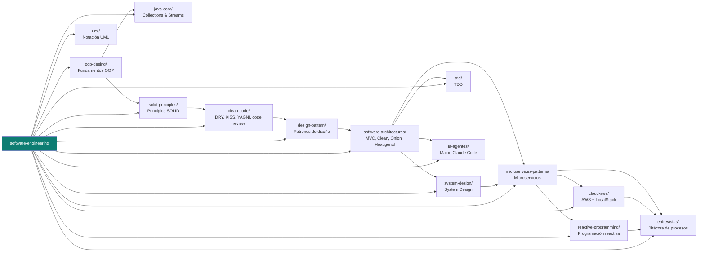

# Software Engineering — Ruta de estudio

Repositorio de estudio y repaso rápido para consolidar lo que un **Software Engineer / Solutions Architect Senior** debe dominar: fundamentos de OOP, SOLID y clean code, patrones de diseño, arquitecturas de software (hexagonal, clean, onion, MVC) y de microservicios, system design a gran escala, programación reactiva, cloud (AWS), UML, TDD, y cómo integrar IA (subagentes de Claude Code) al flujo de trabajo.

> Este repo es **solo documentación** — píldoras en Markdown con diagramas Mermaid, pensadas para repasar rápido y consultar en el momento (una entrevista, una decisión de arquitectura). No contiene proyectos de código para clonar y correr: esa parte vive aparte, fuera de este repo, para que acá no haya nada que compilar ni mantener — solo materia de estudio.

## Mapa del repositorio

La progresión de aprendizaje sugerida sigue las flechas: primero fundamentos de objetos, después principios de diseño y patrones, y desde ahí hacia arquitectura de sistemas completos (hexagonal → microservicios → reactivo/cloud), con TDD y UML como prácticas transversales.

## Índice

| Carpeta | Tema | Estado | Contenido destacado |
|---|---|---|---|
| [`oop-desing/`](oop-desing) | Fundamentos OOP | ✅ Completo | Cohesión/acoplamiento, abstracción, encapsulamiento, descomposición, asociación, generalización — agnóstico de lenguaje. |
| [`java-core/`](java-core) | Collections & Streams | ✅ Completo | Cheatsheet de `List`/`Map`/`Stream` (`groupingBy`, `merge`, `computeIfAbsent`, `flatMap`) con drills cronometrados. |
| [`solid-principles/`](solid-principles) | Principios SOLID | ✅ Completo | Los 5 principios con diagramas "violación vs aplicado" y píldoras de repaso. |
| [`clean-code/`](clean-code) | Clean Code | ✅ Completo | DRY, KISS, YAGNI y checklist de code review — los principios "chicos" que complementan SOLID. |
| [`design-pattern/`](design-pattern) | Patrones de diseño (GoF) | ✅ Completo | Creacionales, estructurales y de comportamiento — los 22 patrones GoF documentados con ejemplo y "cuándo usarlo". |
| [`uml/`](uml) | Notación UML | ✅ Completo | Cheatsheet de las 5 relaciones (herencia, asociación, agregación, composición, dependencia) con diagramas Mermaid. |
| [`software-architectures/`](software-architectures) | Arquitecturas de software | 🟡 En progreso | MVC, Clean Architecture, Onion, Hexagonal (puertos/adaptadores) — comparadas entre sí. Mobile (MVVM/MVP/MVI) y web frontend (Flux/Redux) pendientes. |
| [`system-design/`](system-design) | System Design | 🟡 En progreso | Escalar de 0 a millones de usuarios (load balancer, replicación, cache, CDN, sharding) — basado en ByteByteGo. Se va sumando módulo a módulo. |
| [`microservices-patterns/`](microservices-patterns) | Patrones de microservicios | ✅ Completo | Comunicación sync/async, resiliencia (circuit breaker, retry, bulkhead), consistencia (saga, outbox), API-first, OWASP. |
| [`reactive-programming/`](reactive-programming) | Programación reactiva | ✅ Completo | Mono/Flux, `map` vs `flatMap`, manejo de errores reactivo, R2DBC vs JPA, testing con StepVerifier. |
| [`cloud-aws/`](cloud-aws) | Cloud (AWS) | ✅ Completo | Servicios AWS clave para un backend Java + cómo practicar con LocalStack (sin tarjeta ni cuenta real). |
| [`tdd/`](tdd) | TDD | ✅ Completo | Ciclo red-green-refactor (diagrama de estados), pirámide de testing, patrón AAA. |
| [`ia-agentes/`](ia-agentes) | IA aplicada al desarrollo | 🟡 En progreso | 6 agentes + 2 skills de Claude Code para desarrollo de software (hexagonal, WebFlux, TDD, GitFlow, OWASP, clean code, commits, PRs), con `agent-harness/` como fuente/compilador reusable entre proyectos; analítica/big data pendientes. |
| [`entrevistas/`](entrevistas) | Bitácora de procesos de entrevista | 🟡 En progreso | Un proceso en curso (SaludTools) — logística, checklist y mapa hacia el resto del repo. Se va sumando por proceso. |

## Cómo está organizado

- **Un tema por carpeta raíz.** Cada carpeta es autocontenida: un `README.md` como punto de entrada, con diagramas Mermaid y píldoras — sin código para compilar.
- **Los resúmenes de curso se cargan incrementalmente**, módulo por módulo, para evitar documentos gigantes.
- **Los diagramas se escriben en Mermaid**, no en imágenes ni ASCII art — GitHub los renderiza nativamente en el navegador, sin depender de herramientas externas (PlantUML, draw.io) para poder leerlos.
- **El código de referencia vive fuera de este repo**, en una carpeta local aparte (`codigo-por-reorganizar/`) — proyectos completos en Java/JS que respaldaron esta documentación, pendientes de reorganizar en sus propios repos. No se versiona acá para que este repo se mantenga liviano y 100% enfocado en estudio.
- Antes de crear una carpeta nueva para un tema, revisar si ya existe una carpeta similar y seguir el mismo patrón de organización.

## Cómo estudiar con este repo

1. Andá al índice de arriba y abrí el tema que necesitás repasar — cada `README.md` de carpeta está pensado para leerse solo, sin depender de los demás.
2. Los diagramas Mermaid son el resumen visual — si tenés poco tiempo, mirá esos primero y volvé al texto para el detalle.
3. Los temas marcados 🟡 en el índice son los que más vale la pena reforzar primero.
