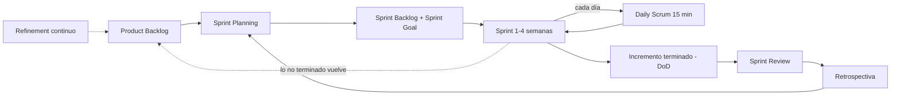
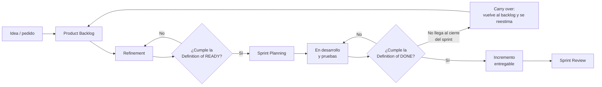

# Agile y Scrum — guía rápida de consulta

> Para repasar en 5 minutos antes de una entrevista o una reunión. Primero la analogía, después los términos, al final las preguntas típicas con respuesta corta.
> Relacionado: [`../entrevistas/archivo/arkano-senior-java-developer/README.md`](../entrevistas/archivo/arkano-senior-java-developer/README.md) · [`../microservices-patterns/`](../microservices-patterns/README.md) (API-first, contratos) · [`../tdd/`](../tdd/README.md)

## 🍎 Con manzanas

Una frutería que trabaja **por semanas**:

| En la frutería | En Scrum |
|---|---|
| La libreta con todos los pedidos pendientes, ordenada por importancia | **Product Backlog** |
| Lo que decidimos cargar en el camión esta semana | **Sprint Backlog** |
| La semana de trabajo | **Sprint** |
| "Esta semana quiero que salga toda la fruta del restaurante" | **Sprint Goal** |
| Reunión de pie de 15 minutos al abrir: qué hice, qué haré, qué me frena | **Daily Scrum** |
| Revisar y aclarar los pedidos que vienen para que estén listos | **Refinement** |
| Mostrar al cliente la fruta entregada y escuchar su opinión | **Sprint Review** |
| El equipo se mira a sí mismo: qué mejoramos la próxima semana | **Retrospectiva** |
| "Fruta lavada, empacada y etiquetada" = terminado de verdad | **Definition of Done** |
| La caja que no alcanzó a salir esta semana y pasa a la siguiente | **Carry over (arrastre)** |

| Nivel | Qué debe dominar |
|---|---|
| 🟢 Junior | Roles, eventos, backlog y la idea de sprint. |
| 🟡 Mid | Estimar, refinar, Definition of Done, qué hacer cuando algo no se termina. |
| 🔴 Senior | Proteger el Sprint Goal, negociar alcance, métricas sin trampa, mejorar el proceso, comunicar riesgos. |

## 1. Scrum en un vistazo

### Roles (la Scrum Team)
| Rol | Responsabilidad | Frase clave |
|---|---|---|
| **Product Owner (PO)** | Maximizar el valor del producto; ordena el backlog. | "Qué construimos y en qué orden". |
| **Scrum Master** | Que Scrum funcione; quita impedimentos; facilita. | "Cómo trabajamos mejor". Sirve al equipo, no manda. |
| **Developers** | Construyen el incremento; deciden cómo hacerlo. | "Cómo lo construimos y cuánto cabe". |

El Tech Lead, el Delivery Manager y el cliente **no son roles de Scrum**, pero conviven con él. El Delivery Manager mira plazos, riesgos y la relación con el cliente.

### Eventos (🔎 duraciones máximas para un sprint de 1 mes; en uno más corto son proporcionales)
| Evento | Para qué | Duración |
|---|---|---|
| **Sprint** | Contenedor de todo; entrega un incremento | 1 a 4 semanas |
| **Sprint Planning** | Por qué (Sprint Goal), qué (items) y cómo (plan) | hasta 8 h |
| **Daily Scrum** | Planear el día hacia el Sprint Goal; ver bloqueos | 15 min |
| **Sprint Review** | Mostrar el incremento y recibir feedback; ajustar el backlog | hasta 4 h |
| **Retrospectiva** | Mejorar cómo trabaja el equipo | hasta 3 h |

**Refinement** (aclarar, partir y estimar items) es una **actividad continua**, no un evento formal de la Guía de Scrum, aunque casi todos los equipos le ponen una reunión.

### Artefactos y su "compromiso"
| Artefacto | Compromiso | Qué es |
|---|---|---|
| **Product Backlog** | **Product Goal** | Lista ordenada de todo lo que podría hacerse |
| **Sprint Backlog** | **Sprint Goal** | Items elegidos + plan del sprint |
| **Incremento** | **Definition of Done** | Resultado utilizable, terminado de verdad |

### 🚪 Las dos puertas: Definition of Ready → Definition of Done

> Píldora para leer rápido. **Ready = puerta de entrada** (¿puede entrar al sprint?). **Done = puerta de salida** (¿de verdad está terminado?).

| | 🚪 Definition of **Ready** | 🚪 Definition of **Done** |
|---|---|---|
| Pregunta | ¿Entiendo lo bastante para empezar? | ¿Está terminado de verdad? |
| Cuándo | Antes de entrar al sprint (refinement) | Al cerrar el item y el sprint |
| De quién | PO y equipo | Todo el equipo, igual para todos los items |
| En la Guía de Scrum | No: es una práctica | Sí: es el compromiso del Incremento |
| En la frutería | El pedido está claro: qué fruta, cuánta, para cuándo | Fruta lavada, empacada, etiquetada y entregada |
| Si no se cumple | Vuelve a refinement | Sigue en desarrollo o es carry over |

**Ready típico** (checklist de entrada):
- [ ] Historia escrita ("Como… quiero… para…") y entendida por todos
- [ ] Criterios de aceptación claros
- [ ] Estimada (puntos) y de un tamaño que cabe en un sprint
- [ ] Dependencias identificadas (otro equipo, API, accesos)
- [ ] Diseño o contrato definido (por ejemplo OpenAPI)
- [ ] Datos de prueba o ambiente disponibles

**Done típico** (checklist de salida):
- [ ] Código terminado y revisado por otra persona (PR)
- [ ] Pruebas unitarias y de integración en verde
- [ ] Criterios de aceptación verificados por el PO
- [ ] Sin vulnerabilidades ni deuda nueva evidente (análisis estático)
- [ ] Documentación y contrato actualizados
- [ ] Desplegado en el ambiente acordado

**Cómo recordarlo:** *Ready entra, Done sale.* Sin Ready, el equipo empieza a ciegas y se arrastra trabajo; sin Done, "terminado" significa cosas distintas para cada persona.

## 2. Pistas rápidas: términos que se olvidan

| Término | Qué es | Se confunde con |
|---|---|---|
| **Carry over / arrastre** | Item que no terminó en el sprint. Según Scrum vuelve al Product Backlog, se **reestima** y el PO decide si entra en el siguiente. No suma a la velocidad. | Darlo por "casi terminado" |
| **Definition of Done (DoD)** | Criterios comunes para decir "terminado": código revisado, probado, desplegado en ambiente de pruebas, documentado. | Criterios de aceptación |
| **Criterios de aceptación** | Condiciones de **esa** historia para aceptarla. | DoD (que es para todas) |
| **Definition of Ready (DoR)** | Práctica (no está en la Guía): cuándo un item está listo para entrar al sprint. | DoD |
| **Historia de usuario** | "Como [rol] quiero [algo] para [beneficio]". | Tarea técnica |
| **Épica → Feature → Historia → Tarea** | Del más grande al más pequeño. | |
| **Story points** | Estimación **relativa** del esfuerzo y la incertidumbre (Fibonacci: 1, 2, 3, 5, 8, 13). | Horas |
| **Planning Poker** | Estimar votando cartas a la vez para no influirse. | |
| **Velocidad** | Puntos **terminados** por sprint; sirve para pronosticar, no para presionar. | Productividad |
| **Capacidad** | Horas o días reales disponibles del equipo (vacaciones, feriados). | Velocidad |
| **Spike** | Investigación con tiempo limitado para resolver una incertidumbre. | |
| **Impedimento / blocker** | Algo que frena al equipo; el Scrum Master lo gestiona. | |
| **Deuda técnica** | Atajos que cobran intereses después; se agenda, no se esconde. | |
| **Scope creep** | Alcance que crece sin control en medio del sprint. | |
| **MVP** | Versión mínima que ya da valor y permite aprender. | Versión pobre |
| **Burndown** | Gráfica del trabajo restante en el sprint. | |
| **WIP (Work in Progress)** | Trabajo en curso; se limita en Kanban. | |
| **Lead time / cycle time** | Desde que se pide hasta que se entrega / desde que se empieza hasta que se entrega. | |
| **Time-box** | Duración fija e inamovible de un evento. | |

## 3. Cuando algo sale mal

| Situación | Qué hago |
|---|---|
| **No termino una historia en el sprint** | No se da por parcialmente hecha. Vuelve al backlog (carry over), se reestima y el PO decide. En la retro se pregunta por qué: estimación, bloqueo, alcance. |
| **Llega un cambio de requisito a mitad de sprint** | Evalúo el impacto. Si es pequeño, se acomoda con el PO; si es grande, se negocia: entra al próximo sprint o sale algo equivalente. **El Sprint Goal no se cambia; el alcance sí se puede renegociar con el PO.** |
| **El API que consumo cambia y ya tenía mocks** | Contrato primero (OpenAPI), cambios compatibles hacia atrás, pruebas de contrato; se comunica al tech lead y al PO. |
| **Estimé mal** | Aviso pronto, no al final. Se ajusta el alcance con el PO y se aprende en la retro. |
| **Un bloqueo externo** | Lo digo en el Daily, el Scrum Master lo escala. Mientras, tomo otro item. |
| **Bug urgente en producción** | Se prioriza con el PO; algo del sprint sale a cambio. |
| **El objetivo ya no es alcanzable** | Se dice cuanto antes. Solo el **PO** puede cancelar un sprint, y es raro. |
| **Un stakeholder presiona por más** | Todo pasa por el PO y por el backlog ordenado. |
| **Desacuerdo técnico** | Datos y prueba pequeña, no opinión; decide el equipo, y el tech lead desempata si hace falta. |
| **Una retro sin acciones** | Elijo 1 o 2 acciones concretas con responsable y fecha. |

## 4. Cascada, Scrum, Kanban y los demás

| | Cascada (Waterfall) | Scrum | Kanban |
|---|---|---|---|
| Idea | Fases en orden: requisitos → diseño → código → pruebas → entrega | Ciclos cortos con entrega en cada uno | Flujo continuo con límite de trabajo en curso |
| Cambios | Costosos | Bienvenidos entre sprints | En cualquier momento |
| Entrega | Al final | Cada sprint | Continua |
| Roles | Jefe de proyecto, analistas… | PO, Scrum Master, Developers | Ninguno obligatorio |
| Ventaja | Previsible si todo está claro | Feedback temprano | Muy flexible |
| Riesgo | Descubrir tarde que era otra cosa | Rituales sin valor | Sin ritmo ni metas |

- **Scrumban:** Scrum con un tablero Kanban y límites de WIP.
- **XP (Extreme Programming):** prácticas técnicas (TDD, integración continua, pair programming) que combinan bien con Scrum.
- **SAFe / LeSS:** formas de escalar a muchos equipos.
- **Tablero (canvas):** columnas por estado (Por hacer, En curso, En revisión, Hecho). Es la herramienta de Kanban; en Scrum se usa para el Sprint Backlog.

**Cómo contar mi experiencia con honestidad:** "He trabajado con Scrum, participando en sus ceremonias con un tablero para seguir el trabajo, y antes con Cascada. En ambos entregué; la diferencia que noto es que en ágil el feedback llega antes y el cambio duele menos."

## 5. Preguntas típicas, respuesta en 30 segundos

| Pregunta | Respuesta corta |
|---|---|
| ¿Qué es Scrum? | Marco ágil con sprints cortos, tres roles, cinco eventos y tres artefactos para entregar valor de forma incremental. |
| ¿Diferencia con Cascada? | Cascada entrega al final y cambiar cuesta; Scrum entrega por incrementos y aprende de cada uno. |
| ¿Qué pasa si una historia no se termina? | Carry over: vuelve al backlog, se reestima, el PO decide si entra al siguiente sprint; no cuenta en la velocidad. |
| ¿Qué es la Definition of Done? | El acuerdo de qué significa "terminado": probado, revisado y desplegable. |
| ¿Qué haces con un cambio a mitad de sprint? | Mido el impacto, lo hablo con el PO: o entra al siguiente sprint o sale algo equivalente. El Sprint Goal se protege. |
| ¿Cómo estimas? | En puntos, relativo a historias ya conocidas, con el equipo y Planning Poker. |
| ¿Qué es la velocidad? | Puntos terminados por sprint; sirve para pronosticar, no para presionar. |
| ¿Qué hace el Scrum Master? | Facilita, quita impedimentos y cuida que el equipo siga Scrum; no es jefe. |
| ¿Para qué sirve la retro? | Para mejorar el proceso con acciones concretas, sin buscar culpables. |
| ¿Cómo avisas un riesgo de retraso? | Pronto, con datos y con opciones, al PO y al Delivery Manager. |

## 6. Por completar

- [ ] Ejemplo real de un sprint de mi proyecto (con historias, puntos y un carry over)
- [ ] Mis 3 historias STAR de [`../entrevistas/archivo/arkano-senior-java-developer/retro-entrevista-tecnica.md`](../entrevistas/archivo/arkano-senior-java-developer/retro-entrevista-tecnica.md)
- [ ] 🔎 Verificar duraciones con la Guía oficial de Scrum 2020 (scrumguides.org)
