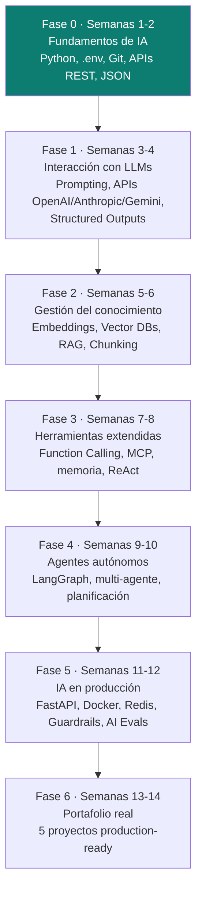

# AI Engineering — hoja de ruta para Desarrollador de Agentes / AI Engineer

Plan de capacitación formal para pasar de "sé usar Claude/ChatGPT" a **diseñar, construir, evaluar y desplegar** sistemas basados en LLMs y arquitecturas multi-agente. Roadmap práctico de 14 semanas (7 fases), estructurado a partir de una hoja de ruta pública (fuente: *@aiseekhobhai*) y adaptado al criterio de este repo: cada fase suma su propia píldora con ejemplos trabajados, no solo teoría.

> **Esta carpeta no es lo mismo que [`ia-agentes/`](../ia-agentes).** `ia-agentes/` documenta cómo **usar** subagentes de Claude Code como herramienta para escribir software más rápido — es tooling aplicado al desarrollo. `ai-engineering/` documenta cómo **construir** los sistemas de IA en sí (APIs de LLMs, RAG, orquestación de agentes, evaluación, producción) — es la disciplina de ingeniería detrás de esas herramientas. Son complementarias: dominar esta carpeta es lo que permite, más adelante, escribir un agente de Claude Code propio desde cero en vez de solo consumir uno ya armado.

## 1 · Resumen ejecutivo

La forma de construir software cambió de escribir reglas fijas (`if`/`else`) a **orquestar modelos que razonan**: reciben una intención en lenguaje natural, deciden qué herramientas usar, y producen un resultado sin que cada paso esté codificado a mano. Esta transición ("Software 2.0/3.0", ver sección 2) ya no es experimental — es lo que se espera de un perfil de **AI Engineer** en 2025 en adelante: no alcanza con saber usar un chat de IA por interfaz, hace falta dominar APIs de LLMs, ingeniería de prompts, salidas estructuradas, RAG, orquestación de agentes y evaluación/gobernanza de esos sistemas antes de llevarlos a producción.

Este documento fija el porqué, el objetivo profesional, el vocabulario base, y la hoja de ruta de 7 fases (14 semanas) que se va a ir completando módulo por módulo — mismo criterio incremental que [`system-design/`](../system-design): cada fase suma su archivo cuando se estudia en la práctica, no antes.

## 2 · Por qué aprender esto ahora

### 2.1 · De software basado en reglas a software basado en intenciones

| | Software tradicional | Software basado en intenciones (LLM-powered) |
|---|---|---|
| Cómo se especifica el comportamiento | Lógica condicional explícita, escrita a mano (`if status == PAID then ...`). | Una intención en lenguaje natural + un modelo que razona sobre qué hacer con ella. |
| Quién decide el "cómo" | El desarrollador, en tiempo de diseño. | El modelo, en tiempo de ejecución — elige qué herramienta invocar, en qué orden, con qué datos. |
| Qué falla si el caso no fue previsto | Un `else` no contemplado — bug o crash. | El modelo puede razonar sobre un caso nuevo sin que alguien haya escrito esa rama — con el riesgo simétrico de que "razone mal" si no hay guardrails (ver sección 5, Fase 5). |

Esto no reemplaza la ingeniería de software clásica (SOLID, hexagonal, TDD — el resto de este repo) — la **envuelve**: un agente sigue necesitando arquitectura, testing y buenas prácticas; lo nuevo es que una de sus piezas centrales (la decisión de qué hacer) ya no es código determinista, sino un modelo probabilístico invocado vía API.

### 2.2 · Por qué no alcanza con usar un chat de IA por interfaz (Production-Ready AI)

Usar ChatGPT/Claude desde el navegador demuestra que sabés **pedir** algo bien. Ser AI Engineer exige poder **integrarlo** en un sistema real:

- **APIs, no interfaz** — invocar el modelo programáticamente (Fase 1), con control total sobre parámetros (temperature, max tokens, streaming) que la UI no expone.
- **Salidas estructuradas (JSON/Structured Outputs)** — un sistema no puede parsear "más o menos JSON" que a veces el modelo devuelve mal formado; hace falta forzar un schema (Fase 1).
- **RAG (Retrieval-Augmented Generation)** — el modelo no sabe nada de tus datos privados/actualizados; hay que dárselos en el momento correcto (Fase 2).
- **Evaluación y gobernanza** — un sistema en producción necesita métricas de calidad y límites de seguridad, no solo "probé unos prompts y andaba bien" (Fase 5).

### 2.3 · Autonomía y eficiencia operativa

El valor de negocio real de un agente no es "responder una pregunta" sino **ejecutar un flujo completo sin intervención humana constante**: un agente de soporte que resuelve un ticket de punta a punta, uno de ventas que califica un lead y agenda una llamada, un asistente de código que abre un PR, uno de análisis que arma un reporte — el mismo tipo de autonomía que la Fase 6 (portafolio) pide demostrar con casos reales.

## 3 · Objetivos profesionales de este plan

1. Pasar de **consumidor** de IA (usar un chat) a **constructor** de sistemas de IA (diseñar, integrar, evaluar, desplegar).
2. Dominar el ciclo completo de un agente: entender el modelo (prompting), darle conocimiento (RAG), darle herramientas (function calling/MCP), darle autonomía (orquestación multi-agente), y hacerlo confiable en producción (evals + guardrails).
3. Construir un **portafolio de 5 proyectos reales** (Fase 6) que demuestre este ciclo completo, no ejercicios de juguete — el mismo criterio "sin caso concreto detrás no es documentación válida" que rige el resto de este repo.
4. Conectar esta disciplina con lo ya dominado en `ia-agentes/`: un desarrollador que entiende **cómo se construye** un agente (esta carpeta) puede además **extender y depurar** sus propios subagentes de Claude Code (esa carpeta), en vez de tratarlos como una caja negra.

## 4 · Roadmap — 7 fases, 14 semanas

La progresión es deliberada: no se puede razonar sobre RAG (Fase 2) sin dominar la API base (Fase 1); no se puede orquestar un multi-agente (Fase 4) sin haber usado function calling/herramientas (Fase 3); y ningún agente va a producción (Fase 5) sin haber demostrado que funciona en un caso real primero.

## 5 · Matriz de fases vs. entregables prácticos

| Fase | Semanas | Conceptos clave | Entregable práctico que demuestra dominio |
|---|---|---|---|
| **0 · Fundamentos de IA** | 1-2 | Python, entornos virtuales, `.env`/API keys, Git, consumo de APIs REST, parsing JSON. | Un script que consume una API REST externa, maneja su API key vía `.env` (nunca hardcodeada), y parsea la respuesta JSON a un modelo tipado. |
| **1 · Interacción con LLMs** | 3-4 | Prompt Engineering (Few-Shot, Chain-of-Thought), APIs de OpenAI/Anthropic/Gemini, Structured Outputs (JSON Schema). | Un cliente que llama a un LLM con un prompt Few-Shot y **fuerza** una salida validable contra un JSON Schema (no un parseo manual de texto libre). |
| **2 · Gestión del conocimiento** | 5-6 | Embeddings, bases de datos vectoriales, RAG, chunking, estrategias de retrieval. | Un pipeline RAG end-to-end: documentos propios → chunking → embeddings → vector DB → retrieval → respuesta del LLM citando la fuente real. |
| **3 · Herramientas extendidas** | 7-8 | Function Calling, Model Context Protocol (MCP), memoria conversacional, patrón ReAct. | Un agente que decide **cuándo** invocar una herramienta propia (function calling) vía el patrón ReAct (Reason → Act → Observe), con memoria de turnos previos. |
| **4 · Agentes autónomos** | 9-10 | Orquestación con LangGraph, arquitecturas multi-agente, planificación, reflexión, flujos de control. | Un grafo de al menos 2 agentes especializados (LangGraph) que se coordinan para resolver una tarea que ninguno resuelve solo, con un paso de reflexión/auto-corrección. |
| **5 · IA en producción** | 11-12 | FastAPI (microservicio), Docker, Redis (caching), Guardrails, AI Evals. | El agente de la Fase 4 empaquetado como microservicio FastAPI + Docker, con caché de respuestas repetidas, al menos un guardrail activo (ej. filtro de contenido/input) y una suite de evals midiendo calidad de respuesta. |
| **6 · Portafolio real** | 13-14 | Integración de todo lo anterior en productos completos. | 5 proyectos production-ready: agente de soporte, agente de ventas, asistente de código, asistente de reuniones, creador de contenido. |

## 6 · Glosario de términos imprescindibles

| Término | Definición corta |
|---|---|
| **LLM** (Large Language Model) | Modelo entrenado sobre grandes volúmenes de texto que predice la siguiente secuencia de tokens más probable — la base de todo lo demás en este documento (GPT, Claude, Gemini, Llama). |
| **Prompting** | La técnica de diseñar la entrada (instrucciones, ejemplos, contexto) que se le da a un LLM para obtener la salida deseada — incluye Zero-Shot, Few-Shot (dar ejemplos) y Chain-of-Thought (pedir razonamiento paso a paso). |
| **Structured Outputs** | Forzar que la respuesta de un LLM cumpla un schema (JSON Schema) exacto y validable, en vez de texto libre que hay que parsear con heurísticas frágiles. |
| **Embeddings** | Representación numérica (un vector) del significado semántico de un texto — dos textos con significado similar producen vectores cercanos entre sí en ese espacio. Es la base matemática de RAG y de cualquier búsqueda semántica. |
| **RAG** (Retrieval-Augmented Generation) | Patrón donde, antes de responder, el sistema **recupera** información relevante (vía embeddings + una base de datos vectorial) y se la agrega al prompt del LLM — así el modelo responde con datos propios/actualizados que no tenía en su entrenamiento. |
| **Chunking** | Dividir un documento largo en fragmentos más chicos antes de generar sus embeddings — el tamaño y la estrategia de corte (por párrafo, por tokens, con solapamiento) afecta directamente la calidad del retrieval en RAG. |
| **Function Calling** | Mecanismo por el cual un LLM puede indicar "quiero ejecutar esta función con estos argumentos" (en vez de solo generar texto) — el modelo decide **cuándo** y **con qué datos** invocar una herramienta externa; el código de la aplicación es quien efectivamente la ejecuta y le devuelve el resultado. |
| **MCP** (Model Context Protocol) | Protocolo abierto (de Anthropic) que estandariza cómo un modelo/agente se conecta a herramientas y fuentes de datos externas — en vez de integrar cada herramienta de forma ad-hoc por proveedor, MCP define una interfaz común reusable entre distintos clientes de IA. |
| **ReAct** (Reason + Act) | Patrón de agente donde el modelo alterna explícitamente entre **razonar** (pensar el siguiente paso en lenguaje natural) y **actuar** (invocar una herramienta), observando el resultado antes de decidir el siguiente ciclo — la base conceptual de casi todo agente que usa herramientas. |
| **Agent** (Agente) | Un sistema que usa un LLM como "motor de decisión" para perseguir un objetivo de forma semi-autónoma: puede usar herramientas, mantener memoria/estado, y decidir sus propios pasos intermedios — a diferencia de un simple llamado prompt-in/texto-out. |
| **Guardrails** | Controles (de input y de output) que limitan lo que un sistema de IA puede recibir o producir — filtros de contenido, validación de que la respuesta no se sale del dominio permitido, límites de costo/tokens, detección de prompt injection. |
| **AI Evals** (Evaluación de IA) | Métricas y procesos sistemáticos para medir la calidad de las respuestas de un sistema de IA (precisión, relevancia, alucinación, latencia, costo) — el equivalente de una suite de tests automatizados, pero para un sistema cuyo output no es 100% determinista. |

## 7 · Relación con el resto del repo

- [`ia-agentes/`](../ia-agentes) — una vez completada la Fase 3-4 (Function Calling, MCP, orquestación de agentes), tiene sentido volver a `ia-agentes/agent-harness/` y entender/extender esa capa de compilación con criterio propio, no solo copiarla.
- [`ddd/`](../ddd) y [`software-architectures/`](../software-architectures) — un agente en producción (Fase 5) sigue siendo una aplicación de software: necesita capas claras (¿dónde vive la lógica de orquestación vs. el adaptador HTTP del microservicio FastAPI?), no una excepción a las reglas del resto del repo.
- [`frameworks/`](../frameworks) — el microservicio de la Fase 5 (FastAPI) es Python, fuera del alcance actual de `frameworks/` (Spring Boot, NestJS) — evaluar más adelante si amerita su propia carpeta `frameworks/fastapi/` cuando se practique en profundidad.
- [`system-design/`](../system-design) — cachear con Redis (Fase 5) conecta directo con los patrones de cache ya vistos en [`01-scale-from-zero-to-millions.md`](../system-design/01-scale-from-zero-to-millions.md).

## 8 · Cómo se va a completar esta carpeta

Mismo criterio incremental que [`system-design/`](../system-design): cada fase suma su propio archivo (`00-fundamentos.md`, `01-llms-y-prompting.md`, etc.) a medida que se estudia y se practica con un caso concreto — no se documenta teoría sin haberla ejercitado. Este `README.md` es el índice y la justificación formal del plan; se actualiza la tabla de la sección 5 con el estado real (⏳ pendiente / ✅ hecho) a medida que cada fase se completa.

| Fase | Estado |
|---|---|
| 0 · Fundamentos de IA | ⏳ Pendiente |
| 1 · Interacción con LLMs | ⏳ Pendiente |
| 2 · Gestión del conocimiento (RAG) | ⏳ Pendiente |
| 3 · Herramientas extendidas (Function Calling, MCP) | ⏳ Pendiente |
| 4 · Agentes autónomos (LangGraph) | ⏳ Pendiente |
| 5 · IA en producción | ⏳ Pendiente |
| 6 · Portafolio real | ⏳ Pendiente |

## Referencias

- Hoja de ruta base de 14 semanas — fuente: *@aiseekhobhai* (recurso público que originó la estructura de fases de este documento).
- [Anthropic — Model Context Protocol](https://modelcontextprotocol.io/) — especificación oficial de MCP.
- [Anthropic — Building Effective Agents](https://www.anthropic.com/research/building-effective-agents) — guía de referencia sobre patrones de agentes (incluye ReAct y arquitecturas multi-agente).
- [OpenAI — Prompt Engineering Guide](https://platform.openai.com/docs/guides/prompt-engineering) y [Structured Outputs](https://platform.openai.com/docs/guides/structured-outputs) — Fase 1.
- [LangGraph — Documentation](https://langchain-ai.github.io/langgraph/) — orquestación multi-agente, Fase 4.
- Yao, S. et al. — [*ReAct: Synergizing Reasoning and Acting in Language Models*](https://arxiv.org/abs/2210.03629) (2022) — paper original del patrón ReAct.
