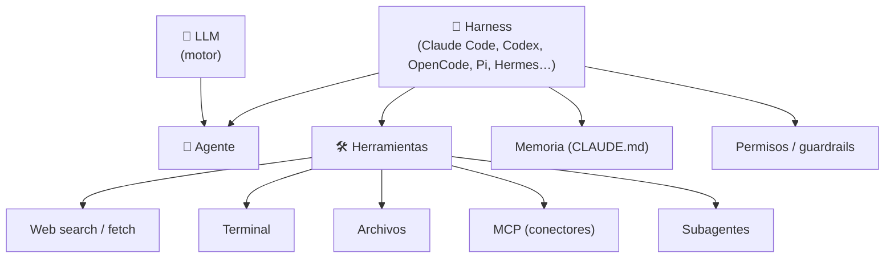

# Claude — LLMs, agentes, harness y MCP (curso)

Apuntes del curso sobre **Claude** y toda la tecnología que hoy usamos para programar con IA: qué es un LLM, qué es un agente, qué es un *harness* (Claude Code), MCP, subagentes, memoria y permisos. Cada clase se convierte en un documento de esta carpeta, escrito **de junior a senior** y vinculado al resto del repo.

> **Dónde encaja:** es la parte **práctica con Claude** del roadmap [`ai-engineering/`](../README.md) (sobre todo Fases 1 y 3). Y es la base teórica de [`ia-agentes/`](../../ia-agentes), donde ya usamos subagentes de Claude Code en este repo.

## 🍎 Con manzanas (la idea completa en 4 líneas)

- **LLM** = el empleado brillante encerrado en un cuarto: solo piensa y habla.
- **Harness** = el local entero (mostrador, bodega, teléfono, candado en la caja).
- **Agente** = empleado + local, repitiendo *miro → decido → actúo* hasta cerrar el pedido.
- **Tú** pones los **permisos**: decides qué puede tocar.

## 📚 Índice de clases

| # | Clase | Tema central | Estado |
|---|---|---|---|
| 01 | [LLM vs agente: el motor y el carro (harness) + instalar Claude Code](clases/01-llm-vs-agente-harness.md) | LLM ≠ agente · harness · herramientas · permisos · instalación | ✅ |
| 02 | _pendiente_ | | ⏳ |

> ➕ **Para agregar una clase:** pégala en [`clases/_pegar-clase-aqui.md`](clases/_pegar-clase-aqui.md) y pide "procesa la clase".

## 🧭 Mapa de conceptos (se va completando con cada clase)

## 📖 Glosario rápido (con enlace a la clase donde se explica)

| Término | En una frase | 🍎 Con manzanas | Clase |
|---|---|---|---|
| **LLM** | Modelo que piensa y decide; no ejecuta nada por sí solo. | Empleado brillante encerrado | [01](clases/01-llm-vs-agente-harness.md#1--por-qué-un-llm-no-es-lo-mismo-que-un-agente) |
| **Harness** | Código alrededor del modelo que le da herramientas. | El local entero | [01](clases/01-llm-vs-agente-harness.md#1--por-qué-un-llm-no-es-lo-mismo-que-un-agente) |
| **Agente** | LLM + herramientas + loop. | Empleado trabajando en el local | [01](clases/01-llm-vs-agente-harness.md#1--por-qué-un-llm-no-es-lo-mismo-que-un-agente) |
| **Claude Code** | Harness de Anthropic para modelos Claude. | El local de la marca Claude | [01](clases/01-llm-vs-agente-harness.md#2--los-carros-harnesses-que-existen-0130) |
| **MCP** | Estándar para conectar apps/datos externos a la IA. | El teléfono al proveedor | [01](clases/01-llm-vs-agente-harness.md#31--mcp-en-una-línea-0240) |
| **Subagente** | Otro Claude que trabaja en paralelo sin llenar tu contexto. | Ayudante con su propia mesa | [01](clases/01-llm-vs-agente-harness.md#32--subagentes-por-qué-existen) |
| **CLAUDE.md** | Memoria/instrucciones persistentes del proyecto. | Cuaderno de preferencias de clientes | [01](clases/01-llm-vs-agente-harness.md#3--qué-le-da-el-harness-al-modelo-las-piezas-del-dibujo) |
| **Permisos / guardrails** | Límites que decides tú sobre lo que el agente puede hacer. | El candado de la caja | [01](clases/01-llm-vs-agente-harness.md#4--permisos-y-guardrails-los-frenos-0330) |

## 🔗 Relacionado

- [Roadmap AI Engineering](../README.md) — plan de 14 semanas / 7 fases.
- [`ia-agentes/`](../../ia-agentes) — subagentes de Claude Code aplicados a este repo.
- [Glosario de la frutería](../../messaging-streaming/glosario.md) — la analogía base del repo.
