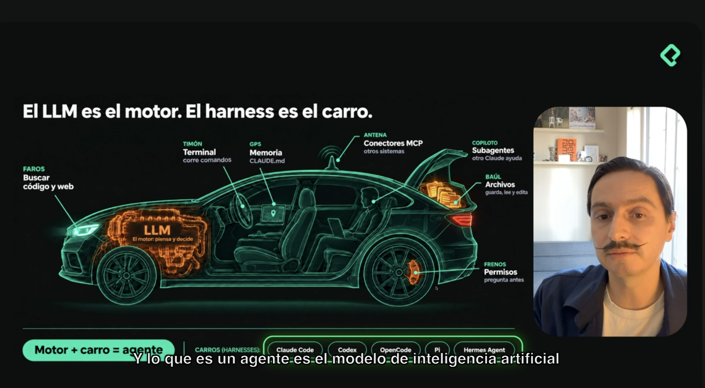
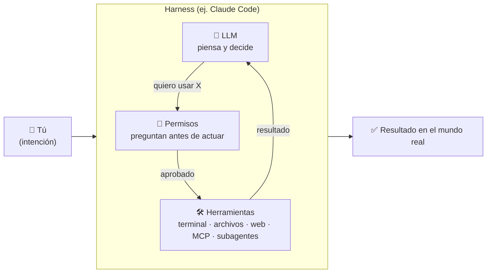

# Clase 01 · LLM vs agente: el motor y el carro (harness) + instalar Claude Code

> ⬅️ [Índice del curso](../README.md) · ➡️ Siguiente clase: _pendiente_
> **Qué vas a poder explicar al terminar:** por qué un LLM **no** es un agente, qué es un *harness*, qué herramientas le da Claude Code al modelo, por qué existen los permisos, y cómo se instala y se lanza.

---

## 🍎 Con manzanas (la analogía de la clase + la frutería del repo)

La clase usa un **auto**: el **LLM es el motor** y el **harness es el carro** que se construye alrededor.



Ahora la misma idea en la **frutería** que usamos en todo el repo ([glosario](../../../messaging-streaming/glosario.md)):

- El **LLM** es un empleado **brillante pero encerrado en un cuarto**: sabe muchísimo de frutas, pero solo puede **pensar y hablar**. No ve el mostrador, no toca la caja, no abre la bodega.
- El **harness** es **el local entero**: el mostrador (terminal), el cuaderno de notas (memoria), el teléfono (MCP), la bodega (archivos), los ayudantes (subagentes) y el **candado en la caja** (permisos).
- **Agente = empleado + local.** Cuando el empleado puede *hacer cosas* en el local y repetir "miro → decido → actúo → miro de nuevo" hasta terminar el pedido, ya no es solo alguien que opina: es un agente.

> En palabras de la calle: **un LLM te dice qué haría; un agente lo hace.**

---

## 1 · Por qué un LLM no es lo mismo que un agente

| Concepto | Qué es | En el auto | En la frutería |
|---|---|---|---|
| **LLM** (Large Language Model) | Modelo que **piensa y decide**: recibe texto, devuelve texto. Por sí solo no ejecuta nada. | 🔧 El motor | El empleado brillante encerrado |
| **Harness** (arnés / *andamiaje*) | Código construido **alrededor del modelo** que le da herramientas para actuar. | 🚗 El carro | El local con mostrador, bodega y caja |
| **Agente** | **Modelo + herramientas + un loop.** | Motor + carro = auto que anda | Empleado trabajando en el local hasta cerrar el pedido |

**Fórmula de la clase [01:30]:** `LLM + harness = agente`.



El **loop** (la flecha que vuelve de `Herramientas` al `LLM`) es lo que convierte la respuesta en trabajo: el modelo pide una acción, el harness la ejecuta, le devuelve el resultado, y el modelo decide el siguiente paso. Es el patrón **ReAct** (Reason → Act → Observe) del [roadmap, Fase 3](../../README.md#6--glosario-de-términos-imprescindibles).

---

## 2 · Los "carros" (harnesses) que existen [01:30]

Cada harness suele estar pensado para una familia de modelos:

| Harness | Dueño / enfoque |
|---|---|
| **Claude Code** | Anthropic — funciona con los modelos **Claude**. *Es el que usamos en este curso.* |
| **Codex** | OpenAI — el carro de los modelos **GPT**. |
| **OpenCode** | Pensado para quien experimenta con modelos **open source**. |
| **Pi** | Muy **ligero y simple**: pocas herramientas básicas que lo hacen potente. |
| **Hermes Agent** / **OpenClaude** | Otras alternativas disponibles. |

> 💡 Mismo motor, distinto carro → distinto comportamiento. Por eso, cuando alguien dice "usé Claude" conviene preguntar **¿el modelo por API, o dentro de qué harness?** Cambia qué puede hacer.

---

## 3 · Qué le da el harness al modelo (las piezas del dibujo)

"No es inteligencia flotando en el aire: es inteligencia **con manos**."

| Pieza del auto | Herramienta en Claude Code | Para qué sirve | 🍎 Frutería |
|---|---|---|---|
| 💡 **Faros** | `web search` / `web fetch` | Buscar código y traer información de internet. | El empleado mira por la ventana para ver qué precio tiene la competencia. |
| 🎛️ **Timón** | **Terminal** (Bash/Linux) | Correr comandos. | Manejar el mostrador: pesar, cobrar, empacar. |
| 🗺️ **GPS** | **Memoria** (`CLAUDE.md`) | Recordar instrucciones y contexto entre sesiones. | El cuaderno de "cómo le gusta el pedido a cada cliente". |
| 📡 **Antena** | **MCP** (conectores) | Conectarse a otros sistemas/aplicaciones. | El teléfono que llama al proveedor, al banco, a contabilidad. |
| 🧑‍✈️ **Copiloto** | **Subagentes** | Otro Claude que ayuda en paralelo. | Un ayudante con su propia mesa y su propia libreta. |
| 🧳 **Baúl** | **Archivos** | Leer, crear, editar y **eliminar** archivos. | La bodega: entrar, mover, tirar cajas. |
| 🛑 **Frenos** | **Permisos** | Preguntar antes de actuar. | El candado de la caja: el dueño decide qué se puede abrir. |

### 3.1 · MCP en una línea [02:40]

**MCP (Model Context Protocol)** es una forma estándar de **conectar datos de otras aplicaciones con tu IA**. La clase lo resume como *"cables que llevan información externa hacia el modelo"*. Se estudia en profundidad más adelante (ver [roadmap, Fase 3](../../README.md#5--matriz-de-fases-vs-entregables-prácticos)).

### 3.2 · Subagentes: por qué existen

Son como **pasajeros con su propia computadora**: toman una tarea, trabajan **en paralelo**, y **no llenan tu ventana de contexto** ni interrumpen tu sesión principal. Delegas sin perder el hilo.

> 🔗 En este repo ya los usamos como herramienta: [`ia-agentes/`](../../../ia-agentes). Aquí aprendes **por qué** son una pieza del harness, no una caja negra.

---

## 4 · Permisos y guardrails: los frenos [03:30]

Claude Code **puede crear, leer, editar y eliminar archivos** de tu computadora. Eso es potencia, y la potencia necesita control:

- No quieres que corra un comando que borre algo importante.
- Por eso **tú defines los permisos y guardrails**: el agente **pregunta antes** de actuar en lo sensible.
- *"Así como el conductor tiene frenos, tú defines los permisos del agente. Tú decides los límites."*

**Regla práctica:** el nivel de autonomía que le das al agente es una **decisión de seguridad tuya**, no un detalle de configuración.

---

## 5 · Instalar y ejecutar Claude Code [04:30]

La clase muestra que hay **tres formas, una por sistema operativo**, y todas parten de **copiar una URL/comando y pegarlo en la terminal**.

**Paso a paso (de la clase):**

1. Copia el comando de instalación de tu sistema operativo y pégalo en la terminal.
2. Espera unos minutos hasta ver el mensaje de **instalación exitosa** (te dice dónde quedó guardado y qué correr a continuación).
3. **Verifica la versión** instalada → `claude --version` (en la clase era la **2.1.286**).
4. Escribe `claude` y presiona **Enter**.
5. **Dale acceso a tu carpeta de trabajo** y listo: el agente corre **localmente**.

```bash
claude --version   # verificar instalación
cd mi-proyecto     # ir a la carpeta donde quieres trabajar
claude             # lanzar el agente y aceptar el acceso a la carpeta
```

> 🔎 **No verificado en la clase:** el comando exacto de instalación por sistema operativo no aparece en el resumen recibido. Tómalo siempre de la documentación oficial de Anthropic (Claude Code → *Setup*) para tu SO, porque cambia con el tiempo.

---

## 6 · Cierre de la clase: programar hoy

> *"Hoy programar se parece más a convertir una **intención** en un **sistema**."*

Conecta directo con la sección [2.1 del roadmap](../../README.md#21--de-software-basado-en-reglas-a-software-basado-en-intenciones): del `if/else` escrito a mano a **intención + modelo + herramientas**. Ojo: no reemplaza la ingeniería clásica ([SOLID](../../../solid-principles), [TDD](../../../tdd), [arquitectura](../../../software-architectures)); la **envuelve**.

**Tarea de la clase:** ahora que Claude Code corre en tu terminal, ¿qué es lo primero que quieres construir con tu agente? _(anótalo aquí → ver [Mis notas](#-mis-notas))_

---

## 7 · Qué debe dominar cada nivel

| Nivel | Debe poder explicar |
|---|---|
| 🟢 **Junior** | Que **LLM ≠ agente**; la fórmula `LLM + harness = agente`; nombrar 3 herramientas de Claude Code; que el agente **puede borrar archivos** y por eso hay permisos; instalar y lanzar `claude`. |
| 🟡 **Mid** | Qué es el **loop** (pensar → pedir herramienta → observar); para qué sirven **MCP**, **subagentes** (paralelismo + proteger el contexto) y **CLAUDE.md** (memoria); que cambiar de harness cambia el comportamiento aunque el modelo sea parecido. |
| 🔴 **Senior** | Trade-offs de **autonomía vs. seguridad** (permisos, allowlists, sandbox, qué comandos nunca aprobar en automático); riesgos de agentes con acceso a FS y red (prompt injection vía web fetch/MCP); cuándo conviene un harness ligero (Pi) vs. uno completo; diseñar **dónde** vive la lógica de orquestación (harness) vs. la del modelo. |

---

## 8 · Preguntas de entrevista (escaleras de respuesta)

**P1. ¿Qué diferencia hay entre un LLM y un agente?**

- 🟢 *Junior:* "El LLM solo piensa y responde texto. El agente además **actúa**, porque tiene herramientas."
- 🟡 *Mid:* "Agente = LLM + herramientas + **loop**: el modelo decide, el harness ejecuta, el resultado vuelve al modelo y repite hasta cumplir el objetivo."
- 🔴 *Senior:* "El modelo es la política de decisión probabilística; el **harness** aporta el entorno determinista: herramientas, estado, permisos y control del loop. La confiabilidad del agente depende tanto del harness (guardrails, límites de pasos/costo, observabilidad) como del modelo."

**P2. ¿Qué es un harness y por qué importa?**

- 🟢 "Es el código alrededor del modelo que le da herramientas; Claude Code es uno."
- 🟡 "Define qué puede hacer el modelo (archivos, terminal, web, MCP, subagentes) y cómo se le piden permisos; harness distinto → agente distinto."
- 🔴 "Es la superficie de **seguridad y control**: ahí se decide qué capacidades se exponen, con qué aprobación, cómo se gestiona el contexto (memoria, subagentes) y cómo se audita lo que el agente hizo."

**P3. ¿Un agente puede borrar archivos de mi máquina? ¿Cómo lo controlas?**

- 🟢 "Sí. Por eso hay permisos: pregunta antes de acciones sensibles."
- 🟡 "Defino qué herramientas/comandos se aprueban solos y cuáles piden confirmación; trabajo dentro de una carpeta acotada y con Git para poder revertir."
- 🔴 "Principio de mínimo privilegio: allowlist explícita, sandbox/entorno aislado para tareas de riesgo, control de versiones como red de seguridad, y desconfiar de contenido externo (web/MCP) que pueda inyectar instrucciones."

---

## 9 · Resumen en 5 líneas

1. **LLM = motor** (piensa); **harness = carro** (le da manos).
2. **Agente = LLM + herramientas + loop.**
3. Claude Code es un harness de Anthropic; hay otros (Codex, OpenCode, Pi, Hermes…).
4. Herramientas clave: buscar en web, terminal, archivos, memoria (`CLAUDE.md`), MCP, subagentes.
5. Potencia ⇒ **permisos**: tú pones los frenos.

## 📝 Mis notas

_(Espacio libre para tus apuntes, dudas y lo que quieres construir primero.)_

-

---

## 🔗 Relacionado

- [Índice del curso](../README.md)
- [Roadmap AI Engineering](../../README.md) — Fases 1 y 3 (APIs de LLMs, function calling, MCP, ReAct).
- [`ia-agentes/`](../../../ia-agentes) — subagentes de Claude Code aplicados a este repo.
- [Glosario de la frutería](../../../messaging-streaming/glosario.md) — la analogía base del repo.
