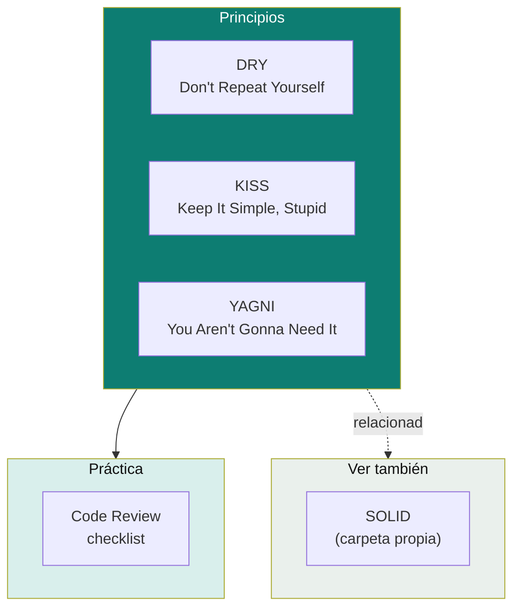

# Clean Code

Principios de código limpio que no encajan puntualmente en SOLID ni en un patrón de diseño, pero que un entrevistador senior espera que apliques todo el tiempo: DRY, KISS, YAGNI, y cómo se traducen en una revisión de código real.

> `SOLID` tiene carpeta propia por su tamaño (5 principios con diagramas) — ver [`solid-principles/`](../solid-principles). Acá van los principios "chicos" y la práctica de code review.

## Cobertura

| Tema | Doc | Idea en una línea |
|---|---|---|
| DRY / KISS / YAGNI | [`dry-kiss-yagni.md`](dry-kiss-yagni.md) | Tres principios que, en conjunto, evitan tanto la duplicación como la sobre-ingeniería. |
| Code Review | [`code-review.md`](code-review.md) | Checklist concreto de qué mirar en un PR, más allá de "¿compila y pasan los tests?". |
| SOLID | [`../solid-principles/`](../solid-principles) | Los 5 principios de diseño orientado a objetos — carpeta propia por tamaño. |

## Por qué DRY, KISS y YAGNI se agrupan (y no van con SOLID)

SOLID responde a **cómo estructurar clases e interfaces**. DRY/KISS/YAGNI responden a una pregunta más básica y previa: **¿este código necesita existir así de complejo, o en absoluto?** Son principios de nivel más bajo (aplican línea a línea, no solo a nivel de diseño de clases) y suelen ser lo primero que se nota en un code review, antes incluso de discutir si el diseño respeta OCP o DIP.

Relacionado: [`design-pattern/`](../design-pattern) — un patrón de diseño aplicado sin necesidad real es, paradójicamente, una violación de KISS/YAGNI (over-engineering). [`tdd/`](../tdd) — el ciclo red-green-**refactor** es, en la práctica, donde se aplican estos tres principios sistemáticamente.

## Referencias

- Hunt, A. & Thomas, D. — *The Pragmatic Programmer* (1999) — origen del principio DRY.
- Martin, R. C. — *Clean Code: A Handbook of Agile Software Craftsmanship* (2008) — base conceptual de KISS/YAGNI aplicados a código, y de la práctica de code review orientada a legibilidad.
