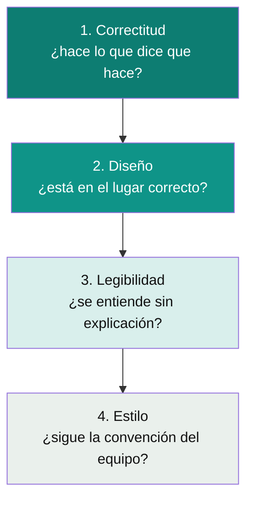

# Code Review — checklist práctico

Qué mirar en un PR más allá de "¿compila y pasan los tests?". Pensado tanto para revisar como para saber qué esperar que te revisen a vos en una entrevista técnica en vivo.

## Las 4 capas de una revisión (en orden)

> El orden importa: no vale la pena discutir nombres de variables (capa 4) en un PR que tiene un bug de concurrencia (capa 1). Muchas revisiones fallan por invertir el orden — se gasta el tiempo en lo cosmético y se deja pasar lo estructural.

### 1. Correctitud

- ¿El código hace lo que el PR dice que hace? Leer la descripción del PR y verificar contra el diff, no asumir.
- Casos borde: `null`, colección vacía, valores negativos/cero, concurrencia (¿dos requests simultáneos pueden corromper el estado?).
- ¿Hay un test que falle si este cambio se revierte? Si no hay test nuevo para un bugfix, es una señal de alarma.

### 2. Diseño

- ¿La lógica de negocio está en `domain`/`application`, o se filtró a un controller o a un repository? (ver [`hexagonal-architecture.md`](../software-architectures/hexagonal-architecture.md))
- ¿Viola algún principio SOLID de forma evidente? (ver [`solid-principles/`](../solid-principles))
- ¿Hay una abstracción nueva que no se justifica con el problema actual? (violación de YAGNI, ver [`dry-kiss-yagni.md`](dry-kiss-yagni.md))
- ¿Este cambio duplica una regla de negocio que ya existe en otro lado?

### 3. Legibilidad

- ¿Los nombres dicen qué hacen, sin necesitar un comentario al lado?
- ¿Una función hace una sola cosa, o mezcla niveles de abstracción (una línea de I/O de bajo nivel junto a una llamada de alto nivel)?
- ¿Sobran comentarios que explican el "qué" en vez de el "por qué"? (el código ya dice el qué)

### 4. Estilo

- Formato, convención de naming del equipo, orden de imports — lo que un linter/formatter debería resolver automáticamente, no una discusión humana.

## Cómo dar feedback (lo que separa un review útil de uno tóxico)

| En vez de... | Decir... |
|---|---|
| "Esto está mal." | "¿Qué pasa si `amount` es negativo acá? Creo que rompe en la línea 42." |
| Reescribir el código en el comentario sin explicar por qué. | Explicar el problema y, si hace falta, sugerir la alternativa — dejar que el autor decida cómo resolverlo. |
| Bloquear un PR por preferencia de estilo personal no acordada por el equipo. | Marcarlo como "nit" (no bloqueante) o proponerlo como regla de linter para todo el equipo, no para este PR puntual. |

👉 **Nota para la entrevista en vivo:** si te piden que revises o expliques tu propio código en voz alta, seguí este mismo orden — primero correctitud y diseño, no arranques por nombres de variables. Es la señal de que priorizás lo que realmente importa.

Volver a [`README.md`](README.md).

## Referencias

- Google Engineering Practices — [*How to do a code review*](https://google.github.io/eng-practices/review/reviewer/) (google.github.io/eng-practices).
- Martin, R. C. — *Clean Code* (2008), capítulo sobre nombres y funciones — base de los criterios de legibilidad usados acá.
