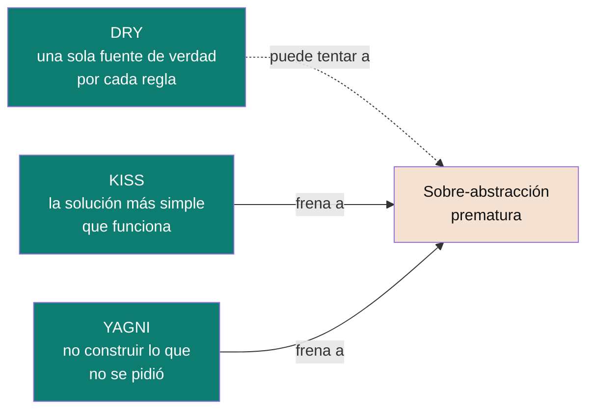

# DRY, KISS y YAGNI

Tres principios que se malinterpretan seguido porque suenan a sentido común — pero cada uno tiene un límite preciso, y saber dónde está ese límite es lo que distingue a un senior.

## DRY — Don't Repeat Yourself

> "Every piece of knowledge must have a single, unambiguous, authoritative representation within a system." — Hunt & Thomas

No es "nunca escribas dos líneas parecidas" — es que una **regla de negocio** no debería estar duplicada en dos lugares que puedan desincronizarse.

```java
// Violación de DRY: la regla "IVA = 15%" vive en dos lugares
class InvoiceService {
    BigDecimal calculateTax(BigDecimal amount) { return amount.multiply(BigDecimal.valueOf(0.15)); }
}
class ReportService {
    BigDecimal estimatedTax(BigDecimal amount) { return amount.multiply(BigDecimal.valueOf(0.15)); } // mismo 0.15 copiado
}

// Aplicando DRY: una sola fuente de verdad
class TaxPolicy {
    static final BigDecimal VAT_RATE = BigDecimal.valueOf(0.15);
    BigDecimal apply(BigDecimal amount) { return amount.multiply(VAT_RATE); }
}
```

> ⚠️ **Trampa común:** DRY no es "dos métodos con código parecido son duplicación". Dos validaciones que hoy hacen lo mismo por *coincidencia* (no porque sean la misma regla de negocio) no deberían fusionarse — si mañana cambian por razones distintas, la abstracción compartida se vuelve una rigidez artificial. Esto es lo que se conoce como "duplicación falsa" (fake duplication).

👉 **Cuándo aplica:** reglas de negocio, constantes de dominio, validaciones que representan la misma decisión. No aplica a "cualquier similitud sintáctica" — eso a veces se resuelve mejor dejando la duplicación (ver YAGNI).

---

## KISS — Keep It Simple, Stupid

Prioriza la solución más simple que resuelve el problema, sobre una más "elegante" o genérica que nadie pidió.

```java
// Viola KISS: generaliza para un caso que no existe
interface Validator<T> { boolean isValid(T input); }
class ValidatorChain<T> {
    private List<Validator<T>> validators = new ArrayList<>();
    boolean validateAll(T input) { return validators.stream().allMatch(v -> v.isValid(input)); }
}
// ... para validar un solo campo: ¿el email tiene "@"?

// Aplicando KISS: la solución directa
boolean isValidEmail(String email) { return email != null && email.contains("@"); }
```

👉 **Cuándo aplica:** cada vez que estás por escribir una abstracción (interfaz genérica, patrón de diseño, capa extra) y el problema real cabe en una función de 3 líneas. La complejidad se justifica cuando el problema la tiene — no antes.

---

## YAGNI — You Aren't Gonna Need It

No implementes una capacidad "porque capaz la necesitamos después". Construí lo que el requerimiento actual pide; si después se necesita más, se refactoriza entonces (con el costo de ese momento, no adivinado hoy).

```java
// Viola YAGNI: parámetros y ramas para casos que nadie pidió todavía
class DiscountCalculator {
    BigDecimal calculate(BigDecimal price, boolean isVip, boolean isBlackFriday,
                          boolean isFirstPurchase, String region, String currency) {
        // 5 combinaciones que hoy no se usan, "por si acaso"
    }
}

// Aplicando YAGNI: resuelve el requerimiento de hoy
class DiscountCalculator {
    BigDecimal calculate(BigDecimal price, boolean isVip) {
        return isVip ? price.multiply(BigDecimal.valueOf(0.9)) : price;
    }
}
```

👉 **Cuándo aplica:** parámetros "por si acaso", capas de abstracción para un solo caso de uso, flags de configuración que nadie pidió. La contraparte de YAGNI no es "no planifiques nada" — es "no le pongas costo de mantenimiento hoy a una flexibilidad que quizás nunca se use".

---

## Cómo se relacionan entre sí



DRY, sin KISS ni YAGNI como contrapeso, empuja a generalizar de más ("esto se repite dos veces, hagamos un framework"). Los tres juntos son el balance: **no dupliques una regla de negocio (DRY), pero tampoco generalices ni construyas nada que el problema de hoy no te pide (KISS + YAGNI)**.

Volver a [`README.md`](README.md).

## Referencias

- Hunt, A. & Thomas, D. — *The Pragmatic Programmer* (1999), capítulo sobre duplicación de conocimiento (origen de DRY).
- Martin, R. C. — *Clean Code* (2008) — capítulos sobre funciones simples y diseño incremental (base de KISS/YAGNI en la práctica diaria).
