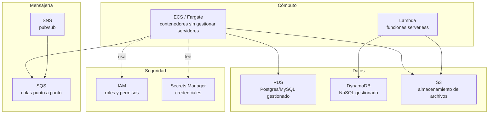

# Cloud (AWS) — conceptos clave + práctica sin tarjeta

Servicios AWS que un backend Java suele tocar, y un entorno para practicarlos en la máquina local sin necesidad de una cuenta AWS real ni tarjeta de crédito.

> Minikube emula **Kubernetes**, no AWS. Para practicar S3/SQS/RDS/DynamoDB sin poner una tarjeta real, la herramienta correcta es **[LocalStack](https://www.localstack.cloud/)**.

## Servicios core



| Servicio | Para qué lo usás desde un backend Java |
|---|---|
| `S3` | Almacenar archivos. SDK: `S3AsyncClient` para no bloquear el event loop. |
| `SQS` | Cola de mensajes para desacoplar microservicios — patrón event-driven, procesamiento asíncrono. |
| `SNS` | Pub/sub — un evento notifica a varios consumidores (ej: SQS + Lambda a la vez). |
| `RDS` | Postgres/MySQL gestionado — equivalente cloud de una base local en Docker. |
| `DynamoDB` | NoSQL gestionado — ideal para acceso por clave con baja latencia y escalado automático. |
| `Lambda` | Función serverless — útil para tareas puntuales disparadas por un evento S3/SQS. |
| `ECS/Fargate` | Cómo se despliega en producción un contenedor Spring Boot — sin gestionar servidores. |
| `Secrets Manager` | Credenciales de BD y API keys — nunca hardcodeadas ni en `application.properties`. |
| `IAM` | Roles y permisos — un servicio nunca usa credenciales de usuario, usa un role con permisos mínimos. |

## Entorno de práctica (LocalStack)

Un `docker-compose.yml` con Postgres + LocalStack (S3, SQS, SNS, DynamoDB, Lambda, Secrets Manager emulados) alcanza para practicar sin cuenta AWS real:

```bash
docker compose up -d
curl http://localhost:4566/_localstack/health   # chequeo

# ejemplo: bucket S3, sin tarjeta ni cuenta real
aws --endpoint-url=http://localhost:4566 s3 mb s3://practica-bucket
aws --endpoint-url=http://localhost:4566 s3 cp archivo.json s3://practica-bucket/

# ejemplo: cola SQS
aws --endpoint-url=http://localhost:4566 sqs create-queue --queue-name practica-queue
```

El patrón se repite para cualquier servicio AWS: mismo comando/SDK, apuntando a `--endpoint-url=http://localhost:4566` con credenciales dummy (`test`/`test`) en vez de a AWS real.

> En Spring, el `S3AsyncClient`/`SqsAsyncClient` apunta al endpoint de LocalStack (`http://localhost:4566`) con credenciales dummy (`test`/`test`). El código de producción no cambia — solo el endpoint, por configuración. Esa separación (código de negocio vs infraestructura) es en sí misma la respuesta esperada cuando preguntan "¿cómo probás algo que usa AWS sin desplegar a AWS?".

## Drills de repaso

| Tiempo | Ejercicio |
|---|---|
| 6 min | Levantar LocalStack, crear un bucket S3 y subir un archivo con el AWS CLI, sin mirar el script de referencia. |
| 6 min | Crear una cola SQS, enviar un mensaje JSON y recibirlo, explicando en voz alta la diferencia con un tópico SNS. |
| 8 min | Crear una tabla DynamoDB con clave simple, insertar un item y consultarlo — explicar cuándo usarías esto en vez de RDS. |
| 5 min | Explicar cómo el mismo código Java que usa `S3AsyncClient` funciona igual contra LocalStack y contra AWS real — qué es lo único que cambia. |

Relacionado: [`microservices-patterns/`](../microservices-patterns) para cómo SQS/SNS se usan en patrones de comunicación event-driven.
