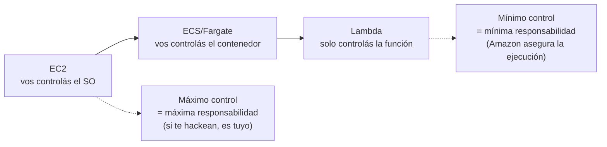
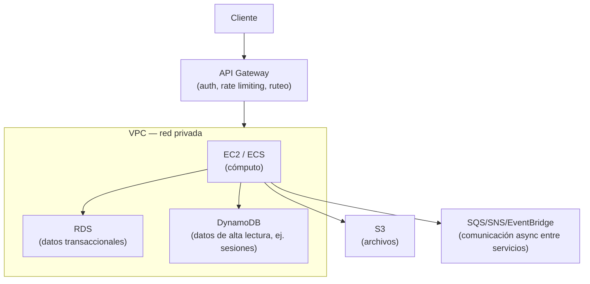
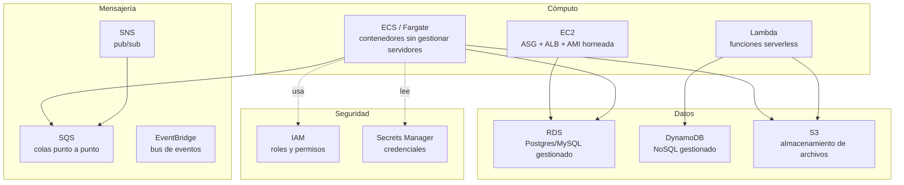

# Cloud (AWS) — conceptos clave + práctica sin tarjeta

Servicios AWS que un backend Java suele tocar, y un entorno para practicarlos en la máquina local sin necesidad de una cuenta AWS real ni tarjeta de crédito.

> Minikube emula **Kubernetes**, no AWS. Para practicar S3/SQS/RDS/DynamoDB sin poner una tarjeta real, la herramienta correcta es **[LocalStack](https://www.localstack.cloud/)**.

## El modelo mental — 3 categorías, con lo que ya conocés

No hay que memorizar servicios sueltos — hay que ubicar cada uno en **una de 3 categorías** (cómputo, datos, comunicación) y relacionarlo con algo que ya sabés usar sin nube:

| Categoría | Servicio AWS | Es básicamente... |
|---|---|---|
| **Cómputo** | `EC2` | Una VM que vos dimensionás (CPU/RAM) — como un servidor propio, con SSH, pero alquilado. |
| | `ECS`/`EKS` | Un orquestador de contenedores — lo mismo que Kubernetes (pods), gestionado por Amazon. |
| | `Lambda` | Una función que corre sola, sin servidor que dimensionar — serverless puro. |
| **Datos** | `RDS` | Tu Postgres/MySQL de siempre, gestionado (backups, failover automáticos). |
| | `DynamoDB` | NoSQL documento/clave-valor — el equivalente a un MongoDB, pero gestionado y con latencia de milisegundos. |
| | `S3` | Un disco duro casi infinito, organizado como carpetas — para archivos, no para queries. |
| **Comunicación** | `SQS` | Cola punto a punto — el equivalente a RabbitMQ. |
| | `SNS` | Pub/sub — un evento, muchos suscriptores (broadcast). |
| | `EventBridge` | Bus de eventos con reglas de ruteo — el equivalente a Kafka para arquitecturas event-driven. |

**El otro eje que importa en Cómputo — espectro de control vs. responsabilidad:**



No es "cuál es mejor" — es cuánta responsabilidad operativa querés asumir vos vs. delegarle a Amazon. Un mismo proyecto puede mezclar los tres (algunos endpoints en Lambda, otros en ECS) detrás del mismo API Gateway.

### Ejemplo de system design — la pregunta típica de entrevista



**Guion para explicarlo en voz alta:** "el cliente entra por API Gateway, que autentica y rutea a mi capa de cómputo dentro de una VPC — ahí decido EC2/ECS según cuánto control necesito. Los datos transaccionales van a RDS, y si hay un acceso de altísima frecuencia y baja latencia (como sesiones) lo separo a DynamoDB para no sobrecargar la base relacional. Los archivos van a S3, y la comunicación entre servicios (para no acoplarlos directo) va por SQS, SNS o EventBridge según necesite cola, broadcast, o un bus de eventos."

## Servicios core



| Servicio | Para qué lo usás desde un backend Java |
|---|---|
| `EC2` | Cómputo tradicional detrás de un Auto Scaling Group + ALB — ver sección dedicada más abajo. |
| `S3` | Almacenar archivos. SDK: `S3AsyncClient` para no bloquear el event loop. |
| `SQS` | Cola de mensajes para desacoplar microservicios — patrón event-driven, procesamiento asíncrono. |
| `SNS` | Pub/sub — un evento notifica a varios consumidores (ej: SQS + Lambda a la vez). |
| `EventBridge` | Bus de eventos con reglas de ruteo — arquitecturas event-driven más desacopladas que SNS directo. |
| `RDS` | Postgres/MySQL gestionado — equivalente cloud de una base local en Docker. |
| `DynamoDB` | NoSQL gestionado — ideal para acceso por clave con baja latencia y escalado automático. |
| `Lambda` | Función serverless — útil para tareas puntuales disparadas por un evento S3/SQS. |
| `ECS/Fargate` | Cómo se despliega en producción un contenedor Spring Boot — sin gestionar servidores. |
| `Secrets Manager` | Credenciales de BD y API keys — nunca hardcodeadas ni en `application.properties`. |
| `IAM` | Roles y permisos — un servicio nunca usa credenciales de usuario, usa un role con permisos mínimos. |

## S3 — buckets, clases de almacenamiento y ciclo de vida

Preguntas típicas: "¿qué clases de S3 existen?", "¿cómo hacés que un archivo se borre solo después de 30 días?", "¿cuál es la diferencia entre versioning y lifecycle?".

### Clases de almacenamiento (storage classes)

La pregunta central es: **¿con qué frecuencia se accede al archivo, y qué tan rápido lo necesito de vuelta?**

| Clase | Acceso | Tiempo de recuperación | Caso de uso |
|---|---|---|---|
| `S3 Standard` | Frecuente | Inmediato (milisegundos) | Archivos que se leen seguido: imágenes de una app, documentos activos. |
| `S3 Intelligent-Tiering` | Variable/desconocido | Inmediato | AWS mueve el archivo automáticamente entre tiers según el patrón de acceso real — ideal cuando no sabés de antemano qué tan seguido se va a leer. |
| `S3 Standard-IA` (Infrequent Access) | Poco frecuente pero rápido si se necesita | Inmediato | Backups recientes, datos de recuperación ante desastres. Más barato en storage, más caro por GB leído. |
| `S3 One Zone-IA` | Poco frecuente | Inmediato | Igual que IA pero en una sola AZ — más barato, pero se pierde si esa AZ falla. Datos re-creables. |
| `S3 Glacier Instant Retrieval` | Archivo, acceso ocasional | Milisegundos | Archivos históricos que rara vez se tocan pero que si se piden, deben responder ya (ej: imágenes médicas antiguas). |
| `S3 Glacier Flexible Retrieval` | Archivo | Minutos a horas | Backups anuales, compliance — se puede esperar. |
| `S3 Glacier Deep Archive` | Archivo, casi nunca | Horas (~12h) | La más barata. Retención legal de 7-10 años, datos que "se congelan" y casi nunca se vuelven a leer. |

> 🔑 La idea que el entrevistador busca: **no todo va en Standard**. Elegir la clase correcta es una decisión de costo basada en el patrón de acceso, y se puede automatizar con **lifecycle rules** (ver abajo) en vez de decidirlo a mano.

### Lifecycle policies (reglas de ciclo de vida)

Automatizan la transición entre clases o el borrado, sin intervención manual. Se configuran a nivel de bucket o por prefijo (carpeta lógica).

```
Regla ejemplo: "logs/"
  Día 0   → S3 Standard (se escribe el log)
  Día 30  → transición a S3 Standard-IA
  Día 90  → transición a S3 Glacier Flexible Retrieval
  Día 365 → expiración (se borra definitivamente)
```

- **Transition actions** — mueven el objeto a una clase más barata pasado X tiempo.
- **Expiration actions** — borran el objeto (o versiones viejas) pasado X tiempo. Útil para logs, uploads temporales, archivos de sesión.
- Se pueden combinar con **versioning**: cuando versioning está activo, el lifecycle puede apuntar a versiones no-actuales (`noncurrent version expiration`) para no acumular historial infinito.

### Otros conceptos de bucket que suelen preguntar

| Concepto | Qué es |
|---|---|
| **Versioning** | Guarda cada versión de un objeto en vez de sobrescribirlo. Protege contra borrado/sobrescritura accidental — pero sin lifecycle, las versiones viejas se acumulan y cuestan. |
| **Object Lock (WORM)** | Write Once Read Many — impide borrar/modificar un objeto durante un período (retención legal, compliance). Los que "se congelan definitivo" que preguntás: esto es lo que lo garantiza, no solo la clase Glacier. |
| **Bucket policy vs IAM policy** | Bucket policy: se adjunta al bucket, controla quién accede a ese bucket específico (puede dar acceso cross-account). IAM policy: se adjunta a un usuario/rol, controla a qué recursos AWS puede acceder ese usuario. |
| **Presigned URL** | URL temporal con firma que da acceso limitado en el tiempo a un objeto privado, sin exponer credenciales — típico para permitir que un frontend suba/descargue un archivo directo a S3. |
| **Encryption at rest (SSE-S3 / SSE-KMS)** | Cifrado del lado del servidor. SSE-KMS da control fino de permisos sobre la key de cifrado (auditable vía CloudTrail); SSE-S3 es más simple, AWS gestiona todo. |
| **Multipart upload** | Subir archivos grandes en partes paralelas — necesario a partir de ~100MB, obligatorio arriba de 5GB. |

---

## RDS — base de datos relacional gestionada

Preguntas típicas: "¿qué te da RDS que no tengas con Postgres en Docker?", "¿qué es Multi-AZ?", "¿cuándo usarías una read replica?".

### Qué resuelve RDS que un Postgres/MySQL "a mano" no

RDS es el motor de base de datos (Postgres, MySQL, MariaDB, SQL Server, Oracle) pero con el trabajo operativo delegado a AWS: parches de seguridad automáticos, backups, failover, monitoreo — vos seguís escribiendo el mismo SQL y usando el mismo driver JDBC/R2DBC.

| Concepto | Qué es | Cuándo importa |
|---|---|---|
| **Multi-AZ** | RDS mantiene una réplica sincrónica en otra zona de disponibilidad. Si la instancia primaria falla, AWS hace failover automático al standby (DNS se actualiza, no cambia tu connection string). | Alta disponibilidad en producción — es la respuesta esperada a "¿cómo evitás downtime si se cae la instancia de BD?". |
| **Read Replica** | Copia **asíncrona** de la BD, de solo lectura, para descargar tráfico de lectura de la instancia principal. Puede estar en otra región. | Cuando el cuello de botella son lecturas (dashboards, reportes) y no querés que compitan con las escrituras transaccionales. |
| **Multi-AZ vs Read Replica** | Multi-AZ = disponibilidad (failover), replicación síncrona, el standby no se usa para servir tráfico. Read Replica = escalar lecturas, replicación asíncrona (puede tener lag), sí sirve tráfico. | Es la pregunta trampa clásica: no son lo mismo ni resuelven lo mismo. |
| **Backups automáticos + snapshots** | Backups automáticos diarios + point-in-time recovery dentro de la ventana de retención (hasta 35 días). Snapshots manuales se guardan indefinidamente hasta que los borrás. | Recuperación ante error humano ("borré la tabla sin WHERE"), no solo ante desastre de infraestructura. |
| **Connection pooling (RDS Proxy)** | Las conexiones a una BD relacional son caras de abrir/cerrar. RDS Proxy mantiene un pool compartido — crítico con Lambda, donde cada invocación podría abrir su propia conexión y agotar el límite de la BD. | Arquitecturas serverless o con muchas instancias efímeras (ECS con auto-scaling agresivo). |
| **Parameter groups / option groups** | Configuración del motor de BD (ej: `max_connections`, `work_mem`) gestionada como recurso de AWS en vez de editar un `.conf` a mano. | Tuning de performance sin acceso SSH a la instancia — RDS no da acceso al sistema operativo. |
| **Vertical vs horizontal scaling en RDS** | Vertical: subir el tipo de instancia (más CPU/RAM) — con downtime breve salvo Multi-AZ. Horizontal: agregar read replicas — no escala escrituras, solo lecturas. | RDS relacional no escala escrituras horizontalmente de forma nativa (para eso existe Aurora o ir a NoSQL/sharding). |

> ⚠️ **Punto que un senior debe saber decir en voz alta:** RDS relacional (Postgres/MySQL clásico) no resuelve el particionamiento de escrituras — si el cuello de botella son las escrituras y no las lecturas, la respuesta no es "agregar read replicas", es reconsiderar el modelo de datos (sharding, Aurora, o mover ese dominio a DynamoDB).

### R2DBC vs RDS clásico (conexión desde Spring WebFlux)

RDS es el servicio (la base de datos gestionada); R2DBC es el driver **no bloqueante** que usás para conectarte a esa base desde un pipeline reactivo. RDS no sabe ni le importa si el cliente es JDBC o R2DBC — la diferencia vive 100% del lado de la aplicación.

## EC2 — cómputo tradicional, y cómo no operarlo "a mano"

Preguntas típicas: "¿cómo escalás un servicio Java en EC2?", "¿dónde guardás la configuración sin hardcodearla?".

| Práctica | Qué resuelve |
|---|---|
| **Auto Scaling Group (ASG)** | Escala horizontal — agrega/quita instancias según CPU/memoria/tráfico, en vez de dimensionar una instancia fija "por si acaso". |
| **Elastic Load Balancer (ALB/NLB)** | Reparte tráfico entre las instancias del ASG. ALB = capa 7 (HTTP, path-based routing); NLB = capa 4 (TCP, más throughput, IP estática). |
| **SSM Parameter Store** (o Secrets Manager para credenciales) | Configuración externalizada — nunca hardcodeada en el JAR ni en variables de entorno planas para secretos. |
| **CloudWatch + X-Ray** | Métricas (CPU/memoria/latencia) + tracing distribuido por request — ver sección de observabilidad más abajo. |
| **Packer / AMI horneada** | Se construye una imagen (AMI) con el JDK y dependencias ya instaladas, en vez de correr un script de provisioning en cada arranque — instancias nuevas del ASG arrancan más rápido y de forma reproducible. |

**Frase para entrevista:** "en EC2 el patrón estándar no es una instancia fija, es un ASG detrás de un ALB, con la config en Parameter Store y una AMI horneada — así una instancia nueva escala sin intervención manual y sin secretos en el código."

## DynamoDB — NoSQL gestionado, y cuándo elegirlo sobre RDS

Preguntas típicas: "¿DynamoDB o RDS para este caso?", "¿por qué DynamoDB no soporta joins?".

| | DynamoDB | RDS (Postgres/MySQL) |
|---|---|---|
| Modelo | NoSQL clave-valor/documento, schema-less. | Relacional, schema fijo. |
| Latencia | Milisegundos de un dígito, constante sin importar el tamaño de la tabla. | Variable según query/índices/joins. |
| Escalado | Automático (horizontal, particionado por partition key). | Vertical por defecto; horizontal solo para lecturas (read replicas) — ver sección RDS arriba. |
| Queries | Por clave (partition key + opcional sort key) o índices secundarios (GSI/LSI) — sin joins. | SQL completo: joins, agregaciones, transacciones multi-tabla. |
| Caso de uso típico | Sesiones de usuario, catálogo de productos, datos de IoT/gaming con muchísima escritura. | Datos financieros/transaccionales, reportes con relaciones complejas. |

**Regla práctica**: si la pregunta de acceso es siempre "dame el item por su ID" y el volumen de escritura es alto → DynamoDB. Si hay que cruzar información entre tablas o garantizar transacciones ACID multi-fila → RDS.

## Elasticsearch — búsqueda y análisis de logs

Preguntas típicas: "¿cómo implementarías búsqueda full-text en una app Java?".

- Se usa para **búsqueda full-text, autocompletado y análisis de logs** — no reemplaza a la base de datos transaccional, vive al lado (los datos se indexan ahí después de guardarse en la fuente de verdad).
- Desde Java: cliente REST oficial (`ElasticsearchClient` en versiones recientes del SDK) para indexar/consultar documentos.
- **Sharding + replication**: los datos se particionan en shards para escalar horizontalmente, y cada shard tiene réplicas para tolerancia a fallos — el mismo principio que un índice de base de datos, pero distribuido.
- **Kibana** — la capa de visualización encima de Elasticsearch, típica para dashboards de logs/métricas.

## Infrastructure as Code — CDK vs CloudFormation

| | CloudFormation | AWS CDK |
|---|---|---|
| Cómo se define | JSON/YAML declarativo. | Código real (Java, TypeScript, Python) que **compila a** CloudFormation. |
| Reusabilidad | Limitada a "copiar y pegar" plantillas o usar módulos. | Abstracciones reales — clases, herencia, loops, funciones — igual que cualquier código. |
| Para quién | Equipos que prefieren declarativo puro. | Equipos que ya piensan en términos de objetos/funciones y quieren IaC con el mismo lenguaje que el backend. |

**Frase para entrevista:** "CDK no reemplaza a CloudFormation, lo genera — es una capa de developer experience encima, así que cualquier limitación de CloudFormation (rollback, drift) sigue aplicando por debajo."

## Observabilidad y debugging de un problema de performance en producción

Pregunta muy común en entrevista senior: *"¿cómo depurás un problema de performance en producción?"* — la respuesta esperada tiene un orden, no es una lista suelta:

1. **CloudWatch metrics** — primero lo barato y rápido: CPU, memoria, latencia agregada. Confirma *que* hay un problema y *cuándo* empezó.
2. **X-Ray traces** — de "hay latencia" a "en qué request/servicio específico" — traza distribuida que muestra qué llamada downstream es el cuello de botella.
3. **GC logs + heap dump** — si el síntoma es memoria/latencia intermitente (no un downstream lento), es momento de mirar la JVM: pausas de GC largas, o un heap dump para encontrar qué retiene memoria (`JVisualVM`, `jcmd`, o Java Flight Recorder).
4. **Optimizar la causa raíz encontrada** — recién ahí: query de base de datos sin índice, falta de caching, un pool de conexiones subdimensionado — nunca "optimizar" antes de confirmar dónde está el cuello real.

**Frase para entrevista:** "no empiezo por adivinar — primero confirmo con métricas agregadas que hay un problema real, después uso tracing para ubicar el servicio/llamada exacta, y solo si el síntoma apunta a la JVM (no a un downstream) reviso GC/heap. Optimizar antes de medir es la forma más común de arreglar lo que no era el problema."

Para el patrón de resiliencia frente a fallas de servicios downstream (retry con backoff, circuit breaker, DLQ, idempotencia) ver [`microservices-patterns/`](../microservices-patterns) sección 2 — es la contraparte de este debugging: cómo evitar que la falla se propague, no solo cómo diagnosticarla.

## Entorno de práctica (LocalStack)

Un `docker-compose.yml` con Postgres + LocalStack (S3, SQS, SNS, DynamoDB, Lambda, Secrets Manager emulados) alcanza para practicar sin cuenta AWS real:

```bash
docker compose up -d
curl http://localhost:4566/_localstack/health   # chequeo

# ejemplo: bucket S3, sin tarjeta ni cuenta real
aws --endpoint-url=http://localhost:4566 s3 mb s3://practica-bucket
aws --endpoint-url=http://localhost:4566 s3 cp archivo.json s3://practica-bucket/

# ejemplo: cola SQS
aws --endpoint-url=http://localhost:4566 sqs create-queue --queue-name practica-queue
```

El patrón se repite para cualquier servicio AWS: mismo comando/SDK, apuntando a `--endpoint-url=http://localhost:4566` con credenciales dummy (`test`/`test`) en vez de a AWS real.

> En Spring, el `S3AsyncClient`/`SqsAsyncClient` apunta al endpoint de LocalStack (`http://localhost:4566`) con credenciales dummy (`test`/`test`). El código de producción no cambia — solo el endpoint, por configuración. Esa separación (código de negocio vs infraestructura) es en sí misma la respuesta esperada cuando preguntan "¿cómo probás algo que usa AWS sin desplegar a AWS?".

## Drills de repaso

| Tiempo | Ejercicio |
|---|---|
| 6 min | Levantar LocalStack, crear un bucket S3 y subir un archivo con el AWS CLI, sin mirar el script de referencia. |
| 6 min | Crear una cola SQS, enviar un mensaje JSON y recibirlo, explicando en voz alta la diferencia con un tópico SNS. |
| 8 min | Crear una tabla DynamoDB con clave simple, insertar un item y consultarlo — explicar cuándo usarías esto en vez de RDS. |
| 5 min | Explicar cómo el mismo código Java que usa `S3AsyncClient` funciona igual contra LocalStack y contra AWS real — qué es lo único que cambia. |
| 4 min | En voz alta: explicar la diferencia entre Multi-AZ y Read Replica en RDS, sin mirar la tabla de arriba. |
| 4 min | Diseñar (solo hablando) una lifecycle policy para un bucket de "comprobantes de pago": cuánto tiempo en Standard, cuándo pasa a IA/Glacier, cuándo expira. |
| 5 min | ¿DynamoDB o RDS para un catálogo de productos con altísimo volumen de lectura por ID, sin necesidad de joins? Justificar. |
| 5 min | Explicar en voz alta el orden de pasos para depurar un problema de performance en producción: qué mirás primero, y por qué no empezás optimizando directamente. |
| 4 min | ¿CDK reemplaza a CloudFormation o lo usa por debajo? ¿Qué implica eso para el rollback/drift? |

Relacionado: [`microservices-patterns/`](../microservices-patterns) para cómo SQS/SNS se usan en patrones de comunicación event-driven, y para el patrón de resiliencia (retry/circuit breaker/DLQ/idempotencia) que complementa la sección de observabilidad de arriba.

## Referencias

- [Documentación oficial de AWS — S3 Storage Classes](https://docs.aws.amazon.com/AmazonS3/latest/userguide/storage-class-intro.html), [Amazon RDS User Guide](https://docs.aws.amazon.com/AmazonRDS/latest/UserGuide/Welcome.html) y [Amazon DynamoDB Developer Guide](https://docs.aws.amazon.com/amazondynamodb/latest/developerguide/Introduction.html).
- [AWS CDK — Developer Guide](https://docs.aws.amazon.com/cdk/v2/guide/home.html) — modelo de abstracciones sobre CloudFormation.
- [AWS X-Ray Developer Guide](https://docs.aws.amazon.com/xray/latest/devguide/aws-xray.html) — tracing distribuido para depurar performance en producción.
- [LocalStack Documentation](https://docs.localstack.cloud/) — para el entorno de práctica local sin cuenta AWS real.
