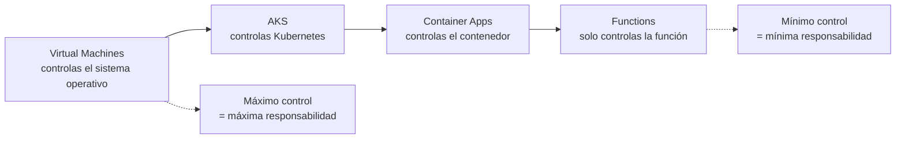
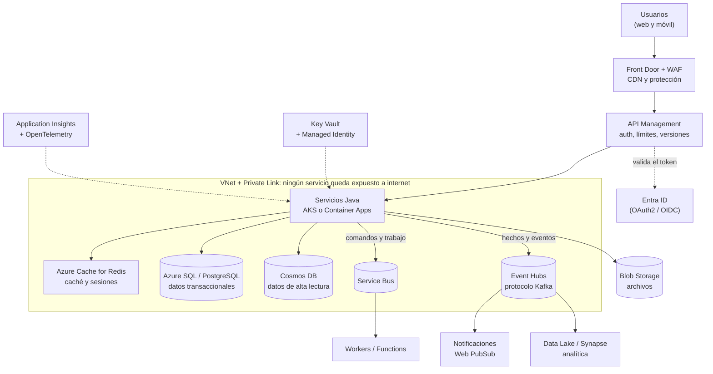

# Azure — mapa mental y servicios clave

Los servicios de Azure que un backend Java (Quarkus o Spring Boot) suele tocar, explicados **con manzanas y peras**. Para esta entrevista (Arkano es partner de Microsoft), **Azure es la nube que más importa**.

> Equivalente en AWS: [`../aws/`](../aws). Comparación de las tres nubes: [`../README.md`](../README.md). Si te preguntan por un servicio concreto, ve a su documento:
>
> | Tema | Documento |
> |---|---|
> | **Mensajería y Kafka:** Event Hubs, Service Bus, Event Grid | [`mensajeria-event-hubs-service-bus.md`](mensajeria-event-hubs-service-bus.md) |
> | **Kubernetes:** AKS, Container Apps, cuándo usar cada cómputo | [`aks-kubernetes.md`](aks-kubernetes.md) |
> | **Redis:** Azure Cache for Redis, caché, sesiones, pub/sub | [`redis-cache.md`](redis-cache.md) |
> | **Datos, seguridad y DevOps:** Cosmos DB, Azure SQL, Blob, Key Vault, Entra ID, App Insights, Azure DevOps | [`datos-seguridad-y-devops.md`](datos-seguridad-y-devops.md) |

## 🍎 Con manzanas (empieza aquí)

Una nube es **un centro comercial donde alquilas todo ya montado**: en vez de construir el local, la cocina, la bodega y la seguridad, **alquilas locales listos** y solo pones tus manzanas. Azure es el centro comercial de Microsoft.

- **Cómputo** = el **local** donde trabajas (desde un local vacío hasta un puesto con todo incluido).
- **Datos** = la **bodega y el archivo**.
- **Mensajería** = el **sistema de notas y avisos** entre áreas.
- **Seguridad** = las **llaves, las credenciales y los guardias**.
- **Red** = los **pasillos y las puertas**: quién puede entrar a dónde.
- **Observabilidad** = las **cámaras y los contadores** para saber qué pasa.

### Qué debes dominar según tu nivel

| Nivel | Debes poder explicar |
|---|---|
| 🟢 **Junior** | Qué es una nube y por qué se usa; las categorías (cómputo, datos, mensajería, seguridad); cuál servicio de Azure corresponde a qué |
| 🟡 **Mid** | Event Hubs vs Service Bus; AKS vs Container Apps vs Functions; Key Vault y Managed Identity; Cosmos DB vs Azure SQL; Application Insights |
| 🔴 **Senior** | Diseñar un sistema completo eligiendo y justificando servicios; costos y límites; seguridad por identidad; alta disponibilidad y recuperación; *lock-in* y alternativas |

## 1. El mapa: cada servicio en su categoría, con su equivalente

| Categoría | Servicio Azure | 🍎 Es básicamente... | AWS | GCP |
|---|---|---|---|---|
| **Cómputo** | **Virtual Machines** | Un local vacío que tú amueblas | EC2 | Compute Engine |
| | **App Service** | Un local con todo incluido para tu app web | Elastic Beanstalk | App Engine |
| | **Azure Functions** | Un empleado que trabaja solo cuando llega un pedido | Lambda | Cloud Run functions |
| | **Container Apps** | Contenedores sin gerente de Kubernetes | Fargate / App Runner | Cloud Run |
| | **AKS** (Kubernetes) | Un gerente que reparte cajas entre sucursales | EKS | GKE |
| **Datos** | **Azure SQL / PostgreSQL** | El archivo de fichas de siempre, gestionado | RDS / Aurora | Cloud SQL |
| | **Cosmos DB** | Un archivo que se parte solo en muchas oficinas y responde en milisegundos | DynamoDB | Firestore / Spanner |
| | **Blob Storage** | Una bodega casi infinita para archivos | S3 | Cloud Storage |
| | **Azure Cache for Redis** | El mostrador con lo más vendido a la mano | ElastiCache | Memorystore |
| **Mensajería** | **Service Bus** | Buzón de pedidos importantes con acuse y bandeja de errores | SQS + SNS | Pub/Sub |
| | **Event Hubs** | El libro de ventas (log de eventos) | MSK / Kinesis | Pub/Sub / Kafka gestionado |
| | **Event Grid** | La campana que avisa "pasó algo" | EventBridge | Eventarc |
| **Seguridad** | **Entra ID** | El carnet de quién eres | Cognito + IAM | Identity Platform + IAM |
| | **Managed Identity** | Un carnet que Azure le pone solo a tu servicio, sin contraseña | IAM Role | Workload Identity |
| | **Key Vault** | La caja fuerte de claves y secretos | Secrets Manager + KMS | Secret Manager + KMS |
| **Red** | **VNet + Private Link** | Los pasillos privados de la tienda | VPC + PrivateLink | VPC + Private Service Connect |
| | **API Management** | La recepción: controla quién pasa y cuántas veces | API Gateway | API Gateway / Apigee |
| | **Front Door + WAF** | La puerta principal con guardia y repartidor global | CloudFront + WAF | Cloud CDN + Cloud Armor |
| | **Application Gateway** | El repartidor de clientes entre cajas | ALB | Cloud Load Balancing |
| **Observabilidad** | **Azure Monitor + Application Insights** | Las cámaras y los contadores | CloudWatch + X-Ray | Cloud Monitoring + Trace |
| **DevOps** | **Azure DevOps** | La línea de armado de entregas | CodePipeline + CodeBuild | Cloud Build |
| | **Container Registry (ACR)** | El almacén de tus imágenes de contenedor | ECR | Artifact Registry |
| | **Bicep / Terraform** | El plano escrito de toda la tienda | CloudFormation / CDK | Deployment Manager / Terraform |

## 2. ¿Qué cómputo elijo? (la pregunta clásica)

El eje es **cuánto control quieres y cuánta responsabilidad quieres asumir**:

| Si tu caso es... | Elige | Por qué |
|---|---|---|
| Una app web o API sencilla, sin complicaciones | **App Service** | Despliegas el código y listo |
| Una tarea corta disparada por un evento (un mensaje, un archivo, un cron) | **Functions** | Pagas por ejecución |
| Microservicios en contenedores sin querer operar Kubernetes | **Container Apps** | Autoescalado (incluido con **KEDA**), sin gestionar el cluster |
| Muchos microservicios, control fino, equipo con experiencia en Kubernetes | **AKS** | Todo el ecosistema de Kubernetes |
| Una aplicación antigua que necesita su propio sistema operativo | **Virtual Machines** | Máxima compatibilidad |

Detalle de AKS y Container Apps: [`aks-kubernetes.md`](aks-kubernetes.md).

## 3. Ejemplo de system design en Azure (la pregunta típica)

**Guion para explicarlo en voz alta:** "Los usuarios entran por **Front Door** (CDN y WAF) y **API Management**, que valida el token con **Entra ID**, aplica límites y versiona. Detrás, mis **servicios Java** corren en **AKS** o **Container Apps**. Antes de ir a la base reviso **Redis** para no repetir consultas. Los datos transaccionales van a **Azure SQL o PostgreSQL**, y los de alta lectura a **Cosmos DB**; los archivos, a **Blob Storage**. Para desacoplar uso **Service Bus** para el trabajo y los comandos (con DLQ, reintentos y mensajes programados) y **Event Hubs** para publicar hechos que varios consumen. Los secretos no están en archivos: viven en **Key Vault** y mis servicios entran con **Managed Identity**. Todo dentro de una **VNet** con **Private Link**, y la observabilidad con **Application Insights**."

## 4. Frases para la entrevista

- **"¿Por qué la nube?"** *"No pago por construir y mantener la infraestructura; escalo según la demanda, y delego parches, copias y alta disponibilidad."*
- **"¿Qué es Managed Identity?"** *"Una identidad que Azure asigna a mi servicio, para que acceda a Key Vault, a la base o a Event Hubs sin contraseñas ni claves en archivos."*
- **"¿Event Hubs o Service Bus?"** *"Event Hubs para un flujo masivo de hechos que se puede releer; Service Bus para comandos que necesitan reintentos, orden, mensajes programados y bandeja de errores."* ([detalle](mensajeria-event-hubs-service-bus.md))
- **"¿AKS o Container Apps?"** *"Container Apps si no quiero operar Kubernetes; AKS si necesito control fino y el ecosistema completo."* ([detalle](aks-kubernetes.md))
- **"Tu experiencia con Azure."** *"Usé Event Hubs por su endpoint de Kafka con Spring Cloud Stream. Mi nube principal es AWS, pero los conceptos se mapean casi uno a uno."* (Solo si es verdad.)

## Casos relacionados en este repo

- Tus servicios de transferencias, y su versión en Azure, AWS y GCP: [`../../system-design/caso-transferencias-asincronas.md`](../../system-design/caso-transferencias-asincronas.md) (sección 10).
- La pasarela de pagos en la nube: [`../../system-design/caso-pasarela-pagos-cloud.md`](../../system-design/caso-pasarela-pagos-cloud.md).
- Kafka y comparación de brokers: [`../../messaging-streaming/`](../../messaging-streaming).

> **Aviso:** los nombres, niveles y límites de los servicios de Azure cambian con frecuencia. Lo marcado con 🔎 en los documentos de esta carpeta conviene confirmarlo en la documentación oficial de Microsoft antes de citarlo como exacto.
