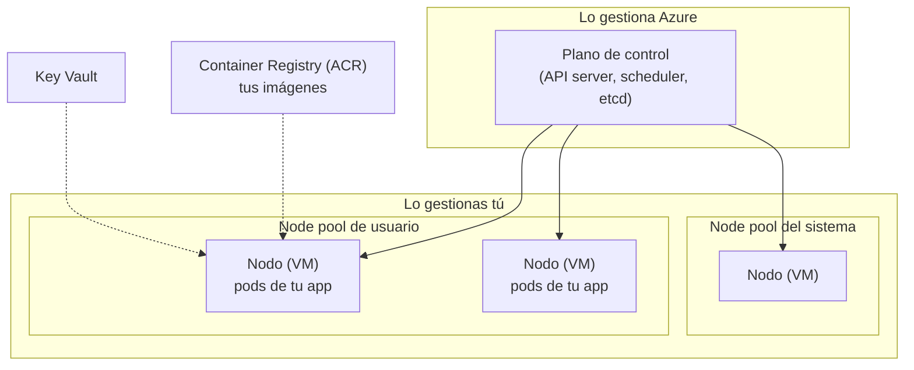

# Azure: Kubernetes (AKS) y Container Apps

Qué es Kubernetes, cómo lo ofrece Azure con **AKS**, y cuándo usar **Container Apps**, **Functions** o **App Service** en su lugar.

> Volver al mapa de Azure: [`README.md`](README.md) · Escalar consumidores de Kafka: [`mensajeria-event-hubs-service-bus.md`](mensajeria-event-hubs-service-bus.md) · Equivalente en AWS: EKS y ECS en [`../aws/`](../aws)

## 🍎 Con manzanas (empieza aquí)

Tu frutería creció y ahora tiene **muchas sucursales**. En cada una hay **cajas registradoras** (tus aplicaciones en contenedores). **Kubernetes es el gerente general**: decide en qué sucursal va cada caja, **reemplaza las que se rompen**, **abre más cajas cuando hay fila** y las **apaga cuando no hace falta**. **AKS** es ese gerente **alquilado a Azure**: tú no pagas ni cuidas al gerente (el *plano de control*), solo pones las sucursales (los *nodos*) y las cajas.

| Concepto de Kubernetes | 🍎 En la frutería | Qué es técnicamente |
|---|---|---|
| **Contenedor** | Una caja registradora ya armada y sellada | Tu aplicación empaquetada con todo lo que necesita (imagen Docker) |
| **Pod** | La caja puesta en el mostrador (a veces con su ayudante) | La unidad mínima: uno o más contenedores juntos |
| **Deployment** | "Quiero **3 cajas iguales** siempre abiertas" | Declara cuántas réplicas y qué versión; reemplaza las que fallan y hace actualizaciones |
| **Service** | Un **teléfono fijo** que reparte las llamadas entre las cajas | Dirección estable que balancea entre los pods |
| **Ingress** | La **puerta principal** con carteles ("pagos por aquí") | Entrada HTTP desde afuera, con reglas por ruta |
| **ConfigMap** | Un **cartel** con las reglas de la tienda | Configuración no secreta |
| **Secret** | La **caja fuerte** | Datos sensibles (mejor desde Key Vault) |
| **Namespace** | Una **sección** de la tienda (frutas, lácteos) | Separación lógica dentro del cluster |
| **Node** | Cada **sucursal** (el local físico) | Una máquina virtual que ejecuta pods |
| **HPA** | "Si hay fila, abre **más cajas**" | Autoescalado de pods por CPU, memoria o métricas |
| **Cluster Autoscaler** | "Si faltan locales, **alquila otro**" | Autoescalado de nodos |
| **Liveness / Readiness probe** | El gerente pregunta "¿**sigues vivo**?" y "¿**estás listo** para atender?" | Chequeos de salud: reinicia o saca del tráfico |
| **Requests / Limits** | Cuánto espacio **reservas** y cuánto **máximo** puedes usar | CPU y memoria por contenedor |
| **Rolling update** | Cambiar las cajas viejas por nuevas **de a una**, sin cerrar | Despliegue sin caída |

### Qué debes dominar según tu nivel

| Nivel | Debes poder explicar |
|---|---|
| 🟢 **Junior** | Qué es un contenedor, un pod, un deployment y un service; qué problema resuelve Kubernetes |
| 🟡 **Mid** | Probes, requests y limits, ConfigMap y Secret, HPA, Ingress; qué ofrece AKS frente a Kubernetes "a mano"; AKS vs Container Apps |
| 🔴 **Senior** | Node pools, redes (CNI), identidad de las cargas (Workload Identity), escalado con KEDA, upgrades, seguridad, costos; cuándo **no** usar Kubernetes |

## 1. Qué hace Azure por ti en AKS



| Parte | Quién la cuida |
|---|---|
| **Plano de control** (el "cerebro") | **Azure**: parches, alta disponibilidad |
| **Nodos** (las VMs donde corren los pods) | **Tú** eliges tamaño y cantidad (Azure aplica parches con tus reglas); hay modos más automáticos (*AKS Automatic*) 🔎 |
| **Tus aplicaciones y su configuración** | **Tú** |

## 2. Las piezas de AKS que se preguntan

| Tema | Qué decir |
|---|---|
| **Node pools** | Grupos de nodos del mismo tipo. **Del sistema** (componentes de Kubernetes) y **de usuario** (tus apps); puedes tener pools con VMs distintas (por ejemplo, con GPU) |
| **Redes (CNI)** | Cómo reciben IP los pods: **Azure CNI** (IPs de la VNet; más integración) o *overlay* (más ahorro de IPs). Se elige al crear el cluster |
| **Ingress** | Entrada HTTP: **NGINX** o **Application Gateway** para contenedores; con **Front Door/WAF** delante |
| **Identidad de las cargas** | **Microsoft Entra Workload Identity**: un pod asume una **Managed Identity** para entrar a Key Vault, Event Hubs o la base, **sin contraseñas** |
| **Secretos** | **Key Vault** con el driver CSI: los secretos aparecen como archivos o variables sin guardarse en el cluster |
| **Imágenes** | **ACR** (Azure Container Registry) integrado con AKS; escaneo de vulnerabilidades |
| **Escalado** | **HPA** (pods) + **Cluster Autoscaler** (nodos) + **KEDA** (por eventos, ver abajo) |
| **Actualizaciones** | Upgrades de versión de Kubernetes y de la imagen del nodo, controlados por *canales* y ventanas de mantenimiento |
| **Observabilidad** | **Container Insights** (Azure Monitor), Prometheus y Grafana gestionados, Application Insights en la app |
| **Políticas y seguridad** | **Azure Policy** para AKS, Microsoft Defender para contenedores, RBAC de Kubernetes con Entra ID |
| **Aislamiento de red** | **Private cluster** (API privada), **Network Policies**, Private Link a las bases de datos |

## 3. KEDA: escalar por eventos (muy relacionado con Kafka)

El HPA clásico escala por CPU o memoria. **KEDA** escala por el **trabajo pendiente**: mensajes en una cola de **Service Bus**, o el **retraso (lag)** de un consumer group de **Event Hubs o Kafka**. Puede incluso llevar las réplicas a **cero** cuando no hay trabajo.

```yaml
# Ejemplo conceptual: escalar un consumidor según el backlog de Event Hubs
apiVersion: keda.sh/v1alpha1
kind: ScaledObject
metadata:
  name: consumidor-ordenes
spec:
  scaleTargetRef:
    name: consumidor-ordenes          # el Deployment a escalar
  minReplicaCount: 1
  maxReplicaCount: 12                 # no más que el número de particiones
  triggers:
  - type: azure-eventhub
    metadata:
      consumerGroup: ejecutor
      unprocessedEventThreshold: "100"
      # conexiones por TriggerAuthentication / identidad, nunca en texto plano
```

**Regla clave:** en Kafka y Event Hubs, **no tiene sentido tener más réplicas que particiones** (las sobrantes quedan ociosas). Ver [`../../messaging-streaming/kafka.md`](../../messaging-streaming/kafka.md).

## 4. Un servicio Java en AKS (ejemplo mínimo)

```yaml
apiVersion: apps/v1
kind: Deployment
metadata:
  name: ordenes
spec:
  replicas: 3
  selector:
    matchLabels: { app: ordenes }
  template:
    metadata:
      labels: { app: ordenes, azure.workload.identity/use: "true" }   # identidad sin contraseñas
    spec:
      serviceAccountName: ordenes-sa
      containers:
      - name: ordenes
        image: miregistro.azurecr.io/ordenes:1.4.2
        ports: [{ containerPort: 8080 }]
        resources:
          requests: { cpu: "250m", memory: "512Mi" }   # lo que reservo
          limits:   { cpu: "1",    memory: "1Gi" }     # el máximo
        readinessProbe:                                # ¿listo para recibir tráfico?
          httpGet: { path: /q/health/ready, port: 8080 }   # Quarkus; en Spring: /actuator/health/readiness
        livenessProbe:                                 # ¿sigue vivo?
          httpGet: { path: /q/health/live, port: 8080 }
        envFrom:
        - configMapRef: { name: ordenes-config }
---
apiVersion: v1
kind: Service
metadata:
  name: ordenes
spec:
  selector: { app: ordenes }
  ports: [{ port: 80, targetPort: 8080 }]
```

**Lo que se pregunta de este archivo:** por qué hay dos *probes* distintas (si falla *readiness* sacan al pod del tráfico; si falla *liveness* lo reinician), qué pasa con `requests` y `limits` (el planificador usa `requests`; superar `limits` de memoria mata el contenedor), y por qué 3 réplicas (alta disponibilidad).

### Comandos que conviene conocer

| Comando | Para qué |
|---|---|
| `kubectl get pods -n <ns>` | Ver pods y su estado |
| `kubectl describe pod <pod>` | Por qué un pod no arranca (eventos) |
| `kubectl logs <pod> [-f]` | Ver logs |
| `kubectl rollout status deploy/<n>` · `rollout undo` | Seguir o revertir un despliegue |
| `kubectl scale deploy/<n> --replicas=5` | Escalar a mano |
| `kubectl top pods` | Uso de CPU y memoria |
| `kubectl exec -it <pod> -- sh` | Entrar a un contenedor |

**Estados típicos de fallo:** `CrashLoopBackOff` (el contenedor arranca y cae: mira `logs`), `ImagePullBackOff` (no puede bajar la imagen: ACR y permisos), `Pending` (no hay nodo con recursos suficientes), `OOMKilled` (superó el límite de memoria).

## 5. ¿AKS, Container Apps, Functions o App Service?

| | **AKS** | **Container Apps** | **Functions** | **App Service** |
|---|---|---|---|---|
| **Qué es** | Kubernetes gestionado | Contenedores sin Kubernetes a la vista | Funciones por evento | App web gestionada |
| **Control** | **Máximo** | Medio | Mínimo | Medio-bajo |
| **Responsabilidad tuya** | Nodos, redes, upgrades, seguridad | Casi solo la app | Solo la función | La app |
| **Escalado** | HPA, KEDA, autoscaler de nodos | **KEDA incluido**, hasta cero | Por evento | Por reglas |
| **Complejidad** | **Alta** | Baja | Muy baja | Muy baja |
| **Ideal para** | Muchos microservicios, equipo con experiencia en Kubernetes, requisitos de red y seguridad a medida | Microservicios y consumidores de eventos **sin operar** un cluster | Tareas puntuales, timers, integración | Una API o web sencilla |

**Regla práctica:** *empieza por lo más simple que cumpla* (**Container Apps**, **Functions** o **App Service**) *y sube a AKS solo si necesitas su control*. Kubernetes tiene un **costo operativo real**: no lo uses por moda.

## 6. Preguntas de entrevista con escalera de respuesta

| Pregunta | 🟢 Junior | 🟡 Mid | 🔴 Senior |
|---|---|---|---|
| **¿Qué es Kubernetes?** | "Un orquestador de contenedores: los reparte, reinicia y escala." | "Con Deployments, Services e Ingress declaro el estado deseado y Kubernetes lo mantiene." | "Es una plataforma declarativa y reconciliadora; su costo operativo es alto, así que lo uso cuando de verdad lo necesito." |
| **¿Qué es AKS?** | "Kubernetes gestionado por Azure." | "Azure gestiona el plano de control; yo, los node pools y las apps." | "Y elijo CNI, identidad con Workload Identity, KEDA y políticas; considero AKS Automatic si quiero menos operación." |
| **¿Pod vs Deployment vs Service?** | "Pod es la unidad, Deployment mantiene réplicas, Service da una dirección estable." | "El Deployment crea ReplicaSets de pods; el Service balancea entre ellos." | "Y uso rolling updates, PodDisruptionBudgets y topologías para alta disponibilidad." |
| **¿Qué son las probes?** | "Chequeos de salud." | "Readiness saca del tráfico; liveness reinicia." | "Y los endpoints deben medir lo correcto: readiness no debe depender de servicios externos opcionales." |
| **¿Cómo escalas un consumidor de Kafka en AKS?** | "Con más réplicas." | "KEDA por lag, con un máximo igual al número de particiones." | "Y vigilo rebalanceos, el tiempo de arranque y que el destino aguante la concurrencia." |
| **¿AKS o Container Apps?** | "Container Apps es más simple." | "Container Apps si no quiero operar Kubernetes; AKS si necesito control." | "Empiezo simple y migro si lo exige la red, la seguridad o el ecosistema; el contenedor es el mismo." |
| **¿Cómo accede un pod a Key Vault sin contraseñas?** | "Con una identidad." | "Workload Identity con una Managed Identity y el rol correcto." | "Con mínimo privilegio por servicio y el driver CSI para no guardar secretos en el cluster." |

## Referencias

- Documentación de Microsoft: *Azure Kubernetes Service (AKS)*, *Azure Container Apps* y *KEDA*. 🔎 Verifica modos de AKS, redes y niveles antes de citarlos como exactos.
