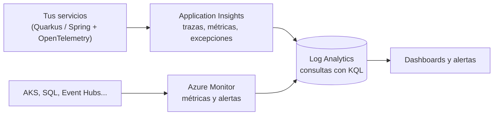
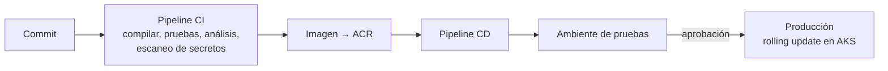

# Azure: datos, seguridad, red, observabilidad y DevOps

El resto de servicios de Azure que se preguntan junto a los de cómputo y mensajería: **dónde guardar datos, cómo proteger accesos, cómo ver qué pasa y cómo desplegar**.

> Volver al mapa de Azure: [`README.md`](README.md) · Mensajería: [`mensajeria-event-hubs-service-bus.md`](mensajeria-event-hubs-service-bus.md) · Kubernetes: [`aks-kubernetes.md`](aks-kubernetes.md) · Redis: [`redis-cache.md`](redis-cache.md)

## 🍎 Con manzanas (empieza aquí)

| Área | Servicio | 🍎 En la frutería |
|---|---|---|
| **Datos** | Azure SQL / PostgreSQL | El **archivo de fichas** de siempre, ordenado y con reglas |
| | Cosmos DB | Un archivo que **se parte solo en muchas oficinas** y contesta rápido, pero ordenado por la clave que tú elijas |
| | Blob Storage | La **bodega** para cajas grandes (archivos), con estantes baratos para lo que casi no se usa |
| **Seguridad** | Entra ID | El **carnet** de cada persona |
| | Managed Identity | Un carnet que Azure **pone solo** a tu servicio: no hay contraseña que robar |
| | Key Vault | La **caja fuerte** de las llaves |
| **Red** | VNet, Private Link | Los **pasillos privados**: la bodega no tiene puerta a la calle |
| **Observabilidad** | Application Insights, Azure Monitor | Las **cámaras** y los **contadores** |
| **DevOps** | Azure DevOps, ACR, Bicep | La **línea de armado** que entrega cada cambio igual, siempre |

### Qué debes dominar según tu nivel

| Nivel | Debes poder explicar |
|---|---|
| 🟢 **Junior** | Qué es cada servicio en una frase; por qué no guardar claves en el código |
| 🟡 **Mid** | Cosmos DB vs Azure SQL; niveles de Blob; Key Vault + Managed Identity; Application Insights; qué hace un pipeline |
| 🔴 **Senior** | Partition key y RU/s en Cosmos; niveles de consistencia; modelo de seguridad por identidad y Private Link; trazas distribuidas; IaC y despliegues sin caída |

## 1. Datos

### 1.1 · Azure SQL y PostgreSQL (relacional gestionado)

Es tu base de datos de siempre, con **parches, copias de seguridad y alta disponibilidad** a cargo de Azure. Equivale a **RDS** en AWS. Los conceptos de **transacciones, aislamiento, índices y N+1** son los mismos: ver [`../../frameworks/quarkus/persistencia-hibernate-postgresql.md`](../../frameworks/quarkus/persistencia-hibernate-postgresql.md).

| Servicio | Qué es |
|---|---|
| **Azure SQL Database** | SQL Server gestionado |
| **Azure Database for PostgreSQL (Flexible Server)** | PostgreSQL gestionado |
| **Réplicas de lectura / geo-replicación** | Escalar lecturas y recuperarse de una caída regional |
| **Copias y recuperación a un punto en el tiempo** | Volver atrás ante un error humano |

**Usarlo para:** datos transaccionales (pagos, órdenes), relaciones y SQL completo.

### 1.2 · Cosmos DB (NoSQL globalmente distribuido)

Una base **NoSQL** que se escala repartiendo los datos en **particiones lógicas** según una **clave de partición**, y responde en milisegundos. Equivale a **DynamoDB**.

| Concepto | Qué decir |
|---|---|
| **Clave de partición (partition key)** | **La decisión más importante.** Reparte los datos y la carga: una mala clave crea una partición "caliente". Debe tener muchos valores distintos y repartir bien las lecturas y escrituras |
| **RU/s (Request Units)** | La "moneda" de rendimiento: cada operación cuesta unidades. Se puede aprovisionar, escalar solo (*autoscale*) o usar el modo sin servidor |
| **Niveles de consistencia (5)** | De más fuerte a más débil: **Strong**, **Bounded Staleness**, **Session** (el más usado por defecto), **Consistent Prefix** y **Eventual**. A más fuerte, más latencia y costo |
| **Change feed** | Un registro **ordenado de los cambios** de un contenedor: base ideal para proyectar vistas (CQRS), disparar eventos o sincronizar |
| **APIs** | NoSQL (la nativa), MongoDB, Cassandra, PostgreSQL (distribuido), entre otras |
| **Sin joins entre documentos** | Se modela **desnormalizado**, pensando en cómo se consulta |

**Cosmos DB o Azure SQL:**

| | **Cosmos DB** | **Azure SQL / PostgreSQL** |
|---|---|---|
| Modelo | Documentos, clave-valor | Relacional |
| Escala | **Horizontal**, automática | Vertical; lecturas con réplicas |
| Consultas | Por clave de partición (rápidas); entre particiones cuestan más | SQL completo, joins, transacciones multi-tabla |
| Consistencia | **Configurable** (5 niveles) | ACID fuerte |
| Ideal | Altísimo volumen de lectura/escritura por clave, datos globales, vistas CQRS | Datos financieros y transaccionales, reportes |

**Regla:** si el acceso es casi siempre "dame el ítem por su id" y el volumen es muy alto → **Cosmos DB**; si hay relaciones y transacciones complejas → **relacional**. Mismo criterio que DynamoDB vs RDS ([`../aws/`](../aws)).

### 1.3 · Blob Storage (archivos)

Para **archivos y objetos** (imágenes, PDF, comprobantes, copias). Equivale a **S3**.

| Nivel de acceso | Uso | Costo |
|---|---|---|
| **Hot** | Se lee a menudo | Almacenar caro, leer barato |
| **Cool** | Se lee poco (30+ días) | Más barato guardar, más caro leer |
| **Cold** | Se lee muy poco (90+ días) | Aún más barato |
| **Archive** | Casi nunca; recuperar tarda **horas** | El más barato para guardar |

- **Lifecycle management:** reglas que **mueven** o **borran** blobs según su antigüedad (como las *lifecycle policies* de S3).
- **SAS (Shared Access Signature):** URL **temporal** con permisos limitados (equivale a una *presigned URL*).
- **Inmutabilidad (WORM):** impide borrar o modificar durante un periodo (cumplimiento legal).
- **Event Grid** puede avisar cuando se crea un blob (ver [mensajería](mensajeria-event-hubs-service-bus.md)).
- Con **Data Lake Storage Gen2** se usa como lago de datos para analítica.

## 2. Seguridad e identidad

### 2.1 · Entra ID vs Managed Identity vs RBAC (la confusión típica)

| | Qué es | Ejemplo |
|---|---|---|
| **Microsoft Entra ID** | El **directorio de identidades** (antes *Azure Active Directory*): usuarios, aplicaciones, grupos. Da **OAuth2 y OpenID Connect** | Un usuario inicia sesión en tu app y recibe un token JWT |
| **Managed Identity** | Una identidad de Entra ID que **Azure asigna a tu servicio** y rota sola. **Sin contraseñas** | Tu servicio en AKS lee un secreto de Key Vault sin ninguna clave |
| **RBAC de Azure** | **Qué puede hacer** cada identidad sobre cada recurso (roles) | "Esta identidad puede **solo leer secretos** de este Key Vault" |

**Los dos tipos de Managed Identity:** **asignada por el sistema** (nace y muere con el recurso) y **asignada por el usuario** (independiente y reutilizable por varios recursos).

> **Frase clave:** *"No guardo credenciales: el servicio usa una Managed Identity con el mínimo rol necesario (RBAC) para acceder a Key Vault, la base o Event Hubs."* Es la contraparte de **IAM Roles** y **Cognito** en AWS.

### 2.2 · Key Vault

| Guarda | Para qué |
|---|---|
| **Secretos** | Cadenas de conexión, contraseñas, API keys |
| **Claves** | Claves criptográficas (cifrar, firmar) sin que salgan del servicio |
| **Certificados** | Gestión y renovación de TLS |

Buenas prácticas: acceso con **Managed Identity + RBAC**, **rotación** de secretos, **registro de auditoría** de accesos, y **Private Endpoint**. Es el sitio de las claves que antes estaban "en el yml" (ver [`../../messaging-streaming/practica-kafka-ejercicios.md`](../../messaging-streaming/practica-kafka-ejercicios.md)).

### 2.3 · Red

| Servicio | Qué hace | 🍎 |
|---|---|---|
| **VNet** y **subredes** | Tu red privada en Azure | Los pasillos privados |
| **NSG** (Network Security Group) | Reglas de qué tráfico entra y sale de una subred | La lista de quién puede pasar |
| **Private Endpoint / Private Link** | Conecta un servicio de Azure (SQL, Storage, Event Hubs, Redis, Key Vault) a tu VNet **con IP privada**, sin pasar por internet | La puerta interna: la bodega no tiene salida a la calle |
| **API Management** | Gateway de APIs: autenticación, límites, versiones, políticas | La recepción |
| **Front Door + WAF** | Entrada global con CDN y firewall de aplicaciones | La puerta principal con guardia |
| **Application Gateway** | Balanceador de capa 7 (HTTP) regional | El repartidor de clientes entre cajas |

## 3. Observabilidad



| Pieza | Qué es |
|---|---|
| **Azure Monitor** | La plataforma de métricas, registros y alertas de todo Azure |
| **Application Insights** | Observabilidad de **tu aplicación**: peticiones, dependencias, excepciones, **trazas distribuidas** (mapa de aplicación) |
| **Log Analytics** | Donde se guardan los registros; se consultan con **KQL** |
| **OpenTelemetry** | Estándar para instrumentar sin atarte a un proveedor (hay *distro* de Azure Monitor) |
| **Container Insights / Prometheus / Grafana** | Observabilidad de AKS |

**Ejemplo de consulta KQL** (errores de la última hora por servicio):

```kusto
requests
| where timestamp > ago(1h) and success == false
| summarize fallos = count() by cloud_RoleName, resultCode
| order by fallos desc
```

**El orden para depurar un problema de rendimiento (igual que en AWS):** *métricas agregadas* (¿hay un problema y desde cuándo?) → *trazas distribuidas* (¿en qué servicio o llamada?) → *logs y la JVM* (GC, heap) → *optimizar la causa*, nunca antes de medir. Con `correlation-id` y `traceparent` en cada mensaje de Kafka, una orden se sigue de punta a punta.

## 4. DevOps y despliegue

| Pieza | Qué es | 🍎 |
|---|---|---|
| **Azure DevOps** | Repos, **Pipelines** (CI/CD), Boards y Artifacts (lo que menciona el job description) | La línea de armado completa |
| **Pipeline CI/CD** | *Compilar → probar → analizar → construir imagen → desplegar* en cada cambio | Cada cambio pasa por la misma revisión |
| **Azure Container Registry (ACR)** | Repositorio de tus imágenes de contenedor | El almacén de cajas selladas |
| **IaC: Bicep / Terraform / ARM** | La infraestructura **escrita como código**, repetible por ambiente | El plano de la tienda |
| **Despliegue sin caída** | **Rolling update**, **blue-green**, **canary**; en App Service, *deployment slots* | Cambiar cajas de una en una sin cerrar |
| **Variables y secretos** | Grupos de variables y **Key Vault** enlazado al pipeline | Sin claves en el repositorio |



**Frase:** *"Todo cambio pasa por un pipeline: pruebas, análisis y escaneo de secretos, imagen en ACR y despliegue con rolling update; la infraestructura se define con Bicep o Terraform, y los secretos vienen de Key Vault, nunca del repositorio."*

## 5. Preguntas de entrevista con escalera de respuesta

| Pregunta | 🟢 Junior | 🟡 Mid | 🔴 Senior |
|---|---|---|---|
| **¿Cosmos DB o Azure SQL?** | "Cosmos para NoSQL y mucho volumen; SQL para relacional." | "Cosmos escala horizontal por clave de partición; SQL tiene joins y transacciones." | "Elijo por el patrón de acceso; en Cosmos la clave de partición decide el rendimiento; niveles de consistencia por caso." |
| **¿Qué es la clave de partición?** | "Cómo se reparten los datos." | "Debe tener muchos valores y repartir la carga; una mala crea una partición caliente." | "Y las consultas entre particiones cuestan más RU; diseño el modelo pensando en cómo consulto." |
| **¿Qué es Managed Identity?** | "Una identidad automática para mi servicio." | "Evita contraseñas: accede a Key Vault o a la base con RBAC." | "Mínimo privilegio, asignada por usuario si se comparte entre recursos; reemplaza las claves compartidas." |
| **¿Entra ID o Managed Identity?** | "Entra ID es el directorio; Managed Identity es la de los servicios." | "Entra ID autentica usuarios y apps; Managed Identity es la identidad de recursos de Azure." | "Y RBAC decide qué puede hacer cada una." |
| **¿Dónde guardas los secretos?** | "En Key Vault." | "En Key Vault, accedido con Managed Identity." | "Con rotación, auditoría y Private Endpoint; nunca en el repositorio ni en variables en claro." |
| **¿Cómo ves qué falla en producción?** | "Con logs." | "Application Insights: trazas, dependencias y excepciones; alertas." | "Métricas → trazas → logs → JVM, con OpenTelemetry y `traceparent` entre servicios." |
| **¿Cómo desplegarías sin caída?** | "Poco a poco." | "Rolling update en AKS o slots en App Service." | "Blue-green o canary con métricas de salud, y marcha atrás automática." |
| **¿Cómo evitas que una base de datos esté expuesta?** | "Con firewall." | "Private Endpoint dentro de la VNet." | "Y deshabilitar el acceso público, con identidad administrada en lugar de contraseñas." |

## Referencias

- Documentación de Microsoft: *Azure Cosmos DB*, *Azure SQL*, *Blob Storage*, *Key Vault*, *Managed identities*, *Azure Monitor*, *Azure DevOps*. 🔎 Confirma niveles y nombres antes de citarlos.
