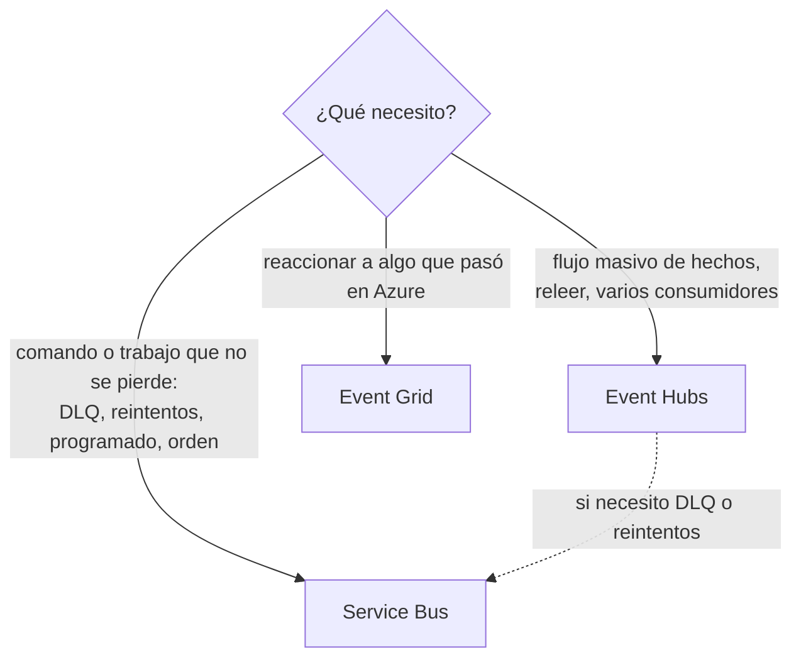
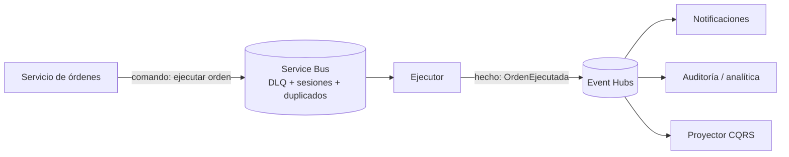

# Azure: mensajería y Kafka (Event Hubs, Service Bus, Event Grid)

Los tres servicios de Azure para comunicar sistemas de forma asíncrona, y **cuál elegir**. **Event Hubs es el "Kafka de Azure"**: habla el protocolo de Kafka.

> Volver al mapa de Azure: [`README.md`](README.md) · Kafka a fondo: [`../../messaging-streaming/kafka.md`](../../messaging-streaming/kafka.md) · Tu experiencia: [`../../messaging-streaming/practica-kafka-ejercicios.md`](../../messaging-streaming/practica-kafka-ejercicios.md) · Comparación general de brokers: [`../../messaging-streaming/README.md`](../../messaging-streaming/README.md)

## 🍎 Con manzanas (empieza aquí)

En la frutería hay **tres formas de avisar**:

| Servicio | En la frutería | Para qué |
|---|---|---|
| **Event Hubs** | El **libro de ventas** con líneas numeradas: nadie arranca hojas; cada área lleva su marcador y puede releer | Un **flujo enorme de hechos** (ventas, clics, lecturas) que varios consumen |
| **Service Bus** | El **buzón de pedidos importantes**: cada pedido lo recoge **uno solo**, firma de recibido, y si no se puede atender va a la **bandeja "revisar a mano"** | **Comandos y trabajo** que no se pueden perder, con reintentos, orden y programación |
| **Event Grid** | La **campana** de la tienda: suena y avisa "¡llegaron manzanas!", sin guardar nada | **Reaccionar** a algo que pasó ("se subió un archivo a Blob Storage") |

### Qué debes dominar según tu nivel

| Nivel | Debes poder explicar |
|---|---|
| 🟢 **Junior** | Qué es cada uno en una frase; que Event Hubs equivale a Kafka y Service Bus a una cola con extras |
| 🟡 **Mid** | Particiones y consumer groups en Event Hubs; DLQ, sesiones, mensajes programados y duplicados en Service Bus; cuándo usar cada uno |
| 🔴 **Senior** | Limitaciones de Event Hubs frente a Kafka (sin DLQ nativa ni compactación); diseño híbrido; autenticación con Entra ID; escalado con KEDA; costos y niveles |

## 1. Event Hubs: el Kafka de Azure

**Qué es:** un servicio gestionado de **ingesta y streaming de eventos** de muy alto volumen. Es un **log particionado** (igual que Kafka) y ofrece un **endpoint compatible con el protocolo de Kafka**, así que muchas aplicaciones Kafka se conectan **cambiando solo la configuración**.

### La tabla de nombres: Kafka ↔ Event Hubs

| Kafka | Event Hubs | 🍎 |
|---|---|---|
| **Cluster** | **Namespace** | El edificio |
| **Topic** | **Event Hub** (el "hub") | Un cuaderno |
| **Partition** | **Partition** | Una sección del cuaderno |
| **Consumer group** | **Consumer group** | El equipo de contadores |
| **Offset** | **Offset** (y *checkpoint*) | El marcador |
| **Producer / Consumer** | **Producer / Consumer** (o *Event Processor*) | Caja / contabilidad |
| **Retention** | **Retention** (límites según el nivel 🔎) | Cuánto se guarda |
| **Schema Registry** | **Schema Registry de Event Hubs** | El formulario oficial |
| **Kafka Connect** | Conectores de Kafka Connect contra el endpoint | El mensajero con adaptadores |
| **Borrar por tiempo** | Igual | — |
| **Log compaction** | ❌ **No implementada** | — |
| **Dead Letter Queue** | ❌ **No nativa** (se monta a mano) | — |

### Cómo se conecta con Kafka (el cambio de configuración)

```properties
# Cliente Kafka normal, apuntando al endpoint de Event Hubs
bootstrap.servers=<namespace>.servicebus.windows.net:9093
security.protocol=SASL_SSL
sasl.mechanism=PLAIN
sasl.jaas.config=org.apache.kafka.common.security.plain.PlainLoginModule required \
  username="$ConnectionString" \
  password="<cadena de conexión>";
```

- **El usuario es el literal `$ConnectionString`**; la contraseña es la cadena de conexión de una política de acceso compartido. Esto lo hiciste en tus pruebas de concepto ([ejercicio 3 y 4](../../messaging-streaming/practica-kafka-ejercicios.md)).
- **Mejor opción:** autenticar con **Microsoft Entra ID** usando `SASL_SSL` con **`OAUTHBEARER`** y **Managed Identity**: sin claves en archivos. Es lo que hoy se recomienda.
- **Puerto 9093**, TLS siempre.

### Lo que NO hace (y lo que debes saber decir)

| Limitación | Qué hacer |
|---|---|
| **Sin DLQ nativa** | Crear tú otro hub de errores, o mover el trabajo con reintentos a **Service Bus** (que sí tiene DLQ) |
| **Sin compactación de logs** | No sirve para "estado actual por clave"; usar Cosmos DB o Redis para eso |
| **Transacciones de Kafka y Kafka Streams** | Estaban en **vista previa** en niveles altos (Premium y Dedicated) 🔎 verificar el estado actual |
| **Kafka no es 100% idéntico** | Hay diferencias de configuración y versiones: revisa la guía de migración |

### Niveles y capacidad 🔎

| Nivel | Idea | Cuándo |
|---|---|---|
| **Standard** | Capacidad medida en **throughput units** | Cargas medianas |
| **Premium** | Recursos aislados, **processing units** | Producción exigente |
| **Dedicated** | Cluster dedicado | Volumen muy alto |

Funciones útiles: **Capture** (guarda los eventos automáticamente en Blob Storage o Data Lake para análisis), **Schema Registry**, **geo-recuperación**, y **escalado automático** de capacidad. **Los consumidores se escalan con el número de particiones** (igual que en Kafka).

## 2. Service Bus: el buzón de pedidos importantes

**Qué es:** un **broker de mensajes empresarial** (colas y topics) con garantías fuertes. Habla **AMQP 1.0**. Es lo equivalente a **SQS + SNS** en AWS y, en la práctica, **a RabbitMQ gestionado**.

| Concepto | Qué es | 🍎 |
|---|---|---|
| **Queue** (cola) | Cada mensaje lo recibe **un solo** consumidor | El buzón de pedidos |
| **Topic + Subscription** | Un mensaje llega a **cada suscripción** (cada una con **filtros**) | El altavoz, pero cada área escucha lo suyo |
| **Peek-lock** | El mensaje queda **bloqueado** mientras lo procesas; lo **completas** al terminar, y si falla, **vuelve a la cola** | Firmas de recibido **solo cuando terminas** |
| **Dead-letter queue (DLQ)** | Bandeja integrada para lo que supera el máximo de entregas o expira | "Revisar a mano" |
| **Max delivery count** | Cuántas veces se reintenta antes de ir a la DLQ | Cuántos intentos antes de rendirse |
| **Sesiones** | Orden **FIFO por clave** (`SessionId`); un solo consumidor por sesión | El orden de un mismo cliente |
| **Mensajes programados** | Entregar a una hora futura (`ScheduledEnqueueTimeUtc`) | "Dentro de 3 días, despacha" |
| **Detección de duplicados** | Descarta un mismo `MessageId` dentro de una ventana | El sello "YA COBRADO" |
| **TTL** | El mensaje expira si nadie lo atiende | Caducidad |
| **Transacciones** | Operaciones atómicas entre colas | Todo o nada |

```java
// Ejemplo conceptual: procesar con peek-lock (Azure SDK)
receiver.receiveMessages(10).forEach(msg -> {
    try {
        procesar(msg);
        receiver.complete(msg);            // confirma al terminar
    } catch (Exception e) {
        receiver.abandon(msg);             // vuelve a la cola; tras N intentos, DLQ
    }
});
```

**Spring:** Spring Cloud Azure (starter y binder de Service Bus). **Quarkus:** vía el conector AMQP 1.0 de SmallRye o el SDK de Azure 🔎 verifícalo antes de afirmarlo.

## 3. Event Grid: la campana

**Qué es:** un servicio de **enrutamiento de eventos discretos** del tipo **"pasó algo"**, con entrega **push** (HTTP o webhooks, y también a Service Bus, Event Hubs, Functions). No guarda un historial para releer.

**Ejemplo típico:** *"se subió un archivo a Blob Storage"* → Event Grid → una **Function** lo procesa. (En tu ejercicio 4, el `Payload` tenía forma de **CloudEvents**, que es precisamente el formato estándar que Event Grid usa para estos avisos.)

## 4. ¿Cuál elijo? (la tabla de decisión)

| Necesito... | Elijo | Por qué |
|---|---|---|
| Un **flujo masivo** de hechos, varios consumidores, poder **releer** | **Event Hubs** | Es un log; escala con particiones |
| **Comandos** o trabajo que **no se pueden perder**, con reintentos y bandeja de errores | **Service Bus** | DLQ, peek-lock, max delivery count |
| **Orden por entidad** (los movimientos de una cuenta) | **Service Bus (sesiones)** o **Event Hubs (clave de partición)** | Depende del volumen y de si necesito releer |
| Entregar un mensaje **más tarde** (programado) | **Service Bus** | Mensajes programados nativos |
| **Evitar duplicados** a nivel de broker | **Service Bus** | Detección de duplicados |
| **Reaccionar** a un evento de otro servicio de Azure | **Event Grid** | Push, sin gestionar nada |
| Reutilizar **código y librerías Kafka** | **Event Hubs** | Endpoint compatible con Kafka |
| **Auditoría y analítica** de los eventos | **Event Hubs + Capture** | Log releíble que cae solo en un data lake |



### El diseño híbrido (el que se recomienda en la práctica)



**Regla:** **comandos** → Service Bus; **hechos** → Event Hubs. Más en [`../../system-design/caso-transferencias-asincronas.md`](../../system-design/caso-transferencias-asincronas.md) (sección 10) y [`../../microservices-patterns/cqrs.md`](../../microservices-patterns/cqrs.md).

## 5. Escalar a los consumidores: KEDA

En **Container Apps** y **AKS**, **KEDA** escala el número de réplicas según el **backlog**: mensajes pendientes en Service Bus, o el **lag** (retraso) del consumer group en Event Hubs. Más réplicas cuando la cola crece, menos cuando baja (incluso a cero en Container Apps). Detalle en [`aks-kubernetes.md`](aks-kubernetes.md).

## 6. Preguntas de entrevista con escalera de respuesta

| Pregunta | 🟢 Junior | 🟡 Mid | 🔴 Senior |
|---|---|---|---|
| **¿Qué es Event Hubs?** | "El servicio de Azure para streaming de eventos; equivale a Kafka." | "Un log particionado con consumer groups y endpoint compatible con Kafka." | "Sin compactación ni DLQ nativa; lo uso para hechos y auditoría, y Service Bus para comandos." |
| **¿Event Hubs o Service Bus?** | "Event Hubs para mucho volumen; Service Bus para mensajes importantes." | "Service Bus trae DLQ, sesiones, programación y duplicados; Event Hubs es un log releíble." | "Híbrido: comandos en Service Bus, hechos en Event Hubs; elijo por semántica, no por moda." |
| **¿Cómo conectas una app Kafka a Event Hubs?** | "Cambiando el servidor y la autenticación." | "`bootstrap.servers` al namespace, puerto 9093, `SASL_SSL`." | "Con `OAUTHBEARER` y Managed Identity, sin claves en archivos." |
| **¿Qué es la DLQ en Service Bus?** | "Donde van los mensajes que fallan." | "Se llena al superar el máximo de entregas o al expirar; hay que monitorearla." | "La reviso con alerta y un proceso de reproceso; el mensaje conserva el motivo del fallo." |
| **¿Cómo programas un mensaje?** | "Con un mensaje programado." | "`ScheduledEnqueueTimeUtc` en Service Bus." | "Un disparo por orden en vez de sondear una tabla; el cron solo para lotes." |
| **¿Y si ya tengo código Kafka?** | "Lo conecto a Event Hubs." | "Cambio la configuración; reviso diferencias de versión." | "Reviso lo que Event Hubs no soporta (compactación, DLQ, algunas funciones) antes de migrar." |

## Referencias

- Documentación de Microsoft: *Azure Event Hubs for Apache Kafka*, *Service Bus messaging* y *Event Grid overview*. 🔎 Confirma niveles, límites y el estado de las funciones en vista previa antes de citarlos.
