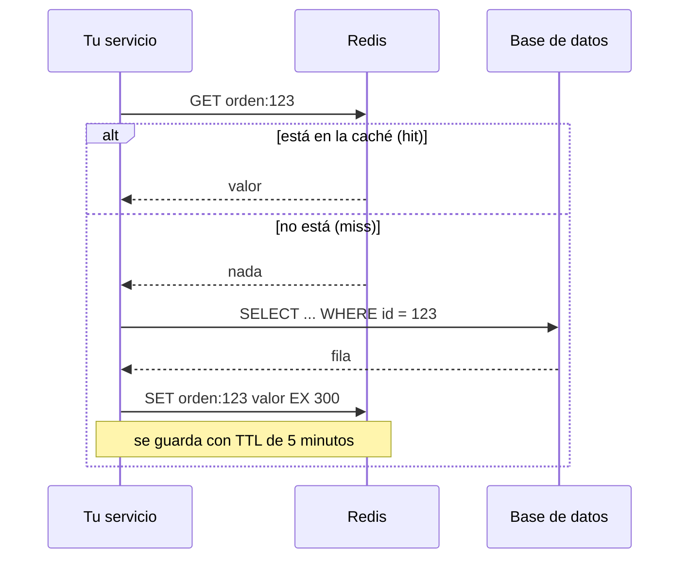

# Azure: Redis (Azure Cache for Redis)

Qué es Redis, para qué se usa en un backend (caché, sesiones, pub/sub, límites de uso, bloqueos) y cómo lo ofrece Azure.

> Volver al mapa de Azure: [`README.md`](README.md) · Equivalente en AWS: ElastiCache en [`../aws/`](../aws) · Tu uso en el banco: [`../../system-design/caso-transferencias-asincronas.md`](../../system-design/caso-transferencias-asincronas.md) (aviso a la interfaz por Redis pub/sub)

## 🍎 Con manzanas (empieza aquí)

El archivo de la frutería (la base de datos) está en la bodega del fondo: **ir y volver tarda**. Entonces pones **un mostrador con lo más vendido a la mano**: las manzanas rojas, el precio del día, el pedido que Ana consulta cada minuto. **Eso es Redis**: una memoria **muy rápida** (todo vive en RAM) delante de la base de datos.

| Cosa de Redis | 🍎 En la frutería |
|---|---|
| **Caché** | El mostrador con lo más pedido: si está ahí, no vas a la bodega |
| **TTL (tiempo de vida)** | Las manzanas del mostrador **caducan** a las 2 horas y se reponen |
| **Sesión de usuario** | La fichita con el nombre del cliente mientras está en la tienda |
| **Pub/Sub** | El **timbre** de la tienda: suena y quien esté escuchando se entera; **si nadie escucha, se pierde** |
| **Rate limiting** | Un contador en la puerta: "máximo 5 pedidos por minuto por cliente" |
| **Lock distribuido** | Un cartel "ocupado": solo un empleado hace esta tarea a la vez |

### Qué debes dominar según tu nivel

| Nivel | Debes poder explicar |
|---|---|
| 🟢 **Junior** | Qué es Redis y por qué es rápido; para qué sirve una caché; qué es el TTL |
| 🟡 **Mid** | Patrón *cache-aside*; estructuras de datos; sesiones, límites de uso y pub/sub; riesgos (datos obsoletos) |
| 🔴 **Senior** | Estampida de caché, expulsión (*eviction*), persistencia, alta disponibilidad y clustering; Redis pub/sub vs Kafka (durabilidad); locks distribuidos y sus límites; nivel de servicio en Azure |

## 1. Por qué es rápido

Guarda los datos **en memoria RAM**, atiende comandos con un modelo simple (un hilo principal para los comandos) y usa estructuras de datos eficientes. Una lectura típica tarda **fracciones de milisegundo**, mientras una consulta a una base de datos puede tardar muchos milisegundos.

**El costo:** la RAM es cara y limitada, y por defecto Redis es **una caché, no la fuente de la verdad**: si se reinicia, puedes perder datos (a menos que configures persistencia).

## 2. Estructuras de datos (lo que lo hace más que una caché)

| Estructura | Qué es | Caso de uso típico |
|---|---|---|
| **String** | Un valor (texto, número, JSON) | Caché de una respuesta, contadores (`INCR`), llaves de idempotencia |
| **Hash** | Un objeto con campos | Un usuario o una orden con varios atributos |
| **List** | Lista ordenada | Una cola simple |
| **Set** | Conjunto sin duplicados | "Usuarios conectados", etiquetas |
| **Sorted Set** | Conjunto ordenado por puntaje | Rankings, "los más vendidos" |
| **Stream** | Un log de eventos con grupos de consumidores | Mensajería ligera (parecida a Kafka, pero mucho más simple) |
| **Pub/Sub** | Canales de avisos en vivo | Notificar a la interfaz que algo cambió |

## 3. Los 5 usos que se preguntan

### 3.1 · Caché con el patrón *cache-aside*



```java
// Quarkus: @CacheResult (quarkus-cache) o el cliente de Redis; Spring: @Cacheable
@CacheResult(cacheName = "ordenes")
public OrdenVista consultar(String id) { return repo.buscar(id); }
```

**El problema de siempre:** datos **obsoletos** (la caché va detrás de la base). Soluciones: un **TTL** corto, **invalidar** la entrada al escribir, o escribir también en la caché.

### 3.2 · Sesiones de usuario
Guardar la sesión en Redis permite que **varias instancias** del servicio compartan el estado de login (sin depender de que el mismo usuario caiga siempre en la misma instancia).

### 3.3 · Límite de uso (rate limiting)
`INCR clave` y `EXPIRE clave 60`: cuentas las peticiones por minuto de un cliente; si pasa del límite, respondes `429`.

### 3.4 · Idempotencia (muy útil en pagos)
`SET llave valor NX EX 86400` guarda la llave **solo si no existe** (`NX`) y la hace caducar. Si devuelve que ya existía, la operación **ya se procesó**: es una forma rápida de evitar duplicados antes de ir a la base. Ver [`../../system-design/caso-pasarela-pagos.md`](../../system-design/caso-pasarela-pagos.md).

### 3.5 · Lock distribuido
`SET lock:tarea id NX PX 30000`: solo una instancia obtiene el candado y lo libera al terminar. **Cuidado:** un lock con expiración no da garantías perfectas (si el proceso se pausa y el candado caduca, otro entra). Para corrección estricta, apóyate en la base de datos (restricciones únicas, bloqueo optimista) y trata el lock de Redis como una **optimización**.

## 4. Redis pub/sub vs Kafka (tu experiencia en el banco)

En tus servicios de transferencias, tras actualizar el estado, **publicabas el id de la orden en un canal de Redis** para que la interfaz **refrescara su bandeja**. Es una decisión correcta *para ese caso*, pero conviene saber **por qué no sustituye a Kafka**:

| | **Redis pub/sub** | **Kafka / Event Hubs** |
|---|---|---|
| **Durabilidad** | ❌ **No guarda nada**: si nadie escucha en ese instante, el aviso **se pierde** | ✅ Guarda los mensajes; se pueden releer |
| **Entrega** | *At-most-once* | *At-least-once* |
| **Consumidores nuevos** | No ven lo anterior | Pueden leer desde el principio |
| **Orden y particiones** | No | Por partición |
| **Latencia** | **Muy baja** | Baja |
| **Complejidad** | Mínima | Mayor |
| **Ideal para** | **Avisos efímeros** ("refresca la pantalla") | **Hechos que no se pueden perder** (órdenes, pagos) |

> **Cómo decirlo:** *"Usé Redis pub/sub solo como aviso ligero para que la interfaz se refrescara. La fuente de verdad era la base de datos y el evento viajaba por Kafka: si el aviso se perdía, el usuario veía el cambio al refrescar."* Y para algo que **no** puede perderse, **Redis Streams** o Kafka.

## 5. Cosas que hay que saber de Redis en producción

| Tema | Qué decir |
|---|---|
| **Expulsión (*eviction*)** | Cuando la memoria se llena, Redis borra claves según una política (`allkeys-lru`, `volatile-lru`, `noeviction`...). Hay que **elegirla** |
| **Estampida de caché (*cache stampede*)** | Una clave popular caduca y **mil peticiones** van a la vez a la base. Solución: TTL con variación aleatoria, bloqueo de recarga, o refrescar antes de que caduque |
| **Claves enormes o "calientes"** | Una clave gigante o muy usada bloquea o satura un nodo |
| **Persistencia** | **RDB** (instantáneas) y **AOF** (registro de comandos): reducen la pérdida de datos si se reinicia |
| **Alta disponibilidad** | Réplicas y *failover*; **clustering** para repartir los datos entre nodos |
| **Seguridad** | TLS, aislar con **Private Endpoint**, y autenticar con **Microsoft Entra ID** o claves de acceso (preferir Entra ID) |
| **Convención de claves** | `servicio:entidad:id` (por ejemplo `ordenes:orden:123`) y **siempre un TTL** |
| **Monitoreo** | Tasa de aciertos (*hit ratio*), memoria, expulsiones, latencia |

## 6. Redis en Azure

**Azure Cache for Redis** es Redis gestionado: Microsoft cuida parches, réplicas, copias y alta disponibilidad; tú configuras tamaño, red y seguridad.

| Aspecto | Qué decir |
|---|---|
| **Niveles** | Hay niveles **Basic, Standard, Premium** y **Enterprise** (con módulos de Redis Enterprise). Basic **no** tiene réplica: solo desarrollo |
| **Evolución del producto** 🔎 | Microsoft está **moviendo la oferta hacia Azure Managed Redis**, y el estado de los niveles clásicos cambia con el tiempo: **confirma en la documentación** cuál usar para un proyecto nuevo |
| **Red** | **Private Endpoint** dentro de la VNet; nada expuesto a internet |
| **Identidad** | Preferir **Entra ID y Managed Identity** a las claves de acceso |
| **Persistencia y georeplicación** | Disponibles en niveles altos |
| **Cliente Java** | **Lettuce** o Jedis (Spring Data Redis); en Quarkus, `quarkus-redis-client` y `quarkus-cache` |

### Cuándo Redis y cuándo otra cosa

| Necesito... | Uso |
|---|---|
| Acelerar lecturas repetidas | **Redis** (caché) |
| Sesiones compartidas entre instancias | **Redis** |
| Un aviso efímero a la interfaz | **Redis pub/sub** (o Web PubSub / SignalR) |
| Guardar datos para siempre, con consultas | **Azure SQL / PostgreSQL / Cosmos DB** |
| Mensajes que no se pueden perder | **Service Bus / Event Hubs** |
| Un lock o llave de idempotencia **rápida** | **Redis** (como primera barrera) + base de datos (como verdad) |

## 7. Preguntas de entrevista con escalera de respuesta

| Pregunta | 🟢 Junior | 🟡 Mid | 🔴 Senior |
|---|---|---|---|
| **¿Qué es Redis?** | "Una base de datos en memoria, muy rápida, usada como caché." | "Almacén clave-valor con estructuras de datos, TTL, pub/sub y streams." | "Es una caché o complemento, no mi fuente de verdad, salvo con persistencia y conociendo sus límites." |
| **¿Cómo funciona una caché?** | "Guardas el resultado de una consulta para no repetirla." | "Cache-aside con TTL: leo de Redis, si falla leo de la base y guardo." | "Cuido la invalidación, la estampida de caché y la política de expulsión." |
| **¿Qué problemas tiene cachear?** | "Datos viejos." | "TTL corto, invalidar al escribir, o write-through." | "Consistencia, estampida, claves calientes; mido el hit ratio antes de añadir complejidad." |
| **¿Redis pub/sub o Kafka?** | "Kafka guarda los mensajes; Redis pub/sub no." | "Pub/sub es *at-most-once*: si nadie escucha, se pierde." | "Redis para avisos efímeros; para hechos que no se pueden perder, Kafka o Event Hubs (o Redis Streams)." |
| **¿Cómo haces un rate limiter?** | "Contando peticiones." | "`INCR` y `EXPIRE` por cliente y ventana." | "Ventana deslizante o token bucket; atómico con un script Lua; límites por cliente y por ruta." |
| **¿Un lock con Redis es seguro?** | "Sirve para que solo uno trabaje." | "`SET NX PX`; libera al terminar." | "No es una garantía perfecta (expiración y pausas); para dinero me apoyo en restricciones de la base de datos." |
| **¿Cómo lo conectas de forma segura en Azure?** | "Con Private Endpoint." | "Con TLS y Entra ID en vez de claves." | "Y Managed Identity, mínimo privilegio, y la clave nunca en archivos." |

## Referencias

- Documentación de Microsoft: *Azure Cache for Redis* y *Azure Managed Redis*. 🔎 Confirma niveles, nombres y fechas de cambio de oferta antes de citarlos.
- [Documentación de Redis](https://redis.io/docs/): estructuras de datos, expiración y persistencia.
