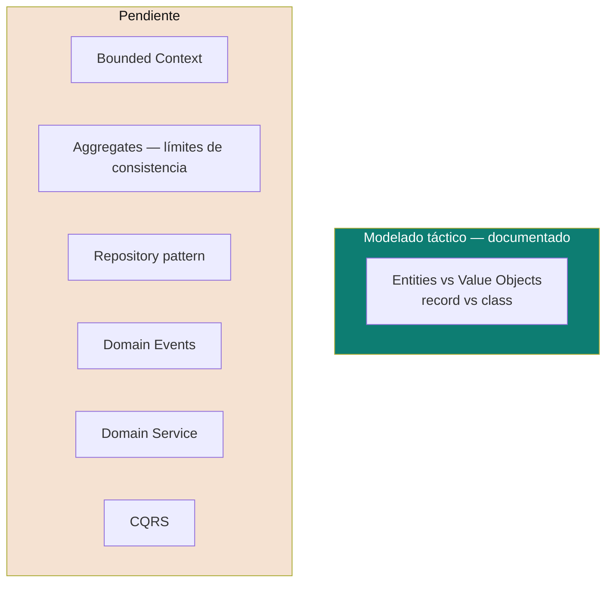

# Domain-Driven Design (DDD)

Píldoras de DDD construidas a partir de casos concretos (no solo teoría): un dominio de pedidos (coffee shop) y un dominio de citas médicas, ambos implementados como ejercicio en Java 21 dentro de una arquitectura hexagonal.

> Diferencia con [`software-architectures/`](../software-architectures): ahí se compara **cómo se organizan las capas** de una aplicación (dominio/aplicación/infraestructura). Acá se profundiza **qué va dentro de la capa de dominio** — cómo modelar Entities, Value Objects y Aggregates correctamente.

## Cobertura actual

| Tema | Doc | Idea central en una línea |
|---|---|---|
| **Entities vs Value Objects** | [`entities-vs-value-objects.md`](entities-vs-value-objects.md) | Cuándo un objeto de dominio debe ser `class` (tiene identidad y ciclo de vida) y cuándo `record` (es un valor inmutable) — con `Order` y `Appointment` como casos trabajados, y por qué el Anemic Domain Model es un anti-patrón. |
| Bounded Context | ⏳ Pendiente | Cómo delimitar formalmente dónde termina un Aggregate y empieza la referencia a otro. |
| Aggregates — límites de consistencia | ⏳ Pendiente | Qué invariantes debe garantizar el Aggregate Root de forma transaccional. |
| Repository pattern | ⏳ Pendiente | El puerto de salida que persiste un Aggregate completo, no tablas sueltas. |
| Domain Events | ⏳ Pendiente | Publicar eventos como `OrderPaid`/`AppointmentCancelled` — conecta con `microservices-patterns/` (outbox). |
| Domain Service | ⏳ Pendiente | Reglas de negocio que no pertenecen a ninguna Entity individual. |
| CQRS | ⏳ Pendiente | Separar modelo de escritura (Aggregates ricos) de modelo de lectura (proyecciones). |

## Código de referencia

Los ejemplos de este documento vienen de un proyecto de práctica en desarrollo (arquitectura hexagonal + Spring WebFlux + Java 21), con dos dominios modelados: `order` (coffee shop) y `appointment` (citas médicas).

> 🚧 **Pendiente**: el proyecto todavía está en fase de desarrollo. Una vez esté terminado, reemplazar esta nota por el link directo al repo/carpeta, y agregar acá el enlace al ticket de Jira correspondiente para mantener todo trazable.

## Cómo estudiar esta carpeta

1. Empezá por [`entities-vs-value-objects.md`](entities-vs-value-objects.md) — es la base de todo lo demás (Aggregates, Repository, Domain Events asumen que ya distinguís Entity de Value Object).
2. Los temas ⏳ se van a ir completando a medida que aparezcan en la práctica (proyecto de referencia) o en preparación de entrevista — mismo criterio que el resto del repo: nada de documentos teóricos sin un caso concreto detrás.

Relacionado: [`entrevistas/saludtools-desarrollador-senior/`](../entrevistas/saludtools-desarrollador-senior) — DDD es uno de los estándares que ese perfil pide promover explícitamente.

## Referencias

- Evans, E. — *Domain-Driven Design: Tackling Complexity in the Heart of Software* (2003) — la fuente original de todo el vocabulario (Entity, Value Object, Aggregate, Bounded Context, Ubiquitous Language).
- Vernon, V. — *Implementing Domain-Driven Design* (2013) — la guía práctica de cómo aterrizar el libro de Evans en código real.
