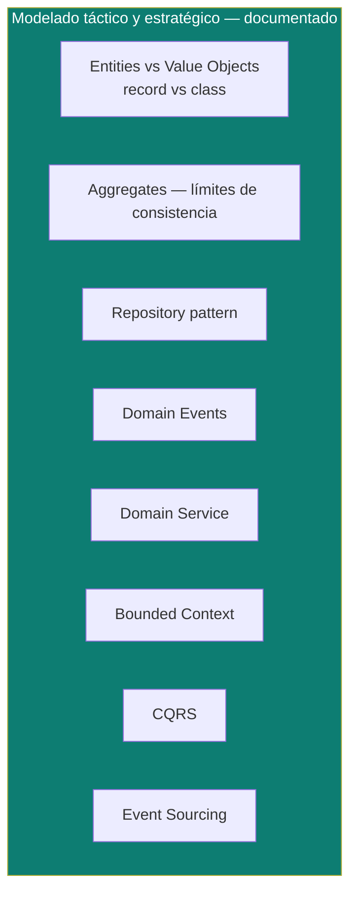

# Domain-Driven Design (DDD)

Píldoras de DDD construidas a partir de casos concretos (no solo teoría): un dominio de pedidos (coffee shop) y un dominio de citas médicas, ambos implementados como ejercicio en Java 21 dentro de una arquitectura hexagonal.

> Diferencia con [`software-architectures/`](../software-architectures): ahí se compara **cómo se organizan las capas** de una aplicación (dominio/aplicación/infraestructura). Acá se profundiza **qué va dentro de la capa de dominio** — cómo modelar Entities, Value Objects y Aggregates correctamente.

## Cobertura actual

| Tema | Doc | Idea central en una línea |
|---|---|---|
| **Entities vs Value Objects** | [`entities-vs-value-objects.md`](entities-vs-value-objects.md) | Cuándo un objeto de dominio debe ser `class` (tiene identidad y ciclo de vida) y cuándo `record` (es un valor inmutable) — con `Order` y `Appointment` como casos trabajados, y por qué el Anemic Domain Model es un anti-patrón. |
| **Aggregates — límites de consistencia** | [`aggregates.md`](aggregates.md) | Qué invariantes debe garantizar el Aggregate Root de forma transaccional, por qué `LineItem` no tiene repositorio propio, y por qué un Aggregate solo referencia a otro por ID. |
| **Repository pattern** | [`repository-pattern.md`](repository-pattern.md) | El puerto de salida que persiste un Aggregate completo, no tablas sueltas — y cómo se mapea 1:1 con `port/out` + `PersistenceAdapter` en hexagonal. |
| **Domain Events** | [`domain-events.md`](domain-events.md) | Publicar hechos ya ocurridos (`OrderPaid`, `AppointmentCompleted`) para coordinar Aggregates/contextos sin acoplarlos — conecta con el Outbox pattern de `microservices-patterns/`. |
| **Domain Service** | [`domain-service.md`](domain-service.md) | Reglas de negocio que cruzan dos Aggregates y no pertenecen a ninguna Entity individual — y cómo no confundirlo con el Application Service. |
| **Bounded Context** | [`bounded-context.md`](bounded-context.md) | Dónde termina un modelo y empieza otro, Ubiquitous Language, y los patrones de Context Mapping (Anticorruption Layer, Customer/Supplier, Shared Kernel). |
| **CQRS** | [`cqrs.md`](cqrs.md) | Separar el modelo de escritura (Aggregates ricos) del modelo de lectura (proyecciones planas) — y los 3 niveles reales del patrón, del más simple al más costoso. |
| **Event Sourcing** | [`event-sourcing.md`](event-sourcing.md) | Guardar el historial de eventos como única fuente de verdad en vez del estado final — replay, snapshots, y por qué casi siempre viaja junto a CQRS nivel 3. |

## Código de referencia

Los ejemplos de este documento vienen de un proyecto de práctica en desarrollo (arquitectura hexagonal + Spring WebFlux + Java 21), con dos dominios modelados: `order` (coffee shop) y `appointment` (citas médicas).

> 🚧 **Pendiente**: el proyecto todavía está en fase de desarrollo. Una vez esté terminado, reemplazar esta nota por el link directo al repo/carpeta, y agregar acá el enlace al ticket de Jira correspondiente para mantener todo trazable.

## Cómo estudiar esta carpeta

Orden recomendado — cada doc asume conceptos de los anteriores:

1. [`entities-vs-value-objects.md`](entities-vs-value-objects.md) — la base de todo lo demás (modelado táctico).
2. [`aggregates.md`](aggregates.md) — el límite de consistencia que agrupa Entities/Value Objects.
3. [`repository-pattern.md`](repository-pattern.md) — cómo se persiste un Aggregate ya delimitado.
4. [`domain-events.md`](domain-events.md) — cómo coordinar Aggregates sin romper su límite transaccional.
5. [`domain-service.md`](domain-service.md) — reglas que cruzan Aggregates y no encajan en ninguna Entity.
6. [`bounded-context.md`](bounded-context.md) — el salto de modelado táctico (dentro de un contexto) a estratégico (entre contextos).
7. [`cqrs.md`](cqrs.md) — una vez claro el modelo de escritura (1-6), cómo separarlo del modelo de lectura.
8. [`event-sourcing.md`](event-sourcing.md) — el último paso, opcional y más costoso: qué cambia si el evento mismo (no el estado) es la fuente de verdad.

Relacionado: [`entrevistas/saludtools-desarrollador-senior/`](../entrevistas/saludtools-desarrollador-senior) — DDD es uno de los estándares que ese perfil pide promover explícitamente.

## Referencias

- Evans, E. — *Domain-Driven Design: Tackling Complexity in the Heart of Software* (2003) — la fuente original de todo el vocabulario (Entity, Value Object, Aggregate, Bounded Context, Ubiquitous Language).
- Vernon, V. — *Implementing Domain-Driven Design* (2013) — la guía práctica de cómo aterrizar el libro de Evans en código real.
