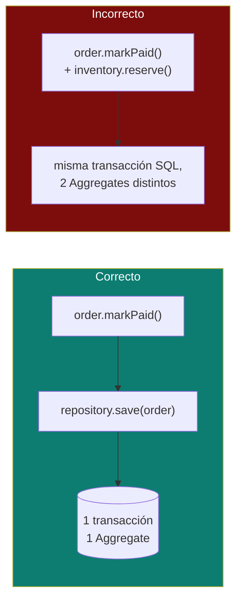

# Aggregates — límites de consistencia transaccional

La pregunta que dispara este documento: *"¿por qué `Order.addItem()` no puede simplemente hacer `order.getItems().add(item)` desde el Controller?"* — y la respuesta es que `Order` es un **Aggregate Root**, y su trabajo es ser el único punto de entrada que garantiza que el pedido nunca quede en un estado inválido.

## La idea central

Un **Aggregate** es un clúster de Entities y Value Objects que se tratan como una sola unidad a efectos de **consistencia transaccional**: o se guarda/actualiza completo, o no se guarda nada. El **Aggregate Root** es la única Entity del clúster accesible desde afuera — todo el resto del clúster (Entities internas, Value Objects) solo se alcanza navegando a través del Root.

- No es "un grupo de clases relacionadas" en sentido amplio — es específicamente el límite dentro del cual las invariantes de negocio deben cumplirse **siempre**, en cada commit.
- El objetivo práctico: **una transacción de base de datos = un Aggregate**. Si una operación necesita modificar dos Aggregates a la vez de forma atómica, es una señal de que el límite del Aggregate está mal trazado — o de que en realidad hace falta una Saga (ver [`microservices-patterns/README.md`](../microservices-patterns/README.md), sección Saga pattern) en vez de una transacción local.

## Ejemplo trabajado: `Order` y `LineItem`

```java
public class Order { // Aggregate Root
    private UUID id;
    private final Location location;
    private final List<LineItem> items; // parte del Aggregate — no accesible para mutar desde afuera
    private Status status = Status.PAYMENT_EXPECTED;

    public Order addItem(LineItem item) {
        if (status != Status.PAYMENT_EXPECTED) {
            throw new IllegalStateException("Cannot modify items after payment");
        }
        items.add(item);
        return this;
    }

    public List<LineItem> items() {
        return List.copyOf(items); // copia defensiva — nunca exponer la lista mutable interna
    }
    // markPaid(), markBeingPrepared()... — ver entities-vs-value-objects.md
}
```

- `LineItem` (Value Object, ver [`entities-vs-value-objects.md`](entities-vs-value-objects.md)) es **parte intrínseca** del Aggregate `Order` — no existe fuera de un pedido, no tiene su propio repositorio, no se persiste en una tabla que se consulte de forma independiente.
- Ningún código externo hace `order.getItemsMutableList().add(...)`. Toda modificación pasa por un método del Root (`addItem`) que puede validar la invariante ("no se pueden agregar ítems después de pagado") **antes** de que el cambio ocurra. Esa es la razón de ser del Aggregate: centralizar dónde se protege la invariante.

## Referencia por ID entre Aggregates — el límite no se cruza nunca

`Appointment` referencia a `PatientId` y `PractitionerId`, nunca a los objetos `Patient`/`Practitioner` completos:

```java
public class Appointment { // Aggregate Root propio
    private UUID id;
    private final PatientId patientId;          // referencia, no composición
    private final PractitionerId practitionerId;
    private TimeSlot schedule;
    private AppointmentStatus status;
}
```

`Patient` y `Practitioner` son Aggregates propios (probablemente en otro Bounded Context — ver [`bounded-context.md`](bounded-context.md)). La regla es estricta: **un Aggregate nunca contiene una referencia de objeto directa a otro Aggregate**, solo a su ID. Motivos:

1. **Evita transacciones gigantes.** Si `Appointment` contuviera un `Patient` completo, guardar una cita implicaría (o tentaría a) guardar también el paciente en la misma transacción — rompiendo el límite de consistencia.
2. **Evita cargar el grafo completo en memoria.** Un `Patient` con su historial completo de citas no necesita cargarse solo para agendar un nuevo turno.
3. **Mantiene los Bounded Contexts desacoplados** cuando `Patient` vive en otro contexto — la referencia por ID es justamente el mecanismo que permite que dos contextos se correlacionen sin compartir modelo.

## Una transacción, un Aggregate — la regla que más se olvida



- Si `markPaid()` en `Order` también necesita reservar stock en `Inventory` (otro Aggregate), la tentación es envolver ambos `save()` en la misma transacción de base de datos. Eso funciona técnicamente con una sola DB, pero:
  - Acopla la disponibilidad de dos Aggregates que en principio deberían poder evolucionar (y escalar) por separado.
  - No escala a un escenario con dos microservicios/bases de datos distintas — ahí una transacción distribuida (2PC) es costosa operativamente y poco usada hoy (ver [`microservices-patterns/README.md`](../microservices-patterns/README.md)).
- La solución DDD-idiomática: `Order` publica un **Domain Event** (`OrderPaid`) al confirmarse su propia transacción, y `Inventory` reacciona a ese evento en su propia transacción, de forma eventualmente consistente (ver [`domain-events.md`](domain-events.md)).

## Cómo decidir el límite de un Aggregate (heurísticas de Vernon)

1. **Protegé invariantes verdaderas, no organización conveniente.** La pregunta no es "¿estas clases están relacionadas?" sino "¿existe una regla de negocio que debe cumplirse siempre, atómicamente, entre estos campos?". Si la respuesta es no, probablemente sean dos Aggregates.
2. **Diseñá Aggregates pequeños.** Vernon (*Implementing Domain-Driven Design*) es explícito: preferí referencias por ID (Aggregates chicos) sobre componer objetos completos (Aggregates grandes), salvo que la invariante realmente lo exija. Un Aggregate grande es más lento de cargar/guardar y más propenso a conflictos de concurrencia (dos usuarios editando el mismo Aggregate gigante).
3. **Si necesitás datos de otro Aggregate para decidir, referencialo por ID y resolvelo en el Application Service o en un Domain Service** (ver [`domain-service.md`](domain-service.md)), no lo compongas dentro del Aggregate.

## Drills de repaso

| Tiempo | Pregunta |
|---|---|
| 4 min | "¿Por qué `LineItem` no tiene su propio repositorio si es una clase de dominio?" |
| 5 min | "Un cambio de negocio necesita actualizar dos Aggregates 'al mismo tiempo'. ¿Cómo lo resolvés sin una transacción distribuida?" |
| 5 min | "¿Por qué `Appointment` no debería tener un campo `Patient patient` en vez de `PatientId patientId`?" |

## Referencias

- Evans, E. — *Domain-Driven Design* (2003) — capítulo 6, definición original de Aggregate y Aggregate Root.
- Vernon, V. — *Implementing Domain-Driven Design* (2013) — capítulo 10, las 4 reglas de diseño de Aggregates (proteger invariantes, aggregates pequeños, referenciar otros aggregates por ID, consistencia eventual entre aggregates).

Relacionado: [`entities-vs-value-objects.md`](entities-vs-value-objects.md) para la distinción Entity/Value Object dentro del Aggregate, [`repository-pattern.md`](repository-pattern.md) para cómo se persiste un Aggregate completo, y [`domain-events.md`](domain-events.md) para cómo coordinar cambios entre Aggregates sin romper el límite transaccional.
