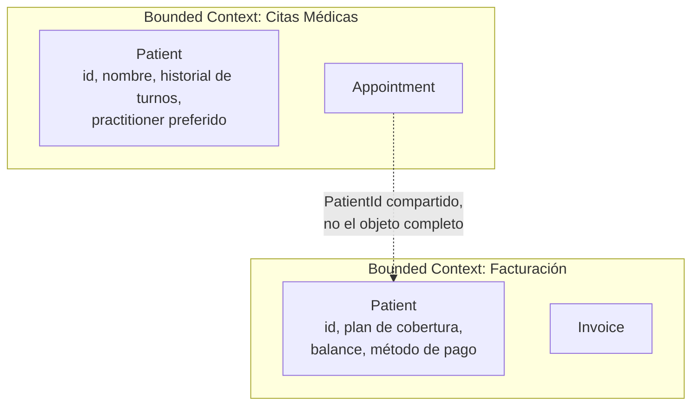

# Bounded Context — dónde termina un modelo y empieza otro

La pregunta que dispara este documento: *"¿por qué `Patient` en el dominio de citas médicas no tiene los mismos campos que `Patient` en el dominio de facturación?"* — y la respuesta es que no son el mismo modelo, aunque compartan nombre. Cada uno vive en su propio **Bounded Context** (Contexto Delimitado).

## La idea central

Un Bounded Context es la frontera explícita dentro de la cual un modelo de dominio (y su **Ubiquitous Language** — el vocabulario compartido entre negocio y código) es válido y consistente. Fuera de esa frontera, la misma palabra puede significar otra cosa.

- **No es una capa técnica** (no confundir con `domain`/`application`/`infrastructure` de hexagonal — ver [`hexagonal-architecture.md`](../software-architectures/hexagonal-architecture.md)). Es una frontera **conceptual de negocio**, que después normalmente coincide con un microservicio, pero el mapeo 1:1 no es obligatorio.
- Dentro del contexto, un término tiene **un solo significado**. `Patient` en "Citas Médicas" es alguien con un historial de turnos y disponibilidad; `Patient` en "Facturación" es alguien con un plan de cobertura y un balance de deuda. Forzar un único modelo `Patient` que sirva a ambos casos produce una clase con campos que solo tienen sentido para uno de los dos consumidores — el síntoma típico de no haber delimitado el contexto.

## Ejemplo trabajado: citas médicas vs facturación

- Cada contexto tiene su propio `Patient` — mismo `id` (la clave que los correlaciona), campos completamente distintos.
- La comunicación entre contextos pasa por **IDs y eventos**, no por compartir la clase de dominio. `Appointment` (contexto Citas) referencia a `PatientId`, nunca a un `Patient` importado del contexto de Facturación — el mismo principio de referencia por ID que ya se usa entre Aggregates dentro de un mismo contexto (ver [`entities-vs-value-objects.md`](entities-vs-value-objects.md), sección `Appointment`).

## Cómo reconocer que hacen falta dos contextos, no uno

Señales de que un supuesto "un solo dominio" en realidad son dos Bounded Contexts que se están mezclando a la fuerza:

1. **La misma entidad tiene campos que solo un subconjunto de casos de uso usa.** Si `Patient` tiene `coveragePlan` y `preferredPractitioner` en la misma clase, y el flujo de agendar turno nunca toca `coveragePlan`, es una señal.
2. **Dos equipos (o dos partes del negocio) usan la misma palabra para cosas distintas** en reuniones — eso ya es la Ubiquitous Language divergiendo en la práctica, el modelo de código debería reflejarlo, no forzar un consenso artificial.
3. **Cambios en una "parte" del modelo rompen o requieren re-testear la otra parte** sin relación de negocio real entre ambas — acoplamiento accidental por compartir una clase que en realidad sirve a dos negocios distintos.

## Context Mapping — cómo se relacionan los contextos entre sí

Una vez identificados los contextos, hay que nombrar explícitamente cómo se relacionan (Evans llama a esto *Context Map*):

| Patrón de relación | Cuándo aplica | Ejemplo |
|---|---|---|
| **Partnership** | Dos equipos coordinan cambios juntos, sin jerarquía. | Citas Médicas y Notificaciones evolucionan su contrato de evento en conjunto. |
| **Customer/Supplier** | Un contexto (supplier) provee datos/eventos que otro (customer) consume; el supplier prioriza los requerimientos del customer. | Facturación (supplier) provee el estado de pago que Citas Médicas (customer) necesita para confirmar un turno. |
| **Conformist** | El contexto consumidor no tiene poder de negociación y simplemente se adapta al modelo del proveedor tal cual lo expone (típico al integrar un servicio externo/legacy). | Integración contra la API de un proveedor de seguros externo — se consume el modelo tal como lo define ese sistema. |
| **Anticorruption Layer (ACL)** | El contexto consumidor traduce el modelo externo a su propio lenguaje en la frontera, para no dejar que un modelo ajeno (o legacy, mal diseñado) contamine el dominio propio. | Un adapter que traduce la respuesta de un sistema legacy de facturación al `PaymentStatus` propio del dominio de Citas — mismo rol que cumple un `mapper` en `infrastructure/adapter/out` dentro de hexagonal. |
| **Shared Kernel** | Dos contextos comparten deliberadamente un subconjunto pequeño y estable del modelo (ej. un `Money` Value Object). Cambiarlo requiere acuerdo de ambos equipos. | Un módulo compartido de tipos monetarios usado por Citas Médicas y Facturación. |

La **Anticorruption Layer** es la que más aparece en la práctica dentro de una arquitectura hexagonal: es, en esencia, el mismo trabajo que ya hace un adapter de salida (`infrastructure/adapter/out/client` + su `mapper`) cuando traduce la respuesta de un sistema externo al Value Object/Entity propio del dominio — la ACL es el nombre que le da DDD a ese mismo patrón quando el "sistema externo" es otro Bounded Context.

## Drills de repaso (para responder en voz alta)

| Tiempo | Pregunta |
|---|---|
| 4 min | "¿Por qué `Customer` en Ventas y `Customer` en Soporte no deberían ser la misma clase de dominio?" |
| 5 min | "Tenés que integrar contra la API de un proveedor externo cuyo modelo de datos no te gusta. ¿Qué patrón aplicás para que no contamine tu dominio?" |
| 5 min | "¿Cómo decidís si dos microservicios deberían fusionarse en uno, usando el criterio de Bounded Context?" |

## Referencias

- Evans, E. — *Domain-Driven Design: Tackling Complexity in the Heart of Software* (2003) — Parte IV, donde define Bounded Context y los patrones de Context Mapping.
- Vernon, V. — *Implementing Domain-Driven Design* (2013) — capítulo 3, guía práctica para identificar contextos en un caso real.

Relacionado: [`entities-vs-value-objects.md`](entities-vs-value-objects.md) para el modelado táctico dentro de un contexto, [`aggregates.md`](aggregates.md) para los límites de consistencia dentro de un contexto, y [`software-architectures/hexagonal-architecture.md`](../software-architectures/hexagonal-architecture.md) para dónde vive la Anticorruption Layer en código (`infrastructure/adapter/out`).
