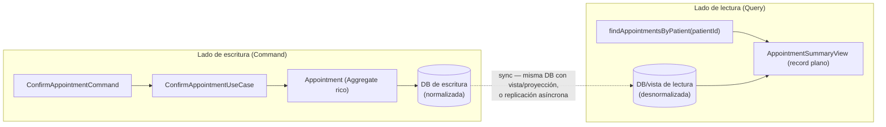

# CQRS — separar el modelo de escritura del modelo de lectura

La pregunta que dispara este documento: *"¿por qué mi endpoint de listado de citas médicas (`GET /appointments?patientId=...&status=...`) tiene que pasar por el `Appointment` Aggregate completo, con todas sus invariantes, solo para mostrar 4 campos en una tabla?"* — y la respuesta es que probablemente no debería: leer y escribir son necesidades distintas, y CQRS es el patrón que las separa explícitamente.

## La idea central

**CQRS** (Command Query Responsibility Segregation, Greg Young) propone que las operaciones que **cambian** estado (Commands) y las que **leen** estado (Queries) usen modelos distintos, en vez de forzar que el mismo Aggregate rico sirva a ambos casos.

- **Modelo de escritura**: el Aggregate completo, con sus invariantes, sus métodos de transición de estado (`Appointment.confirm()`, `Order.markPaid()` — ver [`entities-vs-value-objects.md`](entities-vs-value-objects.md) y [`aggregates.md`](aggregates.md)). Optimizado para **proteger consistencia**, no para velocidad de lectura.
- **Modelo de lectura**: una proyección plana, a menudo un `record` sin comportamiento, armada específicamente para lo que la UI/consumidor necesita mostrar. Optimizada para **velocidad de consulta**, sin invariantes que proteger porque no muta nada.



## Los dos niveles de CQRS — no es todo-o-nada

Es fácil pensar que CQRS implica siempre dos bases de datos separadas con sincronización asíncrona — pero eso es solo el nivel más extremo. Hay un espectro:

| Nivel | Qué implica | Cuándo alcanza |
|---|---|---|
| **1. Separación a nivel de código** | Mismo `Appointment` Aggregate y misma base de datos, pero los `port/in` de escritura (`ConfirmAppointmentUseCase`) están separados de los de lectura (`FindAppointmentsQuery`), y la Query devuelve un `record` de proyección en vez del Aggregate completo. | La mayoría de los casos reales — resuelve el problema de "no quiero exponer/reconstruir el Aggregate completo solo para leer". |
| **2. Separación a nivel de modelo de persistencia** | La escritura pasa por el Aggregate y su tabla normalizada; la lectura usa una vista SQL o tabla desnormalizada específica para ese listado, dentro de la **misma** base de datos. | Cuando el listado necesita joins costosos que no tiene sentido resolver contra el modelo normalizado en cada request. |
| **3. Separación a nivel de infraestructura completa** | Base de datos de escritura y de lectura físicamente distintas (ej. Postgres para escritura, Elasticsearch/read-replica para lectura), sincronizadas vía Domain Events (ver [`domain-events.md`](domain-events.md)) de forma eventualmente consistente. | Alto volumen de lectura desacoplado de la escritura, o necesidad de un motor de consulta distinto (búsqueda full-text, agregaciones). Es el nivel que más complejidad operativa suma — no es el punto de partida por defecto. |

**Regla práctica**: empezar en el nivel 1 siempre. Subir de nivel solo cuando hay evidencia real de que el modelo de escritura no puede servir bien las lecturas (no como decisión anticipada — mismo criterio YAGNI que aplica el agente `clean-code-reviewer`).

## Ejemplo trabajado (nivel 1, el más común en la práctica)

```java
// Lado de escritura — application/port/in
public interface ConfirmAppointmentUseCase {
    Mono<Void> confirm(ConfirmAppointmentCommand command);
}

// Lado de lectura — application/port/in, un puerto SEPARADO
public interface FindAppointmentsQuery {
    Flux<AppointmentSummaryView> byPatient(PatientId patientId);
}

// Proyección de lectura — record plano, sin invariantes ni comportamiento
public record AppointmentSummaryView(
    UUID appointmentId,
    String practitionerName,   // ya resuelto/desnormalizado — el cliente no hace un segundo join
    Instant scheduledAt,
    String statusLabel
) {}
```

- `AppointmentSummaryView` **no es** el Aggregate `Appointment` — no tiene `confirm()`, `cancel()`, ni protege ninguna invariante, porque no se usa para mutar nada.
- El adapter que implementa `FindAppointmentsQuery` (`infrastructure/adapter/out/persistence`) puede ir directo a una query SQL optimizada para ese shape, sin pasar por el mapper Entity↔Domain completo del Aggregate — no hay necesidad de reconstruir un `Appointment` rico solo para leer 4 campos.

## Qué NO es CQRS

- **No es "tener un DTO de response distinto del dominio".** Eso ya lo hace cualquier arquitectura hexagonal por defecto (ver [`hexagonal-architecture.md`](../software-architectures/hexagonal-architecture.md) — "nunca serializar una entidad de dominio directo"). CQRS es específicamente sobre separar los **puertos/casos de uso** y, opcionalmente, el **modelo de persistencia** de lectura vs. escritura — no solo la forma del payload HTTP.
- **No implica Event Sourcing.** Son patrones que combinan bien juntos (Event Sourcing guarda el historial de eventos como fuente de verdad, y las proyecciones de lectura se reconstruyen replay­eando esos eventos), pero CQRS no exige Event Sourcing — se puede aplicar CQRS nivel 1 o 2 sin tocar cómo se persiste el estado de escritura.

## Drills de repaso

| Tiempo | Pregunta |
|---|---|
| 4 min | "¿Por qué separar el modelo de lectura del de escritura en vez de devolver siempre el Aggregate?" |
| 5 min | "¿Cuáles son los 3 niveles de CQRS y cuándo justificarías pasar del nivel 1 al nivel 3?" |
| 4 min | "¿CQRS implica necesariamente dos bases de datos? Justificá." |

## Referencias

- Young, G. — introdujo el término CQRS (2010, basado en Command-Query Separation de Bertrand Meyer) — cqrs.files.wordpress.com/2010/11/cqrs_documents.pdf.
- Richardson, C. — *Microservices Patterns* (2018) — capítulo 7, CQRS aplicado a arquitecturas de microservicios con Event Sourcing.

Relacionado: [`aggregates.md`](aggregates.md) para el modelo de escritura que CQRS busca aliviar en las lecturas, [`domain-events.md`](domain-events.md) para cómo sincronizar el modelo de lectura en el nivel 3 (desnormalizado, eventualmente consistente), y [`microservices-patterns/README.md`](../microservices-patterns/README.md) para el trade-off de consistencia eventual en general.
