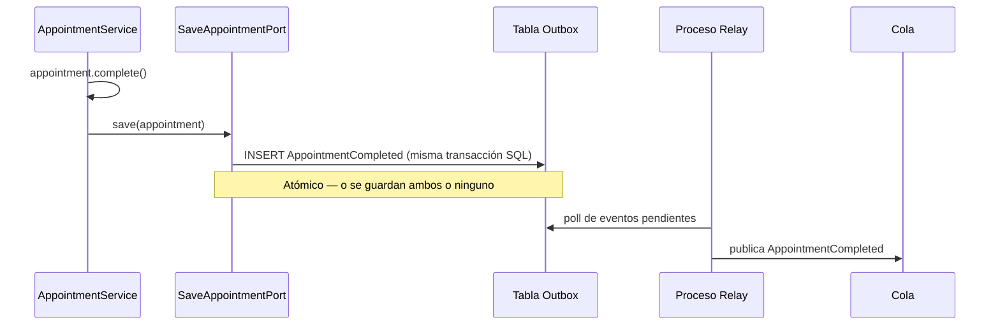

# Domain Events — publicar hechos de negocio ya consumados

La pregunta que dispara este documento: *"¿cómo le aviso a Facturación que un turno se completó, sin que `Appointment` (Citas Médicas) dependa de `Invoice` (Facturación)?"* — la respuesta es que `Appointment` no llama a nadie: publica un **Domain Event** que representa el hecho, y quien esté interesado reacciona.

## La idea central

Un Domain Event es un objeto inmutable que representa **algo que ya pasó** en el dominio, relevante para el negocio: `AppointmentCompleted`, `OrderPaid`, `AppointmentCancelled`. Se nombra en **pasado** — nunca `CompleteAppointment` (eso sería un Command, una intención de que algo pase; ver la distinción con Command en [`hexagonal-architect`](../ia-agentes/agent-harness/agents/hexagonal-architect/instructions.md), sección "Command vs. interfaz").

- Lo publica el Aggregate Root en el mismo método que produce el cambio de estado — la generación del evento es parte de la misma operación de negocio, no un paso separado que alguien pueda olvidar.
- Quien lo consume no lo sabe de antemano el emisor — eso es lo que permite que `Appointment` (Citas Médicas) nunca importe nada de `Invoice` (Facturación), aunque Facturación reaccione a sus eventos. Es el mecanismo estándar para comunicar dos Aggregates (ver [`aggregates.md`](aggregates.md), sección "una transacción, un Aggregate") o dos Bounded Contexts (ver [`bounded-context.md`](bounded-context.md)) sin acoplarlos.

## Ejemplo trabajado

```java
public record AppointmentCompleted(UUID appointmentId, PatientId patientId, Instant completedAt) {}

public class Appointment {
    private final List<Object> domainEvents = new ArrayList<>();

    public Appointment complete() {
        if (status != AppointmentStatus.IN_PROGRESS) {
            throw new IllegalStateException("Only an in-progress appointment can be completed");
        }
        status = AppointmentStatus.COMPLETED;
        domainEvents.add(new AppointmentCompleted(id, patientId, Instant.now()));
        return this;
    }

    public List<Object> pullDomainEvents() {
        List<Object> events = List.copyOf(domainEvents);
        domainEvents.clear();
        return events;
    }
}
```

- El evento es un `record` — es un Value Object, inmutable, describe un hecho que ya ocurrió y no cambia (ver [`entities-vs-value-objects.md`](entities-vs-value-objects.md)).
- `complete()` produce el cambio de estado **y** el evento en la misma operación — no hay forma de completar una cita sin que quede registrado el hecho. Esto es lo que impide el bug típico de "se me olvidó publicar el evento en este otro código path que también hace la transición".
- `pullDomainEvents()` es el patrón estándar (Spring Data lo soporta nativo vía `AbstractAggregateRoot`): el Aggregate acumula eventos internamente, y algo externo a él (el Application Service, después de un `save()` exitoso) los extrae y publica.

## Cuándo se publica — el problema de consistencia



El error común: publicar el evento a una cola (Kafka/SQS) **antes** de confirmar la transacción de base de datos, o en un `@TransactionalEventListener` mal configurado — si la transacción hace rollback después, el evento ya salió y describe un hecho que nunca ocurrió. La solución robusta es el **Outbox pattern**: el evento se guarda en la misma transacción SQL que el Aggregate, y un proceso aparte (`Relay`) lo publica después, garantizando que nunca se pierda ni se publique de más. El detalle completo del patrón está en [`microservices-patterns/README.md`](../microservices-patterns/README.md), sección "Consistencia de datos entre servicios" — Domain Events es el nombre que le da DDD al mismo problema que Outbox resuelve a nivel de infraestructura.

## Domain Event vs. Integration Event — un matiz que se confunde seguido

| | **Domain Event** | **Integration Event** |
|---|---|---|
| Alcance | Dentro de un mismo Bounded Context — puede coordinar dos Aggregates internos (ej. `Order` → reservar `Inventory`). | Cruza la frontera de Bounded Context/microservicio (ej. Citas Médicas → Facturación). |
| Contenido | Puede llevar referencias internas (IDs de Aggregates propios del contexto). | Debe ser un contrato estable y versionado — cambiar su forma rompe a consumidores externos que no controlás. |
| Transporte típico | In-process (event bus interno, `ApplicationEventPublisher` de Spring) — no necesariamente sale a una cola. | Cola/tópico (Kafka, SQS/SNS) — atraviesa un proceso distinto. |

En la práctica, un Domain Event puede **promoverse** a Integration Event cuando otro Bounded Context necesita enterarse — pero no todo Domain Event cruza esa frontera: `Order` puede publicar internamente `LineItemAdded` sin que eso le importe a nadie fuera del propio Aggregate.

## Drills de repaso

| Tiempo | Pregunta |
|---|---|
| 4 min | "¿Por qué un evento de dominio se nombra en pasado y un Command en imperativo?" |
| 5 min | "¿Cómo evitás publicar un evento cuya transacción de base de datos después falla y hace rollback?" (Outbox pattern) |
| 5 min | "Citas Médicas necesita avisarle a Facturación que un turno se completó. Diseñá el flujo sin que un contexto dependa del código del otro." |

## Referencias

- Evans, E. — *Domain-Driven Design Reference* (2015, versión actualizada) — formaliza Domain Events como bloque táctico, ausente en el libro original de 2003.
- Richardson, C. — *Microservices Patterns* (2018) — Outbox pattern como mecanismo de publicación confiable, ver también [`microservices-patterns/README.md`](../microservices-patterns/README.md).

Relacionado: [`aggregates.md`](aggregates.md) para por qué los eventos son el mecanismo correcto de coordinar Aggregates sin transacciones distribuidas, [`bounded-context.md`](bounded-context.md) para la distinción Domain/Integration Event entre contextos, y [`microservices-patterns/README.md`](../microservices-patterns/README.md) para el detalle de infraestructura del Outbox pattern.
