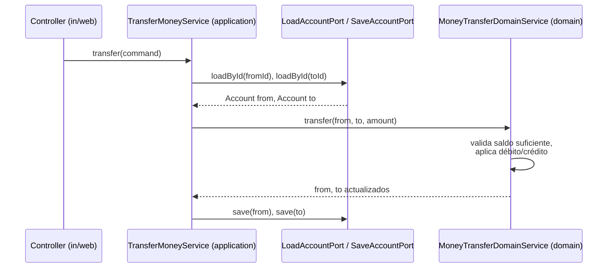

# Domain Service — reglas que no pertenecen a ninguna Entity sola

La pregunta que dispara este documento: *"¿el método `transferMoney(from, to, amount)` va dentro de `Account`?"* — y la respuesta es no: transferir involucra a **dos** Aggregates (`Account` origen y `Account` destino), y ninguno de los dos es dueño exclusivo de esa regla. Ahí es donde entra un Domain Service.

## La idea central

Un Domain Service encapsula una regla de negocio que:

1. **Involucra a más de un Aggregate** — no hay una Entity única a la que asignarle el método sin que quede raro (`accountA.transferTo(accountB, amount)` obliga a que una cuenta conozca y module a la otra).
2. **No tiene estado propio** — a diferencia de una Entity, un Domain Service no tiene identidad ni ciclo de vida; es comportamiento puro, sin campos mutables.
3. **Sigue siendo dominio puro** — sin anotaciones de framework, sin I/O directo (eso lo distingue de un `application/service`, ver más abajo).

## Domain Service vs. Application Service — la confusión más común

Este es el punto donde más se pierde la distinción en la práctica, porque en Spring ambos terminan siendo una clase con `@Service`. La diferencia es de **capa** y de **qué decide vs. qué orquesta**:

| | **Domain Service** (vive en `domain`) | **Application Service** (vive en `application/service`, ver [`hexagonal-architecture.md`](../software-architectures/hexagonal-architecture.md)) |
|---|---|---|
| Qué contiene | Una regla de negocio pura que cruza Aggregates. | Orquestación: cargar Aggregates vía Repository, invocar el dominio, guardar, publicar eventos. |
| Conoce infraestructura? | No — nunca un `Port`, nunca I/O, nunca `Mono`/`Flux` de un cliente externo. | Sí — depende de `port/out` (Repository, cliente externo) inyectados por constructor. |
| Decide reglas de negocio? | Sí, esa es su única razón de existir. | No — solo orquesta; si empieza a tener `if` de negocio, esa lógica se está filtrando fuera del dominio (ver el antipatrón Anemic Domain Model en [`entities-vs-value-objects.md`](entities-vs-value-objects.md)). |
| Ejemplo | `MoneyTransferDomainService.transfer(Account from, Account to, Money amount)` — recibe los Aggregates ya cargados, aplica la regla, los devuelve modificados. | `TransferMoneyService implements TransferMoneyUseCase` — carga `from`/`to` vía `LoadAccountPort`, llama al Domain Service, guarda ambos vía `SaveAccountPort`. |



- El Application Service (`TransferMoneyService`) **no decide** si hay saldo suficiente — eso es una regla de negocio y vive en el Domain Service.
- El Domain Service (`MoneyTransferDomainService`) **no sabe** de dónde salieron `from`/`to` ni a dónde van a guardarse — eso es orquestación y vive en el Application Service.

## Ejemplo de código

```java
// domain/MoneyTransferDomainService.java — dominio puro, sin ports ni anotaciones de Spring
public class MoneyTransferDomainService {
    public void transfer(Account from, Account to, Money amount) {
        if (!from.hasSufficientBalance(amount)) {
            throw new InsufficientBalanceException(from.id(), amount);
        }
        from.debit(amount);
        to.credit(amount);
    }
}
```

`hasSufficientBalance`, `debit`, `credit` siguen viviendo **dentro de `Account`** (protegen invariantes de una sola Entity — no del negocio conjunto de la transferencia). El Domain Service no reemplaza esos métodos: los **coordina**. Regla práctica: si podés escribir la lógica completa dentro de una sola Entity sin que quede forzado, hacelo ahí — un Domain Service es el último recurso cuando la regla genuinamente no tiene un dueño natural entre las Entities existentes, no un lugar por defecto para "lógica que no sé dónde poner".

## Cuándo NO hace falta un Domain Service

- Si la regla se puede expresar como un método de una sola Entity (`order.markPaid()`), ponerla ahí — crear un `OrderDomainService` con un solo método que delega a `Order` es indirección sin beneficio (mismo criterio que el agente `clean-code-reviewer` aplica contra patrones forzados).
- Si la regla necesita I/O (consultar un servicio externo, leer de base de datos), no es un Domain Service — es responsabilidad del Application Service coordinar ese I/O, el dominio nunca lo hace directo.

## Drills de repaso

| Tiempo | Pregunta |
|---|---|
| 4 min | "¿Por qué `transferMoney` no debería ser un método de `Account`?" |
| 5 min | "Tenés un `AccountApplicationService` con un `if (balance < amount) throw ...` adentro. ¿Qué está mal y cómo lo arreglás?" |
| 4 min | "¿Cuándo NO conviene crear un Domain Service aunque la regla cruce dos clases?" |

## Referencias

- Evans, E. — *Domain-Driven Design* (2003) — capítulo 5, definición de Domain Service como bloque táctico.
- Vernon, V. — *Implementing Domain-Driven Design* (2013) — capítulo 7, criterios prácticos para no abusar de Domain Services como "bolsa de métodos sueltos".

Relacionado: [`entities-vs-value-objects.md`](entities-vs-value-objects.md) para el antipatrón Anemic Domain Model (mover reglas de una sola Entity al Service, el error opuesto al que resuelve este documento), [`aggregates.md`](aggregates.md) para el límite de consistencia que un Domain Service debe respetar al modificar más de un Aggregate, y [`software-architectures/hexagonal-architecture.md`](../software-architectures/hexagonal-architecture.md) para dónde vive cada capa en el código.
