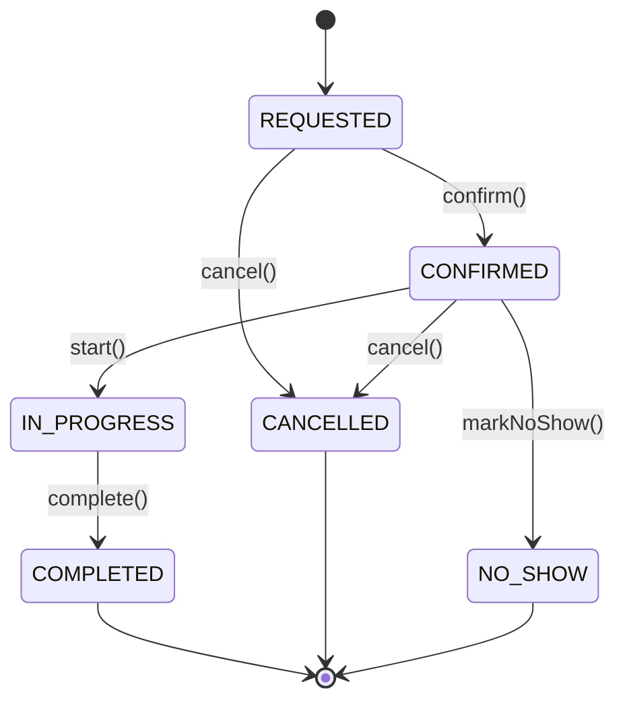

# Entities vs Value Objects — cuándo usar `class` y cuándo `record`

La pregunta que dispara todo este documento: *"¿por qué mi objeto de dominio no puede ser un `record` de Java?"* — y la respuesta corta es que depende de si el objeto tiene **identidad** o es solo un **valor**.

## La distinción central

| | **Entity** | **Value Object** |
|---|---|---|
| Igualdad | Por identidad (`id`) — dos instancias con el mismo `id` son "la misma cosa" aunque cambien otros campos | Por valor — dos instancias son iguales si **todos** sus campos coinciden |
| Mutabilidad | Puede cambiar de estado en el tiempo (tiene ciclo de vida) | Inmutable — si necesitás un valor distinto, creás una instancia nueva |
| Tipo Java idóneo | `class` (mutable-controlada o con reconstrucción inmutable) | `record` |
| Ejemplo | Un pedido (`Order`), una cita médica (`Appointment`) | El precio de una línea, un rango horario, un ID tipado |

**Un `record` de Java modela un Value Object, no una Entity.** La igualdad estructural automática que genera (`equals`/`hashCode` sobre todos los campos) es exactamente lo que **no** querés en una Entity — ahí la igualdad debe basarse solo en el `id`, sin importar qué más haya cambiado.

## Cómo reconocer una Entity al mirar el negocio

Preguntas que delatan una Entity (→ `class`):

1. **¿Tiene un ciclo de vida con estados?** (`PAYMENT_EXPECTED → PAID → PREPARING → READY`, o `REQUESTED → CONFIRMED → IN_PROGRESS → COMPLETED`). Si la respuesta es sí, necesitás métodos que **validen y controlen las transiciones** — algo que un `record` no puede hacer porque todos sus campos son `final`.
2. **¿Necesita persistir su identidad a través de cambios?** Un pedido sigue siendo "el mismo pedido" aunque cambie de estado. Un `record` no distingue esto — trataría cada cambio de estado como "un objeto completamente distinto" a nivel de igualdad.
3. **¿Protege invariantes de negocio en sus transiciones?** (ej. "no se puede marcar como preparado si no está pagado"). Esa validación vive **junto al dato que protege** — en un método de la Entity, no dispersa en un Service.

## Ejemplos trabajados

### `Order` (dominio café)

```java
public class Order {
    private UUID id;
    private final Location location;
    private final List<LineItem> items;
    private Status status = Status.PAYMENT_EXPECTED;

    public Order markPaid() {
        if (status != Status.PAYMENT_EXPECTED) {
            throw new IllegalStateException("Order is already paid");
        }
        status = Status.PAID;
        return this;
    }
    // markBeingPrepared(), markPrepared(), markTaken() — mismo patrón
}
```

- `Order` es la Entity/Aggregate Root: `class`, con `status` mutable-controlado.
- `LineItem` (línea de pedido) sí es candidato a `record`: no tiene ciclo de vida propio, es un valor que describe qué se pidió.

### `Appointment` (dominio citas médicas)

Mismo patrón, con un matiz nuevo: **referencias a otros Aggregates por ID**.

```java
public class Appointment {
    private UUID id;
    private final PatientId patientId;         // no contiene el Patient completo
    private final PractitionerId practitionerId; // referencia, no composición
    private TimeSlot schedule;
    private AppointmentStatus status = AppointmentStatus.REQUESTED;

    public Appointment confirm() {
        if (status != AppointmentStatus.REQUESTED) {
            throw new IllegalStateException("Only a requested appointment can be confirmed");
        }
        status = AppointmentStatus.CONFIRMED;
        return this;
    }
    // start(), complete(), cancel(), markNoShow(), reschedule() — mismo patrón
}
```

- `Appointment` es la Entity/Aggregate Root.
- `PatientId` / `PractitionerId` — records "Tiny Type" que envuelven un `UUID`. Evitan pasar un ID pelado y confundir accidentalmente un paciente con un profesional (el compilador lo impide).
- `TimeSlot(start, end)` — record con **compact constructor** que valida `start` y `end` no nulos, y que `start` sea antes que `end`. La invariante vive en el tipo mismo: cualquier código que intente construir un `TimeSlot` inválido falla en el momento de construcción, sin depender de que alguien se acuerde de validarlo después.
- `CancellationReason(description, cancelledAt)` — record inmutable asociado al evento de cancelar.
- `Patient` y `Practitioner` son Aggregates propios (probablemente en otro Bounded Context) — `Appointment` no los contiene, solo los referencia por ID. Distinto de `Order` → `LineItem`, donde `LineItem` sí es parte intrínseca del agregado y no existe fuera de él.



Código completo de referencia (proyecto en desarrollo): [`spring-webflux-hexagonal-architecture`](../../../codigo-por-reorganizar/) — dominio `appointment` y dominio `order`. *(Pendiente: reemplazar este link por la ruta/repo definitiva una vez esté terminado, y enlazar el ticket de Jira correspondiente aquí.)*

## Anemic Domain Model vs Rich Domain Model

Es técnicamente posible forzar una Entity a `record` — pero entonces la lógica de transición de estado no puede vivir ahí (un record no puede validar y mutar), así que migra al Application Service:

```java
// Anti-patrón: Anemic Domain Model
OrderService.markAsPaid(orderId):
    order = repository.findById(orderId)
    if (order.status() != PAYMENT_EXPECTED) throw ...
    updated = new Order(order.id(), order.location(), order.items(), PAID)
    repository.save(updated)
```

Esto compila y funciona, pero es un **anti-patrón** (Martin Fowler lo llamó *Anemic Domain Model*):

1. **Rompe encapsulamiento** — la regla de negocio queda "sugerida" en un Service, no **garantizada** por el tipo. Cualquier otro código puede construir un `Order` en un estado inválido.
2. **Lógica dispersa** — si mañana otro Service necesita la misma transición, la regla se duplica o se olvida en alguno.
3. **Viola "Tell, Don't Ask"** — en DDD le decís al objeto qué hacer (`order.markPaid()`) en vez de preguntarle su estado desde afuera y decidir vos.

**Regla de DDD**: el comportamiento que protege invariantes de negocio vive junto a los datos que protege, dentro del dominio (en un método de la Entity, o en un Domain Service para reglas que cruzan varios agregados) — nunca en el Application Service, que solo debería **orquestar** (repositorio, transacción, eventos), no decidir reglas de negocio.

## Un matiz que se presta a confusión: la inmutabilidad no es "por capa"

Error común: pensar *"el dominio/aplicación es inmutable, los extremos (DTO, persistencia) son mutables porque ahí cambian las cosas"*. Es al revés de lo que parece:

- La mutación real de negocio (`markPaid`, `confirm`, etc.) ocurre en el **centro** (dominio), no en los extremos.
- Un `OrderRequestDto` (adapter-in) es una foto que se lee una vez y se descarta — buen candidato a `record`.
- Una `OrderJpaEntity` (adapter-out) suele ser mutable **por requisito técnico de Hibernate** (dirty checking, proxies), no por diseño de negocio.
- El dominio nunca "se convierte" en la entidad de persistencia — un *mapper* lo **traduce** en cada borde. La naturaleza de cada tipo (mutable/inmutable) es constante en todo su recorrido, no cambia según en qué capa estés parado.

La regla correcta: **inmutable por naturaleza semántica** (Value Objects) siempre, en cualquier capa. **Mutable por naturaleza semántica** (Entities/Aggregates) cuando el negocio real tiene un ciclo de vida — y ahí lo que importa es **controlar** la mutación (validaciones en cada método), no evitarla.

## Pendiente de profundizar

- **Bounded Context** — cómo delimitar formalmente dónde termina un Aggregate y empieza la referencia a otro (esbozado acá con `PatientId`/`PractitionerId`, falta el marco completo).
- **Ubiquitous Language** — vocabulario compartido entre negocio y código.
- **Domain Events** — cómo publicar `OrderPaid`, `AppointmentCancelled` como eventos de dominio (conecta con `microservices-patterns/` — patrón outbox).
- **Repository pattern** — el puerto de salida que persiste un Aggregate completo, no tablas sueltas.
- **Domain Service** — cuándo una regla de negocio no pertenece a ninguna Entity individual porque involucra a varias.
- **CQRS** — separar el modelo de escritura (Aggregates ricos) del modelo de lectura (proyecciones planas, a menudo records).

## Referencias

- Evans, E. — *Domain-Driven Design: Tackling Complexity in the Heart of Software* (2003) — origen de Entity, Value Object, Aggregate, Bounded Context.
- Fowler, M. — [*AnemicDomainModel*](https://martinfowler.com/bliki/AnemicDomainModel.html) — por qué separar datos y comportamiento en DDD es un anti-patrón, no una simplificación válida.

Relacionado: [`software-architectures/hexagonal-architecture.md`](../software-architectures/hexagonal-architecture.md) — dónde vive el dominio dentro del hexágono. [`java-core/`](../java-core) — records, compact constructors y demás features de Java usadas acá.
