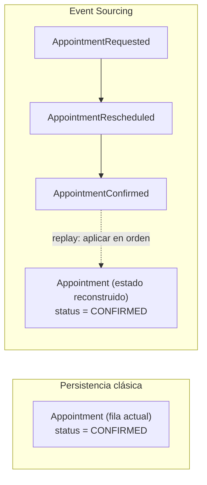
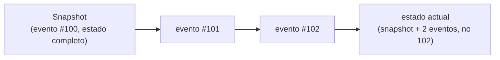
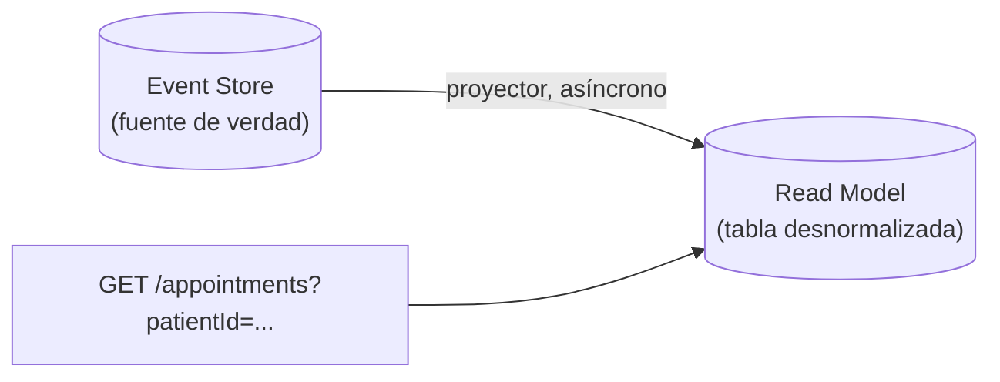

# Event Sourcing — el historial de eventos como única fuente de verdad

La pregunta que dispara este documento: *"si guardo el estado actual de `Appointment` en una tabla, y alguien pregunta '¿cuándo se reagendó este turno, y desde qué hora original?', ¿de dónde saco esa respuesta?"* — con persistencia clásica (guardar el estado final), esa historia se perdió en el momento en que se sobreescribió la fila. Event Sourcing resuelve esto invirtiendo qué es lo que realmente se persiste.

Este documento asume [`domain-events.md`](domain-events.md) (qué es un Domain Event, cómo se publica) y [`aggregates.md`](aggregates.md) (el límite de consistencia) como base — Event Sourcing es una forma particular, más radical, de usar esos mismos eventos.

## La idea central — invertir qué es la fuente de verdad

| | Persistencia clásica (state-oriented) | Event Sourcing |
|---|---|---|
| Qué se guarda | El **estado final** del Aggregate (una fila `appointments` con su `status` actual). | La **secuencia completa de eventos** que llevó a ese estado (`AppointmentRequested`, `AppointmentConfirmed`, `AppointmentRescheduled`, ...). |
| Cómo se reconstruye el estado actual | Se lee directo — la fila **es** el estado. | Se **recalcula**: se leen todos los eventos del Aggregate en orden y se aplican uno por uno (*replay*) para llegar al estado presente. |
| Historial | Se pierde, salvo que se audite aparte (tabla de auditoría manual, a menudo incompleta). | Es gratis — **es** el modelo de datos, no un agregado extra. |
| Depurar "por qué llegó a este estado" | Requiere logs externos, si existen. | Se responde reproduciendo los eventos reales que ocurrieron, en orden. |



Ambos terminan en el mismo estado actual — la diferencia es que Event Sourcing conserva **cómo se llegó ahí**, sin costo adicional de diseño.

## Ejemplo trabajado

```java
// los mismos Domain Events de domain-events.md, pero ahora SON el registro persistente
public record AppointmentRequested(UUID appointmentId, PatientId patientId, TimeSlot schedule) {}
public record AppointmentRescheduled(UUID appointmentId, TimeSlot newSchedule) {}
public record AppointmentConfirmed(UUID appointmentId) {}
public record AppointmentCancelled(UUID appointmentId, CancellationReason reason) {}

// event store — una tabla append-only: (aggregateId, sequenceNumber, eventType, payload, occurredAt)
public class Appointment {
    public static Appointment replay(List<Object> events) {
        Appointment appointment = new Appointment();
        events.forEach(appointment::apply); // reconstruye el estado aplicando cada evento en orden
        return appointment;
    }

    private void apply(Object event) {
        switch (event) {
            case AppointmentRequested e -> { this.id = e.appointmentId(); this.status = REQUESTED; this.schedule = e.schedule(); }
            case AppointmentRescheduled e -> this.schedule = e.newSchedule();
            case AppointmentConfirmed e -> this.status = CONFIRMED;
            case AppointmentCancelled e -> this.status = CANCELLED;
            default -> throw new IllegalArgumentException("Evento desconocido: " + event);
        }
    }

    public void confirm() {
        if (status != REQUESTED) throw new IllegalStateException("Solo se confirma un turno solicitado");
        apply(new AppointmentConfirmed(id)); // aplica localmente Y queda pendiente de persistir
    }
}
```

- El `switch` con pattern matching sobre el tipo de evento (Java 21, ver [`stacks-java`](../ia-agentes/.claude/skills/stacks-java/SKILL.md)) es la forma idiomática de aplicar cada evento — cada `case` sabe cómo mutar el estado para ese tipo particular.
- El **event store** (la tabla `append-only` que guarda cada evento con su número de secuencia) reemplaza a la tabla `appointments` tradicional como fuente de verdad — la tabla de estado actual, si existe, es solo una **proyección** derivada (ver más abajo), nunca la fuente original.

## Snapshots — el problema de rendimiento, y su solución

Reconstruir el estado de un Aggregate con 10,000 eventos acumulados (poco común, pero posible en un Aggregate de larga vida) implicaría leer y aplicar los 10,000 en cada `findById`. La solución estándar: **snapshots** — guardar periódicamente (ej. cada 100 eventos) una foto del estado ya reconstruido, y al leer, partir del snapshot más reciente + solo los eventos posteriores a él.



Un snapshot es una **optimización de lectura**, nunca la fuente de verdad — el event store completo sigue siendo lo único que no se puede reconstruir si se pierde; el snapshot se puede regenerar en cualquier momento reproduciendo los eventos desde cero.

## Event Sourcing + CQRS — por qué casi siempre aparecen juntos

Event Sourcing resuelve cómo se **escribe** (persistir eventos, no estado). Pero consultar "todos los turnos confirmados de un paciente" reproduciendo eventos en cada `GET` sería absurdamente lento. Por eso Event Sourcing casi siempre se combina con **CQRS nivel 3** (ver [`cqrs.md`](cqrs.md)): los eventos se proyectan de forma asíncrona hacia un modelo de lectura desnormalizado (una tabla o índice optimizado para consulta), que se reconstruye — o se repara desde cero — simplemente volviendo a reproducir el historial completo de eventos.



**Esto es lo que distingue a Event Sourcing de "simplemente publicar Domain Events" (ver [`domain-events.md`](domain-events.md)):** publicar un evento después de guardar el estado (con Outbox pattern) es la práctica común y suficiente para la mayoría de los casos. Event Sourcing va un paso más allá — el evento **es** el registro persistente, no un mensaje adicional que se dispara después de guardar algo distinto.

## Cuándo NO conviene Event Sourcing — el costo real

| Ventaja real | Costo real |
|---|---|
| Auditoría completa gratis — quién cambió qué y cuándo, sin tabla de logs aparte. | Toda consulta necesita un modelo de lectura proyectado aparte (CQRS) — no hay forma simple de "traer el estado actual" sin reproducir eventos o mantener una proyección. |
| Debugging real de producción — reproducir exactamente la secuencia que llevó a un bug. | Versionado de eventos es un problema serio: si `AppointmentRescheduled` cambia de forma, hay que migrar o traducir años de eventos viejos, no solo el código nuevo. |
| Nunca se pierde información de negocio (ej. "por qué se canceló", capturado en el evento mismo). | Curva de aprendizaje y complejidad operativa mucho mayor que una tabla CRUD — no es la opción por defecto. |

**Regla práctica**: Event Sourcing se justifica cuando el historial de cambios **es en sí mismo** un requisito de negocio (auditoría regulatoria, sistemas financieros, historiales clínicos) — no como elección por defecto de "arquitectura moderna". La mayoría de los Aggregates se sirven mejor con persistencia clásica + Domain Events puntuales para lo que otros contextos necesitan saber (ver [`domain-events.md`](domain-events.md)), sin pagar el costo completo de Event Sourcing.

## Drills de repaso

| Tiempo | Pregunta |
|---|---|
| 4 min | "¿Cuál es la diferencia entre 'publicar un Domain Event con Outbox pattern' y 'Event Sourcing'? No son lo mismo — explicá por qué." |
| 5 min | "¿Por qué Event Sourcing casi siempre se combina con CQRS? ¿Qué problema resuelve cada uno?" |
| 4 min | "¿Para qué sirve un snapshot en Event Sourcing, y por qué nunca reemplaza al event store completo?" |
| 5 min | "Te piden justificar si conviene Event Sourcing para un sistema de turnos médicos. ¿Qué preguntarías primero para decidir?" |

## Referencias

- Fowler, M. — [*Event Sourcing*](https://martinfowler.com/eaaDev/EventSourcing.html) — la formulación de referencia del patrón.
- Vernon, V. — *Implementing Domain-Driven Design* (2013) — capítulo 4 y apéndice, Event Sourcing aplicado sobre Aggregates de DDD.
- Young, G. — charlas y escritos sobre CQRS/Event Sourcing como complemento — mismo autor que acuñó CQRS (ver [`cqrs.md`](cqrs.md)).

Relacionado: [`domain-events.md`](domain-events.md) para la distinción con simplemente publicar eventos, [`aggregates.md`](aggregates.md) para el límite que se reconstruye vía replay, y [`cqrs.md`](cqrs.md) para el modelo de lectura que casi siempre lo acompaña.
