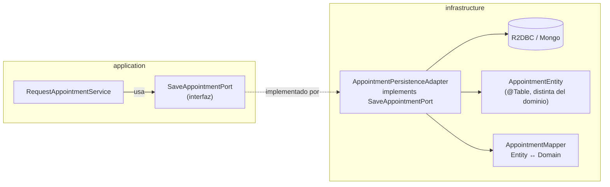

# Repository Pattern — el puerto que persiste un Aggregate completo

La pregunta que dispara este documento: *"¿por qué mi `OrderRepository` no puede tener un método `updateStatus(UUID id, Status status)`?"* — y la respuesta es que un Repository en DDD no es un CRUD de columnas sueltas: es el puerto que carga y guarda un **Aggregate completo** (ver [`aggregates.md`](aggregates.md)), respetando su límite de consistencia.

## La idea central

Un Repository da la ilusión de que el Aggregate vive en una colección en memoria — `save(order)` / `findById(id)` — mientras oculta completamente cómo se persiste realmente (SQL, documento, cache). Dos reglas separan un Repository DDD de un DAO/CRUD genérico:

1. **Un Repository por Aggregate Root, nunca por tabla.** `LineItem` no tiene `LineItemRepository` — se persiste como parte de `Order` porque no existe fuera de su Aggregate (ver [`aggregates.md`](aggregates.md)).
2. **La interfaz habla el lenguaje del dominio, no el de la base de datos.** `findPatientAppointmentsInRange(patientId, dateRange)` es un método de Repository legítimo; `executeQuery(String sql)` no lo es — el Repository no debe filtrar detalles de la tecnología de persistencia hacia quien lo consume.

## Dónde vive en una arquitectura hexagonal — Port vs. Adapter

Esto es exactamente el mismo concepto que `port/out` + `infrastructure/adapter/out/persistence` en hexagonal (ver [`hexagonal-architecture.md`](../software-architectures/hexagonal-architecture.md)) — DDD le da nombre al patrón, hexagonal le da la ubicación en el código:



- `SaveAppointmentPort`/`LoadAppointmentPort` (interfaces en `application/port/out`) son el "Repository" en términos de DDD — el dominio y la aplicación solo conocen esta interfaz, nunca la tecnología detrás.
- `AppointmentPersistenceAdapter` (en `infrastructure/adapter/out/persistence`) es la implementación concreta. Traduce entre `AppointmentEntity` (forma de persistencia — `@Table`/`@Document`, con los requisitos técnicos del driver) y `Appointment` (Aggregate de dominio) usando un `mapper` dedicado.
- Esta separación es la que permite lo que hexagonal promete de verdad: cambiar de un adapter in-memory (`Map<UUID, Appointment>`) a R2DBC/Postgres sin tocar una sola línea de `domain` o `application` — el caso de uso nunca supo que la implementación cambió.

## Ejemplo de la interfaz (port/out)

```java
public interface SaveAppointmentPort {
    Mono<Appointment> save(Appointment appointment);
}

public interface LoadAppointmentPort {
    Mono<Appointment> loadById(UUID appointmentId);
    Flux<Appointment> loadByPatientId(PatientId patientId);
}
```

- Los nombres de método hablan del dominio (`loadByPatientId`), no de SQL (`selectWherePatientId`).
- Separar `Load`/`Save` en dos interfaces (en vez de un único `AppointmentRepository` con ambos) es una decisión común en hexagonal (viene de `buckpal` — ver [`hexagonal-architecture.md`](../software-architectures/hexagonal-architecture.md)): un caso de uso que solo necesita leer no debería depender de una interfaz que también expone escritura (Interface Segregation Principle, SOLID).

## Qué NO es un Repository en DDD

| Antipatrón | Por qué rompe el patrón |
|---|---|
| Un método que actualiza un campo suelto (`updateStatus(id, status)`) en vez de recibir el Aggregate completo (`save(order)`). | Permite persistir un estado que nunca pasó por las invariantes del Aggregate Root — el `if` que valida la transición de estado queda salteado. |
| Exponer un método que devuelve una entidad de persistencia (`AppointmentEntity`) en vez del Aggregate de dominio (`Appointment`). | Filtra un detalle de infraestructura (anotaciones `@Table`, tipos del driver) hacia `application`/`domain`, rompiendo la regla de que `domain` no conoce frameworks. |
| Un Repository por tabla en vez de por Aggregate (`LineItemRepository` separado de `OrderRepository`). | `LineItem` no tiene ciclo de vida propio fuera de `Order` — exponerlo como si lo tuviera invita a mutarlo sin pasar por las invariantes del Aggregate Root. |
| Lógica de negocio dentro del Adapter (ej. calcular un total antes de guardar). | El Adapter solo traduce y persiste — cualquier regla de negocio pertenece al dominio o al Application Service, nunca a `infrastructure`. |

## Drills de repaso

| Tiempo | Pregunta |
|---|---|
| 4 min | "¿Por qué `LineItem` no tiene su propio Repository si también se guarda en base de datos?" |
| 5 min | "Tu método de Repository devuelve la entidad JPA directo al Service. ¿Qué problema genera y cómo lo arreglás?" |
| 4 min | "¿Por qué separar `LoadAppointmentPort` de `SaveAppointmentPort` en vez de un solo `AppointmentRepository`?" |

## Referencias

- Evans, E. — *Domain-Driven Design* (2003) — capítulo 6, definición original del Repository pattern.
- Hombergs, T. — *Get Your Hands Dirty on Clean Architecture* — el proyecto `buckpal` (github.com/thombergs/buckpal), referencia de cómo se ve `port/out` + `PersistenceAdapter` en código real Spring.

Relacionado: [`aggregates.md`](aggregates.md) para el límite de consistencia que el Repository debe respetar al guardar, y [`software-architectures/hexagonal-architecture.md`](../software-architectures/hexagonal-architecture.md) para la ubicación exacta de puertos/adapters en el layout de carpetas.
