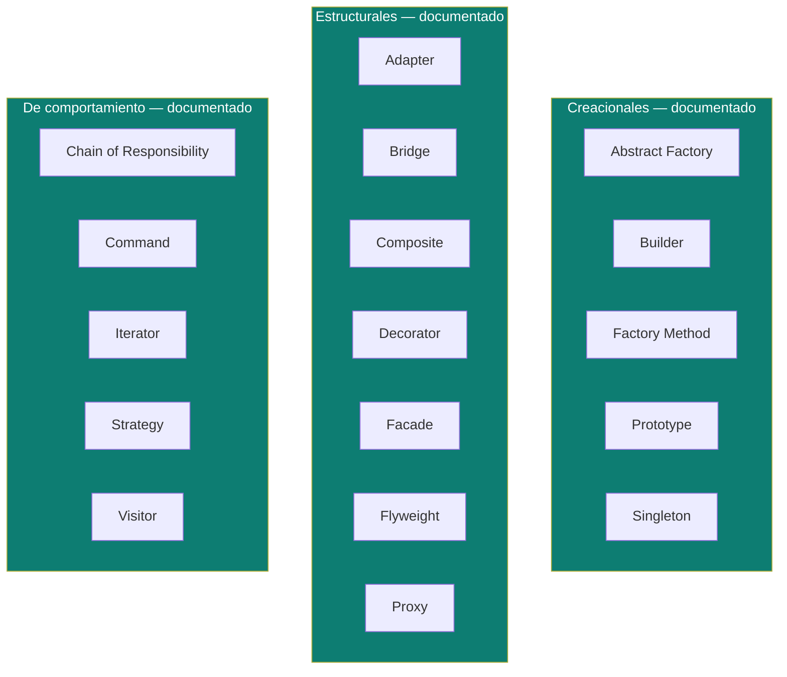

# Patrones de Diseño (GoF)

Píldoras de los patrones de diseño clásicos (Gang of Four), agrupados por categoría.

## Cobertura actual

| Categoría | Patrones | Doc |
|---|---|---|
| **Creacionales** | Factory Method, Abstract Factory, Builder, Prototype, Singleton | [`creational-patterns.md`](creational-patterns.md) — con caso de ejemplo en [`factory-method-example-es.md`](factory-method-example-es.md) / [`-en.md`](factory-method-example-en.md) |
| **Estructurales** | Adapter, Bridge, Composite, Decorator, Facade, Flyweight, Proxy | [`structural-patterns.md`](structural-patterns.md) |
| **De comportamiento** | Chain of Responsibility, Command, Iterator, Strategy, Visitor | [`behavioral-patterns.md`](behavioral-patterns.md) |

## Cuándo usar cada categoría (repaso rápido)

- **Creacionales** — cómo se instancian objetos, ocultando la lógica de creación (`new`) del código que los usa. Se usan cuando construir un objeto es complejo, condicional, o necesita desacoplarse de una implementación concreta.
- **Estructurales** — cómo se componen clases/objetos en estructuras más grandes sin acoplar sus implementaciones (envolver, adaptar, componer).
- **De comportamiento** — cómo se reparten responsabilidades y se comunican los objetos entre sí (algoritmos intercambiables, cadenas de manejo, iteración).

Relacionado: [`solid-principles/`](../solid-principles) — los patrones de diseño son, en gran parte, aplicaciones concretas de SOLID (ej. Strategy/Factory Method resuelven OCP; Adapter resuelve DIP).

## Referencias

- Gamma, E., Helm, R., Johnson, R., Vlissides, J. (Gang of Four) — *Design Patterns: Elements of Reusable Object-Oriented Software* (1994) — fuente original de los 22 patrones GoF cubiertos en esta carpeta.
- [Refactoring.Guru — Design Patterns](https://refactoring.guru/design-patterns) — explicaciones y ejemplos modernos usados como referencia complementaria.
