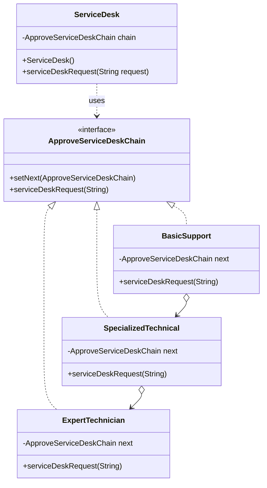

## Behavioral Design Patterns

Behavioral design patterns are concerned with algorithms and the assignment of responsibilities between objects. They describe how objects interact and distribute responsibility, increasing flexibility in communication.

In simple terms, they deal with object creation mechanisms, trying to create objects in a manner suitable to the situation. The basic form of object creation could result in design problems or added complexity to the design. Creational design patterns solve this problem by somehow controlling this object creation.

This document covers the following behavioral patterns:
1.  **Chain of Responsibility**

---

### 1. Chain of Responsibility

The Chain of Responsibility is a behavioral design pattern that lets you pass requests along a chain of handlers. Upon receiving a request, each handler decides either to process the request or to pass it to the next handler in the chain. This pattern decouples the sender of a request from its receivers.

### How It Works

The pattern is implemented by creating a chain of handler objects. Each handler has a reference to the next handler in the chain and an interface for processing requests.

In the provided example (`ec.com.pattern.behavioral.chainofresponsability.servicedesk`), we have a simple implementation for a service desk ticketing system.

1.  **Handler Interface (`ApproveServiceDeskChain`):** An interface that defines the contract for all handlers. It includes a method to set the next handler (`setNext`) and a method to process the request (`serviceDeskRequest`).
2.  **Concrete Handlers (`BasicSupport`, `SpecializedTechnical`, `ExpertTechnician`):** These are the concrete classes that implement the `ApproveServiceDeskChain` interface. Each handler knows how to process a specific type of request. If it can't handle a request, it passes it to the next handler in the chain.
3.  **Client (`ServiceDesk`):** The client is responsible for building the chain of handlers and initiating the request by passing it to the first handler in the chain.

### Class Diagram (Service Desk Example)

Here is the UML class diagram for the service desk example:

🔹 Simple explanation with a real-world example

Imagine you apply for a credit card at a bank:
	1.	The request goes first to the Gold Approver (approves up to $10,000).
	2.	If it exceeds that, it moves to the Platinum Approver (approves $10,001–$50,000).
	3.	If still higher, it moves to the Black Approver (approves above $50,000).
	4.	The customer only submits once; the system automatically passes the request through the chain until the right approver handles it.

⸻

👉 In summary:
This diagram shows a Factory pattern with polymorphism, where a factory centralizes the creation of different payment types, using an enum to decide which concrete class to instantiate.

---
