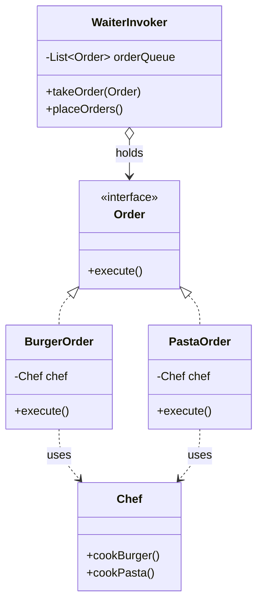
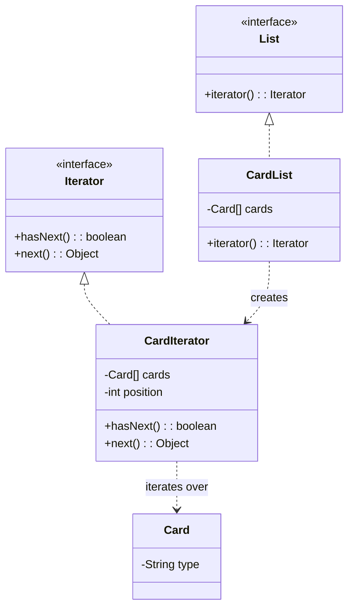

## Behavioral Design Patterns

Behavioral design patterns are concerned with algorithms and the assignment of responsibilities between objects. They describe how objects interact and distribute responsibility, increasing flexibility in communication.

In simple terms, they deal with object creation mechanisms, trying to create objects in a manner suitable to the situation. The basic form of object creation could result in design problems or added complexity to the design. Creational design patterns solve this problem by somehow controlling this object creation.

This document covers the following behavioral patterns:
1.  **Chain of Responsibility**

---

### 1. Chain of Responsibility

The Chain of Responsibility is a behavioral design pattern that lets you pass requests along a chain of handlers. Upon receiving a request, each handler decides either to process the request or to pass it to the next handler in the chain. This pattern decouples the sender of a request from its receivers.

### How It Works

The pattern is implemented by creating a chain of handler objects. Each handler has a reference to the next handler in the chain and an interface for processing requests.

In the provided example (`ec.com.pattern.behavioral.chainofresponsability.servicedesk`), we have a simple implementation for a service desk ticketing system.

1.  **Handler Interface (`ApproveServiceDeskChain`):** An interface that defines the contract for all handlers. It includes a method to set the next handler (`setNext`) and a method to process the request (`serviceDeskRequest`).
2.  **Concrete Handlers (`BasicSupport`, `SpecializedTechnical`, `ExpertTechnician`):** These are the concrete classes that implement the `ApproveServiceDeskChain` interface. Each handler knows how to process a specific type of request. If it can't handle a request, it passes it to the next handler in the chain.
3.  **Client (`ServiceDesk`):** The client is responsible for building the chain of handlers and initiating the request by passing it to the first handler in the chain.

### Class Diagram (Service Desk Example)

Here is the UML class diagram for the service desk example:

🔹 Simple explanation with a real-world example

Imagine you apply for a credit card at a bank:
	1.	The request goes first to the Gold Approver (approves up to $10,000).
	2.	If it exceeds that, it moves to the Platinum Approver (approves $10,001–$50,000).
	3.	If still higher, it moves to the Black Approver (approves above $50,000).
	4.	The customer only submits once; the system automatically passes the request through the chain until the right approver handles it.

⸻

👉 In summary: This diagram shows a Chain of Responsibility pattern, where a request is passed along a chain of handlers. The ServiceDesk sends the request to the first handler (BasicSupport). If it cannot resolve it, the request is forwarded to SpecializedTechnical, and if still unresolved, it is escalated to ExpertTechnician. All handlers implement the same ApproveServiceDeskChain interface, ensuring flexibility and dynamic request routing.

---

### 2. Command

The **Command** is a behavioral design pattern that turns a request into a stand-alone object containing all information about the request. This transformation lets you parameterize methods with different requests, delay or queue a request's execution, and support undoable operations.

### How It Works

The pattern decouples the object that invokes an operation (the **Invoker**) from the object that knows how to perform it (the **Receiver**). The invoker doesn't need to know anything about the receiver's interface.

In the provided example (`ec.com.pattern.behavioral.command.cook`), we have a restaurant scenario:

1.  **Command Interface (`Order`):** An interface that declares a method for executing the command, typically named `execute()`.
2.  **Concrete Commands (`BurgerOrder`, `PastaOrder`):** These are the specific orders. They implement the `Order` interface and hold a reference to the receiver (`Chef`). When `execute()` is called, they instruct the `Chef` on what action to perform.
3.  **Receiver (`Chef`):** The object that knows how to perform the actual work (e.g., `cookBurger()`, `cookPasta()`). It has no knowledge of the command objects that trigger its actions.
4.  **Invoker (`WaiterInvoker`):** This object takes an `Order` and triggers its execution. The `WaiterInvoker` is decoupled from the `Chef`; it only knows about the `Order` interface and calls its `execute()` method. It can also queue commands, as seen with the `orderQueue`.
5.  **Client:** The client is responsible for creating the Receiver (`Chef`), the Concrete Commands (`BurgerOrder`, `PastaOrder`), and the Invoker (`WaiterInvoker`). It then assembles them by passing the command objects to the invoker.

### Class Diagram (Cook Example)

Here is the UML class diagram for the restaurant example:

🔹 **Simple explanation with a real-world example**

Imagine a friendly waiter (`WaiterInvoker`) taking your order at a restaurant.

1.  You tell the waiter you want a burger. The waiter writes this down on an order slip (`BurgerOrder`). The slip itself is the command.
2.  Your friend orders pasta, and the waiter creates another order slip (`PastaOrder`).
3.  The waiter takes these slips to the kitchen and sticks them on a queue. The waiter doesn't know how to cook; they just manage the order slips.
4.  When the chef (`Chef`) is ready, they pick up an order slip and execute the instructions on it (e.g., `cookBurger()`). The chef is completely decoupled from the waiter and the customer.

This setup allows for great flexibility. You can queue orders, log them, or even cancel them without the chef or waiter needing to change how they work.

---

### 3. Iterator

The **Iterator** is a behavioral design pattern that lets you traverse elements of a collection without exposing its underlying representation (like a list, stack, tree, etc.). It provides a way to access the elements of an aggregate object sequentially without exposing its internal structure.

### How It Works

The main idea of the Iterator pattern is to extract the traversal behavior of a collection into a separate object called an *iterator*.

In the provided example (`ec.com.pattern.behavioral.iteractor`), we have an implementation for iterating over a collection of `Card` objects.

1.  **Iterator Interface (`Iterator`):** This interface declares the operations for traversal, such as `hasNext()` to check if there are more elements and `next()` to retrieve the next element.
2.  **Aggregate Interface (`List`):** This interface declares a method for getting an iterator, like `iterator()`.
3.  **Concrete Iterator (`CardIterator`):** This class implements the `Iterator` interface and keeps track of the current position in the traversal of a specific collection. It is coupled with the `CardList`.
4.  **Concrete Aggregate (`CardList`):** This class implements the `List` interface. It returns a new instance of the `CardIterator` when the `iterator()` method is called, giving the client a way to traverse its internal `Card` array.
5.  **Client:** The client gets an iterator object from the collection and uses it to access the elements. This way, the client code doesn't depend on the concrete classes of the collection.

### Class Diagram (Card Iterator Example)

Here is the UML class diagram for the card iterator example:

🔹 **Simple explanation with a real-world example**

Think of a TV remote control.

1.  Your TV has a collection of channels (the `CardList`).
2.  The remote control is your `Iterator`.
3.  You can use the "next channel" and "previous channel" buttons (`next()` method) to go through the channels one by one. You don't need to know how the TV stores the channels or tunes into them.
4.  You can also check if you've reached the last channel (`hasNext()` method).

The remote control (Iterator) provides a simple, universal interface to interact with the TV's channels (the collection), hiding the complex internal details.
