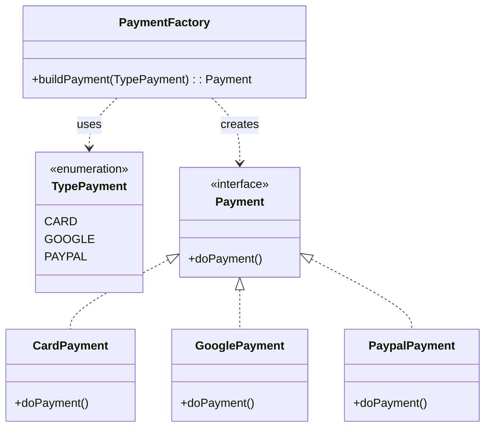
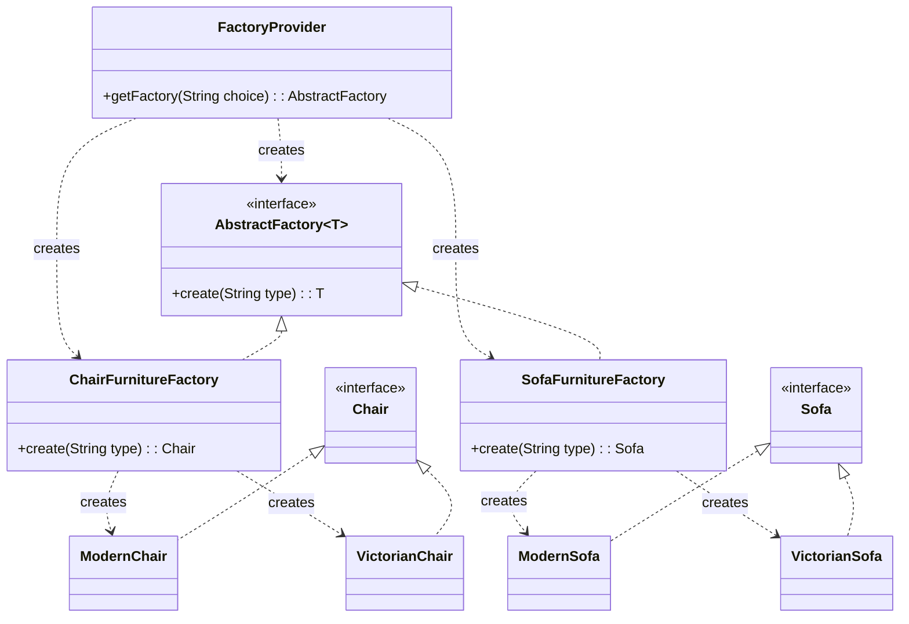
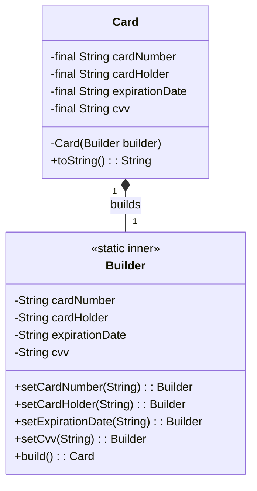

## Creational Design Patterns

Creational design patterns are all about class instantiation. These patterns can be further divided into class-creation patterns and object-creational patterns. While class-creation patterns use inheritance effectively in the instantiation process, object-creation patterns use delegation effectively to get the job done.

In simple terms, they deal with object creation mechanisms, trying to create objects in a manner suitable to the situation. The basic form of object creation could result in design problems or added complexity to the design. Creational design patterns solve this problem by somehow controlling this object creation.

This document covers the following creational patterns:
1.  **Factory Method**
2.  **Abstract Factory**

---

### 1. Factory Method

The Factory Method is a creational design pattern that provides an interface for creating objects in a superclass, but allows subclasses to alter the type of objects that will be created.

### How to Use It

This pattern is used when a class cannot anticipate the class of objects it must create. The Factory Method pattern suggests that you replace direct object construction calls (using the `new` operator) with calls to a special *factory* method.

In the provided example (`ec.com.pattern.creational.factorymethod.payment`), we have a simple implementation of a factory for creating different types of payments.

1.  **Product Interface (`Payment`):** An interface that defines the operations of the objects the factory will create. In this case, it's the `doPayment()` method.
2.  **Concrete Products (`CardPayment`, `GooglePayment`, `PaypalPayment`):** These are the concrete classes that implement the `Payment` interface.
3.  **Factory (`PaymentFactory`):** This class contains a static method `buildPayment()` that, based on a `TypePayment` enum, returns a concrete instance of a `Payment`. The client code calls this method to get a payment object without having to know the specific implementation details.

### Class Diagram (Payment Example)

Here is the UML class diagram for the payment example:

🔹 Simple explanation with a real-world example

Imagine you work at a bank:
    1. The customer chooses to pay with a card, Google Pay, or PayPal.
    2. The factory (PaymentFactory) receives that information (the TypePayment enum).
    3. The factory creates the appropriate object:
        • If it's CARD → returns CardPayment.
        • If it's GOOGLE → returns GooglePayment.
        • If it's PAYPAL → returns PaypalPayment.
    4. The system calls doPayment() regardless of the payment type, because all classes implement the Payment interface.

⸻

👉 In summary:
This diagram shows a Factory pattern with polymorphism, where a factory centralizes the creation of different payment types, using an enum to decide which concrete class to instantiate.

---

### 2. Abstract Factory

The Abstract Factory is a creational design pattern that lets you produce families of related objects without specifying their concrete classes. It provides an interface for creating families of related or dependent objects.

### How to Use It

This pattern is used when your system needs to be independent of how its products are created, composed, and represented. You have several families of objects, and you need to ensure that the objects from one family are always used together.

In the provided example (`ec.com.pattern.creational.abstractfactory.furniturestore`), we have an implementation for creating different families (styles) of furniture.

1.  **Product Interfaces (`Chair`, `Sofa`, `CoffeeTable`):** Each interface defines a distinct product.
2.  **Concrete Products (`ModernChair`, `VictorianChair`, etc.):** These are the concrete classes that implement the product interfaces, representing specific styles (Modern, Victorian).
3.  **Generic Abstract Factory (`AbstractFactory<T>`):** A generic interface to create an object of type `T`.
4.  **Concrete Factories (`ChairFurnitureFactory`, `SofaFurnitureFactory`):** These factories implement the generic `AbstractFactory` for a specific product type (e.g., `Chair`). They contain the logic to create different styles of that product.
5.  **Factory Provider (`FactoryProvider`):** A class that provides the client with a specific factory (e.g., `SofaFurnitureFactory`) based on a request. This is a "factory of factories."

The client first gets a specific factory from the `FactoryProvider` and then uses that factory to create a product of a specific style, without knowing the concrete product class.

### Class Diagram (Furniture Store Example)

Here is the UML class diagram for the furniture store example:

🔹 **Simple explanation with a real-world example**

Imagine you're furnishing your house and you want everything to match a certain style (e.g., "Modern" or "Victorian").

1.  You decide you need a chair. You go to the "Furniture Store" (`FactoryProvider`).
2.  You ask the store for the "Chair Department" (`ChairFurnitureFactory`).
3.  In the chair department, you ask for a "Modern" style chair. The department gives you a `ModernChair`.
4.  Later, you decide you need a sofa. You go back to the store and ask for the "Sofa Department" (`SofaFurnitureFactory`).
5.  In the sofa department, you ask for a "Modern" style sofa, and you get a `ModernSofa`.

You get matching furniture pieces without having to know the specific manufacturing details. The store and its departments (the factories) handle the creation process for you.

---

### 3. Builder

El patrón Builder es un patrón de diseño creacional que te permite construir objetos complejos paso a paso. El patrón te permite producir diferentes tipos y representaciones de un objeto usando el mismo código de construcción. Separa la construcción de un objeto complejo de su representación, de modo que el mismo proceso de construcción pueda crear diferentes representaciones.

### Cómo trabaja esto

Este patrón es especialmente útil cuando un objeto tiene muchos parámetros de configuración, algunos de los cuales pueden ser opcionales. En lugar de usar constructores con una larga lista de parámetros (constructores telescópicos), el patrón Builder simplifica la creación de objetos.

En el ejemplo proporcionado (`ec.com.pattern.creational.builder.Card`), se implementa el patrón Builder para crear un objeto `Card` inmutable.

1.  **Producto (`Card`):** Es el objeto complejo que se está construyendo. Tiene un constructor privado que solo acepta un objeto `Builder`. Esto obliga a que la creación se realice exclusivamente a través del builder. Sus atributos son `final` para garantizar la inmutabilidad.
2.  **Builder (`Card.Builder`):** Es una clase anidada estática dentro de `Card`. Contiene los mismos campos que la clase `Card` para almacenar la configuración paso a paso.
3.  **Métodos de construcción (`set...`):** La clase `Builder` tiene métodos fluidos (que devuelven `this`) para configurar cada uno de los atributos del objeto. Esto permite encadenar llamadas de una manera legible (ej: `new Card.Builder().setCardNumber(...).setCardHolder(...)`).
4.  **Método `build()`:** Este método, dentro de la clase `Builder`, invoca al constructor privado de `Card`, pasándose a sí mismo como argumento. Finalmente, devuelve el objeto `Card` ya construido y configurado.

### Diagrama de Clases (Ejemplo de Tarjeta)

Aquí está el diagrama de clases UML para el ejemplo de `Card`:

🔹 **Explicación simple con un ejemplo del mundo real**

Imagina que estás pidiendo una pizza personalizada:

1.  Empiezas con una base de pizza vacía (creas una instancia de `Pizza.Builder`).
2.  Le dices al chef qué ingredientes agregar, uno por uno: "añade queso", "añade pepperoni", "añade champiñones" (llamas a los métodos `addCheese()`, `addPepperoni()`, `addMushrooms()`).
3.  Cada vez que añades un ingrediente, el chef sigue trabajando sobre la misma pizza que está preparando.
4.  Cuando has terminado de elegir, le dices al chef "¡Listo!" (llamas al método `build()`).
5.  El chef mete la pizza al horno y te entrega el producto final, listo para comer.

El `Builder` te permite construir el objeto (`Pizza` o `Card`) de forma flexible y legible, sin necesidad de un constructor con un sinfín de parámetros.
