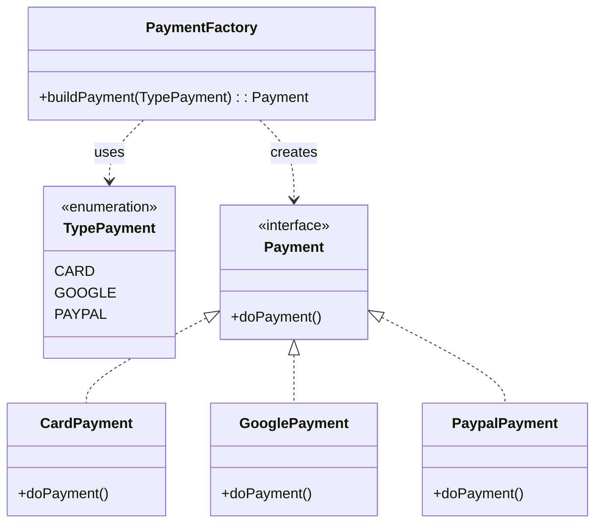
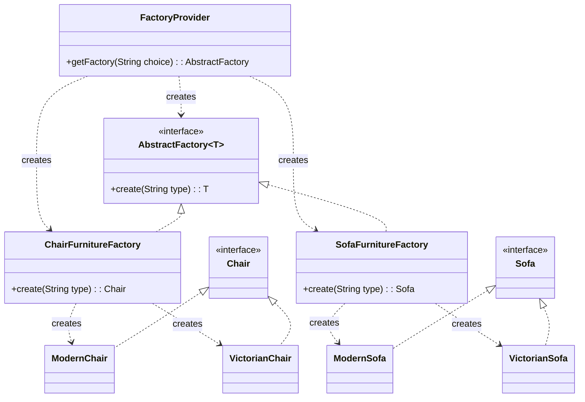
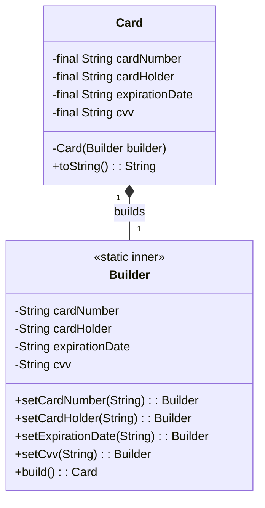
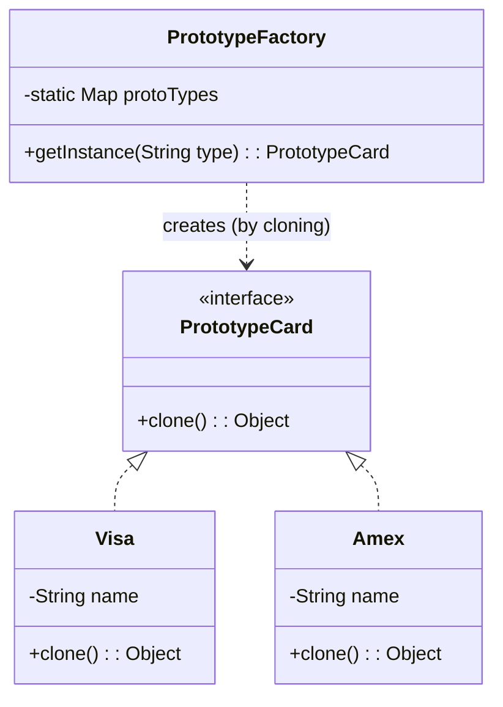
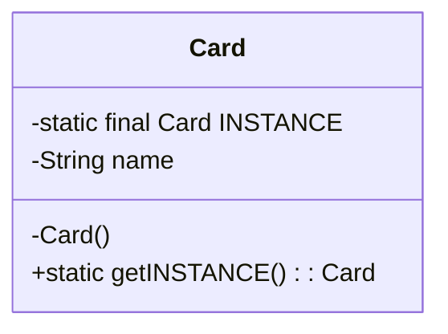

## Creational Design Patterns

Creational design patterns are all about class instantiation. These patterns can be further divided into class-creation patterns and object-creational patterns. While class-creation patterns use inheritance effectively in the instantiation process, object-creation patterns use delegation effectively to get the job done.

In simple terms, they deal with object creation mechanisms, trying to create objects in a manner suitable to the situation. The basic form of object creation could result in design problems or added complexity to the design. Creational design patterns solve this problem by somehow controlling this object creation.

This document covers the following creational patterns:
1.  **Factory Method**
2.  **Abstract Factory**

---

### 1. Factory Method

The Factory Method is a creational design pattern that provides an interface for creating objects in a superclass, but allows subclasses to alter the type of objects that will be created.

### How to Use It

This pattern is used when a class cannot anticipate the class of objects it must create. The Factory Method pattern suggests that you replace direct object construction calls (using the `new` operator) with calls to a special *factory* method.

In the provided example (`ec.com.pattern.creational.factorymethod.payment`), we have a simple implementation of a factory for creating different types of payments.

1.  **Product Interface (`Payment`):** An interface that defines the operations of the objects the factory will create. In this case, it's the `doPayment()` method.
2.  **Concrete Products (`CardPayment`, `GooglePayment`, `PaypalPayment`):** These are the concrete classes that implement the `Payment` interface.
3.  **Factory (`PaymentFactory`):** This class contains a static method `buildPayment()` that, based on a `TypePayment` enum, returns a concrete instance of a `Payment`. The client code calls this method to get a payment object without having to know the specific implementation details.

### Class Diagram (Payment Example)

Here is the UML class diagram for the payment example:

🔹 Simple explanation with a real-world example

Imagine you work at a bank:
    1. The customer chooses to pay with a card, Google Pay, or PayPal.
    2. The factory (PaymentFactory) receives that information (the TypePayment enum).
    3. The factory creates the appropriate object:
        • If it's CARD → returns CardPayment.
        • If it's GOOGLE → returns GooglePayment.
        • If it's PAYPAL → returns PaypalPayment.
    4. The system calls doPayment() regardless of the payment type, because all classes implement the Payment interface.

⸻

👉 In summary:
This diagram shows a Factory pattern with polymorphism, where a factory centralizes the creation of different payment types, using an enum to decide which concrete class to instantiate.

---

### 2. Abstract Factory

The Abstract Factory is a creational design pattern that lets you produce families of related objects without specifying their concrete classes. It provides an interface for creating families of related or dependent objects.

### How to Use It

This pattern is used when your system needs to be independent of how its products are created, composed, and represented. You have several families of objects, and you need to ensure that the objects from one family are always used together.

In the provided example (`ec.com.pattern.creational.abstractfactory.furniturestore`), we have an implementation for creating different families (styles) of furniture.

1.  **Product Interfaces (`Chair`, `Sofa`, `CoffeeTable`):** Each interface defines a distinct product.
2.  **Concrete Products (`ModernChair`, `VictorianChair`, etc.):** These are the concrete classes that implement the product interfaces, representing specific styles (Modern, Victorian).
3.  **Generic Abstract Factory (`AbstractFactory<T>`):** A generic interface to create an object of type `T`.
4.  **Concrete Factories (`ChairFurnitureFactory`, `SofaFurnitureFactory`):** These factories implement the generic `AbstractFactory` for a specific product type (e.g., `Chair`). They contain the logic to create different styles of that product.
5.  **Factory Provider (`FactoryProvider`):** A class that provides the client with a specific factory (e.g., `SofaFurnitureFactory`) based on a request. This is a "factory of factories."

The client first gets a specific factory from the `FactoryProvider` and then uses that factory to create a product of a specific style, without knowing the concrete product class.

### Class Diagram (Furniture Store Example)

Here is the UML class diagram for the furniture store example:

🔹 **Simple explanation with a real-world example**

Imagine you're furnishing your house and you want everything to match a certain style (e.g., "Modern" or "Victorian").

1.  You decide you need a chair. You go to the "Furniture Store" (`FactoryProvider`).
2.  You ask the store for the "Chair Department" (`ChairFurnitureFactory`).
3.  In the chair department, you ask for a "Modern" style chair. The department gives you a `ModernChair`.
4.  Later, you decide you need a sofa. You go back to the store and ask for the "Sofa Department" (`SofaFurnitureFactory`).
5.  In the sofa department, you ask for a "Modern" style sofa, and you get a `ModernSofa`.

You get matching furniture pieces without having to know the specific manufacturing details. The store and its departments (the factories) handle the creation process for you.

---

### 3. Builder

The Builder pattern is a creational design pattern that lets you construct complex objects step by step. The pattern allows you to produce different types and representations of an object using the same construction code. It separates the construction of a complex object from its representation, so that the same construction process can create different representations.

### How It Works

This pattern is especially useful when an object has many configuration parameters, some of which may be optional. Instead of using constructors with a long list of parameters (telescoping constructors), the Builder pattern simplifies object creation.

In the provided example (`ec.com.pattern.creational.builder.Card`), the Builder pattern is implemented to create an immutable `Card` object.

1.  **Product (`Card`):** This is the complex object being built. It has a private constructor that only accepts a `Builder` object. This forces creation to be done exclusively through the builder. Its attributes are `final` to ensure immutability.
2.  **Builder (`Card.Builder`):** This is a static nested class inside `Card`. It contains the same fields as the `Card` class to store the configuration step by step.
3.  **Construction Methods (`set...`):** The `Builder` class has fluent methods (that return `this`) to configure each of the object's attributes. This allows for chaining calls in a readable way (e.g., `new Card.Builder().setCardNumber(...).setCardHolder(...)`).
4.  **`build()` Method:** This method, inside the `Builder` class, invokes the private constructor of `Card`, passing itself as an argument. Finally, it returns the fully constructed and configured `Card` object.

### Class Diagram (Card Example)

Here is the UML class diagram for the `Card` example:

🔹 **Simple explanation with a real-world example**

Imagine you are ordering a custom pizza:

1.  You start with an empty pizza base (you create an instance of `Pizza.Builder`).
2.  You tell the chef which toppings to add, one by one: "add cheese," "add pepperoni," "add mushrooms" (you call the `addCheese()`, `addPepperoni()`, `addMushrooms()` methods).
3.  Each time you add a topping, the chef continues to work on the same pizza being prepared.
4.  When you're done choosing, you tell the chef, "Ready!" (you call the `build()` method).
5.  The chef puts the pizza in the oven and gives you the final product, ready to eat.

The `Builder` allows you to construct the object (`Pizza` or `Card`) in a flexible and readable way, without needing a constructor with endless parameters.

### 4. Prototype

The Prototype pattern is a creational design pattern that lets you copy existing objects without making your code dependent on their classes. Instead of creating an object from scratch, you create a new instance by cloning an existing one.

This pattern is useful when the cost of creating an object is higher than cloning it, or when you want to avoid the complexity of direct instantiation.

### How It Works

The pattern is based on the idea of having a "prototype" object that can be cloned to produce new objects.

In the provided example (`ec.com.pattern.creational.prototype`), a prototype registry for credit cards is implemented.

1.  **Prototype Interface (`PrototypeCard`):** Defines an interface that extends Java's `Cloneable` and declares a `clone()` method. All objects that can be cloned must implement this interface.
2.  **Concrete Prototypes (`Visa`, `Amex`):** These are the classes that implement the `PrototypeCard` interface. They provide the implementation of the `clone()` method, which usually calls `super.clone()` to create a shallow copy of the object.
3.  **Prototype Registry (`PrototypeFactory`):** This class acts as a central registry. It maintains a `Map` of pre-initialized prototypes. When a client requests a new object, the factory looks up the corresponding prototype, clones it, and returns the copy. This avoids the need to instantiate objects with `new` every time.

### Class Diagram (Card Example)

🔹 **Explicación simple con un ejemplo del mundo real**

Imagina que trabajas en una imprenta y tienes plantillas maestras para diferentes tipos de tarjetas de presentación (una para "Ejecutivo", otra para "Creativo").

1.  Un cliente llega y pide 50 tarjetas de estilo "Ejecutivo".
2.  En lugar de diseñar cada tarjeta desde cero, tomas la plantilla maestra "Ejecutivo" (el prototipo).
3.  Clonas esa plantilla 50 veces, y luego solo personalizas los detalles (nombre, teléfono) en cada copia.

El `PrototypeFactory` es como el archivador donde guardas tus plantillas maestras. El método `getInstance()` es el proceso de tomar una plantilla, fotocopiarla (`clone()`) y entregar la copia.

---

### 5. Singleton

The Singleton pattern is a creational design pattern that ensures a class has only one instance, while providing a global access point to this instance. It's one of the most well-known patterns, but should be used with caution as it can introduce global state into an application.

This pattern is useful for managing shared resources, such as a database connection, a logger, or a configuration manager.

### How It Works

To implement the Singleton pattern, you make the class responsible for its own creation and lifecycle.

In the provided example (`ec.com.pattern.creational.singleton.Card`), the pattern is implemented as follows:

1.  **Private Constructor:** The class has a `private` constructor (`private Card()`). This prevents other classes from creating new instances of the Singleton using the `new` operator.
2.  **Static Instance:** The class holds a `private static final` instance of itself. This instance is created "eagerly" when the class is loaded by the Java Virtual Machine (JVM), which is an inherently thread-safe approach.
3.  **Global Access Method:** A `public static` method (e.g., `getINSTANCE()`) is provided to act as a global access point. Any time this method is called, it returns the single, pre-existing instance.

### Class Diagram (Card Example)

The diagram shows that the `Card` class contains a static reference to itself and provides a static method to get that instance. The private constructor ensures no other instances can be created from outside.

🔹 **Simple explanation with a real-world example**

Imagine the government of a country.

1.  There can only be **one** official government at any given time. You can't just create a new one whenever you want. This is enforced by the "constitution" (the private constructor).
2.  The government itself exists as a single entity within the country (the static instance).
3.  When anyone needs to interact with the government (e.g., to pay taxes or get a passport), they go through official channels to reach the *same* single government body (the `getInstance()` method).

No matter how many citizens or agencies try to "get the government," they all end up interacting with the one and only instance.

**Note on Thread Safety:** The example uses "eager initialization," which is a simple and thread-safe way to implement a Singleton. Other methods like "double-checked locking" or using an `enum` also exist for more complex scenarios (like lazy initialization in a multithreaded context).
