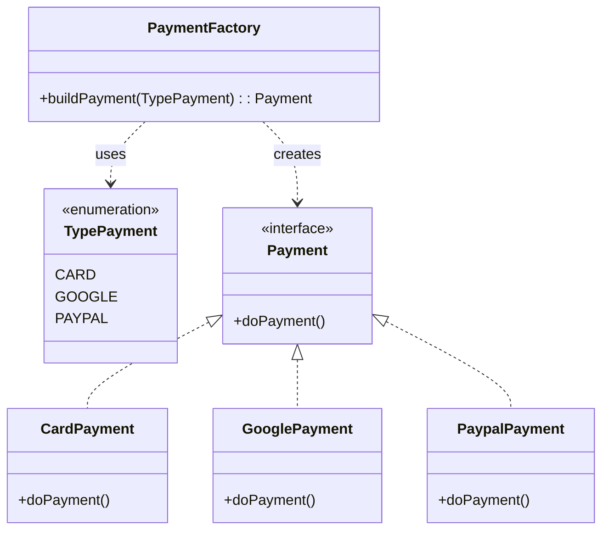

## Creational Patterns: Factory Method

The Factory Method is a creational design pattern that provides an interface for creating objects in a superclass, but allows subclasses to alter the type of objects that will be created.

### How to Use It

This pattern is used when a class cannot anticipate the class of objects it must create. The Factory Method pattern suggests that you replace direct object construction calls (using the `new` operator) with calls to a special *factory* method.

In the provided example (`ec.com.pattern.creational.factorymethod.payment`), we have a simple implementation of a factory for creating different types of payments.

1.  **Product Interface (`Payment`):** An interface that defines the operations of the objects the factory will create. In this case, it's the `doPayment()` method.
2.  **Concrete Products (`CardPayment`, `GooglePayment`, `PaypalPayment`):** These are the concrete classes that implement the `Payment` interface.
3.  **Factory (`PaymentFactory`):** This class contains a static method `buildPayment()` that, based on a `TypePayment` enum, returns a concrete instance of a `Payment`. The client code calls this method to get a payment object without having to know the specific implementation details.

### Class Diagram (Payment Example)

Here is the UML class diagram for the payment example:

🔹 Simple explanation with a real-world example

Imagine you work at a bank:
    1. The customer chooses to pay with a card, Google Pay, or PayPal.
    2. The factory (PaymentFactory) receives that information (the TypePayment enum).
    3. The factory creates the appropriate object:
        • If it's CARD → returns CardPayment.
        • If it's GOOGLE → returns GooglePayment.
        • If it's PAYPAL → returns PaypalPayment.
    4. The system calls doPayment() regardless of the payment type, because all classes implement the Payment interface.

⸻

👉 In summary:
This diagram shows a Factory pattern with polymorphism, where a factory centralizes the creation of different payment types, using an enum to decide which concrete class to instantiate.