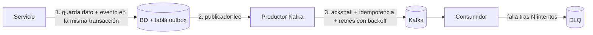

# Retrospectiva — entrevista técnica con el Tech Lead (Arkano)

> **Estado:** realizada el 7-oct-2026 · veredicto **pendiente** · sin correo de rechazo hasta la fecha de este documento.
> Volver a la guía: [`README.md`](README.md) · consulta rápida: [`cheat-sheet.md`](cheat-sheet.md)

## 🍎 Con manzanas

Imagina que el dueño de la frutería te pregunta: *"¿Y si el camión que trae las manzanas se avería a mitad de camino?"*. Respondiste que existen camiones, rutas y bodegas (topic, particiones, brokers), pero lo que querían oír era el **plan B**: reintentar el viaje sin duplicar la carga, guardar la caja en la bodega hasta que el camión vuelva, y apartar las cajas dañadas en un estante aparte para revisarlas después.

| Nivel | Qué se espera ante "¿qué pasa si Kafka falla?" |
|---|---|
| 🟢 Junior | "Se reintenta". |
| 🟡 Mid | Reintentos con espera creciente y una cola de mensajes fallidos (DLQ). |
| 🔴 Senior | Todo lo anterior, más idempotencia en productor y consumidor, Outbox para no perder eventos y qué pasa con el orden. |

## Qué pasó

| Tema | Qué respondí | Valoración |
|---|---|---|
| Habilidades blandas, experiencia, casos | Buena conversación; el feedback fue positivo | ✅ |
| Cambio de contrato con servicios ya mockeados | OpenAPI first, medir impacto, escalar a tech lead y PO, carry over al sprint siguiente | ✅ Sólida; se puede reforzar con compatibilidad hacia atrás y pruebas de contrato |
| Kafka: "¿qué pasa si falla y no se envía?" | Expliqué topic, particiones, brokers; recordé que existe un retry pero no su nombre | ⚠️ Faltó el manejo de fallos |
| GraphQL y N+1 | Respondí con la ventaja del esquema extensible | ⚠️ No era el N+1 |
| Node.js / NestJS | Dije que no lo he usado mucho y lo comparé con Spring Boot | ⚠️ Comparación correcta, faltó profundidad |

**Feedback textual del entrevistador:** habilidades buenas, se nota experiencia. Recomendó repasar **NestJS** y, sobre todo, **Kafka** (reintentos y casos de fallo).

## Lo que debí responder

### 1. Kafka: ¿qué pasa si falla el envío?

- **Productor:** `acks=all`, `enable.idempotence=true`, `retries` con `retry.backoff.ms` y un tope en `delivery.timeout.ms`. La idempotencia evita que un reintento duplique el mensaje en la partición.
- **Kafka caído un buen rato:** el evento no se pierde porque quedó en la tabla outbox junto al dato; el publicador lo reenvía al volver. Ver [`../../microservices-patterns/`](../../microservices-patterns/README.md).
- **Consumidor:** reintentos con backoff y, al agotarlos, DLQ. Como la entrega es *at-least-once*, el consumidor debe ser idempotente (por ejemplo, guardar el id del evento procesado).
- **Orden:** si se reintenta un mensaje y otro de la misma clave pasa por delante, se rompe el orden. Con idempotencia y `max.in.flight.requests.per.connection ≤ 5` Kafka lo conserva por partición.
- **Quarkus:** `mp.messaging.incoming.<canal>.failure-strategy=dead-letter-queue`. Ver [`../../frameworks/quarkus/smallrye-reactive-messaging.md`](../../frameworks/quarkus/smallrye-reactive-messaging.md).
- **Spring:** `DefaultErrorHandler` con `DeadLetterPublishingRecoverer` y `ExponentialBackOff`.
- Más detalle: [`../../messaging-streaming/kafka.md`](../../messaging-streaming/kafka.md).

**Respuesta de 30 segundos:** "El productor reintenta con backoff e idempotencia para no duplicar; si Kafka sigue caído, el evento queda en la tabla outbox y se publica después. En el consumidor reintento con espera y, si agota, va a una DLQ; y lo hago idempotente porque la entrega es at-least-once."

### 2. GraphQL y el problema N+1

Pides 100 pedidos y, por cada uno, el resolver consulta su cliente: **1 consulta + 100**. Se resuelve con **DataLoader**, que junta esas 100 búsquedas en una sola consulta por lote. Complementos: límite de profundidad y de complejidad de la query. Ventaja del esquema (ampliarlo para integrar otro servicio) es válida, pero es otra pregunta.

### 3. Node.js y NestJS

- Nest se parece a Spring Boot: módulos, controllers, providers (servicios) e inyección de dependencias. Documentado en [`../../frameworks/nestjs/`](../../frameworks/nestjs/README.md).
- Lo propio de Node es el **event loop** de un solo hilo: nada bloquea, por eso `async/await` y Promises son la norma. Se usa mucho en web por la concurrencia de I/O.

### 4. Cambio de contrato (reforzar)

Además de OpenAPI first: cambios **aditivos** o versionados para no romper consumidores, y **pruebas de contrato** (Pact) para que el cambio falle en el build y no en producción.

## Plan de refuerzo

- [ ] Hacer el ejercicio de reintento + DLQ en [`../../messaging-streaming/practica-kafka-ejercicios.md`](../../messaging-streaming/practica-kafka-ejercicios.md)
- [ ] Un ejemplo corto con DataLoader
- [ ] Repasar el ciclo de petición de NestJS: [`../../frameworks/nestjs/request-lifecycle.md`](../../frameworks/nestjs/request-lifecycle.md)
- [ ] Practicar la respuesta de 30 segundos en voz alta

## El proceso según el correo de Talent Acquisition (6-oct-2026)

| # | Etapa | Estado |
|---|---|---|
| 1 | Entrevista por competencias (RR. HH.) | ✅ |
| 2 | Evaluación técnica (Tech Lead) | ✅ 7-oct, veredicto pendiente |
| 3 | Fit cultural | ⏳ si se avanza |
| 4 | Test de Integridad en plataforma externa | ⏳ con su aprobación el proceso queda finalizado |

**Después, requisitos excluyentes:** certificado de antecedentes financieros (score superior a 550 puntos más el informe), antecedentes penales y judiciales, todos sin registros recientes.

**Plazos:** el proceso se completa en 4 a 10 días hábiles desde el 6-oct, es decir, entre el lunes 12 y el lunes 20 de octubre. El correo no promete un día concreto para el resultado.

## Qué esperar en el fit cultural

Probablemente: motivación y por qué Arkano, trabajo con clientes, manejo de conflictos, y 2 o 3 historias STAR (situación, tarea, acción, resultado) con casos reales de la pasarela de pagos.

## Papeles por adelantar

- [ ] Revisar tu score financiero y pedir el informe (🔎 verificar dónde se emite y cuánto demora)
- [ ] Certificado de antecedentes penales
- [ ] Certificado de antecedentes judiciales
