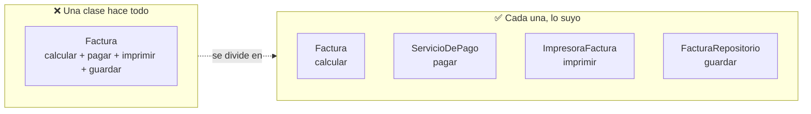
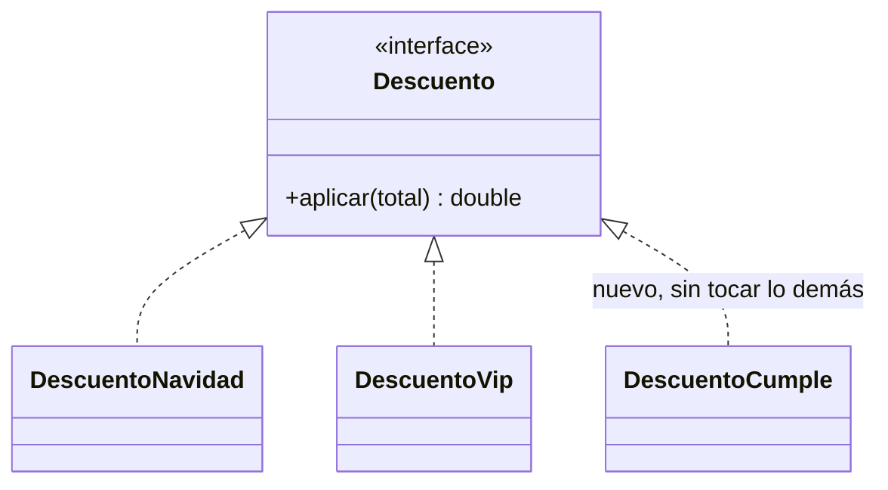
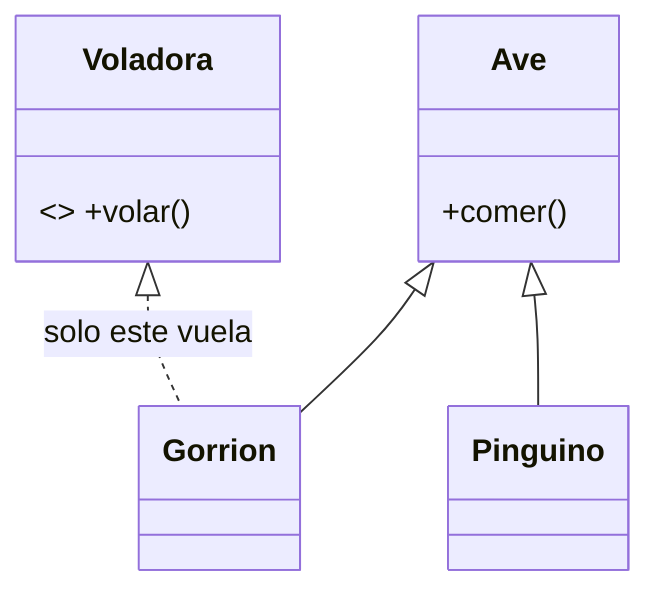
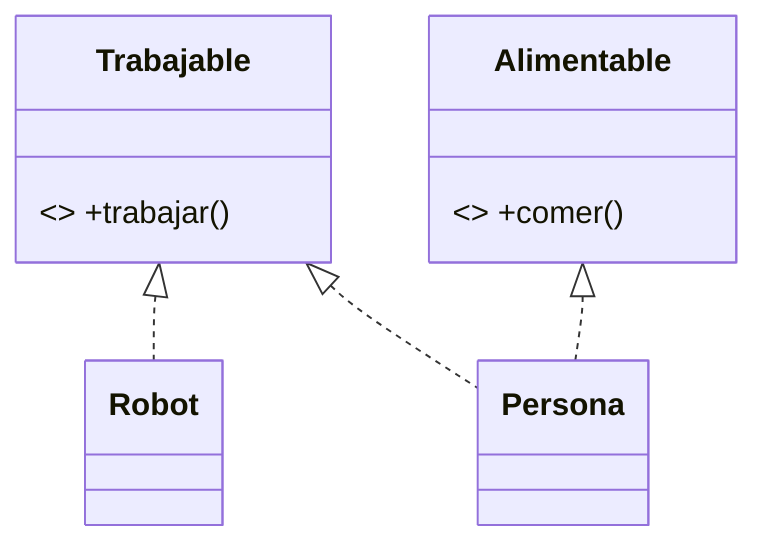
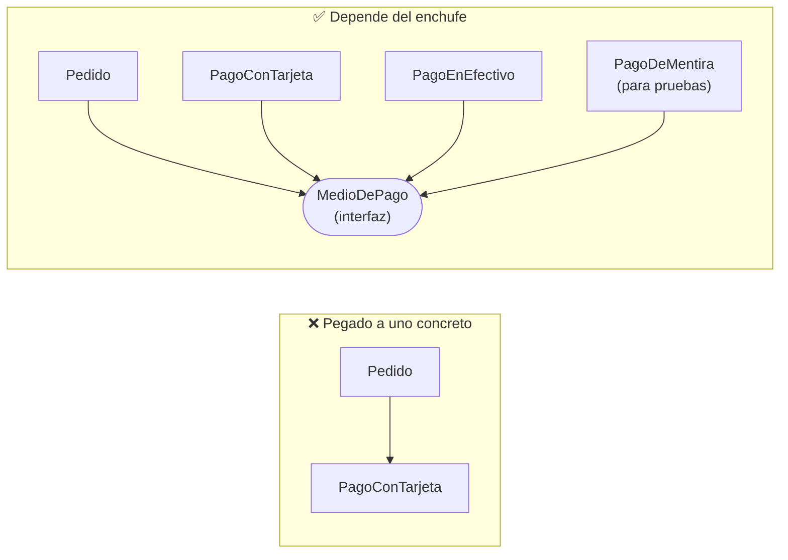
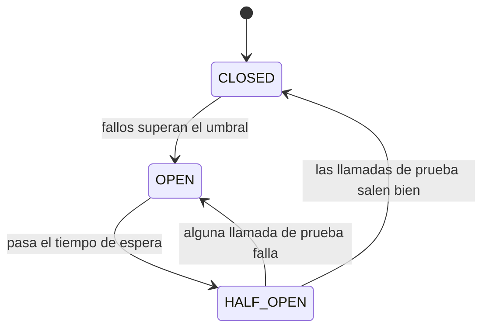
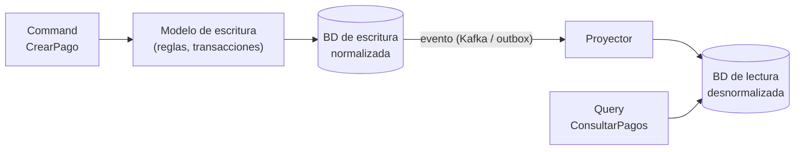
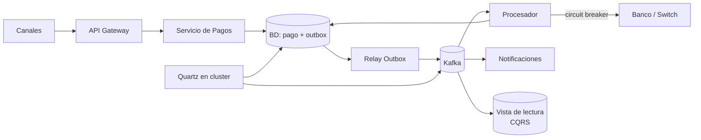
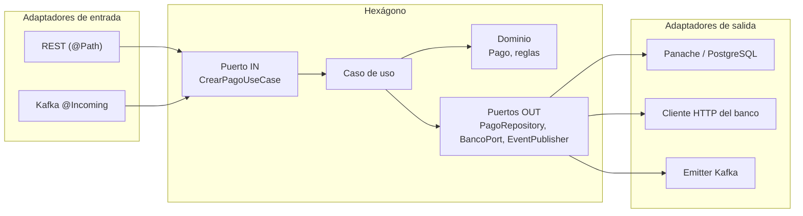

# Arkano — Senior Java Developer

> **Documento temporal de estudio.** Entrevista conversacional (te preguntan, tú explicas con tus palabras y das un ejemplo). Cuando el proceso cierre, mover a `archivo/` y registrar la retrospectiva en [`kaizen/`](../kaizen).

Java 17+ con **Quarkus** o Spring Boot, **Kafka con SmallRye Reactive Messaging**, **PostgreSQL con JPA/Hibernate**, **arquitectura hexagonal**, **resiliencia** y **testing con JUnit 5 y Mockito**, para una consultora que construye soluciones para clientes de la región.

> El job description original hablaba de Node.js, OWASP y Azure; **los temas que te confirmaron por WhatsApp son otros** (los de arriba). Para la técnica de hoy, **manda la lista de WhatsApp**. El resto de las secciones sirve de respaldo.

## Estado del proceso

| Etapa | Con quién | Foco | Estado |
|---|---|---|---|
| 1 · Competencias | Lourdes Moreno (Talent Acquisition) | Experiencia, habilidades, alineación con el rol | Hecha, avanzas |
| 2 · Evaluación técnica | Por confirmar: Lourdes no dijo quién (según lo que entendiste, un Tech Lead o Principal Engineer) | **Conversacional.** Temas confirmados por WhatsApp: Java 17+ con Quarkus/Spring Boot, Kafka con SmallRye Reactive Messaging, PostgreSQL con JPA/Hibernate, hexagonal, resiliencia, JUnit 5 y Mockito | **Agendada para hoy (14:00 o 15:00)** |
| 3 · Fit cultural | Por definir | Valores, forma de trabajo | Pendiente |
| 4 · Test de integridad | Plataforma externa | Aprobarlo cierra el proceso | Pendiente |

**Requisitos al final (excluyentes):** certificado de antecedentes financieros (score superior a 550 puntos, con informe), penales y judiciales sin registros. Conviene empezar a gestionarlos ya; no esperes a la etapa 4.

**Ritmo:** el proceso dura entre 4 y 10 días hábiles y hay urgencia. Prepárate como si la técnica pudiera caer esta misma semana.

---

## 🚨 Prioridad para hoy (lo que te confirmaron por WhatsApp)

> ⚡ **Para consultar en vivo y entrenar rápido:** [`cheat-sheet.md`](cheat-sheet.md): respuestas relámpago A-Z, repaso de Kafka para quien lo usó hace tiempo, tu proyecto de pagos en 5 frases y un **simulacro de 20 preguntas** con respuesta oculta. Esta guía es la profunda; el cheat sheet es la de bolsillo.

**Lista oficial de Lourdes:** Java 17+ con Quarkus o Spring Boot · Kafka con SmallRye Reactive Messaging o equivalente · PostgreSQL con JPA/Hibernate · Arquitectura hexagonal · Resiliencia · Testing con JUnit 5 y Mockito.

| # | Tema que evaluarán | Aquí (resumen y preguntas) | Detalle |
|---|---|---|---|
| 1 | **Java 17+ con Quarkus / Spring Boot** | [20 · Java 17+ y Quarkus](#s20) | [`frameworks/quarkus/`](../../frameworks/quarkus), [`frameworks/spring-boot/`](../../frameworks/spring-boot), [`java-core/`](../../java-core) |
| 2 | **Kafka con SmallRye Reactive Messaging** | [21 · SmallRye + Kafka](#s21), [06 · Kafka](#s06) | [`smallrye-reactive-messaging.md`](../../frameworks/quarkus/smallrye-reactive-messaging.md), [`messaging-streaming/kafka.md`](../../messaging-streaming/kafka.md) |
| 3 | **PostgreSQL con JPA/Hibernate** | [22 · JPA, Hibernate y PostgreSQL](#s22) | [`persistencia-hibernate-postgresql.md`](../../frameworks/quarkus/persistencia-hibernate-postgresql.md) |
| 4 | **Arquitectura hexagonal** | [23 · Hexagonal](#s23) | [`software-architectures/hexagonal-architecture.md`](../../software-architectures/hexagonal-architecture.md) |
| 5 | **Resiliencia** | [16 · Resiliencia](#s16), [24 · En Quarkus](#s24) | [`microservices-patterns/`](../../microservices-patterns) |
| 6 | **Testing: JUnit 5 y Mockito** | [25 · Testing](#s25) | [`tdd/junit5-mockito.md`](../../tdd/junit5-mockito.md) |

**¿Y la programación reactiva / WebFlux?** No está en la lista, pero **SmallRye Reactive Messaging y Quarkus son reactivos por debajo** (Mutiny: `Uni` y `Multi`, equivalentes a `Mono` y `Flux`). Basta con saber **qué es, por qué existe y cuándo usarla**; ver [20](#s20) y [21](#s21). No necesitas dominar operadores. Si te preguntan, tu base de WebFlux ([`webflux.md`](../../frameworks/spring-boot/webflux.md)) aplica casi 1 a 1.

**Tus 2 servicios de producción en el banco (transferencias asíncronas con Kafka/Event Hubs), con revisión crítica y rediseño, y su versión en Azure, AWS y GCP (Service Bus + Event Hubs + Durable Functions):** [`caso-transferencias-asincronas.md`](../../system-design/caso-transferencias-asincronas.md). **Tu práctica con Kafka:** tienes 4 pruebas de concepto (cliente Java, Spring Kafka, Spring Cloud Stream, multi-binder con Azure Event Hubs): [`practica-kafka-ejercicios.md`](../../messaging-streaming/practica-kafka-ejercicios.md). **Kafka vs RabbitMQ vs cola:** [`messaging-streaming/README.md` sección 5b](../../messaging-streaming/README.md#5b-kafka-vs-rabbitmq-vs-cola-gestionada-la-pregunta-clásica).

**Sobre lo que NO conoces ("SmallRye"):** no lo has usado y está bien. La lista dice **"o equivalente"**: tu experiencia con `spring-kafka` cuenta. Dilo así: *"Con Spring usé `@KafkaListener` y `KafkaTemplate`; SmallRye es el equivalente en Quarkus con `@Incoming` y `Emitter`, y los conceptos (grupos, offsets, DLQ, idempotencia) son los mismos."* (solo si es verdad).

**Qué se sabe del proceso de Arkano (Glassdoor):** hay solo **3 reseñas** públicas, 67% con experiencia positiva y dificultad promedio **2,3 sobre 5**; **ninguna trae preguntas técnicas**. No hay un banco de preguntas reales de Arkano; lo más fiable es la lista de Lourdes. Para ese tipo de rol, una entrevista de ese estilo suele combinar fundamentos de Java, el framework, base de datos, pruebas y diseño, y pedirte ejemplos de tu experiencia.

### Plan para hoy (con el tiempo que haya antes de las 14:00)

| Orden | Qué | Cuánto | Cómo |
|---|---|---|---|
| 1 | Secciones **20 a 25** de esta guía: solo las cápsulas "con manzanas" y las escaleras de respuesta | 60 min | Responde en voz alta, una capa por vez |
| 2 | **Equivalencias Spring → Quarkus** ([20](#s20)) | 15 min | Memoriza la tabla |
| 3 | **Kafka: garantías, ack/commit/DLQ** ([21](#s21) y [06](#s06)) | 30 min | Explica a un "compañero imaginario" |
| 4 | **Hibernate: N+1, lazy, transacciones, `@Version`** ([22](#s22)) | 20 min | |
| 5 | **Tu proyecto de pagos** ([19](#s19)): historia de 3 minutos | 20 min | Es tu mejor ejemplo para casi cualquier tema |
| 6 | Respirar y revisar las preguntas para hacerles ([14](#s14)) | 10 min | |

**Antes de que empiece:** pregunta si la entrevista es con stack **Quarkus o Spring**, y qué ven más en el proyecto. Te ayuda a enfocar y es una buena pregunta.

---

## Cómo estudiar esta guía (de junior a senior)

**Regla del repo:** todo se explica primero **con manzanas** (la analogía de la frutería, ver [`glosario.md`](../../messaging-streaming/glosario.md)) y después con el detalle técnico. Si no puedes contarlo con manzanas, todavía no lo entiendes lo bastante para contarlo en una entrevista.

**Tres pasadas:**

| Pasada | Objetivo | Cómo |
|---|---|---|
| 1 · 🟢 Junior | Entender **qué es** y **para qué sirve** | Lee la cápsula "con manzanas" de cada tema y explícalo en una frase |
| 2 · 🟡 Mid | Saber **cómo se usa** y qué falla | Tablas de configuración, ejemplos de código, errores típicos |
| 3 · 🔴 Senior | Defender **por qué** y a qué costo | Trade-offs, alternativas, límites, "cuándo no usarlo" |

**En la entrevista, la respuesta sube de nivel por capas.** Empieza simple y baja al detalle solo si te lo piden. Ejemplos:

| Pregunta | 🟢 Respuesta junior (la primera frase) | 🟡 Añade (mid) | 🔴 Cierra (senior) |
|---|---|---|---|
| **¿Qué es un Circuit Breaker?** | "Corta las llamadas a un servicio que está fallando, para no seguir intentando. Es como el fusible de la casa." | "Tiene tres estados: cerrado, abierto y semiabierto. Abre al superar un umbral de fallos, espera y prueba unas pocas llamadas." | "Lo combino con timeout, bulkhead y reintentos idempotentes con backoff; el fallback debe ser honesto; ajusto el umbral con la latencia p99 real y lo monitoreo con métricas y alertas." |
| **¿Cómo garantiza Kafka el orden?** | "Solo dentro de una partición. Si quiero el orden de las ventas de un cliente, uso al cliente como key." | "La key decide la partición con un hash; con idempotencia activada, los reintentos no desordenan." | "No hay orden global; un key muy popular crea una *hot partition*; cambiar el número de particiones rompe el reparto histórico, así que lo dimensiono desde el inicio." |
| **¿Cómo evitas cobrar dos veces?** | "Con un identificador único por pago, como el número de ticket: si llega dos veces, reconozco que es el mismo." | "Idempotency-Key con restricción única, estado condicional (`UPDATE ... WHERE estado='EN_PROCESO'`) y consumidor idempotente." | "Todo es *at-least-once*, así que lo hago en cada capa: API, consumidor y llamada al banco; y ante un timeout del banco el estado es `PENDIENTE_CONFIRMACION`: consulto o concilio, nunca reintento a ciegas." |
| **¿Por qué Quartz y no `@Scheduled`?** | "Porque con varias instancias `@Scheduled` corre en todas; Quartz tiene una sola agenda y reparte." | "Persiste en base de datos, tiene cluster, misfire y programación dinámica." | "A cambio, los locks de BD limitan la escala; hoy usaría un scheduler gestionado y un disparo por pago, y migraría por partes con Strangler Fig." |

**Cómo usarlo:** practica cada respuesta en voz alta, **una capa por vez**. Un entrevistador junior se queda en la primera; un Principal Engineer te hará bajar hasta la tercera.

---

<a id="s01"></a>

## 01 · La empresa en 2 minutos

- **Qué es:** consultora de TI uruguaya (fundada a fines de 2006), partner de Microsoft. Las fuentes difieren en las cifras: **"más de 18 años" y "más de 100 personas"** en una versión de la vacante, **"20 años" y "+200 personas"** en LinkedIn; con equipos en Uruguay, Argentina, Chile, Perú, Paraguay, Colombia, México y más países. No cites una cifra exacta, di "casi 20 años" y "más de 100 personas".
- **Qué hace:** proyectos sobre **Azure, Dynamics 365 y Microsoft 365**, con foco en Cloud, Data e IA (Copilot, agentes, low-code).
- **Clientes (según prensa):** Unilever, Coca-Cola, Deloitte, YPF, Falabella, Ternium, Scotiabank. Sectores: recursos naturales, manufactura, servicios financieros, farma, retail.
- **Modelo:** consultoría y staff augmentation. Entras a un proyecto de un cliente, con equipos regionales y multiculturales.
- **Lo que ofrecen:** certificaciones Microsoft pagadas al 100%, evaluación cada 6 meses, remoto o híbrido (en ciudades con oficinas), bono por referidos y herramienta de trabajo provista o subsidio para adquirirla.
- **Competencia:** más de 100 personas aplicaron a la vacante. Lo que diferencia es **explicar con claridad y respaldar con un proyecto real**, no recitar definiciones.

**Qué implica para la entrevista:**
1. **Azure pesa mucho.** Es su identidad. Aunque el rol sea Java, espera preguntas sobre cómo despliegas y consumes servicios en Azure.
2. **Perfil de consultor.** Comunicarte con el cliente, explicar decisiones y adaptarte a stacks heredados importa tanto como la técnica.
3. **Calidad y seguridad como disciplina**: pruebas, código limpio, OWASP, documentación de APIs.

> Sobre Yape: el link que pegaste es de Yape, pero la vacante es de Arkano y en la web de Yape no hay mención a Arkano. Si en la entrevista te dicen que el proyecto es para un cliente en concreto, anótalo y estudia ese dominio. Si no, ignóralo.

---

<a id="s02"></a>

## 02 · Mapa del job description → qué estudiar

> Este mapa sale del **job description original**. Los temas confirmados para la técnica están en [🚨 Prioridad para hoy](#-prioridad-para-hoy-lo-que-te-confirmaron-por-whatsapp); usa este mapa como respaldo.

| Requisito del JD | Prioridad | Aquí en esta guía | Para profundizar |
|---|---|---|---|
| 4+ años backend, Java sólido | Alta | [03 · Java](#s03) | [`java-core/`](../../java-core) |
| Servicios RESTful y APIs | Alta | [05 · REST](#s05) | [`frameworks/spring-boot/`](../../frameworks/spring-boot) |
| Patrones de diseño y código limpio | Alta | [04 · SOLID y patrones](#s04) | [`design-pattern/`](../../design-pattern), [`clean-code/`](../../clean-code), [`solid-principles/`](../../solid-principles) |
| Kafka (streaming de eventos) | Alta | [06 · Kafka](#s06) | [`messaging-streaming/kafka.md`](../../messaging-streaming/kafka.md) (cluster, KRaft, topics, payload, headers, banca) y [`messaging-streaming/`](../../messaging-streaming) (cuándo elegir cada tecnología) |
| OWASP Top 10 | Alta | [07 · OWASP](#s07) | [`frameworks/spring-boot/security.md`](../../frameworks/spring-boot/security.md) |
| Resiliencia (Circuit Breaker, Retry, Bulkhead) | Alta, la suele preguntar un Tech Lead | [16 · Resiliencia](#s16) | [`microservices-patterns/`](../../microservices-patterns) |
| Decisiones de arquitectura y trade-offs | Alta, nivel Principal Engineer | [17 · Arquitectura](#s17) | [`software-architectures/`](../../software-architectures) |
| CQRS y Saga/Outbox como patrones de arquitectura | Alta, nivel Principal Engineer | [17 · Arquitectura](#s17) | [`ddd/cqrs.md`](../../ddd/cqrs.md), [`microservices-patterns/`](../../microservices-patterns) |
| Jobs programados y disparadores (Quartz) | Media, sale por experiencia previa en pagos | [18 · Quartz](#s18) | [`messaging-streaming/quartz-scheduler.md`](../../messaging-streaming/quartz-scheduler.md) |
| **System design de tu proyecto (pasarela de pagos)** | Alta: es tu historia de experiencia | [19 · System design](#s19) | [`system-design/caso-pasarela-pagos.md`](../../system-design/caso-pasarela-pagos.md) y su versión cloud: [`caso-pasarela-pagos-cloud.md`](../../system-design/caso-pasarela-pagos-cloud.md) |
| Node.js (+2 años) | Media | [08 · Node.js](#s08) | [`frameworks/nestjs/`](../../frameworks/nestjs) |
| Azure (Functions, Service Bus, APIM, AKS, DevOps) | Media | [09 · Azure](#s09) | [`cloud-aws/`](../../cloud-aws) para comparar |
| Pruebas unitarias e integración, agilidad | Media | [10 · Pruebas y agilidad](#s10) | [`tdd/`](../../tdd) |
| GraphQL (deseable) | Baja | [11 · GraphQL](#s11) | Solo aquí |
| Sistemas heredados y bases de datos (plus) | Plus | [12 · Legacy y BD](#s12) | [`system-design/02-databases-sql-vs-nosql.md`](../../system-design/02-databases-sql-vs-nosql.md) |
| Competencias y fit | Media | [13 · STAR](#s13), [14 · Preguntas a ellos](#s14) | |

**Búsqueda rápida durante la prueba:** [Circuit Breaker](#s16) · [SOLID](#s04) · [Patrones GoF](#s04) · [Garantías de entrega Kafka](#s06) · [OWASP](#s07) · [Saga y Outbox](#s17) · [Azure vs AWS](#s09) · [N+1](#s12) · [CQRS](#s17) · [Quartz](#s18) · [Pasarela de pagos](#s19) · [Plan de estudio](#s15)

---

<a id="s03"></a>

## 03 · Java: lo que te van a preguntar

> ⚡ **Versión de bolsillo con POO completa, dibujos y ejemplos de manzanas:** [`cheat-sheet.md` sección 1](cheat-sheet.md#c1) (clase, objeto, atributo, variables, los 4 pilares, sobrecarga vs sobrescritura, abstracta vs interfaz, composición, `equals`/`hashCode`, colecciones, streams, Java 17/21, concurrencia y preguntas trampa).

Formato: **pregunta → respuesta corta que puedes decir en voz alta → ejemplo**.

### ¿Qué experiencia tienes con Java y qué versiones usaste?
Responde con tu experiencia real (proyectos, versión, tamaño del equipo). Si preguntan qué cambió entre versiones, estos son los hitos que importan:

| Versión | Qué trajo |
|---|---|
| 8 | Lambdas, Streams, `Optional`, `java.time` |
| 11 | `var` en lambdas, `HttpClient` estándar, LTS |
| 17 | Records, sealed classes, text blocks, pattern matching para `instanceof`, LTS |
| 21 | Virtual threads, pattern matching en `switch`, record patterns, sequenced collections, LTS |

Detalle en [`java-core/java-version-evolution.md`](../../java-core/java-version-evolution.md).

### Diferencia entre `==` y `equals()`; contrato `equals`/`hashCode`
`==` compara referencias; `equals()` compara contenido si se sobrescribe. Si dos objetos son `equals`, deben tener el mismo `hashCode`. Si lo rompes, un `HashMap` o `HashSet` no encuentra el objeto. Un record lo genera por ti.

### `ArrayList` vs `LinkedList`; `HashMap` por dentro
`ArrayList` accede por índice en O(1) y es lo que se usa casi siempre. `LinkedList` casi nunca gana en la práctica. `HashMap` calcula el índice con el hash de la clave, resuelve colisiones con lista y, desde Java 8, con árbol rojo-negro cuando el bucket crece. Promedio O(1). No es thread-safe: usa `ConcurrentHashMap`. Ver [`java-core/collections-and-streams.md`](../../java-core/collections-and-streams.md).

### ¿Cómo funciona el garbage collector?
Libera memoria de objetos inalcanzables. La memoria se divide en generaciones (young y old), porque la mayoría de los objetos muere joven. G1 es el colector por defecto, ZGC apunta a pausas muy bajas. Una fuga de memoria en Java es mantener referencias que ya no necesitas (caches estáticos, listeners sin remover).

### `Optional`, Streams, `CompletableFuture`
- `Optional` se usa como tipo de retorno para expresar "puede no haber valor". No va en campos ni en parámetros.
- Streams: pipeline declarativo (`filter`, `map`, `collect`). Son lazy: no se ejecuta nada hasta la operación terminal.
- `CompletableFuture` compone tareas asíncronas (`thenApply`, `thenCompose`, `allOf`). Con Java 21, los virtual threads permiten escribir código bloqueante simple con alta concurrencia.

### Checked vs unchecked exceptions
Checked: el compilador te obliga a manejarlas, para errores recuperables. Unchecked (`RuntimeException`): errores de programación o situaciones donde el llamador no puede hacer nada. En servicios REST, centraliza el manejo en un `@ControllerAdvice` y devuelve errores consistentes sin filtrar detalles internos (conecta con OWASP).

### Concurrencia: `synchronized`, `volatile`, deadlock
`synchronized` da exclusión mutua. `volatile` garantiza visibilidad, no atomicidad. Deadlock: dos hilos esperan locks que el otro tiene; se evita con un orden consistente de adquisición. Prefiere estructuras inmutables y `java.util.concurrent` antes que locks manuales.

### Pregunta de experiencia típica
*"Cuéntame un problema de rendimiento que resolviste."* Prepara una historia con la estructura **situación → cómo lo mediste → causa → solución → resultado con números**. Un ejemplo creíble: consulta N+1 con JPA, resuelta con `fetch join` o un `@EntityGraph`, y p95 de 1.8 s a 250 ms. Usa un caso real tuyo, no este.

---

<a id="s04"></a>

## 04 · SOLID, patrones y código limpio

### Los 5 principios, explicados simple

> Misma explicación que en el [cheat sheet 1.15](cheat-sheet.md#c1) (código malo, código bueno y dibujos).

**Para qué sirve SOLID, en palabras de la calle:** son 5 reglas para que el código **se pueda cambiar sin romper otras cosas**. Imagina una frutería: si el cajero también cuenta el dinero, empaca, limpia y hace la contabilidad, cuando falle algo no sabes por dónde empezar. SOLID es poner **a cada uno a hacer lo suyo**.

| Letra | Nombre | En una frase simple |
|---|---|---|
| **S** | Responsabilidad única | **Cada clase hace UNA sola cosa** |
| **O** | Abierto/Cerrado | Para agregar algo nuevo, **agregas una clase; no editas lo que ya funciona** |
| **L** | Liskov | Si un hijo reemplaza al padre, **todo debe seguir funcionando** |
| **I** | Interfaces pequeñas | **No obligues a nadie a hacer cosas que no le corresponden** |
| **D** | Dependencias hacia el "enchufe" | **Depende de un enchufe (interfaz), no de un aparato concreto** |

#### S · Responsabilidad única: "cada clase, una sola cosa"

**El problema:** tengo una clase `Factura` que **calcula**, **cobra**, **imprime** y **guarda en la base de datos**. Si mañana cambia el formato de impresión, tengo que **abrir la misma clase** donde está la lógica de cobro, y puedo romperla sin querer.

```java
// ❌ MALO: una clase que hace de todo
class Factura {
    double calcularTotal() { ... }
    void pagar()           { ... }
    void imprimir()        { ... }
    void guardarEnBD()     { ... }
}
```

```java
// ✅ BUENO: cada clase hace UNA cosa
class Factura          { double calcularTotal() { ... } }   // solo datos y cálculo
class ServicioDePago   { void pagar(Factura f)  { ... } }   // solo cobrar
class ImpresoraFactura { void imprimir(Factura f) { ... } } // solo imprimir
class FacturaRepositorio { void guardar(Factura f) { ... } } // solo guardar
```



**Cómo darte cuenta:** describe la clase en voz alta. Si dices **"y"** ("calcula **y** cobra **y** imprime"), hay que dividirla.
**🍎 Con manzanas:** el cajero cobra, el empacador empaca y el contador anota. Si el empacador cambia de método, el cajero ni se entera.

#### O · Abierto/Cerrado: "agregas, no editas"

**El problema:** calculo descuentos con una cadena de `if`. Cada descuento nuevo me obliga a **abrir y editar** código que ya funcionaba, y cada edición puede romperlo.

```java
// ❌ MALO: cada descuento nuevo = editar este método
double descuento(String tipo, double total) {
    if (tipo.equals("NAVIDAD")) return total * 0.10;
    else if (tipo.equals("VIP")) return total * 0.20;
    // y mañana otro más...
}
```

```java
// ✅ BUENO: cada descuento nuevo = una clase nueva. Lo anterior no se toca.
interface Descuento { double aplicar(double total); }
class DescuentoNavidad implements Descuento { public double aplicar(double t) { return t * 0.10; } }
class DescuentoVip     implements Descuento { public double aplicar(double t) { return t * 0.20; } }
// mañana: class DescuentoCumple implements Descuento { ... }  ← no editas nada de lo que ya funciona
```



**Cómo darte cuenta:** si para agregar un caso nuevo tienes que **modificar un `if` o un `switch` que ya existe**, rompes este principio. *(Este patrón se llama **Strategy**.)*
**🍎 Con manzanas:** un descuento nuevo es **una tarjeta nueva en la caja**; no hay que desarmar la caja registradora.

#### L · Liskov: "el reemplazo no debe romper nada"

**El problema:** si digo "un `Pingüino` es un `Ave`", pero el `Ave` sabe `volar()` y el pingüino no, **cualquier código que mande volar a un ave se rompe** cuando recibe un pingüino.

```java
// ❌ MALO: el hijo no puede cumplir lo que promete el padre
class Ave { void volar() { ... } }
class Pinguino extends Ave { void volar() { throw new RuntimeException("no puedo volar"); } }
```

```java
// ✅ BUENO: solo "vuelan" las que de verdad vuelan
class Ave { void comer() { ... } }
interface Voladora { void volar(); }
class Gorrion  extends Ave implements Voladora { public void volar() { ... } }
class Pinguino extends Ave { }          // no promete volar
```



**Cómo darte cuenta:** si un hijo **lanza error, no hace nada o hace algo raro** en un método heredado, no debería heredar de ese padre.
**🍎 Con manzanas:** si la receta pide "una fruta con jugo" y te dan una que no tiene jugo, la receta falla. **Un reemplazo tiene que servir para lo mismo.**

#### I · Interfaces pequeñas: "no obligues a nadie a hacer lo que no le toca"

**El problema:** una interfaz `Trabajador` obliga a **trabajar y comer**. Si un `Robot` la implementa, **tiene que inventar un `comer()`** que no tiene sentido.

```java
// ❌ MALO: una interfaz grande obliga a todos a todo
interface Trabajador { void trabajar(); void comer(); }
class Robot implements Trabajador {
    public void trabajar() { ... }
    public void comer()    { /* un robot no come... ¿qué pongo aquí? */ }
}
```

```java
// ✅ BUENO: interfaces chicas; cada clase firma solo lo suyo
interface Trabajable { void trabajar(); }
interface Alimentable { void comer(); }
class Robot   implements Trabajable { public void trabajar() { ... } }
class Persona implements Trabajable, Alimentable { /* ambas */ }
```



**Cómo darte cuenta:** si al implementar una interfaz dejas métodos **vacíos o con "no soportado"**, la interfaz es demasiado grande: pártela.
**🍎 Con manzanas:** el contrato del cajero no debería obligarlo a "cargar camiones".

#### D · Dependencias hacia el enchufe: "usa el enchufe, no el aparato"

**El problema:** mi `Pedido` crea por dentro un `PagoConTarjeta` con `new`. Si mañana quiero pagar con efectivo, o **probar sin cobrar de verdad**, tengo que **cambiar `Pedido`**.

```java
// ❌ MALO: Pedido está pegado a UNA forma de pago
class Pedido {
    private PagoConTarjeta pago = new PagoConTarjeta();
    void cobrar() { pago.cobrar(); }
}
```

```java
// ✅ BUENO: Pedido pide "un medio de pago" (el enchufe); le dan el que sea
interface MedioDePago { void cobrar(); }
class PagoConTarjeta implements MedioDePago { public void cobrar() { ... } }
class PagoEnEfectivo implements MedioDePago { public void cobrar() { ... } }

class Pedido {
    private final MedioDePago pago;
    Pedido(MedioDePago pago) { this.pago = pago; }     // se lo dan desde afuera
    void cobrar() { pago.cobrar(); }
}
// En las pruebas le pasas un MedioDePago de mentira (un mock): no cobras de verdad.
```



**Cómo darte cuenta:** si dentro de una clase ves `new` de una clase concreta de **otra capa** (base de datos, banco, correo), está pegada a ella.
**🍎 Con manzanas:** la caja usa **"un lector de pagos"**, el que sea; no solo la marca X. En las pruebas le pones un lector de mentira. *(Esto es lo que usan Spring y Quarkus al "inyectar dependencias".)*

#### Cómo responderlo en la entrevista (30 segundos)

> "SOLID son cinco reglas para que el código se pueda cambiar sin romper otras partes. **S**: cada clase hace una sola cosa; por ejemplo, separo `Factura` de quien la paga y de quien la imprime. **O**: para agregar algo nuevo agrego una clase, no edito la que ya funciona; por ejemplo, un descuento nuevo es una clase nueva. **L**: un hijo debe poder reemplazar al padre sin romper nada. **I**: interfaces pequeñas, para que nadie implemente lo que no usa. **D**: las clases dependen de interfaces y no de implementaciones concretas, y así puedo cambiar de proveedor y hacer pruebas con mocks. **No son leyes:** aplicarlos de más produce código innecesariamente complicado."

**Trampa común:** querer aplicarlo todo desde el primer día. Si el programa es pequeño y simple, **no lo partas en diez clases** (principio KISS/YAGNI: no construyas lo que aún no necesitas).

**Las 3 preguntas que más caen:** *"¿Un ejemplo de SRP?"* → `Factura` con pagar e imprimir, dividida. *"¿Para qué sirve D?"* → poder cambiar de implementación y hacer pruebas con mocks. *"¿Qué relación tiene D con Spring o Quarkus?"* → la inyección de dependencias es aplicar D: el framework te entrega la implementación.

**"¿Para qué sirven?"** Para que el código sea fácil de cambiar, probar y entender cuando el sistema crece y el equipo rota. No son leyes: aplicarlos de más produce sobreingeniería (por eso existen KISS y YAGNI, ver [`clean-code/dry-kiss-yagni.md`](../../clean-code/dry-kiss-yagni.md)).

**Tu ejemplo propio:** prepara uno de tu trabajo real donde aplicaste DIP u OCP. Es lo que más convence.

### Patrones de diseño: las preguntas clásicas

**"¿Cuántos tipos de patrones de diseño hay?"**
Los del libro *Gang of Four* son **23**, en 3 categorías:

| Categoría | Cuántos | Para qué sirven | Patrones |
|---|---|---|---|
| **Creacionales** | 5 | Cómo se crean los objetos sin acoplarte a clases concretas | Factory Method, Abstract Factory, Builder, Prototype, Singleton |
| **Estructurales** | 7 | Cómo se componen clases y objetos en estructuras mayores | Adapter, Bridge, Composite, Decorator, Facade, Flyweight, Proxy |
| **De comportamiento** | 11 | Cómo se reparten responsabilidades y se comunican los objetos | Chain of Responsibility, Command, Interpreter, Iterator, Mediator, Memento, Observer, State, Strategy, Template Method, Visitor |

Además existen patrones **arquitectónicos** (Layered, Hexagonal, CQRS, Event Sourcing) y de **microservicios** (Saga, Outbox, Circuit Breaker, API Gateway), que no son del GoF pero se preguntan igual.

**"¿Qué patrones has usado y dónde?"** Elige 3 o 4 con un caso real. Esta tabla te da un caso de respaldo para cada uno:

| Patrón | Dónde lo aplicarías | Ejemplo en Java/Spring que ya conoces |
|---|---|---|
| **Strategy** | Reemplazar un `if/else` o `switch` por tipo: método de pago, cálculo de descuento, formato de exportación | Inyectar `List<PaymentStrategy>` o un `Map<String, PaymentStrategy>` en Spring y elegir por tipo |
| **Factory Method / Abstract Factory** | Crear objetos según contexto sin que el cliente conozca la clase concreta | `BeanFactory`, `Calendar.getInstance()`, `List.of(...)` |
| **Builder** | Objetos con muchos parámetros opcionales | `StringBuilder`, Lombok `@Builder`, `HttpRequest.newBuilder()` |
| **Singleton** | Una sola instancia compartida (config, pool). Cuidado: estado global y difícil de testear | Los beans de Spring son singleton por defecto, pero **gestionados por el contenedor**, que es mejor que un singleton manual |
| **Adapter** | Integrar un sistema heredado o una API externa con otra interfaz. **Muy relevante en este rol** | Un adaptador que traduce la respuesta SOAP de un legacy al modelo de tu dominio |
| **Decorator** | Añadir comportamiento sin modificar la clase: caché, logging, métricas | `BufferedReader` sobre `Reader`; un repositorio decorado con caché |
| **Proxy** | Controlar el acceso: carga perezosa, seguridad, transacciones | Spring AOP: `@Transactional` y `@Cacheable` funcionan con proxies; Hibernate lazy loading |
| **Facade** | Una interfaz simple sobre un subsistema complejo | Un servicio de aplicación que orquesta varios servicios internos detrás de un solo método |
| **Observer** | Notificar a varios interesados cuando algo cambia. Es la base de los eventos | `ApplicationEventPublisher` de Spring; a escala, Kafka |
| **Template Method** | Esqueleto fijo con pasos variables | `JdbcTemplate`, `RestTemplate`, clases abstractas de procesamiento por lotes |
| **Chain of Responsibility** | Una petición pasa por varios manejadores | Filtros de servlet, `SecurityFilterChain` de Spring Security |
| **Command** | Encapsular una acción como objeto (deshacer, encolar, auditar) | `Runnable`, comandos en CQRS |
| **State** | El comportamiento cambia según el estado interno | Ciclo de vida de un pedido; **el Circuit Breaker es una máquina de estados** |
| **Repository** | Abstraer el acceso a datos del dominio | Spring Data `JpaRepository` |

**Preguntas de seguimiento que suelen venir:**
- *"¿Strategy vs State?"* Ambos delegan a un objeto intercambiable. En Strategy **el cliente elige** el algoritmo; en State **el objeto cambia solo** de comportamiento según su estado.
- *"¿Adapter vs Facade vs Decorator vs Proxy?"* Adapter cambia una interfaz por otra; Facade simplifica una interfaz compleja; Decorator añade comportamiento con la misma interfaz; Proxy controla el acceso con la misma interfaz.
- *"¿Cuándo NO usar un patrón?"* Cuando el problema no existe todavía. Aplicar patrones por anticipado es sobreingeniería (YAGNI). Un patrón es un nombre común para una solución, no un objetivo.
- *"¿Singleton es un antipatrón?"* Manual, muchas veces sí: estado global, hilos, tests difíciles. Gestionado por un contenedor de inyección de dependencias, no.
- *"¿Un patrón que hayas usado y te haya salido mal?"* Prepara una historia honesta de sobreingeniería y lo que aprendiste.

Detalle de cada patrón en [`design-pattern/`](../../design-pattern). Interpreter, Mediator, Memento, Observer, State y Template Method todavía no están documentados allí: con lo de arriba alcanza para una entrevista conversacional, pero conviene ampliarlo después.

### Código limpio en una respuesta
Nombres que revelan intención, funciones pequeñas con un solo nivel de abstracción, sin duplicación (DRY) pero sin abstraer demasiado pronto, pocos parámetros, errores con excepciones y no con códigos de retorno, y tests que documentan el comportamiento. Ver [`clean-code/`](../../clean-code).

---

<a id="s05"></a>

## 05 · REST y diseño de APIs

- **Verbos:** `GET` seguro e idempotente, `PUT` idempotente (reemplaza), `PATCH` actualización parcial, `DELETE` idempotente, `POST` no idempotente.
- **Códigos:** 200, 201 (con `Location`), 204, 400, 401 (no autenticado), 403 (sin permiso), 404, 409 (conflicto), 422, 429 (rate limit), 500, 503.
- **Idempotencia en pagos o creaciones:** cabecera `Idempotency-Key` para que un reintento no duplique la operación.
- **Versionado:** en la URL (`/v1/`) o por cabecera. Lo importante es no romper a los clientes: cambios compatibles hacia atrás.
- **Paginación:** por `offset/limit` o, mejor para datasets grandes, por cursor.
- **Documentación:** OpenAPI/Swagger. El JD lo pide explícitamente ("documentación para facilitar la integración de APIs").
- **Errores consistentes:** formato único, idealmente Problem Details (RFC 9457), sin stack traces.
- **Spring Boot:** controladores finos, lógica en servicios, DTOs en la frontera, validación con Bean Validation (`@Valid`). Ver [`frameworks/spring-boot/`](../../frameworks/spring-boot).

---

<a id="s06"></a>

## 06 · Kafka (estudia esto con cuidado)

> Aquí queda lo esencial para consultar rápido. El detalle completo está en [`messaging-streaming/kafka.md`](../../messaging-streaming/kafka.md) y la comparación de tecnologías de mensajería en [`messaging-streaming/README.md`](../../messaging-streaming).

### Cuándo elegir cada tecnología (cola, pub/sub o log)

| Necesito… | Elijo |
|---|---|
| Repartir tareas entre workers, ack por mensaje | Cola: SQS, RabbitMQ, Service Bus queue |
| Un hecho que interesa a varios sistemas | Pub/Sub: SNS+SQS, Service Bus topics, o Kafka |
| Releer, auditar, reprocesar, orden por entidad, alto volumen | **Log: Kafka / Event Hubs** |
| Integrarme con un core bancario o mainframe | IBM MQ / JMS |
| No administrar infraestructura | Servicio gestionado (Service Bus, Event Hubs, SQS) |

Diferencia clave: en una cola el mensaje es una **tarea que se consume y desaparece**; en un log es un **hecho que se conserva** y varios consumidores lo leen con su propio offset.

### Qué es y para qué sirve
Plataforma distribuida de **log de eventos**. Los productores escriben eventos a *topics*, los consumidores los leen a su ritmo. Los eventos se retienen por tiempo configurable, así que se pueden releer. Sirve para desacoplar servicios, mover datos entre sistemas y procesar streams en tiempo real.

### Conceptos que no pueden fallar

| Concepto | Qué decir |
|---|---|
| **Topic** | Categoría o feed de eventos. |
| **Partition** | Un topic se divide en particiones. Es la unidad de paralelismo. **El orden solo se garantiza dentro de una partición.** |
| **Key** | La clave del mensaje decide la partición (hash). Mismos eventos de un cliente, misma key, mismo orden. |
| **Offset** | Posición de un mensaje dentro de la partición. |
| **Broker / Cluster** | Servidor Kafka / conjunto de brokers. |
| **Replication factor** | Copias de cada partición (típico 3). Hay un líder y réplicas seguidoras. |
| **ISR** | In-Sync Replicas: réplicas al día con el líder. |
| **Consumer group** | Consumidores que se reparten las particiones del topic. Cada partición la lee un solo consumidor del grupo. |

Una regla útil: **más consumidores que particiones en un grupo = consumidores ociosos.** El paralelismo máximo es el número de particiones.

### Semánticas de entrega (pregunta clásica)
- **At-most-once:** puedes perder mensajes (commit antes de procesar).
- **At-least-once:** no pierdes, pero puede haber duplicados (commit después de procesar). **Es lo más común**, y obliga a que el consumidor sea **idempotente**.
- **Exactly-once:** productor idempotente (`enable.idempotence=true`) más transacciones. Funciona dentro de Kafka (consume-transform-produce); con sistemas externos sigues necesitando idempotencia propia.

### Configuración del productor para no perder datos
`acks=all` (espera a todas las réplicas en sync), `min.insync.replicas=2`, `retries` altos, `enable.idempotence=true`. Compromiso: más latencia a cambio de durabilidad.

### Consumidor: offsets y errores
- Si `enable.auto.commit=true`, puedes confirmar mensajes que luego fallan. Para control, commit manual después de procesar.
- **Rebalanceo:** cuando entra o sale un consumidor, se reasignan particiones y hay una pausa breve.
- **Mensajes venenosos:** reintentos con backoff y, si siguen fallando, **Dead Letter Topic** para no bloquear la partición.
- **Consumer lag:** diferencia entre el último offset y el consumido. Es la métrica clave para monitorear.

### Arquitectura en 30 segundos (banca incluida)

- **Cluster** = varios brokers (mínimo 3). Cada **topic** se parte en **particiones**, y cada partición se **replica** (RF=3) con un líder y seguidoras.
- **ZooKeeper → KRaft:** antes un cluster aparte coordinaba los metadatos; ahora un quórum de controladores con Raft dentro de Kafka lo hace (ZooKeeper desapareció en Kafka 4.0).
- **Registro:** `key` (decide la partición y el orden), `value` (payload en JSON, Avro o Protobuf), `headers` (metadatos: correlationId, tipo de evento, versión del esquema, traza) y `timestamp`; Kafka añade offset y partición.
- **Banca:** `acks=all`, RF=3, `min.insync.replicas=2`, idempotencia, commit manual, consumidor idempotente con `eventId`, key = cuenta, dinero como string decimal, sin datos sensibles en claro, TLS/SASL/ACLs, DLT y lag monitoreado. Casos: transacciones, antifraude, notificaciones, CDC del core, auditoría, conciliación.

### Cómo garantizar el orden
Usa una key que agrupe lo que debe ir ordenado (por ejemplo, el id del pedido). Con reintentos puede romperse el orden si `max.in.flight.requests.per.connection > 1` sin idempotencia; con idempotencia activada se mantiene.

### Patrón Outbox (conecta con microservicios)
Problema: guardas en la base de datos y publicas a Kafka; si falla uno de los dos, quedas inconsistente (no hay transacción distribuida). Solución: en la **misma transacción** guardas el dato y un registro en una tabla `outbox`; un proceso aparte (polling o CDC con Debezium) publica esos registros a Kafka. Resultado: at-least-once confiable.

### Kafka vs un broker de colas (RabbitMQ, Azure Service Bus)
| | Kafka | Service Bus / RabbitMQ |
|---|---|---|
| Modelo | Log persistente, consumidores leen por offset | Cola: el mensaje se consume y desaparece |
| Rejugar eventos | Sí | No (normalmente) |
| Throughput | Muy alto | Alto |
| Fortaleza | Streaming, eventos, análisis | Mensajería de comandos, colas de trabajo, sesiones, dead-letter integrado |

Para Azure, el equivalente gestionado es **Azure Event Hubs**, que además expone un endpoint compatible con el protocolo de Kafka. Dato muy útil para esta entrevista.

### El ecosistema (una línea cada uno, por si lo mencionan)

| Pieza | Qué es |
|---|---|
| **Kafka Connect** | Framework para mover datos entre Kafka y otros sistemas (bases de datos, S3, Elasticsearch) con conectores ya hechos, sin escribir código. Ej.: Debezium para CDC |
| **Kafka Streams** | Librería Java para procesar streams (filtros, agregaciones, joins, ventanas de tiempo) dentro de tu propia aplicación |
| **Schema Registry** | Guarda los esquemas (Avro, Protobuf, JSON Schema) de los mensajes y valida la **compatibilidad** al evolucionarlos, para no romper a los consumidores |
| **Log compaction** | Un topic puede conservar solo el último valor de cada key (útil como "tabla" de estado) en lugar de borrar por tiempo |
| **KRaft** | Modo moderno de Kafka que reemplaza a ZooKeeper para coordinar el cluster |

**Preguntas frecuentes de cierre:**
- *¿Qué pasa si un consumidor se cae?* Se hace un rebalanceo: sus particiones pasan a otro consumidor del grupo, que retoma desde el último offset confirmado.
- *¿Cuántas particiones elijo?* Según el paralelismo deseado de consumo y el throughput. Se pueden aumentar después, pero cambia el reparto por key (rompe el orden histórico por key), así que conviene estimarlo bien al inicio.
- *¿Cómo evoluciono el formato de un evento?* Cambios compatibles (añadir campos opcionales con valor por defecto), controlados por el Schema Registry; nunca renombrar o quitar campos de golpe.
- *¿Cuándo no usar Kafka?* Cola de trabajo simple con pocos mensajes, peticiones que requieren respuesta inmediata, o cuando el equipo no puede operar el cluster (en ese caso, un servicio gestionado como Event Hubs o un broker de colas).

### Con Java (Spring)
`spring-kafka`: `KafkaTemplate` para producir y `@KafkaListener` para consumir. Configura serializadores (JSON o Avro con Schema Registry) y un `DefaultErrorHandler` con reintentos y dead-letter.

### Tu respuesta si te preguntan "¿has usado Kafka?"
Sé honesto con el nivel. Si lo has usado poco, di qué sí sabes (conceptos de particiones, grupos, entrega, idempotencia) y qué harías en un caso real. Un conocimiento conceptual sólido con honestidad vale más que un "sí" que se cae a la segunda pregunta. El JD dice "familiaridad", no "experto".

---

<a id="s07"></a>

## 07 · OWASP Top 10

La lista que Arkano menciona es la clásica. **Verifica cuál versión usan** (la 2021 es la más conocida; existe una edición 2025 con cambios). Estudia las categorías con su defensa en Java.

### OWASP Top 10:2021

| # | Categoría | Qué es | Defensa en Java/Spring |
|---|---|---|---|
| A01 | Broken Access Control | Un usuario accede a datos o acciones que no le corresponden (IDOR, falta de chequeo de rol) | Autorización en el servidor, siempre; deny by default; `@PreAuthorize`; verificar que el recurso pertenezca al usuario |
| A02 | Cryptographic Failures | Datos sensibles sin cifrar o con cifrado débil | TLS en tránsito, hashing de contraseñas con BCrypt/Argon2, nada de MD5/SHA-1, secretos fuera del código |
| A03 | Injection | Datos del usuario interpretados como código (SQL, comandos, LDAP) | Consultas parametrizadas (`PreparedStatement`, JPA con parámetros nombrados), validación de entrada |
| A04 | Insecure Design | Fallas de diseño, no de implementación | Modelado de amenazas, límites de uso, principio de mínimo privilegio |
| A05 | Security Misconfiguration | Configuración por defecto, endpoints de depuración abiertos, mensajes de error detallados | Desactivar lo que no uses, restringir Actuator, cabeceras de seguridad, configuración por entorno |
| A06 | Vulnerable and Outdated Components | Dependencias con CVE conocidos | Dependabot/Renovate, OWASP Dependency-Check, `mvn dependency:tree`, actualizar con frecuencia |
| A07 | Identification and Authentication Failures | Contraseñas débiles, sesiones mal manejadas, sin MFA | MFA, límites de intentos, expiración de tokens, no filtrar si el usuario existe |
| A08 | Software and Data Integrity Failures | Pipelines o deserialización sin verificar | Firmar artefactos, evitar deserialización insegura (`ObjectInputStream` con datos externos), proteger el CI/CD |
| A09 | Security Logging and Monitoring Failures | No detectas ataques | Registrar eventos de seguridad, alertas, **sin loguear datos sensibles** |
| A10 | Server-Side Request Forgery (SSRF) | El servidor hace peticiones a URLs controladas por el atacante | Lista blanca de destinos, bloquear IPs internas y metadatos de la nube |

**Sobre la edición 2025:** según lo que conozco, añadió "Software Supply Chain Failures" como categoría propia y "Mishandling of Exceptional Conditions", e incorporó SSRF dentro de Broken Access Control. Confírmalo en [owasp.org/Top10](https://owasp.org/Top10/) antes de la entrevista y, si preguntan, menciona que conoces ambas.

### Respuestas cortas que suelen pedir
- **¿Cómo previenes SQL injection?** Consultas parametrizadas, nunca concatenar strings; además validar entrada y usar un usuario de BD con mínimos privilegios.
- **XSS:** escapar la salida según el contexto, `Content-Security-Policy`, cookies `HttpOnly`. En una API pura, el riesgo se traslada al frontend, pero igual no devuelvas HTML sin sanear.
- **CSRF:** relevante con sesiones por cookie (token CSRF, `SameSite`). Con JWT en cabecera `Authorization` y sin cookies, el riesgo es menor.
- **JWT:** validar firma, `exp`, `iss` y `aud`; no aceptar `alg: none`; vida corta y refresh tokens; no guardar datos sensibles en el payload (está codificado, no cifrado).
- **Manejo de secretos:** variables de entorno o un gestor (**Azure Key Vault** en este contexto), nunca en el repo.
- **Autenticación vs autorización:** quién eres vs qué puedes hacer. OAuth2 delega acceso; OpenID Connect añade identidad. En Azure, **Microsoft Entra ID** es el proveedor.

Detalle de Spring Security en [`frameworks/spring-boot/security.md`](../../frameworks/spring-boot/security.md).

---

<a id="s08"></a>

## 08 · Node.js (+2 años en el JD)

El rol mezcla Java y Node. Prepárate para comparar.

- **Event loop:** Node ejecuta JavaScript en un hilo, con I/O no bloqueante. Es excelente para I/O (APIs, gateways), malo para CPU intensiva (usa `worker_threads` o un servicio aparte).
- **Promesas y `async/await`:** manejo de errores con `try/catch`; `Promise.all` para paralelo, `Promise.allSettled` si no quieres que un fallo cancele todo.
- **Cuándo Java y cuándo Node:** Java para lógica de negocio pesada, tipado fuerte y ecosistema empresarial; Node para capas de integración, BFF y APIs ligeras con mucho I/O.
- **TypeScript** y **NestJS** (arquitectura por módulos, inyección de dependencias, parecido a Spring): ver [`frameworks/nestjs/`](../../frameworks/nestjs).

---

<a id="s09"></a>

## 09 · Azure (lo que Arkano vende)

No te piden ser experto, pero conoce el mapa y compáralo con lo que sabes de AWS.

| Servicio Azure | Para qué | Equivalente aproximado en AWS |
|---|---|---|
| **Azure Functions** | Funciones serverless por evento | Lambda |
| **Service Bus** | Colas y topics para mensajería empresarial | SQS + SNS |
| **Event Hubs** | Ingesta de eventos masiva, compatible con Kafka | Kinesis / MSK |
| **API Management (APIM)** | Gateway: autenticación, rate limit, versionado, políticas | API Gateway |
| **AKS** | Kubernetes gestionado | EKS |
| **Azure DevOps** | Repos, pipelines CI/CD, boards | CodePipeline + Jira |
| **Key Vault** | Secretos, claves y certificados | Secrets Manager / KMS |
| **Entra ID** | Identidad y acceso | Cognito / IAM |
| **Azure SQL / Cosmos DB** | Relacional gestionado / NoSQL multimodelo | RDS / DynamoDB |
| **App Service** | Hospedar web y APIs sin gestionar servidores | Elastic Beanstalk |

Una frase que te ubica bien: *"Mi experiencia fuerte de nube es en AWS, y los conceptos se mapean casi uno a uno: Functions con Lambda, Service Bus con SQS/SNS, APIM con API Gateway. Lo que haría es apoyarme en eso y en la certificación Microsoft que ustedes cubren para ponerme al día rápido."*

Si no has usado Azure, **no inventes**. Di qué conoces conceptualmente y que la curva es corta.

---

<a id="s10"></a>

## 10 · Pruebas, calidad y agilidad

- **Pirámide de tests:** muchos unitarios (rápidos, aislados), menos de integración (con BD real vía Testcontainers), pocos end-to-end.
- **Java:** JUnit 5, Mockito, AssertJ, Testcontainers, `@SpringBootTest` y `@WebMvcTest`.
- **TDD:** rojo → verde → refactor. Ver [`tdd/`](../../tdd).
- **Mocks vs fakes:** un mock verifica interacciones; un fake es una implementación simple y funcional (BD en memoria). Abusar de los mocks hace tests frágiles.
- **Contratos:** si el frontend y el backend se desarrollan en paralelo, pruebas de contrato (Pact) o un OpenAPI como fuente de verdad.
- **Agilidad:** Scrum (sprints, planning, daily, review, retro) y Kanban. Prepara un ejemplo de cómo aportaste en una retro o cómo manejaste un cambio de alcance a mitad de sprint.
- **Monitoreo (el JD lo pide):** logs estructurados, métricas (latencia p95/p99, tasa de error), trazas distribuidas (OpenTelemetry), health checks. En Azure: Application Insights.

---

<a id="s11"></a>

## 11 · GraphQL (deseable)

**Qué es:** un lenguaje de consulta para APIs. El cliente envía **una consulta** que describe exactamente los campos que necesita y recibe esa forma exacta de respuesta, normalmente a través de **un solo endpoint** (`POST /graphql`). Lo creó Facebook en 2012 y es una especificación abierta.

### REST vs GraphQL

| | REST | GraphQL |
|---|---|---|
| Endpoints | Muchos, uno por recurso | Uno |
| Forma de la respuesta | La define el servidor | La define el cliente |
| Over-fetching (te llegan campos que no usas) | Frecuente | No ocurre |
| Under-fetching (necesitas varias llamadas) | Frecuente | Una sola consulta anidada |
| Cache | Cache HTTP estándar, simple | Más complejo (casi todo es POST; se usa caché por campo/ID en el cliente) |
| Versionado | `/v1`, `/v2` | Evolución del esquema: añadir campos y marcar los viejos como `@deprecated` |
| Tipado | Opcional (OpenAPI) | Obligatorio y autodocumentado (esquema) |
| Mejor para | APIs públicas simples, CRUD, caché HTTP | Clientes variados (web, móvil), pantallas con datos de varias fuentes, BFF |

### Los conceptos que hay que saber

- **Esquema (SDL):** contrato tipado de lo que se puede pedir.
- **Query** (leer), **Mutation** (escribir), **Subscription** (tiempo real, normalmente por WebSocket).
- **Resolver:** función que sabe obtener el dato de cada campo. Aquí es donde viven los problemas de rendimiento.
- **Variables, fragments, directivas** (`@include`, `@skip`).

```graphql
type Libro { id: ID!  titulo: String!  autor: Autor! }
type Autor { id: ID!  nombre: String! }
type Query { libro(id: ID!): Libro }

# Consulta del cliente: solo pide lo que necesita
query { libro(id: "1") { titulo autor { nombre } } }
```

### Problemas clásicos (lo que pregunta un senior)

1. **N+1 en resolvers:** pides 50 libros y el resolver de `autor` hace 50 consultas. Solución: **DataLoader / batching** (agrupa los IDs en una sola consulta). En Spring: `@BatchMapping`.
2. **Consultas abusivas:** un cliente puede pedir un árbol enorme y tumbar el servidor. Defensas: **límite de profundidad**, **análisis de costo** de la consulta, límite de tamaño, timeouts, y desactivar *introspection* en producción si el esquema no es público.
3. **Seguridad (conecta con OWASP):** la autorización se aplica **por campo y por resolver**, no solo en el endpoint. El único endpoint no te exime de A01 (Broken Access Control).
4. **Errores:** GraphQL suele responder `200` aunque haya errores; vienen en el campo `errors`. Monitorea eso, no solo el código HTTP.
5. **Subida de archivos y cache HTTP:** no encajan bien; se resuelven con REST aparte o con persisted queries.

### En Java
`spring-boot-starter-graphql` (esquema en `src/main/resources/graphql/*.graphqls`, controladores con `@QueryMapping`, `@MutationMapping`, `@SchemaMapping`). Alternativas: Netflix DGS, graphql-java. En Node: Apollo Server o NestJS con `@nestjs/graphql`.

### Cuándo elegir GraphQL y cuándo no
Sí: varios clientes con necesidades distintas, pantallas que agregan datos de varios servicios (GraphQL como gateway o BFF), evolución rápida del frontend. No: API simple tipo CRUD, subida/descarga de archivos, cuando necesitas caché HTTP agresivo, o si el equipo no puede asumir la complejidad extra.

**Respuesta si no lo has usado:** *"No lo he usado en producción. Entiendo que resuelve el over-fetching y el under-fetching con un esquema tipado, y que el riesgo principal está en los resolvers (N+1, resuelto con batching) y en limitar la complejidad de las consultas. Para un caso real lo pondría como BFF sobre los servicios REST existentes."*

---

<a id="s12"></a>

## 12 · Sistemas heredados y bases de datos (plus)

### Integrar con sistemas heredados (legacy)

El JD dice "integrar sistemas heredados": en una consultora es el pan de cada día (ERP, mainframes, SOAP, bases de datos antiguas, archivos planos).

| Estrategia | Cuándo | Idea |
|---|---|---|
| **Adapter** | Siempre que el legacy tiene otra interfaz | Una clase traduce el modelo viejo al tuyo |
| **Anti-Corruption Layer (ACL)** | Cuando el modelo del legacy es feo o distinto y no quieres que contamine el nuevo | Capa que traduce entre dos modelos de dominio (patrón de DDD) |
| **Strangler Fig** | Migrar un legacy grande sin reescribirlo de golpe | Pones una fachada delante y desvías funcionalidad por funcionalidad al sistema nuevo hasta apagar el viejo |
| **API wrapper / Facade** | Exponer el legacy con una API REST moderna | El legacy sigue igual, los clientes nuevos hablan REST |
| **Mensajería / eventos** | Desacoplar y sincronizar datos | El legacy publica o consume eventos (Kafka, Service Bus). Si no puede, **CDC** (Change Data Capture, ej. Debezium) lee los cambios de su base de datos |
| **Archivos batch (SFTP, CSV)** | El legacy no ofrece otra cosa | Procesamiento por lotes, con validación e idempotencia (Spring Batch) |
| **Base de datos compartida** | Último recurso | Acopla fuertemente; evítalo salvo transición controlada |

**Riesgos que debes mencionar:** formatos de datos distintos (codificaciones, fechas), disponibilidad (el legacy cae más), rendimiento (no soporta tu carga: usa caché, colas y circuit breaker, ver [sección 16](#s16)), documentación pobre (se mitiga con pruebas de contrato y de caracterización), y la **migración gradual con rollback**.

**Pregunta típica:** *"Tienes que integrar un sistema SOAP viejo y lento con tu nuevo servicio REST. ¿Cómo lo haces?"*
> "Un adaptador con una capa anti-corrupción para que el modelo del legacy no entre a mi dominio. Timeout y circuit breaker alrededor de la llamada porque es lento y puede caer. Caché o una réplica de lectura si los datos lo permiten, y si la operación es de escritura, una cola con reintentos idempotentes. A largo plazo, un strangler fig para ir reemplazándolo."

### Bases de datos: lo que se pregunta

**SQL vs NoSQL**

| | SQL (relacional) | NoSQL |
|---|---|---|
| Modelo | Tablas, relaciones, esquema fijo | Documentos, clave-valor, columnas o grafos |
| Consistencia | ACID fuerte | Suele ser eventual (configurable) |
| Fortaleza | Joins, transacciones, integridad | Escala horizontal, esquema flexible, alto volumen |
| Ejemplos | PostgreSQL, SQL Server, Azure SQL | MongoDB, Cosmos DB, Redis, DynamoDB |

Regla: empieza por relacional salvo que haya una razón concreta (volumen enorme, esquema muy variable, latencia mínima). Detalle en [`system-design/02-databases-sql-vs-nosql.md`](../../system-design/02-databases-sql-vs-nosql.md).

**ACID** (Atomicidad, Consistencia, Aislamiento, Durabilidad) vs **BASE** (Basically Available, Soft state, Eventual consistency).

**Índices:** aceleran lecturas, ralentizan escrituras y ocupan espacio. Un índice compuesto respeta el orden de columnas (`(a, b)` sirve para filtrar por `a` o por `a` y `b`, no solo por `b`). Una función sobre la columna en el `WHERE` suele impedir usar el índice. Para ver el plan de ejecución: `EXPLAIN` (PostgreSQL/MySQL) o el plan de ejecución en SQL Server.

**Transacciones y aislamiento:** de menos a más estricto: `READ UNCOMMITTED` → `READ COMMITTED` → `REPEATABLE READ` → `SERIALIZABLE`. Fenómenos: *dirty read*, *non-repeatable read*, *phantom read*. A más aislamiento, más bloqueos y menos concurrencia.

**Problema N+1 (JPA/Hibernate), pregunta muy común:** cargas 1 lista de pedidos y por cada uno se dispara otra consulta para sus líneas = 1 + N consultas. Soluciones: `JOIN FETCH`, `@EntityGraph`, `@BatchSize`, o una proyección/DTO con una consulta específica. Detectarlo: activar el log de SQL en desarrollo y revisar el conteo de consultas.

**Otros temas frecuentes:**
- **Pool de conexiones** (HikariCP): dimensionarlo (más grande no es mejor) y vigilar conexiones agotadas.
- **Bloqueo optimista** (`@Version`, detecta conflictos al guardar) vs **pesimista** (`SELECT ... FOR UPDATE`, bloquea la fila).
- **Migraciones de esquema:** Flyway o Liquibase, versionadas y repetibles; en producción, cambios compatibles hacia atrás (añadir columna antes de quitar la vieja).
- **Réplicas de lectura, particionado (sharding), caché (Redis):** para escalar lecturas o volumen.
- **Paginación:** `OFFSET` degrada con tablas grandes; usa paginación por cursor/keyset.
- **Seguridad:** consultas parametrizadas contra inyección (sección [07](#s07)) y un usuario de BD con mínimos privilegios.

---

<a id="s13"></a>

## 13 · Preguntas de competencias (etapa de fit)

Prepara una historia por cada una, con formato **STAR** (situación, tarea, acción, resultado):

1. Un conflicto técnico con un compañero y cómo lo resolviste.
2. Un error tuyo que llegó a producción.
3. Cuando propusiste una mejora que previno errores (el JD lo pide: "proponer ideas para prevenir errores").
4. Cómo aprendes una tecnología nueva rápido.
5. Cómo trabajas con equipos distribuidos o en otra zona horaria.
6. Cómo explicaste una decisión técnica a alguien no técnico.

---

<a id="s14"></a>

## 14 · Preguntas para hacerles

- ¿En qué tipo de proyecto o cliente me incorporaría y cuál es la composición del equipo?
- ¿Cuál es el stack real del proyecto: Java, Node, Kafka, Azure? ¿Qué parte es nueva y cuál es heredada?
- ¿Cómo es el ciclo de entrega: pipelines, entornos, revisiones de código?
- ¿Cómo se ve el éxito en los primeros 90 días?
- ¿Cómo se eligen las certificaciones Microsoft y cuánto tiempo se dedica a estudiar?
- ¿Cómo sería la contratación (modalidad, moneda, país de contrato)? Sobre todo si es remoto desde Perú.

---

<a id="s15"></a>

## 15 · Plan de estudio sugerido

| Bloque | Qué hacer | Tiempo |
|---|---|---|
| 0 | Patrones de diseño (sección 04) y resiliencia (sección 16): los estados del Circuit Breaker de memoria | 60 min |
| 1 | Kafka: sección 06 completa y explicarla en voz alta sin mirar | 60-90 min |
| 2 | OWASP: aprender las 10 categorías con una defensa cada una | 45 min |
| 3 | SOLID: un ejemplo propio por principio, con código en tu cabeza | 45 min |
| 4 | Java: colecciones, concurrencia, versiones 8/17/21 | 45 min |
| 5 | Azure: tabla de la sección 09 y la frase de puente desde AWS | 30 min |
| 6 | REST, testing y STAR (secciones 05, 10, 13) | 45 min |
| 6b | Arquitectura y trade-offs (sección 17): responder cada pregunta en voz alta con "depende de... y elegiría..." | 45 min |
| 7 | Simulacro: pídeme que te entreviste y respondes en voz alta | 30 min |

**Truco para una entrevista conversacional:** responde en tres pasos: **definición en una frase → para qué sirve → ejemplo de tu experiencia.** Si no sabes algo, di qué sabes cerca de eso y cómo lo averiguarías. Eso lo valora un entrevistador senior.

---

<a id="s16"></a>

## 16 · Resiliencia: Circuit Breaker y compañía

Pregunta típica de Tech Lead: *"Un servicio del que dependes empieza a responder lento o a fallar. ¿Qué haces?"* La respuesta correcta es una **combinación** de patrones, no uno solo.

### Circuit Breaker: los 3 estados (la píldora clave)



| Estado | Qué hace | Cómo sale de ahí |
|---|---|---|
| **CLOSED** (cerrado) | Funcionamiento normal. Las llamadas pasan y se **mide** la tasa de fallos | Si la tasa de fallos supera el umbral (ej. 50% sobre las últimas 20 llamadas) pasa a OPEN |
| **OPEN** (abierto) | **Corta las llamadas** y falla de inmediato, sin tocar al servicio caído. Se ejecuta un *fallback* | Tras un tiempo de espera (`waitDurationInOpenState`) pasa a HALF_OPEN |
| **HALF_OPEN** (semiabierto) | Deja pasar **unas pocas llamadas de prueba** para ver si el servicio se recuperó | Si salen bien, vuelve a CLOSED; si fallan, vuelve a OPEN |

**Por qué existe:** sin él, un servicio lento mantiene hilos y conexiones ocupados esperando, se agotan los recursos y la caída **se propaga en cascada** (cascading failure). Fallar rápido protege al llamador y le da tiempo de recuperarse al servicio dañado.

**Configuración que hay que saber nombrar (Resilience4j):**
- `failureRateThreshold`: porcentaje de fallos que abre el circuito.
- `slidingWindowType` y `slidingWindowSize`: ventana por conteo o por tiempo para medir.
- `waitDurationInOpenState`: cuánto espera en OPEN antes de probar.
- `permittedNumberOfCallsInHalfOpenState`: cuántas llamadas de prueba deja pasar.
- `slowCallDurationThreshold` y `slowCallRateThreshold`: también cuentan como fallo las llamadas **lentas**, no solo las que lanzan error.
- `minimumNumberOfCalls`: mínimo de llamadas antes de evaluar (evita abrir con 1 fallo de 2 llamadas).

**Ejemplo en Spring Boot (Resilience4j):**
```java
@CircuitBreaker(name = "pagos", fallbackMethod = "pagoPendiente")
public Pago cobrar(Orden orden) {
    return pagosClient.cobrar(orden);
}

private Pago pagoPendiente(Orden orden, Throwable t) {
    return Pago.pendiente(orden.id());   // degradación controlada
}
```

**Qué NO hacer:** que el fallback devuelva datos falsos sin avisar. Un buen fallback degrada de forma explícita (caché, valor por defecto, "pendiente de confirmar") o devuelve un error claro.

### El resto de patrones de resiliencia

| Patrón | Qué resuelve | Cuidado |
|---|---|---|
| **Timeout** | Nunca esperar indefinidamente a una dependencia. **Es lo primero que se configura** | Timeouts demasiado largos anulan al resto de los patrones |
| **Retry** (con backoff exponencial y jitter) | Fallos transitorios (red, 503) | Solo sobre operaciones **idempotentes**. Sin jitter, todos reintentan a la vez y provocan una tormenta. Reintentar sobre un servicio caído empeora todo, por eso se combina con el Circuit Breaker |
| **Bulkhead** (mamparo) | Aislar recursos por dependencia (pools de hilos o semáforos) para que una dependencia lenta no agote los recursos de las demás | Como los compartimentos de un barco: si uno se inunda, el resto flota |
| **Rate Limiter** | Limitar las llamadas por unidad de tiempo para proteger un servicio | Devolver 429 con `Retry-After` |
| **Fallback** | Respuesta alternativa cuando todo falla | Debe ser honesto y barato |
| **Cache** | Servir datos previos si el origen no responde | Datos obsoletos aceptables según el caso de negocio |
| **Load shedding** | Descartar carga cuando el sistema está saturado, para no caer entero | Priorizar las peticiones críticas |
| **Health checks** (liveness y readiness) | Que el orquestador (Kubernetes/AKS) saque del tráfico a una instancia enferma | Readiness no debe depender de servicios externos opcionales |

**Orden típico de composición (de afuera hacia adentro):** Retry → Circuit Breaker → Rate Limiter → Timeout → Bulkhead → llamada. Si te preguntan, lo importante es explicar *por qué*: el timeout acota cada intento, el circuit breaker evita seguir intentando sobre algo caído, y el retry cubre los fallos transitorios.

**Respuesta modelo a "un servicio downstream responde lento y satura tus hilos":**
> "Primero un timeout corto para no quedarme esperando. Segundo, un bulkhead para que esa dependencia solo pueda consumir su propio pool de hilos y no afecte al resto. Tercero, un circuit breaker que, al superar el umbral de fallos o de llamadas lentas, corta las llamadas y ejecuta un fallback. Reintentos solo si la operación es idempotente y con backoff y jitter. Y lo monitoreo: tasa de fallos, latencia p99 y el estado del breaker como métrica y alerta."

**Cómo se ve en Azure:** API Management permite políticas de `retry`, `rate-limit` y `circuit-breaker` en el gateway; AKS con probes de liveness y readiness; en Service Bus, dead-letter queue y reintentos de entrega. Con service mesh (Istio, Linkerd) estas políticas se mueven al sidecar sin tocar el código.

Más contexto en [`microservices-patterns/`](../../microservices-patterns), sección 2.

---

<a id="s17"></a>

## 17 · Preguntas de arquitectura (el lente de un Tech Lead o Principal Engineer)

Con este nivel de entrevistador, **el "por qué" y los trade-offs pesan más que la definición.** Para casi cualquier pregunta, cierra con: *"depende de X, y aquí elegiría esto por esta razón, a costa de esto otro."*

| Pregunta | Qué quiere ver | Puntos clave |
|---|---|---|
| **¿Monolito o microservicios?** | Que no dices "microservicios" por moda | Monolito modular primero si el equipo es chico o el dominio no está claro. Microservicios cuando hay equipos independientes, escalado distinto por módulo o ciclos de despliegue diferentes. Costo: complejidad operativa, consistencia, observabilidad |
| **¿Cómo manejas transacciones entre servicios?** | Saga, no transacciones distribuidas | **Saga** (coreografía u orquestación) con compensaciones, **Outbox** para publicar de forma confiable, **idempotencia** en consumidores. Consistencia eventual |
| **Teorema CAP** | Entenderlo con matices | Ante una partición de red eliges entre consistencia y disponibilidad. Es una elección por operación, no por sistema |
| **¿Sincrónico o asíncrono entre servicios?** | Acoplamiento temporal | REST/gRPC para consultas que necesitan respuesta inmediata; eventos (Kafka, Service Bus) para desacoplar y absorber picos |
| **¿Cómo escalas un servicio?** | Qué se puede escalar y qué no | Stateless detrás de un balanceador, caché, réplicas de lectura, particionado, colas para absorber picos. Identifica el cuello de botella con métricas antes de escalar |
| **¿Cómo versionas una API sin romper clientes?** | Compatibilidad | Cambios aditivos, versionado explícito, política de deprecación, contratos (OpenAPI, pruebas de contrato) |
| **¿Qué es la arquitectura hexagonal?** | Dependencias hacia el dominio | El dominio no depende de frameworks ni de la infraestructura; puertos (interfaces) y adaptadores. Facilita pruebas y cambios de tecnología. Ver [`software-architectures/`](../../software-architectures) |
| **¿Cómo haces que un sistema sea observable?** | Más que "logs" | Logs estructurados con correlation id, métricas (RED/USE), trazas distribuidas con OpenTelemetry, alertas sobre síntomas (latencia, errores) y no sobre causas |
| **¿Cómo detectas y resuelves un cuello de botella en producción?** | Método, no intuición | Medir primero (métricas y trazas), aislar el componente, hipótesis, cambio mínimo, medir de nuevo. Conecta con tu historia de rendimiento de la sección 03 |
| **¿Cómo haces una revisión de código?** | Criterio y trato al equipo | Correctitud, legibilidad, pruebas, seguridad; comentarios sobre el código y no sobre la persona; automatizar lo mecánico (linters, CI). Ver [`clean-code/code-review.md`](../../clean-code/code-review.md) |
| **¿Cómo usas IA en tu trabajo?** | Criterio, no dependencia | Para borradores, pruebas y exploración, **revisando cada resultado** contra las reglas de la arquitectura y la seguridad. La responsabilidad sigue siendo tuya |

**Cómo responder cuando no sabes:** "No lo he usado en producción, pero entiendo el concepto así..., y para un caso real lo abordaría de esta manera..." Un principal engineer detecta el humo en segundos; la honestidad con razonamiento puntúa mejor.

**Prepara 3 historias propias de peso senior:** una decisión de arquitectura que defendiste, un incidente en producción que ayudaste a resolver, y algo que mejoraste en el equipo (proceso, calidad, mentoría).

### CQRS (Command Query Responsibility Segregation)

> No confundir con **SQS** (la cola de AWS). CQRS es un patrón de arquitectura. Detalle en [`ddd/cqrs.md`](../../ddd/cqrs.md).

**Idea:** separar las operaciones que **cambian** estado (*commands*) de las que **leen** (*queries*), con modelos distintos: uno de escritura que protege las reglas de negocio y otro de lectura plano y rápido.



| Nivel | Qué implica |
|---|---|
| 1 · Separación en código | Misma BD; casos de uso de escritura y de lectura separados, y la consulta devuelve un DTO plano. **Lo más común** |
| 2 · Vista o tabla de lectura | Misma BD, pero la lectura usa una vista o tabla desnormalizada |
| 3 · BD distintas | Escritura (PostgreSQL) y lectura (Elasticsearch, Redis, réplica) sincronizadas por eventos; **consistencia eventual** |

- **Cuándo sí:** lecturas mucho más frecuentes que escrituras, consultas complejas que no encajan con el modelo de escritura, necesidad de escalar lectura por separado, dominios con auditoría.
- **Cuándo no:** CRUD simple. Empezar en el nivel 1 y subir solo con evidencia (YAGNI).
- **Costos:** consistencia eventual (la lectura puede ir un instante detrás de la escritura), más piezas, proyectores a mantener, duplicación de datos.
- **Con Kafka:** los eventos del lado de escritura alimentan el proyector del lado de lectura.
- **No es lo mismo que Event Sourcing:** combinan bien, pero CQRS no lo exige.
- **Banca:** escritura = el libro de movimientos; lectura = saldos y extractos desnormalizados.

**Respuesta corta:** *"CQRS separa el modelo que cambia estado del que lo consulta, para optimizar cada lado: el de escritura protege invariantes y el de lectura es plano y rápido. Empiezo separando casos de uso en el mismo servicio y solo muevo a bases distintas, con consistencia eventual, si la carga de lectura lo justifica."*

---

<a id="s18"></a>

## 18 · Quartz y jobs programados (disparadores por tabla)

> Contexto: experiencia previa con una pasarela de pagos donde Quartz disparaba procesos a una hora configurada. Detalle completo en [`messaging-streaming/quartz-scheduler.md`](../../messaging-streaming/quartz-scheduler.md). Nombre correcto: **Quartz** (no "Quark"; Quarkus es otro framework).

**Qué es:** librería Java para ejecutar trabajo por **tiempo** (cron o intervalos), con **persistencia en BD**, **clustering**, **misfire** y programación dinámica.

**Por debajo:** con el `JDBCJobStore` guarda todo en tablas `QRTZ_*`. Cada trigger es una fila en `QRTZ_TRIGGERS` con `NEXT_FIRE_TIME` y un estado (`WAITING` → `ACQUIRED` → `EXECUTING` → `WAITING`). Un hilo busca triggers vencidos, los reclama con un lock de fila de la BD (`QRTZ_LOCKS`, `SELECT ... FOR UPDATE`) y los entrega a un pool de hilos.

**Cluster:** varios nodos con la misma BD; **un solo nodo dispara cada trigger**. Si uno cae, los jobs con `requestsRecovery` se re-ejecutan en otro nodo. Requiere relojes sincronizados y escala hasta donde aguante la BD.

**Misfire:** disparo que se pasó de hora. Se resuelve con una política (ejecutar una vez ahora, ignorar, etc.). En pagos, normalmente **ejecutar una vez**.

**Qué patrón es lo que hicieron:** un job que lee una tabla de pendientes y publica al tópico configurado es un **Polling Publisher** (el relay de un Transactional Outbox, activado por tiempo). Además: Job Scheduler, Command (cada `JobDetail`), configuración *data-driven* por tabla y competencia entre nodos por lock de BD.

**Riesgos:** Quartz da *at-least-once*, así que el job y el consumidor deben ser **idempotentes**; evitar solapes con `@DisallowConcurrentExecution`; reclamar filas con `UPDATE ... EN_PROCESO` o `FOR UPDATE SKIP LOCKED` para que dos nodos no tomen las mismas.

**Alternativas:** `@Scheduled` (+ ShedLock), Spring Batch, Kubernetes CronJob, Azure Functions Timer trigger, Durable Functions, **Service Bus con mensajes programados** (entregar un mensaje más tarde), motores de workflow.

**Frase para la entrevista:** *"En una pasarela de pagos usamos Quartz en cluster con JDBC JobStore como disparador temporal: el trigger corría a la hora configurada, el job leía de una tabla los pagos pendientes y los publicaba al tópico correspondiente, que es un Polling Publisher. Como la entrega era at-least-once, los consumidores eran idempotentes."* Cuenta solo lo que recuerdes con certeza del proyecto.

---

<a id="s19"></a>

## 19 · Tu proyecto como system design: pasarela de pagos

> Detalle completo (requisitos, modelo de datos, estados, flujos, fallas, Azure): [`system-design/caso-pasarela-pagos.md`](../../system-design/caso-pasarela-pagos.md). Es una **reconstrucción**: contrástala con lo que recuerdas del proyecto real (sección 16 de ese documento).



**Las 6 ideas que lo sostienen:**
1. **BD relacional** para el pago (ACID) y **Outbox** para publicar el evento en la misma transacción.
2. **Kafka** desacopla y guarda el historial (auditoría, notificaciones, conciliación, lectura).
3. **Quartz** (cluster, JDBC) dispara por horario, lee pendientes y publica al tópico configurado: **Polling Publisher**. Los horarios y tópicos viven en una **tabla de configuración**.
4. **Idempotencia en todas partes** (API, consumidor, banco): todo es *at-least-once*.
5. **Timeout del banco → `PENDIENTE_CONFIRMACION`**: se consulta o concilia, nunca se reintenta a ciegas.
6. **Resiliencia:** timeout, circuit breaker, bulkhead, DLT, y vigilar el lag.

**¿Y hoy, con la nube? (la pregunta natural de un Principal Engineer)** Detalle en [`caso-pasarela-pagos-cloud.md`](../../system-design/caso-pasarela-pagos-cloud.md). Quartz hacía **tres trabajos**, y las nubes los separan:

| Trabajo de Quartz | AWS | Azure | GCP |
|---|---|---|---|
| **A · Cron recurrente** | EventBridge Scheduler | Functions Timer trigger | Cloud Scheduler |
| **B · Disparo individual en el futuro** (pago programado, reintento) | EventBridge Scheduler (una vez) | **Service Bus: mensaje programado** | Cloud Tasks (`scheduleTime`) |
| **C · Flujo con espera y estado** (saga, timeout del banco) | Step Functions | **Durable Functions** | Workflows |
| Bus de eventos (Kafka con otro nombre) | MSK / Kinesis | **Event Hubs** (protocolo Kafka) | Pub/Sub / Kafka gestionado |

Cambio de mentalidad: de **sondear una tabla por lote** a **un disparo por pago** (o Outbox con CDC). Pero no migrar por moda: si Quartz ya funciona con volumen moderado, se mantiene y se extraen primero los flujos nuevos (Strangler Fig). Cuidado con los límites: el delay de SQS llega solo a 15 minutos, así que no sirve para "cobrar el día 5".

**Cómo conecta con lo que pide Arkano:** Java + Kafka + seguridad (OWASP) + patrones de resiliencia + integración con sistemas externos, y en Azure se traduce a Functions Timer o Service Bus programado, Event Hubs y APIM (sección 14 del caso).

**Úsalo como respuesta a "cuéntame un proyecto que hayas hecho":** problema → arquitectura (el dibujo) → decisión clave y su porqué → un problema real que resolviste (duplicados, timeout del banco, picos) → resultado.

---

<a id="s20"></a>

## 20 · Java 17+ y Quarkus / Spring Boot

> Detalle: [`frameworks/quarkus/README.md`](../../frameworks/quarkus/README.md) · [`java-core/java-version-evolution.md`](../../java-core/java-version-evolution.md)

### 🍎 Con manzanas
Dos fruterías abren a las 8:00. **Spring Boot** llega a las 7:00 y, al abrir, revisa qué preparar. **Quarkus** hizo ese trabajo **la noche anterior** (en el build): abre al instante y gasta menos. Mismos productos, distinta preparación.

### Java 17+: lo que se pregunta
| Versión | Novedades que debes poder nombrar y usar |
|---|---|
| **17 (LTS)** | **Records** (datos inmutables), **sealed classes** (jerarquía cerrada), **text blocks**, `instanceof` con patrón, `switch` con flechas |
| **21 (LTS)** | **Virtual threads** (hilos baratos para código bloqueante), **pattern matching en `switch`**, record patterns, `SequencedCollection` |
| Siempre | Streams, `Optional`, `CompletableFuture`, `var`, `java.time` |

```java
public record CrearPagoComando(String idempotencyKey, String origen, String destino, BigDecimal monto) {}

public sealed interface ResultadoBanco permits Aprobado, Rechazado, SinRespuesta {}
String texto = switch (resultado) {                 // el compilador exige cubrir todos los casos
    case Aprobado a    -> "ok";
    case Rechazado r   -> "rechazado: " + r.motivo();
    case SinRespuesta s -> "pendiente de confirmación";
};
```

### Quarkus vs Spring Boot en 5 líneas
- **Build vs runtime:** Quarkus procesa configuración y anotaciones **en el build**; Spring, **al arrancar** con reflexión.
- **DI:** Quarkus usa **CDI** (`@Inject`, `@ApplicationScoped`); Spring, `@Autowired` y `@Service`.
- **Arranque y memoria:** Quarkus gana, y soporta **imagen nativa** con GraalVM.
- **Desarrollo:** Quarkus tiene **dev mode** con recarga en vivo y **Dev Services** (levanta PostgreSQL o Kafka solo).
- **Ecosistema:** Spring es más grande; Quarkus es más ligero. Los **patrones son los mismos**.

| Spring Boot | Quarkus |
|---|---|
| `@Service` | `@ApplicationScoped` |
| `@Autowired` | `@Inject` |
| `@Value` | `@ConfigProperty` |
| `@RestController` + `@GetMapping` | `@Path` + `@GET` |
| `JpaRepository` | `PanacheRepository` |
| `@KafkaListener` / `KafkaTemplate` | `@Incoming` / `Emitter` |
| Resilience4j | SmallRye Fault Tolerance |
| `@MockBean` | `@InjectMock` |
| `@SpringBootTest` | `@QuarkusTest` |

### Programación reactiva en dos minutos (por si preguntan)
- **Qué es:** procesar flujos de datos **sin bloquear hilos**: en vez de esperar, registras qué hacer cuando llegue el resultado.
- **Por qué existe:** con pocos hilos (event loop) atiendes muchas conexiones; útil con mucho I/O.
- **Quarkus:** `Uni<T>` (0 o 1 resultado) y `Multi<T>` (0 a N), de la librería **Mutiny**. Spring: `Mono` y `Flux`.
- **Reglas:** es **perezoso** (nada corre hasta suscribirse), **no bloquees el event loop**, `map` transforma y `transformToUni`/`flatMap` encadena otra operación asíncrona.
- **Cuándo sí:** mucha concurrencia de I/O con todo el camino no bloqueante. **Cuándo no:** CRUD con JDBC bloqueante; ahí el estilo imperativo, o **virtual threads** (Java 21), es más simple.

### Escalera de respuesta
| Pregunta | 🟢 Junior | 🟡 Mid | 🔴 Senior |
|---|---|---|---|
| **¿Qué es Quarkus?** | "Un framework Java que arranca rápido y gasta poca memoria." | "Configura en el build, usa CDI, tiene dev mode, Dev Services e imagen nativa." | "Optimiza arranque y memoria, que importa en Kubernetes y serverless; a cambio, ecosistema menor que Spring." |
| **¿Qué trae Java 17 / 21?** | "Records, text blocks; en 21, virtual threads." | "Sealed classes y pattern matching hacen el dominio más expresivo y seguro." | "Virtual threads permiten escalar código bloqueante sin pasar a reactivo; lo uso donde WebFlux sería sobreingeniería." |
| **¿Reactivo o imperativo?** | "Reactivo usa `Uni`/`Multi` y no bloquea." | "El event loop no puede bloquearse; con JDBC uso `@Blocking`." | "Reactivo solo si todo el camino es no bloqueante y hay alta concurrencia; si no, imperativo o virtual threads." |

---

<a id="s21"></a>

## 21 · Kafka con SmallRye Reactive Messaging

> Detalle: [`smallrye-reactive-messaging.md`](../../frameworks/quarkus/smallrye-reactive-messaging.md) · Kafka base: [sección 06](#s06) y [`kafka.md`](../../messaging-streaming/kafka.md)

### 🍎 Con manzanas
Kafka es el **libro de ventas**. SmallRye es **el empleado que lo escribe y lo lee por ti**: tú dices "lo que llegue al canal *pedidos*, procésalo" (`@Incoming`) y "lo que produzca va al canal *despachos*" (`@Outgoing`). El **conector** une cada canal con un topic.

### Lo esencial
```java
@Incoming("pedidos")                          // consumir
@Blocking @Transactional                      // si usas JDBC/Hibernate
public void procesar(PedidoCreado e) { service.procesar(e); }

@Inject @Channel("despachos") Emitter<DespachoCreado> emitter;   // producir
emitter.send(evento);
```
```properties
mp.messaging.incoming.pedidos.connector=smallrye-kafka
mp.messaging.incoming.pedidos.topic=pedidos.creados.v1
mp.messaging.incoming.pedidos.group.id=bodega
mp.messaging.incoming.pedidos.failure-strategy=dead-letter-queue
mp.messaging.outgoing.despachos.connector=smallrye-kafka
mp.messaging.outgoing.despachos.acks=all
```

| Tema | Respuesta corta |
|---|---|
| **Ack** | Por defecto, se confirma **al terminar** el método (`POST_PROCESSING`). Manual con `Message<T>` y `msg.ack()` / `nack()` |
| **Commit de offsets** | `throttled` por defecto (confirma el mayor offset consecutivo procesado); Quarkus desactiva el auto-commit de Kafka |
| **Si falla** | `failure-strategy`: `fail` (por defecto, se detiene), `ignore`, **`dead-letter-queue`**, `delayed-retry-topic` |
| **Código bloqueante** | `@Blocking` (o `@RunOnVirtualThread`); no bloquear el event loop |
| **Key y headers** | `OutgoingKafkaRecordMetadata` al producir; `IncomingKafkaRecordMetadata` al consumir |
| **Pruebas** | `InMemoryConnector` (sin broker) y Dev Services (Kafka real en contenedor) |
| **Garantía** | At-least-once: el consumidor debe ser **idempotente** |
| **Publicar tras guardar en BD** | **Outbox**, no "guardo y publico" |

**Equivalente en Spring:** `@KafkaListener` + `KafkaTemplate`, `DefaultErrorHandler` + `DeadLetterPublishingRecoverer`, y Spring Cloud Stream para el estilo de canales.

### Escalera de respuesta
| Pregunta | 🟢 Junior | 🟡 Mid | 🔴 Senior |
|---|---|---|---|
| **¿Qué es SmallRye Reactive Messaging?** | "La librería de Quarkus para enviar y recibir mensajes con `@Incoming` y `@Outgoing`." | "Implementa MicroProfile Reactive Messaging: canales, conectores (`smallrye-kafka`) y mensajes." | "Abstrae el broker sobre flujos Mutiny; el mismo código sirve con Kafka, AMQP o memoria para tests." |
| **¿Cómo manejas un mensaje que falla?** | "Lo mando a otro topic." | "`dead-letter-queue` o `delayed-retry-topic`, y alerto sobre la DLT." | "Distingo transitorio de permanente y mi consumidor es idempotente porque el reproceso es inevitable." |
| **¿Cómo evitas duplicados?** | "Guardo el id del mensaje procesado." | "Tabla de `eventId` con restricción única, en la misma transacción." | "At-least-once más idempotencia; confirmo el offset solo tras persistir." |

---

<a id="s22"></a>

## 22 · PostgreSQL con JPA / Hibernate

> Detalle: [`persistencia-hibernate-postgresql.md`](../../frameworks/quarkus/persistencia-hibernate-postgresql.md)

### 🍎 Con manzanas
PostgreSQL es el **archivo de fichas** de la frutería. JPA es el **reglamento** para pasar de objeto a ficha; Hibernate es el **empleado** que lo cumple y lleva una **libreta de lo que tocaste**: al terminar la transacción, escribe solo los cambios. **N+1** es ir al archivo 50 veces en lugar de una.

### Lo esencial
| Tema | Respuesta corta |
|---|---|
| **JPA vs Hibernate** | JPA es la especificación; Hibernate, la implementación |
| **Estados de una entidad** | Transient → Managed (`persist`) → Detached → Removed |
| **Dirty checking** | En una transacción, si cambias una entidad *managed*, Hibernate emite el `UPDATE` al hacer flush; no hace falta `save` |
| **N+1** | 1 consulta de lista + N consultas por relación. Solución: `JOIN FETCH`, `@EntityGraph`, `@BatchSize` o **proyecciones/DTO** |
| **Lazy vs Eager** | Lazy carga al usar; eager siempre. Poner `LAZY` y traer lo necesario por consulta. `LazyInitializationException` = acceso fuera de la transacción |
| **`@Transactional`** | Rollback en excepciones *runtime*; propagación `REQUIRED` por defecto; no funciona en autoinvocación; ponerla en la capa de aplicación |
| **Concurrencia** | Optimista con `@Version` (lo habitual) o pesimista con `SELECT ... FOR UPDATE` (`SKIP LOCKED` para colas) |
| **Aislamiento en PostgreSQL** | `READ COMMITTED` por defecto; usa **MVCC** (lecturas no bloquean escrituras) |
| **Índices** | B-tree por defecto; compuestos respetan el orden; revisar con `EXPLAIN (ANALYZE)` |
| **Esquema** | **Flyway o Liquibase**; en producción `database.generation=none` |
| **Panache** | `PanacheRepository<T>` o Active Record; equivale a Spring Data |
| **Dinero y enums** | `BigDecimal`; `@Enumerated(STRING)` |

### Escalera de respuesta
| Pregunta | 🟢 Junior | 🟡 Mid | 🔴 Senior |
|---|---|---|---|
| **¿Qué es el N+1 y cómo lo arreglas?** | "Una consulta que dispara una extra por cada elemento; se arregla trayendo todo junto." | "`JOIN FETCH` o `@EntityGraph`; lo detecto con el log de SQL." | "Para lecturas uso proyecciones; cuido la paginación con `JOIN FETCH` de colecciones, y lo vigilo contando consultas en tests." |
| **¿Cómo evitas que dos usuarios pisen un registro?** | "Con un campo de versión." | "`@Version`; si falla, reintento." | "Optimista por defecto; pesimista solo con alta contención, como saldos." |
| **¿Qué hace `@Transactional`?** | "Abre una transacción y hace commit al terminar." | "Rollback en runtime exceptions; ojo con la autoinvocación." | "Transacciones cortas sin llamadas de red adentro; Outbox para publicar eventos atómicamente." |

---

<a id="s23"></a>

## 23 · Arquitectura hexagonal

> Detalle y comparación con Clean, Onion y MVC: [`hexagonal-architecture.md`](../../software-architectures/hexagonal-architecture.md) · [`software-architectures/`](../../software-architectures)

### 🍎 Con manzanas
La frutería (el **negocio**) está en el centro y no sabe quién la visita ni qué banco usa. Tiene **enchufes** (los **puertos**) que dicen "aquí entra un pedido" y "aquí necesito cobrar". Los **adaptadores** son los **cables**: uno conecta la web (REST), otro el banco real, otro el archivo (PostgreSQL). Cambias de banco cambiando de cable; la frutería no se toca.



**Estructura de paquetes (Quarkus):**
```text
pagos/
  domain/                 ← sin anotaciones de framework: Pago, EstadoPago, reglas
  application/
    port/in/              ← CrearPagoUseCase (interfaz)
    port/out/             ← PagoRepository, BancoPort, EventPublisher (interfaces)
    service/              ← CrearPagoService (implementa el caso de uso)
  infrastructure/
    adapter/in/rest/      ← PagoResource (@Path), DTOs
    adapter/in/messaging/ ← @Incoming
    adapter/out/persistence/ ← PagoEntity, PagoRepositoryImpl (Panache), mapper
    adapter/out/bank/     ← cliente REST del banco (con @CircuitBreaker)
    adapter/out/messaging/ ← Emitter (Outbox)
```

**Reglas que se preguntan:**
1. **La dependencia apunta hacia adentro:** infraestructura conoce a aplicación y dominio; **nunca al revés**.
2. **El dominio no tiene anotaciones de JPA, Jackson ni CDI** (o las mínimas).
3. **Entidad de dominio ≠ entidad JPA:** se mapean entre sí (un mapper); así el modelo de negocio no queda atado a la tabla.
4. **Los DTOs de REST no entran al dominio.**
5. **Puerto = interfaz definida por el núcleo; adaptador = implementación en infraestructura.**
6. **Testing:** dominio y casos de uso se prueban con mocks de los puertos, en milisegundos, sin arrancar Quarkus ([25](#s25)).

**Cuándo no:** CRUD simple sin lógica de negocio: la capa extra es sobreingeniería (YAGNI).

### Escalera de respuesta
| Pregunta | 🟢 Junior | 🟡 Mid | 🔴 Senior |
|---|---|---|---|
| **¿Qué es la arquitectura hexagonal?** | "Separar el negocio de los detalles técnicos con puertos y adaptadores." | "El núcleo define interfaces (puertos); REST, JPA o Kafka son adaptadores que las implementan." | "Invierte la dependencia hacia el dominio: facilita probar y cambiar tecnología; el costo es mapeos extra, que solo vale la pena con lógica de negocio real." |
| **¿Dónde va `@Transactional`?** | "En el servicio." | "En el caso de uso (capa de aplicación), no en el controlador." | "Y publico eventos con Outbox para que base de datos y Kafka queden consistentes." |
| **Hexagonal vs capas clásicas** | "Hexagonal usa puertos; capas, no." | "En capas el dominio suele depender de la persistencia; en hexagonal, al revés." | "Son compatibles: hexagonal es una forma de aplicar capas con la dependencia invertida." |

---

<a id="s24"></a>

## 24 · Resiliencia en Quarkus

> Teoría completa (estados del Circuit Breaker, backoff, bulkhead): [sección 16](#s16) · Anotaciones: [`frameworks/quarkus/README.md`](../../frameworks/quarkus/README.md)

**Con manzanas:** si el banco no contesta, no sigues llamando sin parar: pones un **tiempo límite**, **reintentas con pausa**, y si falla mucho, **dejas de llamar un rato** (el fusible), con un **plan B** honesto.

```java
@Retry(maxRetries = 3, delay = 200, jitter = 100)          // reintentar con pausa y azar
@Timeout(2000)                                              // no esperar para siempre
@CircuitBreaker(requestVolumeThreshold = 10, failureRatio = 0.5, delay = 10000)
@Fallback(fallbackMethod = "pendiente")                     // plan B
public ResultadoBanco cobrar(Pago pago) { return banco.cobrar(pago); }
```

| Anotación | Qué hace |
|---|---|
| `@Timeout` | Corta si tarda demasiado |
| `@Retry` | Reintenta (`maxRetries`, `delay`, `jitter`) |
| `@CircuitBreaker` | Abre tras un umbral de fallos; estados cerrado, abierto, semiabierto |
| `@Bulkhead` | Limita llamadas concurrentes |
| `@Fallback` | Alternativa si todo falla |

**La trampa:** un `TimeoutException` **dispara el reintento** (si hay `@Retry`) y **cuenta como fallo** para el circuit breaker. Reintentar solo operaciones **idempotentes**.

**Resiliencia en Kafka:** DLQ, `delayed-retry-topic`, consumidor idempotente, `acks=all`. **En Spring:** Resilience4j con anotaciones equivalentes.

---

<a id="s25"></a>

## 25 · Testing con JUnit 5 y Mockito

> Detalle: [`tdd/junit5-mockito.md`](../../tdd/junit5-mockito.md)

### 🍎 Con manzanas
**JUnit** es la lista de comprobación ("3 manzanas a 2 soles = 6"). **Mockito** es un **banco de mentira** que contesta lo que le indiques para probar tu caja sin llamar al banco real. Tres pasos: **preparar, actuar, comprobar** (AAA).

```java
@ExtendWith(MockitoExtension.class)
class CobrarPagoServiceTest {
    @Mock BancoPort banco;
    @Mock PagoRepository repo;
    @InjectMocks CobrarPagoService service;

    @Test
    void siElBancoNoResponde_quedaPendiente() {
        when(banco.cobrar(any())).thenThrow(new TimeoutException());   // Arrange
        service.cobrar(pago);                                            // Act
        verify(repo).guardar(argThat(p -> p.estado() == PENDIENTE_CONFIRMACION)); // Assert
    }
}
```

| Tema | Respuesta corta |
|---|---|
| **JUnit 5** | `@Test`, `@BeforeEach`, `@ParameterizedTest`, `@Nested`, `@DisplayName`, `assertThrows`, `assertAll` |
| **Mockito** | `@Mock`, `@InjectMocks`, `when/thenReturn`, `verify`, `ArgumentCaptor`, `@Spy` |
| **Mock vs Stub vs Spy vs Fake** | Mock verifica llamadas; stub devuelve respuestas; spy es un real vigilado; fake es una implementación simple (repositorio en memoria) |
| **Qué mockear** | Los **puertos** propios; no tipos de terceros ni el dominio |
| **Pirámide** | Muchos unitarios, algunos de integración con BD y Kafka reales en contenedor, pocos end-to-end |
| **Quarkus** | `@QuarkusTest`, `@InjectMock`, RestAssured, Dev Services, `InMemoryConnector` |
| **Spring** | `@SpringBootTest`, `@MockBean`, `@WebMvcTest`, Testcontainers |
| **Por capa** | Dominio sin mocks; casos de uso con mocks de puertos; adaptadores con integración |

### Escalera de respuesta
| Pregunta | 🟢 Junior | 🟡 Mid | 🔴 Senior |
|---|---|---|---|
| **¿Qué es un mock?** | "Un objeto falso para aislar la prueba." | "Mockito programa respuestas con `when` y verifica con `verify`." | "Mockeo mis puertos; demasiados mocks acoplan la prueba a la implementación." |
| **¿Cómo pruebas una llamada al banco?** | "Mockeo el cliente." | "Pruebo aprobado, rechazado y timeout con el puerto mockeado." | "Unitaria con mocks más una de integración del adaptador contra un banco simulado." |
| **¿Cómo pruebas el acceso a datos?** | "Con una base de pruebas." | "Integración con PostgreSQL real en contenedor." | "Evito H2 como sustituto: difiere de PostgreSQL." |

---

## Fuentes

- [Arkano — distinguido como Microsoft Partner (Montevideo Portal)](https://www.montevideo.com.uy/Negocios-y-Tendencias/Arkano-distinguido-como-el-Microsoft-Partner-2010-en-Uruguay-uc144910)
- [Arkano se expande a Brasil (El Observador)](https://www.elobservador.com.uy/cafe-y-negocios/la-empresa-uruguaya-arkano-se-expande-brasil-la-mano-microsoft-sus-planes-retomar-el-crecimiento-2026-n6027430)
- [Arkano Software en ERP Research](https://erpresearch.com/dynamics-partners/arkano-software)
- [Arkano en ConnectAmericas](https://connectamericas.com/company/arkano-software)
