# Cheat sheet — Arkano, entrevista técnica

Dos usos: **(1) durante la entrevista**, busca con `Ctrl+F` (o `Cmd+F`) una palabra clave y lee la respuesta de una o dos líneas; **(2) antes**, haz el entrenamiento rápido de la sección 10.

> Guía completa: [`README.md`](README.md) · Todas las respuestas están **de junior a senior**: empieza con la frase 🟢, baja a 🟡 y 🔴 solo si te piden más. Analogía de todo: la **frutería de manzanas** ([`glosario.md`](../../messaging-streaming/glosario.md)).

## Índice rápido (en el orden en que suelen preguntar)

**Primero, lo que casi seguro preguntan:** [0 · Tu presentación](#c0) · [1 · **Java y POO**](#c1) (clases, modificadores, pilares, sobrecarga, abstracta vs interfaz, colecciones, Java 17/21, **SOLID**)

**Después, el stack y los datos:** [2 · Quarkus, Spring Boot y SmallRye](#c2) · [3 · JPA, Hibernate y PostgreSQL](#c3) · [4 · Testing](#c4)

**Arquitectura y mensajería:** [5 · Hexagonal](#c5) · [6 · Kafka](#c6) · [7 · Resiliencia](#c7)

**Tu experiencia y extras:** [8 · Tus proyectos del banco](#c8) · [9 · Extras del job description](#c9)

**Práctica:** [10 · Entrenamiento rápido (26 preguntas)](#c10) · [11 · Cuando no sabes](#c11) · [12 · Preguntas para hacerles](#c12)

**Referencia (para buscar con `Cmd+F`):** [13 · Respuestas relámpago A-Z](#c13) · [14 · Galería de dibujos](#c14)

> **Orden del documento:** va de lo **básico a lo avanzado**. Primero Java y programación orientada a objetos (lo que se pregunta al inicio de casi toda entrevista), luego el framework y los datos, después arquitectura y mensajería. Términos como CQRS, Outbox o Saga están al final como referencia, porque no suelen ser lo primero que preguntan.

**Contexto del proceso:** más de 100 personas aplicaron a la vacante, así que lo que te diferencia no es recitar definiciones, sino **explicar con claridad y respaldar con un proyecto real** (tu pasarela de pagos en un banco). Glassdoor no trae preguntas técnicas de Arkano (solo 3 reseñas, sin detalle), así que esta preparación sigue la lista de Lourdes y el job description.

---

<a id="c0"></a>

## 0 · Tu presentación (60 segundos)

Plantilla: **quién eres → qué has hecho → qué te trae aquí**. Completa los 🔎 con tus datos reales.

> "Soy desarrollador backend con 🔎 N años de experiencia, sobre todo en Java y Node.js. Trabajé en banca, en una **pasarela de pagos** para 🔎 Banco Pichincha, con una solución de 🔎 NTT Data: servicios con Spring Boot, **mensajería con Kafka**, procesos programados con **Quartz** y PostgreSQL, con foco en que **un pago nunca se duplique ni se pierda**: idempotencia, reintentos y conciliación. Me interesa Arkano por 🔎 el trabajo con Azure y proyectos regionales."

**Lo que te diferencia:** experiencia en pagos bancarios, mensajería, sistemas que no pueden fallar y criterio de diseño. Úsalo.

---

<a id="c1"></a>

## 1 · Java y POO (cápsulas para responder rápido)

> Todo lo esencial está **aquí**, sin tener que saltar a otro documento. Si te piden más profundidad: [`java-core/`](../../java-core) · [`oop-in-java.md`](../../java-core/oop-in-java.md).

**Atajo de 60 segundos si te dicen "explícame POO":**
> "La programación orientada a objetos organiza el código en **objetos** que juntan **datos (atributos) y comportamiento (métodos)**. Una **clase** es el molde y el **objeto** es una instancia concreta. Se apoya en cuatro pilares: **encapsulación** (proteger el estado y exponer solo métodos), **abstracción** (mostrar qué hace y esconder cómo), **herencia** (una clase reutiliza a otra: relación 'es un') y **polimorfismo** (la misma llamada se comporta distinto según el objeto real). Prefiero **composición sobre herencia** y programar contra **interfaces**."

*(Algunos dicen "tres pilares" y omiten la abstracción; di "cuatro" y menciona que la abstracción a veces se agrupa con la encapsulación.)*

### 1.1 · Lo básico, con manzanas

| Concepto | 🟢 En una frase | 🍎 Con manzanas | Código |
|---|---|---|---|
| **Clase** | El molde o plano que define atributos y métodos | La **receta** de una manzana: color, peso, qué se puede hacer con ella | `class Manzana { ... }` |
| **Objeto** | Una instancia concreta de una clase, creada con `new` | **Esta** manzana roja de 150 g | `new Manzana("roja", 150)` |
| **Atributo (campo)** | Una variable que pertenece al objeto y guarda su estado | El color y el peso de la manzana | `private String color;` |
| **Método** | Una función de la clase: el comportamiento | Madurar, pelar, calcular su precio | `double precio() { ... }` |
| **Constructor** | Código que inicializa el objeto al crearlo; mismo nombre que la clase, sin tipo de retorno | La máquina que **fabrica** la manzana con su color y peso | `Manzana(String c, int p)` |
| **Variable** | Un nombre que guarda un valor | Una etiqueta pegada a un cajón | `int peso = 150;` |
| **Referencia** | Variable que apunta a un objeto en el heap, no lo contiene | La **etiqueta** que dice dónde está la manzana, no la manzana | `Manzana m = new Manzana(...)` |

```java
public class Manzana {
    private final String color;        // atributo (estado), privado y final
    private final int pesoGramos;

    public Manzana(String color, int pesoGramos) {   // constructor
        this.color = color;
        this.pesoGramos = pesoGramos;
    }

    public double precio(double precioPorKilo) {     // método
        return pesoGramos / 1000.0 * precioPorKilo;
    }
}
```

### 1.2 · Los tipos de variable (pregunta muy frecuente)

| Tipo | Dónde vive | Valor por defecto | Alcance | Ejemplo |
|---|---|---|---|---|
| **Local** | Stack (dentro de un método) | **No tiene**: hay que inicializarla | El método o bloque | `int total = 0;` |
| **Parámetro** | Stack | Recibe el argumento | El método | `void pelar(int grosor)` |
| **De instancia (campo)** | Heap, dentro del objeto | `0`, `false` o `null` | La vida del objeto | `private String color;` |
| **Estática (de clase)** | Área de la clase (metaspace/heap) | `0`, `false` o `null` | Compartida por **todos** los objetos | `static int contador;` |

- **Primitivos** (`int`, `long`, `double`, `boolean`, `char`, `byte`, `short`, `float`): guardan el valor. **Referencias**: guardan la dirección de un objeto.
- **Java siempre pasa por valor:** con objetos, lo que se copia es **la referencia**. Por eso un método puede modificar el objeto, pero no reasignar tu variable.

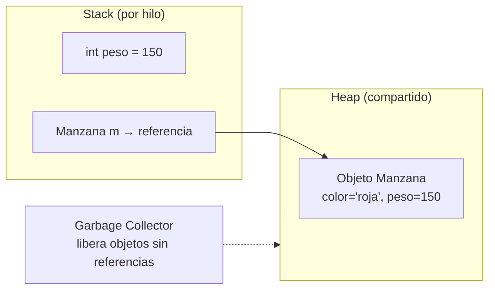

### 1.3 · Modificadores de acceso y otras palabras clave

| Modificador | Misma clase | Mismo paquete | Subclase (otro paquete) | Todos |
|---|:-:|:-:|:-:|:-:|
| `private` | ✅ | ❌ | ❌ | ❌ |
| *(sin modificador)* | ✅ | ✅ | ❌ | ❌ |
| `protected` | ✅ | ✅ | ✅ | ❌ |
| `public` | ✅ | ✅ | ✅ | ✅ |

| Palabra | Qué hace |
|---|---|
| `static` | Pertenece a la **clase**, no al objeto; se comparte |
| `final` | **Variable:** no se reasigna · **método:** no se sobrescribe · **clase:** no se hereda |
| `abstract` | Sin implementación; obliga a la subclase a completarla |
| `this` | El objeto actual; también `this(...)` para encadenar constructores |
| `super` | El padre: `super.metodo()` y `super(...)` (primer paso del constructor) |
| `instanceof` | Comprueba el tipo real (en 17 con patrón: `if (f instanceof Manzana m)`) |
| `synchronized` / `volatile` | Exclusión mutua / visibilidad entre hilos |

**Constructores:** no se heredan. Si no escribes ninguno, Java crea uno por defecto sin parámetros. El primer paso de cualquier constructor es llamar a `super(...)` (implícito si no lo escribes).

### 1.4 · Los 4 pilares

| Pilar | 🟢 En una frase | 🍎 Con manzanas | Cómo se logra en Java |
|---|---|---|---|
| **Encapsulación** | Esconder el estado y controlar su acceso | El peso es **privado**: solo cambia con un método que valida (no puede ser negativo) | Campos `private` + getters y métodos con reglas |
| **Abstracción** | Mostrar **qué** hace y esconder **cómo** | Para vender, solo importa `precio()`, no cómo se calcula | `interface` y `abstract class` |
| **Herencia** | Una clase reutiliza y extiende a otra (relación **"es un"**) | Una **Manzana es una Fruta** y hereda `peso` y `madurar()` | `extends` |
| **Polimorfismo** | La misma llamada hace cosas distintas según el objeto real | `fruta.precio()` calcula distinto para manzana y para banana | Sobrescritura (`@Override`) y referencias del tipo padre |

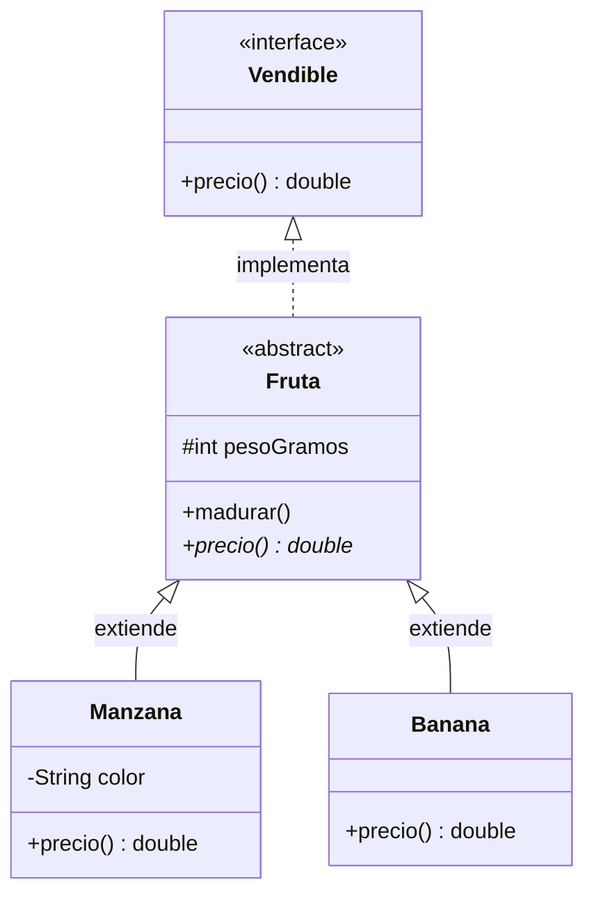

```java
Fruta f1 = new Manzana("roja", 150);   // referencia del padre, objeto hijo (upcasting)
Fruta f2 = new Banana(120);
for (Fruta f : List.of(f1, f2)) {
    System.out.println(f.precio());    // POLIMORFISMO: cada uno ejecuta SU precio()
}
```

**Por qué importa el polimorfismo:** puedes escribir código que depende de `Fruta` o `Vendible` y funciona con cualquier tipo nuevo **sin modificarlo** (Open/Closed).

### 1.5 · Sobrecarga vs sobrescritura (la pregunta clásica)

| | **Sobrecarga** (*overloading*) | **Sobrescritura** (*overriding*) |
|---|---|---|
| **Qué es** | Mismo nombre, **parámetros distintos** | Una subclase **redefine** un método del padre con la **misma firma** |
| **Dónde** | En la **misma clase** (o heredada) | Entre **clase padre e hija** |
| **Se resuelve** | **En compilación** (según los tipos de los argumentos) | **En ejecución** (según el objeto real: *dynamic dispatch*) |
| **Tipo de polimorfismo** | Estático (en tiempo de compilación) | **Dinámico** (en tiempo de ejecución) |
| **`@Override`** | No aplica | Sí, recomendado: el compilador verifica que realmente sobrescribes |
| **Tipo de retorno** | Puede variar, pero **no basta** para distinguir | Igual o **covariante** (un subtipo) |
| **Modificador de acceso** | Libre | **No puede ser más restrictivo** que el del padre |
| **Excepciones** | Libre | No puede lanzar checked **más amplias** que el padre |
| **No se pueden sobrescribir** | | `static` (se *oculta*), `private`, `final` |

```java
// SOBRECARGA: misma clase, distintos parámetros
double precio(int kilos)             { ... }
double precio(int kilos, double descuento) { ... }

// SOBRESCRITURA: la hija redefine
class Banana extends Fruta {
    @Override
    public double precio() { return pesoGramos * 0.003; }
}
```

**Regla mnemotécnica:** *sobre**carga** = otro menú de parámetros en la misma carta (decide el compilador); sobre**escritura** = la hija reescribe la receta del padre (decide la JVM al ejecutar).*

### 1.6 · Clase abstracta vs interfaz

| | **Clase abstracta** | **Interfaz** |
|---|---|---|
| **Qué expresa** | Una base común con **estado y comportamiento** ("es un") | Un **contrato** o capacidad ("sabe hacer") |
| **Estado (campos)** | Sí, de instancia | Solo constantes (`public static final`) |
| **Constructores** | Sí | No |
| **Métodos** | Abstractos y con implementación | Abstractos y, desde Java 8, `default` y `static`; desde Java 9, `private` |
| **Herencia múltiple** | **No**: una sola clase padre | **Sí**: una clase implementa varias |
| **Modificadores** | Cualquiera | Métodos `public` por defecto |
| **Cuándo** | Varias clases comparten **código y estado** | Definir un **contrato** para desacoplar (puertos en hexagonal) |

🟢 **Frase:** *"Interfaz para el contrato, clase abstracta cuando hay código y estado compartido. Y prefiero interfaces: permiten varias implementaciones y facilitan los tests."*

### 1.7 · Herencia vs composición

| | **Herencia** (`extends`) | **Composición** (atributo) |
|---|---|---|
| Relación | "**es un**" (Manzana es una Fruta) | "**tiene un**" (Pedido tiene Manzanas) |
| Acoplamiento | **Alto**: la hija depende de los detalles del padre | **Bajo**: dependes de una interfaz |
| Flexibilidad | Fija en compilación | Se cambia en ejecución (inyectas otra implementación) |
| Riesgo | Jerarquías profundas y frágiles; rompe encapsulación | Más código de delegación |

🟢 **Frase:** *"Prefiero composición sobre herencia: heredo solo cuando de verdad es una relación 'es un' y la subclase puede sustituir al padre sin romper nada (Liskov)."*

### 1.8 · La clase `Object`, `==` vs `equals`, `String`

| Tema | Respuesta |
|---|---|
| **`Object`** | Todas las clases heredan de ella: `equals`, `hashCode`, `toString`, `getClass`, `clone` |
| **`==` vs `equals`** | `==` compara **referencias** (¿el mismo objeto?); `equals` compara **contenido** si se sobrescribe |
| **Contrato `equals`/`hashCode`** | Si `a.equals(b)` entonces `a.hashCode() == b.hashCode()`. Si lo rompes, `HashMap` y `HashSet` no encuentran el objeto. `equals` debe ser reflexivo, simétrico, transitivo y consistente |
| **`String` es inmutable** | Seguridad, *string pool* (reutilización), `hashCode` cacheado y seguro entre hilos. Para concatenar en bucles: `StringBuilder` |
| **String pool** | `"a" == "a"` es `true` (mismo literal); `new String("a") == "a"` es `false` |
| **`record`** | Genera `equals`, `hashCode` y `toString` por ti |

### 1.9 · Clases anidadas, enums, genéricos

| Tema | Respuesta |
|---|---|
| **Clase anidada estática** | Dentro de otra, sin acceso a la instancia externa (`static class Builder`) |
| **Clase interna (inner)** | Tiene referencia a la instancia externa |
| **Clase anónima / lambda** | Implementación sin nombre; la lambda solo para interfaces funcionales |
| **`enum`** | Conjunto fijo de constantes; pueden tener campos, métodos y implementar interfaces (`EstadoPago.AUTORIZADO`) |
| **Genéricos** | Seguridad de tipos en compilación (`List<Manzana>`); **type erasure**: en ejecución se borran los tipos |
| **Comodines (PECS)** | `? extends T`: **produces** (lees); `? super T`: **consumes** (escribes) |

### 1.10 · Excepciones

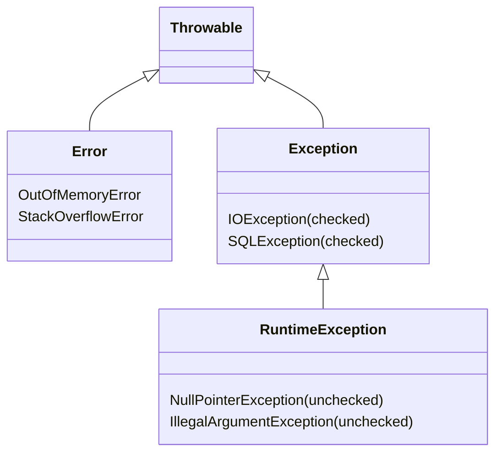

| Tema | Respuesta |
|---|---|
| **Checked** | El compilador obliga a manejarlas o declararlas (`throws`): `IOException`, `SQLException` |
| **Unchecked** | `RuntimeException`: errores de programación (`NullPointerException`, `IllegalArgumentException`) |
| **`Error`** | Problemas graves de la JVM (`OutOfMemoryError`); no se capturan |
| **`try-with-resources`** | Cierra automáticamente lo que implementa `AutoCloseable` |
| **`final` vs `finally` vs `finalize`** | Constante o no-sobrescribible · bloque que siempre se ejecuta · método del GC (obsoleto, no usar) |
| **Buena práctica** | Excepciones propias de negocio (unchecked), nunca tragarse una excepción, y no usarlas para control de flujo |

### 1.11 · Colecciones: cuál elegir

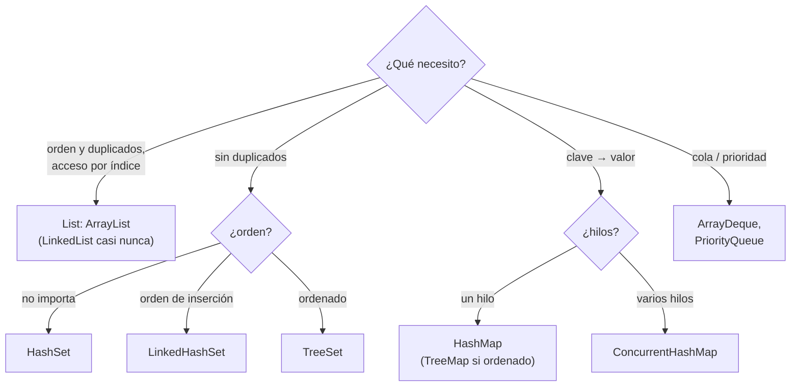

| Pregunta | Respuesta |
|---|---|
| **`ArrayList` vs `LinkedList`** | `ArrayList`: acceso por índice O(1), el default. `LinkedList` casi nunca gana en la práctica |
| **`HashMap` por dentro** | Hash de la clave → bucket; colisiones con lista o árbol; O(1) promedio; permite una clave `null`; no es thread-safe |
| **`HashMap` vs `Hashtable` vs `ConcurrentHashMap`** | `Hashtable`: obsoleto y sincronizado entero. `ConcurrentHashMap`: concurrente y eficiente, **sin** `null` |
| **`HashSet`** | Por dentro es un `HashMap`; usa `equals`/`hashCode` |
| **Inmutables** | `List.of(...)`, `Map.of(...)`: no se modifican |

### 1.12 · Lambdas, interfaces funcionales y Streams

| Interfaz funcional | Método | Para qué |
|---|---|---|
| `Predicate<T>` | `boolean test(T)` | Filtrar / condición |
| `Function<T,R>` | `R apply(T)` | Transformar |
| `Consumer<T>` | `void accept(T)` | Hacer algo con el valor |
| `Supplier<T>` | `T get()` | Producir un valor |
| `UnaryOperator<T>` / `BinaryOperator<T>` | `apply` | Transformar con el mismo tipo |
| `Runnable` / `Callable<V>` | `run()` / `call()` | Tarea sin / con resultado |

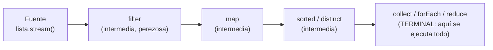

```java
List<String> nombres = manzanas.stream()
    .filter(m -> m.peso() > 100)          // intermedia
    .map(Manzana::variedad)               // intermedia
    .sorted()                             // intermedia
    .toList();                            // terminal (Java 16+)
```

- **Intermedias** (perezosas): `filter`, `map`, `flatMap`, `sorted`, `distinct`, `limit`. **Terminales**: `collect`, `toList`, `forEach`, `reduce`, `count`, `findFirst`, `anyMatch`.
- **`map` vs `flatMap`:** `map` transforma 1 a 1; `flatMap` aplana (1 a muchos).
- **`Optional`:** para retornos que pueden no tener valor; no para campos ni parámetros. Usar `map`, `orElse`, `orElseThrow`, no `get()` a ciegas.

### 1.13 · Java 17 y Java 21 (con ejemplos)

| Novedad | Versión final | Ejemplo y para qué |
|---|---|---|
| **Records** | 16 | `record Manzana(String color, int peso) {}`: clase inmutable con `equals`, `hashCode`, `toString` y accesores `color()` |
| **Sealed classes** | 17 | `sealed interface Fruta permits Manzana, Banana {}`: jerarquía **cerrada** |
| **Text blocks** | 15 | `"""` para texto multilínea (JSON, SQL) |
| **`instanceof` con patrón** | 16 | `if (f instanceof Manzana m) { m.color(); }` sin *cast* |
| **`switch` como expresión** | 14 | `var x = switch (e) { case A -> 1; case B -> 2; };` |
| **Pattern matching en `switch`** | **21** (preview en 17) | `case Manzana m -> ...` con tipos |
| **Record patterns** | 21 | Desestructurar un record en un `switch` |
| **Virtual threads** | 21 | Hilos baratos: código bloqueante simple con alta concurrencia |
| **`SequencedCollection`** | 21 | `getFirst()`, `getLast()`, `reversed()` |
| **`var`** | 10 | Inferencia de tipo local |
| **Mensajes NPE útiles** | 14 | Dice qué variable era `null` |

```java
public record Manzana(String color, int peso) {
    public Manzana {                                 // constructor compacto: valida
        if (peso <= 0) throw new IllegalArgumentException("peso inválido");
    }
}

public sealed interface Fruta permits Manzana, Banana {}

String describir(Fruta f) {                          // Java 21
    return switch (f) {                              // el compilador exige cubrir todos los casos
        case Manzana m -> "manzana " + m.color();
        case Banana b  -> "banana";
    };
}
```

**Record vs clase normal:** un record es **inmutable**, no puede extender otra clase (sí implementar interfaces) y sirve para DTOs y objetos de valor. **Java 17 es LTS**; **21** también.

### 1.14 · Concurrencia y memoria (lo básico)

| Tema | Respuesta |
|---|---|
| **`Thread` vs `ExecutorService`** | Prefiere `ExecutorService` (pool): reusa hilos y controla la concurrencia |
| **`synchronized`** | Exclusión mutua sobre un monitor |
| **`volatile`** | Garantiza **visibilidad**, no atomicidad |
| **`AtomicInteger`** | Operaciones atómicas sin lock |
| **Deadlock** | Dos hilos esperan locks que el otro tiene; se evita con orden consistente |
| **`CompletableFuture`** | Compone tareas asíncronas (`thenApply`, `thenCompose`, `allOf`) |
| **Virtual threads (21)** | Miles de hilos baratos; escribir código bloqueante sin pasar a reactivo |
| **Garbage Collector** | Libera lo inalcanzable; por generaciones (young y old); G1 por defecto; ZGC para pausas bajas |
| **Fuga de memoria** | Referencias que ya no necesitas (caches estáticos, listeners sin remover) |
| **Inmutabilidad** | Campos `final`, sin setters, copias defensivas: más seguro entre hilos |

### 1.15 · SOLID explicado simple (con código malo, código bueno y dibujos)

**Para qué sirve SOLID, en palabras de la calle:** son 5 reglas para que el código **se pueda cambiar sin romper otras cosas**. Imagina una frutería: si el cajero también cuenta el dinero, empaca, limpia y hace la contabilidad, cuando falle algo no sabes por dónde empezar. SOLID es poner **a cada uno a hacer lo suyo**.

| Letra | Nombre | En una frase simple |
|---|---|---|
| **S** | Responsabilidad única | **Cada clase hace UNA sola cosa** |
| **O** | Abierto/Cerrado | Para agregar algo nuevo, **agregas una clase; no editas lo que ya funciona** |
| **L** | Liskov | Si un hijo reemplaza al padre, **todo debe seguir funcionando** |
| **I** | Interfaces pequeñas | **No obligues a nadie a hacer cosas que no le corresponden** |
| **D** | Dependencias hacia el "enchufe" | **Depende de un enchufe (interfaz), no de un aparato concreto** |

#### S · Responsabilidad única: "cada clase, una sola cosa"

**El problema:** tengo una clase `Factura` que **calcula**, **cobra**, **imprime** y **guarda en la base de datos**. Si mañana cambia el formato de impresión, tengo que **abrir la misma clase** donde está la lógica de cobro, y puedo romperla sin querer.

```java
// ❌ MALO: una clase que hace de todo
class Factura {
    double calcularTotal() { ... }
    void pagar()           { ... }
    void imprimir()        { ... }
    void guardarEnBD()     { ... }
}
```

```java
// ✅ BUENO: cada clase hace UNA cosa
class Factura          { double calcularTotal() { ... } }   // solo datos y cálculo
class ServicioDePago   { void pagar(Factura f)  { ... } }   // solo cobrar
class ImpresoraFactura { void imprimir(Factura f) { ... } } // solo imprimir
class FacturaRepositorio { void guardar(Factura f) { ... } } // solo guardar
```

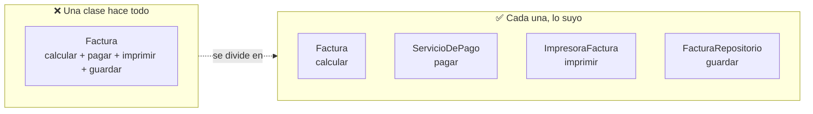

**Cómo darte cuenta:** describe la clase en voz alta. Si dices **"y"** ("calcula **y** cobra **y** imprime"), hay que dividirla.
**🍎 Con manzanas:** el cajero cobra, el empacador empaca y el contador anota. Si el empacador cambia de método, el cajero ni se entera.

#### O · Abierto/Cerrado: "agregas, no editas"

**El problema:** calculo descuentos con una cadena de `if`. Cada descuento nuevo me obliga a **abrir y editar** código que ya funcionaba, y cada edición puede romperlo.

```java
// ❌ MALO: cada descuento nuevo = editar este método
double descuento(String tipo, double total) {
    if (tipo.equals("NAVIDAD")) return total * 0.10;
    else if (tipo.equals("VIP")) return total * 0.20;
    // y mañana otro más...
}
```

```java
// ✅ BUENO: cada descuento nuevo = una clase nueva. Lo anterior no se toca.
interface Descuento { double aplicar(double total); }
class DescuentoNavidad implements Descuento { public double aplicar(double t) { return t * 0.10; } }
class DescuentoVip     implements Descuento { public double aplicar(double t) { return t * 0.20; } }
// mañana: class DescuentoCumple implements Descuento { ... }  ← no editas nada de lo que ya funciona
```

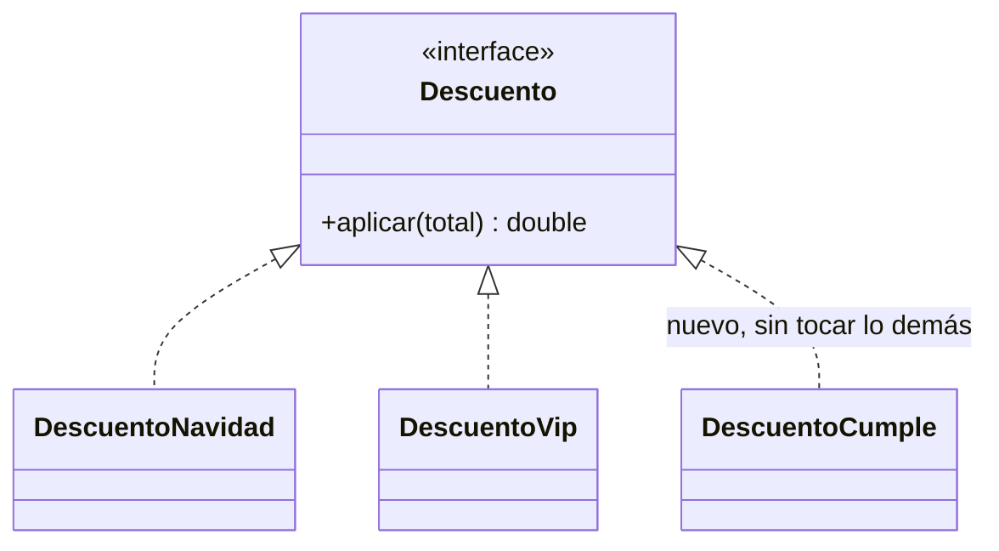

**Cómo darte cuenta:** si para agregar un caso nuevo tienes que **modificar un `if` o un `switch` que ya existe**, rompes este principio. *(Este patrón se llama **Strategy**.)*
**🍎 Con manzanas:** un descuento nuevo es **una tarjeta nueva en la caja**; no hay que desarmar la caja registradora.

#### L · Liskov: "el reemplazo no debe romper nada"

**El problema:** si digo "un `Pingüino` es un `Ave`", pero el `Ave` sabe `volar()` y el pingüino no, **cualquier código que mande volar a un ave se rompe** cuando recibe un pingüino.

```java
// ❌ MALO: el hijo no puede cumplir lo que promete el padre
class Ave { void volar() { ... } }
class Pinguino extends Ave { void volar() { throw new RuntimeException("no puedo volar"); } }
```

```java
// ✅ BUENO: solo "vuelan" las que de verdad vuelan
class Ave { void comer() { ... } }
interface Voladora { void volar(); }
class Gorrion  extends Ave implements Voladora { public void volar() { ... } }
class Pinguino extends Ave { }          // no promete volar
```

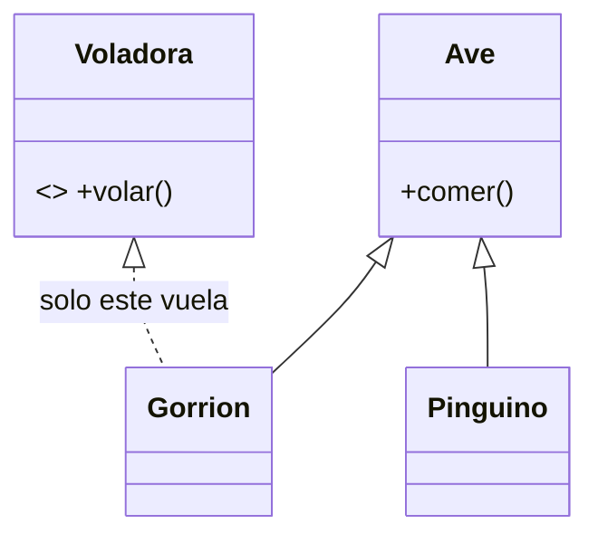

**Cómo darte cuenta:** si un hijo **lanza error, no hace nada o hace algo raro** en un método heredado, no debería heredar de ese padre.
**🍎 Con manzanas:** si la receta pide "una fruta con jugo" y te dan una que no tiene jugo, la receta falla. **Un reemplazo tiene que servir para lo mismo.**

#### I · Interfaces pequeñas: "no obligues a nadie a hacer lo que no le toca"

**El problema:** una interfaz `Trabajador` obliga a **trabajar y comer**. Si un `Robot` la implementa, **tiene que inventar un `comer()`** que no tiene sentido.

```java
// ❌ MALO: una interfaz grande obliga a todos a todo
interface Trabajador { void trabajar(); void comer(); }
class Robot implements Trabajador {
    public void trabajar() { ... }
    public void comer()    { /* un robot no come... ¿qué pongo aquí? */ }
}
```

```java
// ✅ BUENO: interfaces chicas; cada clase firma solo lo suyo
interface Trabajable { void trabajar(); }
interface Alimentable { void comer(); }
class Robot   implements Trabajable { public void trabajar() { ... } }
class Persona implements Trabajable, Alimentable { /* ambas */ }
```

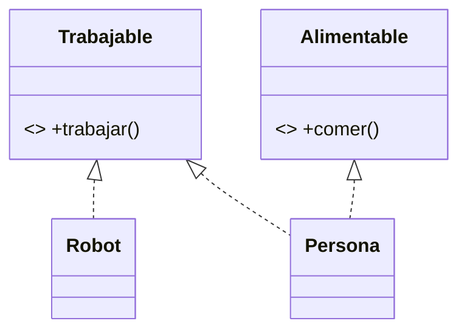

**Cómo darte cuenta:** si al implementar una interfaz dejas métodos **vacíos o con "no soportado"**, la interfaz es demasiado grande: pártela.
**🍎 Con manzanas:** el contrato del cajero no debería obligarlo a "cargar camiones".

#### D · Dependencias hacia el enchufe: "usa el enchufe, no el aparato"

**El problema:** mi `Pedido` crea por dentro un `PagoConTarjeta` con `new`. Si mañana quiero pagar con efectivo, o **probar sin cobrar de verdad**, tengo que **cambiar `Pedido`**.

```java
// ❌ MALO: Pedido está pegado a UNA forma de pago
class Pedido {
    private PagoConTarjeta pago = new PagoConTarjeta();
    void cobrar() { pago.cobrar(); }
}
```

```java
// ✅ BUENO: Pedido pide "un medio de pago" (el enchufe); le dan el que sea
interface MedioDePago { void cobrar(); }
class PagoConTarjeta implements MedioDePago { public void cobrar() { ... } }
class PagoEnEfectivo implements MedioDePago { public void cobrar() { ... } }

class Pedido {
    private final MedioDePago pago;
    Pedido(MedioDePago pago) { this.pago = pago; }     // se lo dan desde afuera
    void cobrar() { pago.cobrar(); }
}
// En las pruebas le pasas un MedioDePago de mentira (un mock): no cobras de verdad.
```

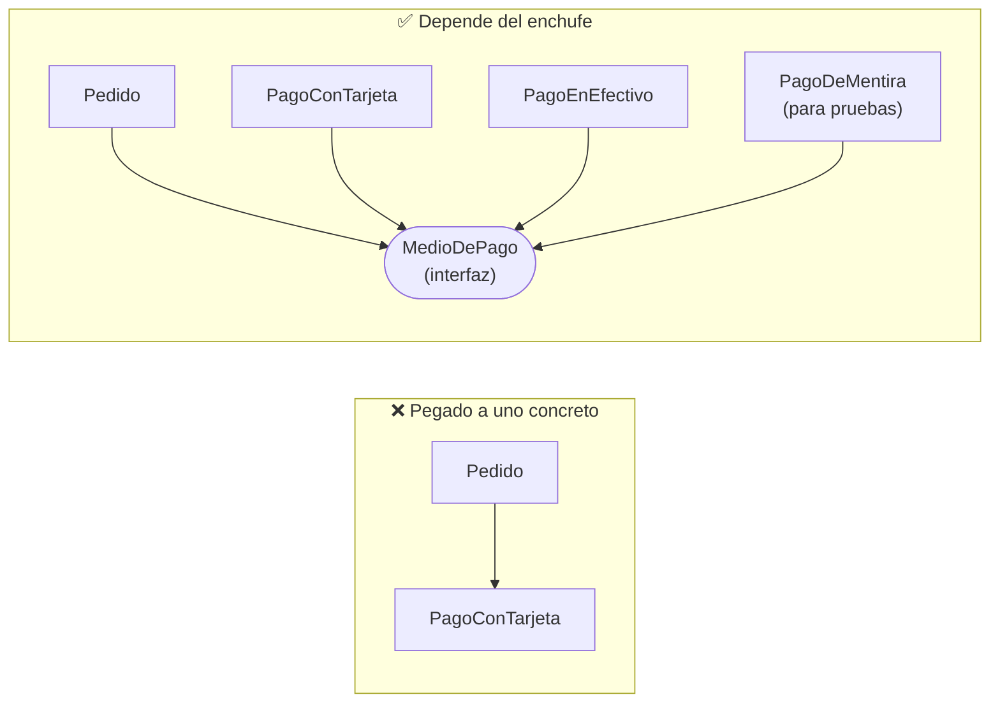

**Cómo darte cuenta:** si dentro de una clase ves `new` de una clase concreta de **otra capa** (base de datos, banco, correo), está pegada a ella.
**🍎 Con manzanas:** la caja usa **"un lector de pagos"**, el que sea; no solo la marca X. En las pruebas le pones un lector de mentira. *(Esto es lo que usan Spring y Quarkus al "inyectar dependencias".)*

#### Cómo responderlo en la entrevista (30 segundos)

> "SOLID son cinco reglas para que el código se pueda cambiar sin romper otras partes. **S**: cada clase hace una sola cosa; por ejemplo, separo `Factura` de quien la paga y de quien la imprime. **O**: para agregar algo nuevo agrego una clase, no edito la que ya funciona; por ejemplo, un descuento nuevo es una clase nueva. **L**: un hijo debe poder reemplazar al padre sin romper nada. **I**: interfaces pequeñas, para que nadie implemente lo que no usa. **D**: las clases dependen de interfaces y no de implementaciones concretas, y así puedo cambiar de proveedor y hacer pruebas con mocks. **No son leyes:** aplicarlos de más produce código innecesariamente complicado."

**Trampa común:** querer aplicarlo todo desde el primer día. Si el programa es pequeño y simple, **no lo partas en diez clases** (principio KISS/YAGNI: no construyas lo que aún no necesitas).

**Las 3 preguntas que más caen:** *"¿Un ejemplo de SRP?"* → `Factura` con pagar e imprimir, dividida. *"¿Para qué sirve D?"* → poder cambiar de implementación y hacer pruebas con mocks. *"¿Qué relación tiene D con Spring o Quarkus?"* → la inyección de dependencias es aplicar D: el framework te entrega la implementación.

### 1.16 · Preguntas trampa de Java (respuesta corta)

| Pregunta | Respuesta |
|---|---|
| ¿Java pasa por valor o por referencia? | **Siempre por valor**; con objetos se copia la referencia |
| ¿Se puede sobrescribir un método `static`? | No: se **oculta**, no se sobrescribe |
| ¿Un constructor se hereda? | No |
| ¿Una clase abstracta puede tener constructor? | Sí (se invoca desde las subclases) |
| ¿Una interfaz puede tener métodos con implementación? | Sí: `default`, `static` y `private` |
| ¿Se puede instanciar una clase abstracta o una interfaz? | No directamente (sí con una clase anónima que la implemente) |
| ¿Por qué `String` es inmutable? | Seguridad, string pool, hash cacheado, thread-safe |
| ¿Qué pasa si sobrescribes `equals` sin `hashCode`? | Rompes `HashMap` y `HashSet` |
| ¿Se puede heredar de varias clases? | No; sí implementar varias interfaces |
| ¿Qué es el *autoboxing*? | Conversión automática entre `int` e `Integer`; cuidado con `==` en `Integer` y con `null` |
| ¿`ArrayList` es thread-safe? | No; usa `CopyOnWriteArrayList` o sincroniza |
| ¿Diferencia entre `Comparable` y `Comparator`? | `Comparable`: orden natural dentro de la clase; `Comparator`: orden externo y alternativo |

**Pregunta de experiencia típica:** *"Cuéntame un problema de rendimiento que resolviste."* → situación → cómo lo mediste → causa → solución → resultado con números. Usa un caso real tuyo (por ejemplo, un N+1 o un cuello de botella en pagos).

Detalle: [`java-core/`](../../java-core) · [`java-version-evolution.md`](../../java-core/java-version-evolution.md) · [`oop-in-java.md`](../../java-core/oop-in-java.md) · [sección 03](README.md#s03) · [20](README.md#s20).

---

<a id="c2"></a>

## 2 · Quarkus, Spring Boot y SmallRye

| Pregunta | Respuesta |
|---|---|
| ¿Qué es Quarkus? | Framework Java para microservicios y cloud: arranca rápido y gasta poca memoria porque hace la configuración **en el build** |
| ¿Spring vs Quarkus? | Mismos patrones; Spring configura en runtime, Quarkus en build; DI con CDI; tiene dev mode, Dev Services e imagen nativa |
| ¿DI? | CDI: `@Inject`, `@ApplicationScoped` |
| ¿Endpoint? | `@Path` + `@GET` (Jakarta REST) |
| ¿Persistencia? | Hibernate ORM con **Panache** |
| ¿Config? | `application.properties`, `@ConfigProperty`, perfiles `%dev` `%test` `%prod` |
| ¿Reactivo? | `Uni` (0 o 1) y `Multi` (0 a N) de Mutiny; equivalen a `Mono` y `Flux`; el event loop no se bloquea |
| ¿Código bloqueante? | `@Blocking`, o un endpoint imperativo, o virtual threads |
| ¿Qué es SmallRye Reactive Messaging? | La librería de Quarkus para mensajería (`@Incoming`, `@Outgoing`, `Emitter`) con conectores (Kafka, AMQP...) |
| ¿Pruebas? | `@QuarkusTest`, `@InjectMock`, RestAssured, Dev Services |

Tabla de equivalencias completa: [sección 20](README.md#s20) · [`quarkus/README.md`](../../frameworks/quarkus/README.md).

---

<a id="c3"></a>

## 3 · JPA, Hibernate y PostgreSQL

| Pregunta | Respuesta |
|---|---|
| N+1 | Lista + una consulta por elemento. `JOIN FETCH`, `@EntityGraph`, `@BatchSize` o DTO |
| Lazy vs eager | Lazy al usar, eager siempre; poner `LAZY` y traer lo necesario |
| `LazyInitializationException` | Acceso lazy fuera de la transacción; usar `JOIN FETCH` o devolver DTO |
| Estados de entidad | Transient → Managed → Detached → Removed |
| `@Transactional` | Rollback en runtime exceptions; `REQUIRED` por defecto; no funciona en autoinvocación; en la capa de aplicación |
| Concurrencia | `@Version` (optimista, lo habitual) o `FOR UPDATE` (pesimista); `SKIP LOCKED` para colas |
| Aislamiento PostgreSQL | `READ COMMITTED` por defecto; MVCC |
| Índices | B-tree; compuesto respeta el orden; `EXPLAIN (ANALYZE)` |
| Dinero | `BigDecimal`, nunca `double` |
| Enums | `@Enumerated(STRING)` |
| Esquema | Flyway o Liquibase; `generation=none` en producción |
| Insert en lote | `SEQUENCE`, no `IDENTITY` |
| Paginación grande | Por cursor/keyset, no `OFFSET` |
| Upsert | `INSERT ... ON CONFLICT` (clave para idempotencia) |

Detalle: [sección 22](README.md#s22) · [`persistencia-hibernate-postgresql.md`](../../frameworks/quarkus/persistencia-hibernate-postgresql.md).

---

<a id="c4"></a>

## 4 · Testing (JUnit 5 y Mockito)

| Pregunta | Respuesta |
|---|---|
| AAA | Arrange (preparar), Act (actuar), Assert (comprobar) |
| JUnit 5 | `@Test`, `@BeforeEach`, `@ParameterizedTest`, `@Nested`, `assertThrows`, `assertAll` |
| Mockito | `@Mock`, `@InjectMocks`, `when/thenReturn`, `verify`, `ArgumentCaptor` |
| Mock / Stub / Spy / Fake | Verifica / devuelve / real vigilado / implementación simple |
| ¿Qué mockeas? | Tus **puertos**; no tipos de terceros ni el dominio |
| Pirámide | Muchos unitarios, algunos de integración, pocos end-to-end |
| Quarkus | `@QuarkusTest`, `@InjectMock`, Dev Services, `InMemoryConnector` |
| Spring | `@SpringBootTest`, `@MockBean`, Testcontainers |
| BD en pruebas | PostgreSQL real en contenedor; evitar H2 como sustituto |
| TDD | Rojo, verde, refactor |
| Cobertura | Indicador, no objetivo; importan los caminos de error |

Detalle: [sección 25](README.md#s25) · [`junit5-mockito.md`](../../tdd/junit5-mockito.md).

---

<a id="c5"></a>

## 5 · Arquitectura hexagonal

| Pregunta | Respuesta |
|---|---|
| ¿Qué es? | Negocio al centro; **puertos** (interfaces que define el núcleo) y **adaptadores** (REST, JPA, Kafka, cliente del banco) que los implementan |
| Regla de oro | La dependencia apunta **hacia adentro**; el dominio no conoce frameworks |
| Puerto IN / OUT | IN: lo que el sistema ofrece (`CrearPagoUseCase`); OUT: lo que necesita (`PagoRepository`, `BancoPort`) |
| Entidad de dominio vs entidad JPA | Distintas, con un mapper; el modelo de negocio no queda atado a la tabla |
| ¿Dónde va `@Transactional`? | En el caso de uso |
| ¿Cómo se prueba? | Dominio sin mocks; casos de uso con mocks de los puertos; adaptadores con integración |
| ¿Cuándo no? | CRUD sin lógica de negocio (sobreingeniería) |

Detalle: [sección 23](README.md#s23) · [`hexagonal-architecture.md`](../../software-architectures/hexagonal-architecture.md).

---

<a id="c6"></a>

## 6 · Kafka: repaso de 15 minutos (lo usaste en el banco, hace tiempo)

### Cómo presentarlo con honestidad

> "En el banco construí **consumidores de eventos en producción** con Spring Cloud Stream sobre Azure Event Hubs (protocolo Kafka): transferencias interbancarias y al exterior, con orquestación reactiva, reintentos y trazabilidad por headers. Además hice **pruebas de concepto propias**: el cliente Java puro, Spring Kafka y **Spring Cloud Stream contra Azure Event Hubs por su endpoint de Kafka**, con dos binders y cabeceras de trazabilidad. Con SmallRye Reactive Messaging no he trabajado, pero Spring Cloud Stream es su equivalente: bindings y `StreamBridge` son los canales y el `Emitter`."

Eso es **verdad y suficiente** (tus 4 ejercicios: [`practica-kafka-ejercicios.md`](../../messaging-streaming/practica-kafka-ejercicios.md)). Solo di lo que sea cierto: con dos preguntas se nota.

### Los 12 conceptos (léelos hasta poder decirlos sin mirar)

| # | Concepto | 🟢 Frase | 🍎 Manzanas |
|---|---|---|---|
| 1 | **Kafka** | Log distribuido de eventos: se escribe al final y se **lee sin borrar** | El libro de ventas con líneas numeradas |
| 2 | **Topic** | Canal con nombre para un tipo de evento | Un cuaderno |
| 3 | **Partición** | División del topic; **el orden solo vale dentro de una** | Secciones del cuaderno |
| 4 | **Key** | Decide la partición; misma key, mismo orden | El nombre del cliente decide la sección |
| 5 | **Offset** | Posición del mensaje en su partición | Número de línea |
| 6 | **Consumer group** | Consumidores que se reparten las particiones; cada partición la lee **uno** del grupo | Equipo de contadores |
| 7 | **Replicación + `acks=all` + `min.insync.replicas=2`** | No pierdes datos si cae un servidor | Fotocopias en 3 oficinas |
| 8 | **Commit de offsets** | Marcar hasta dónde leíste; confirmar **después de procesar** | El marcador del libro |
| 9 | **At-least-once + idempotencia** | Puede llegar dos veces: el consumidor ignora duplicados con el `eventId` | El sello "YA COBRADO" |
| 10 | **Rebalanceo y lag** | Reasignar particiones al entrar o salir un consumidor; lag = lo que falta por leer | Un contador se enferma; líneas sin leer |
| 11 | **DLT y reintentos** | El mensaje que siempre falla va a otro topic, tras reintentos con backoff | Bandeja "revisar a mano" |
| 12 | **Outbox** | Guardar dato y evento en la misma transacción; otro proceso publica | Misma hoja: "vendí" y "avisar" |

### Las preguntas que más caen (respuesta de una línea)

| Pregunta | Respuesta |
|---|---|
| ¿Cómo garantizas el orden? | Con una key (cuenta, pedido): sus eventos van a la misma partición |
| ¿Qué pasa si hay más consumidores que particiones? | Los sobrantes quedan ociosos |
| ¿Cómo no pierdes mensajes? | Productor `acks=all` e idempotente; consumidor con commit manual tras procesar; RF=3 |
| ¿Cómo evitas duplicados? | At-least-once más consumidor idempotente (`eventId` con restricción única) |
| ¿Exactly-once? | Existe dentro de Kafka (idempotencia y transacciones); con sistemas externos necesitas idempotencia propia |
| ¿Qué haces con un mensaje que falla? | Reintento con backoff y luego Dead Letter Topic con alerta |
| ¿Kafka vs RabbitMQ/SQS? | Kafka es un log que se relee, con alto volumen y orden por clave; RabbitMQ es una cola con enrutamiento rico y ack por mensaje que se consume y desaparece; una cola gestionada (SQS, Service Bus) es lo más simple. Tabla completa: [`messaging-streaming/README.md` sección 5b](../../messaging-streaming/README.md#5b-kafka-vs-rabbitmq-vs-cola-gestionada-la-pregunta-clásica) |
| ¿Qué es ZooKeeper/KRaft? | Coordinaba el cluster; hoy lo hace KRaft integrado en Kafka |
| ¿Qué es Schema Registry? | Guarda los esquemas y valida que los cambios sean compatibles |
| ¿Cómo publicas y guardas en BD sin inconsistencias? | Outbox |
| ¿Qué es el consumer lag? | Mensajes pendientes por consumir; la métrica clave |
| ¿Qué es log compaction? | Conserva solo el último valor por key |

### Con SmallRye (Quarkus), en 10 líneas

```java
@Incoming("pedidos")  @Blocking @Transactional
public void procesar(PedidoCreado e) { ... }              // consume; ack al terminar el método

@Inject @Channel("despachos") Emitter<DespachoCreado> emitter;
emitter.send(evento);                                      // produce
```
```properties
mp.messaging.incoming.pedidos.connector=smallrye-kafka
mp.messaging.incoming.pedidos.failure-strategy=dead-letter-queue    # fail (por defecto) | ignore | dead-letter-queue | delayed-retry-topic
mp.messaging.outgoing.despachos.acks=all
```
Ack por defecto al terminar el método; commit `throttled`; pruebas con `InMemoryConnector`; equivalente Spring: `@KafkaListener` + `KafkaTemplate`. Detalle: [`smallrye-reactive-messaging.md`](../../frameworks/quarkus/smallrye-reactive-messaging.md).

Más profundidad si te la piden: [`kafka.md`](../../messaging-streaming/kafka.md) (arquitectura, headers, banca).

---

<a id="c7"></a>

## 7 · Resiliencia

| Patrón | Frase |
|---|---|
| **Timeout** | Lo primero: no esperar para siempre |
| **Retry** | Solo operaciones idempotentes, con backoff y jitter |
| **Circuit Breaker** | **Cerrado** (mide fallos) → **abierto** (corta y usa fallback) → **semiabierto** (prueba unas llamadas) → cerrado o abierto |
| **Bulkhead** | Aislar recursos por dependencia |
| **Fallback** | Plan B honesto (caché, "pendiente de confirmar") |
| **Rate limiter / load shedding** | Proteger al servicio |

**Quarkus:** `@Timeout`, `@Retry`, `@CircuitBreaker`, `@Bulkhead`, `@Fallback` (SmallRye Fault Tolerance). **Spring:** Resilience4j. **Trampa:** un timeout dispara el reintento y cuenta como fallo del circuit breaker.

**Respuesta modelo (servicio lento satura mis hilos):** *timeout corto → bulkhead → circuit breaker con fallback → reintentos idempotentes con backoff y jitter → monitoreo de p99, tasa de fallos y estado del breaker.* Detalle: [sección 16](README.md#s16) y [24](README.md#s24).

---

<a id="c8"></a>

## 8 · Tus proyectos del banco (úsalos como ejemplo de casi todo)

1. "Era una **pasarela de pagos**: recibía órdenes, las procesaba contra el banco y devolvía el resultado."
2. "Usábamos **mensajería con tópicos de entrada y salida** para desacoplar y absorber picos."
3. "**Quartz** disparaba procesos a una hora configurada: leía una tabla de pendientes y publicaba al tópico; era un *Polling Publisher*."
4. "Como todo es *at-least-once*, el diseño era **idempotente**: id único por pago, estado condicional y consumidores que ignoran duplicados."
5. "Si el banco no respondía, el pago quedaba **pendiente de confirmación** y se resolvía por consulta o conciliación; nunca se reintentaba a ciegas."

**Segundo proyecto (transferencias asíncronas):** "Una orden de transferencia se ejecutaba por **evento**, no en la petición del usuario. Un consumidor con Spring Cloud Stream y Reactor **orquestaba** la ejecución llamando a varias APIs. Si algo fallaba, reintentaba con espera creciente; las órdenes con fecha futura usaban un **servicio de tareas programadas** que republicaba el evento al vencer. Todo con headers de trazabilidad. **Al revisarlo hoy** cambiaría los reintentos por tópicos escalonados y DLQ, añadiría idempotencia por ítem y `key = orderId`." Análisis: [`caso-transferencias-asincronas.md`](../../system-design/caso-transferencias-asincronas.md).

Sirve para: Kafka, idempotencia, resiliencia, transacciones, arquitectura, concurrencia y testing. Detalle y dibujo: [`caso-pasarela-pagos.md`](../../system-design/caso-pasarela-pagos.md) (🔎 contrasta con tu memoria lo que no recuerdes con certeza).

---

<a id="c9"></a>

## 9 · Extras del job description

El job description menciona más cosas que la lista de Lourdes. Respuestas mínimas por si salen:

| Tema | Respuesta mínima |
|---|---|
| **OWASP Top 10 (2021)** | A01 Broken Access Control · A02 Cryptographic Failures · A03 Injection · A04 Insecure Design · A05 Security Misconfiguration · A06 Vulnerable Components · A07 Auth Failures · A08 Integrity Failures · A09 Logging/Monitoring Failures · A10 SSRF (existe una edición 2025: confírmala en owasp.org) |
| SQL injection | Consultas parametrizadas, nunca concatenar |
| JWT | Validar firma, `exp`, `iss`, `aud`; vida corta; no datos sensibles |
| REST | Verbos, códigos (201 con `Location`, 400, 401, 403, 404, 409, 429), idempotencia con `Idempotency-Key`, OpenAPI |
| **Node.js** | Un hilo con event loop no bloqueante: ideal para I/O, no para CPU; `async/await`; NestJS parecido a Spring |
| **GraphQL** | El cliente pide los campos que necesita; resuelve over/under-fetching; riesgos: N+1 (DataLoader) y consultas abusivas |
| **Azure** | Functions (serverless), Service Bus (colas/topics), Event Hubs (compatible con Kafka), API Management (gateway), AKS (Kubernetes), DevOps (CI/CD), Key Vault, Entra ID |
| **Tu diseño en Azure hoy** | **Service Bus** para ejecutar órdenes (DLQ, programación, sesiones, duplicados) + **Event Hubs** para publicar hechos + **Container Apps/KEDA** + **Durable Functions** (orquestación por ítem) + **Managed Identity/Key Vault**. Event Hubs **no tiene DLQ nativa ni compactación**. Detalle y AWS/GCP: [`caso-transferencias-asincronas.md` §10](../../system-design/caso-transferencias-asincronas.md) |
| **Ágil** | Scrum (sprints, planning, daily, review, retro); ten un ejemplo de retro o de cambio de alcance |
| **Legacy** | Adapter, Anti-Corruption Layer, Strangler Fig |
| **Documentar APIs** | OpenAPI/Swagger |

Detalle: secciones [07](README.md#s07), [08](README.md#s08), [09](README.md#s09), [11](README.md#s11), [12](README.md#s12).

---

<a id="c10"></a>

## 10 · Entrenamiento rápido (30 minutos)

**Cómo usarlo:** lee la pregunta, **contesta en voz alta**, y luego despliega la respuesta. Cuenta cuántas dijiste con la frase 🟢 clara.

**Están ordenadas como suele ir la entrevista: de lo básico (Java y POO) a lo avanzado (Kafka y diseño).**

#### Java y POO

<details><summary><b>1.</b> Explícame los 4 pilares de la POO.</summary>

🟢 Encapsulación (esconder el estado y controlar el acceso), abstracción (mostrar qué hace, esconder cómo), herencia (reutilizar con relación "es un") y polimorfismo (la misma llamada, distinto comportamiento según el objeto real). 🟡 Con ejemplo: una `Fruta` abstracta con `precio()`; `Manzana` y `Banana` lo sobrescriben, y un `for` sobre `List<Fruta>` llama a cada uno. 🔴 Prefiero composición sobre herencia y programar contra interfaces; heredo solo si se cumple Liskov.
</details>

<details><summary><b>2.</b> ¿Diferencia entre sobrecarga y sobrescritura?</summary>

🟢 Sobrecarga: mismo nombre y distintos parámetros en la misma clase; la resuelve el compilador. Sobrescritura: la subclase redefine un método del padre con la misma firma; la resuelve la JVM en ejecución. 🟡 `@Override` verifica la sobrescritura; el retorno puede ser covariante; no se puede reducir la visibilidad; `static`, `private` y `final` no se sobrescriben. 🔴 La sobrescritura es el polimorfismo dinámico (*dynamic dispatch*) que sostiene Open/Closed.
</details>

<details><summary><b>3.</b> ¿Clase abstracta o interfaz?</summary>

🟢 Interfaz para un contrato; clase abstracta cuando varias clases comparten código y estado. 🟡 Una clase extiende solo una clase pero implementa varias interfaces; desde Java 8 las interfaces tienen métodos `default`. 🔴 Prefiero interfaces: permiten varias implementaciones, facilitan los tests y son los puertos de la arquitectura hexagonal.
</details>

<details><summary><b>4.</b> ¿Java pasa los objetos por valor o por referencia?</summary>

🟢 Siempre por valor. 🟡 Con objetos se copia el valor de la referencia: el método puede modificar el objeto al que apunta, pero no reasignar tu variable. 🔴 Por eso conviene inmutabilidad y copias defensivas en las APIs.
</details>

<details><summary><b>5.</b> ¿Qué es un record y cuándo lo usas?</summary>

🟢 Una clase inmutable de datos con `equals`, `hashCode` y `toString` generados (Java 16). 🟡 Ideal para DTOs, eventos y objetos de valor; puede implementar interfaces pero no extender clases; el constructor compacto valida. 🔴 Junto con `sealed` y el pattern matching de `switch` (Java 21) modelo dominios cerrados y el compilador exige cubrir todos los casos.
</details>


#### SOLID y patrones

<details><summary><b>6.</b> Explícame SOLID con un ejemplo.</summary>

🟢 Cinco reglas para que el código se pueda cambiar sin romper otras partes. Ejemplo de **S**: una clase `Factura` que calcula, paga e imprime se divide en tres: la factura, quien la paga y quien la imprime. 🟡 **O**: un descuento nuevo es una clase nueva, no un `if` más. **L**: el hijo reemplaza al padre sin romper nada (un pingüino no debería heredar `volar()`). **I**: interfaces pequeñas. **D**: depender de una interfaz (`MedioDePago`), no de `new PagoConTarjeta()`. 🔴 No son leyes: aplicarlos de más es sobreingeniería (KISS y YAGNI). **D** es la base de la inyección de dependencias de Spring y Quarkus. Detalle: [1.15](#c1).
</details>

<details><summary><b>7.</b> ¿Qué patrón de diseño has usado y dónde?</summary>

Elige **tres con un caso real**: Strategy (métodos de pago), Adapter (integrar un sistema externo), Proxy (`@Transactional`), Observer/Command/Template Method. Cierra con cuándo **no** lo usarías (sobreingeniería).
</details>


#### Quarkus y Spring

<details><summary><b>8.</b> ¿Quarkus o Spring Boot? ¿Por qué?</summary>

🟢 Quarkus arranca más rápido y gasta menos memoria. 🟡 Configura en el build, usa CDI, tiene dev mode e imagen nativa; Spring tiene el ecosistema más grande. 🔴 Elijo según el contexto: arranque y memoria críticos, Quarkus; equipo y ecosistema ya en Spring, Spring. Los patrones son los mismos.
</details>

<details><summary><b>9.</b> ¿Reactivo o imperativo?</summary>

🟢 Reactivo usa `Uni`/`Multi` y no bloquea. 🟡 El event loop no puede bloquearse; con JDBC uso `@Blocking`. 🔴 Reactivo solo si todo el camino es no bloqueante y hay alta concurrencia; si no, imperativo o virtual threads (Java 21).
</details>


#### Datos: Hibernate y PostgreSQL

<details><summary><b>10.</b> ¿Qué es el problema N+1 y cómo lo resuelves?</summary>

🟢 Una consulta de lista que dispara una extra por cada elemento. 🟡 `JOIN FETCH`, `@EntityGraph` o `@BatchSize`. 🔴 Para lecturas uso proyecciones/DTO y lo detecto contando consultas en tests.
</details>

<details><summary><b>11.</b> ¿Lazy o eager? ¿Qué es `LazyInitializationException`?</summary>

🟢 Lazy carga al usar; eager siempre; la excepción es acceder a una relación lazy fuera de la transacción. 🟡 Pongo `LAZY` y traigo lo necesario por consulta. 🔴 Devuelvo DTOs en lugar de entidades y no uso "open session in view".
</details>

<details><summary><b>12.</b> ¿Cómo evitas que dos usuarios pisen el mismo registro?</summary>

🟢 Con un campo de versión. 🟡 `@Version` (optimista); si falla, reintento. 🔴 Optimista por defecto; pesimista (`FOR UPDATE`) con alta contención, como saldos.
</details>

<details><summary><b>13.</b> ¿Cómo pruebas el acceso a datos?</summary>

🟢 Con una base de pruebas. 🟡 PostgreSQL real en contenedor (Dev Services o Testcontainers). 🔴 Evito H2 como sustituto de PostgreSQL porque difiere en SQL y tipos.
</details>


#### Testing

<details><summary><b>14.</b> ¿Qué es un mock y qué mockeas?</summary>

🟢 Un objeto falso que reemplaza una dependencia. 🟡 Mockito programa con `when` y verifica con `verify`; distingo mock, stub, spy y fake. 🔴 Mockeo mis puertos, no tipos de terceros; demasiados mocks acoplan la prueba a la implementación.
</details>


#### Arquitectura hexagonal

<details><summary><b>15.</b> ¿Qué es la arquitectura hexagonal?</summary>

🟢 Separar el negocio de los detalles técnicos con puertos y adaptadores. 🟡 El núcleo define interfaces; REST, JPA y Kafka son adaptadores. 🔴 Invierte la dependencia hacia el dominio: facilita probar y cambiar tecnología; el costo son mapeos extra y solo vale con lógica de negocio real.
</details>


#### Kafka y mensajería

<details><summary><b>16.</b> ¿Qué es Kafka y en qué se diferencia de una cola?</summary>

🟢 Un log distribuido de eventos: se escribe al final y se lee sin borrar; varios consumidores leen con su propio offset. 🟡 En una cola el mensaje se consume y desaparece. 🔴 Elijo Kafka por volumen, orden por clave y poder releer; una cola si solo reparto tareas.
</details>

<details><summary><b>17.</b> ¿Cómo garantizas el orden en Kafka?</summary>

🟢 Solo dentro de una partición. 🟡 Uso una key (la cuenta) para que sus eventos vayan a la misma partición. 🔴 No hay orden global; una key muy popular crea una partición caliente; cambiar el número de particiones rompe el reparto.
</details>

<details><summary><b>18.</b> ¿Cómo evitas procesar un mensaje dos veces?</summary>

🟢 Guardo el id del mensaje procesado. 🟡 Tabla de `eventId` con restricción única, en la misma transacción que el efecto. 🔴 Es at-least-once: lo hago idempotente de punta a punta y confirmo el offset solo después de persistir.
</details>

<details><summary><b>19.</b> ¿Qué es SmallRye Reactive Messaging?</summary>

🟢 La librería de Quarkus para mensajería: `@Incoming`, `@Outgoing` y `Emitter`. 🟡 Canales y conectores (`smallrye-kafka`), con estrategias de ack y de fallo. 🔴 Abstrae el broker sobre flujos Mutiny; el equivalente en Spring es `@KafkaListener` más `KafkaTemplate` o Spring Cloud Stream.
</details>

<details><summary><b>20.</b> Un mensaje falla siempre, ¿qué haces?</summary>

🟢 Lo mando a otro topic. 🟡 `failure-strategy=dead-letter-queue`, o `delayed-retry-topic` si es transitorio, con alerta. 🔴 Distingo transitorio de permanente, y mi consumidor es idempotente porque el reproceso es inevitable.
</details>

<details><summary><b>21.</b> ¿Qué es el patrón Outbox?</summary>

🟢 Guardar el dato y el evento en la misma transacción. 🟡 Un relay o CDC publica después a Kafka. 🔴 Evita la inconsistencia entre base de datos y broker sin transacción distribuida; la entrega queda at-least-once.
</details>


#### Resiliencia y pagos

<details><summary><b>22.</b> Explícame los estados del Circuit Breaker.</summary>

🟢 Cerrado: pasa todo y mide fallos. Abierto: corta y usa fallback. Semiabierto: prueba unas llamadas. 🟡 Abre al superar el umbral de fallos y vuelve a probar tras un tiempo. 🔴 Lo combino con timeout, bulkhead y reintentos idempotentes; el fallback debe ser honesto.
</details>

<details><summary><b>23.</b> ¿Qué haces si el banco no responde a un cobro?</summary>

🟢 No reintento a ciegas: puedo cobrar dos veces. 🟡 Estado `PENDIENTE_CONFIRMACION` y consulta de estado. 🔴 Conciliación, llave de idempotencia hacia el banco, circuit breaker y alerta por antigüedad de pendientes.
</details>


#### Tus proyectos

<details><summary><b>24.</b> ¿Por qué Quartz y no `@Scheduled`?</summary>

🟢 Con varias instancias `@Scheduled` corre en todas. 🟡 Quartz persiste en BD, tiene cluster, misfire y programación dinámica. 🔴 Los locks de BD limitan la escala; hoy usaría un scheduler gestionado y un disparo por pago.
</details>

<details><summary><b>25.</b> En tu servicio de transferencias, ¿qué mejorarías?</summary>

🟢 Los reintentos: esperar con `Thread.sleep` bloquea el consumidor. 🟡 Usaría tópicos de reintento escalonados y una DLQ, y `key = orderId` para conservar el orden. 🔴 Lo más importante: **idempotencia por ítem** (un fallo parcial reejecutaba todo y podía duplicar transferencias) y confirmar el **offset al terminar** la cadena reactiva, no antes. Detalle: [`caso-transferencias-asincronas.md`](../../system-design/caso-transferencias-asincronas.md).
</details>

<details><summary><b>26.</b> Cuéntame un proyecto del que estés orgulloso.</summary>

Usa la sección 8 de este documento: problema → arquitectura → decisión clave y por qué → un problema real (duplicados, timeout del banco, picos) → resultado.
</details>

**Resultado:** 21 o más (de 26) con la frase 🟢 clara = estás listo. Si fallas en un bloque, vuelve a su sección arriba y repítelo.

---

<a id="c11"></a>

## 11 · Cuando no sabes

1. **Di lo que sí sabes cerca:** *"No he usado X en producción, pero conozco Y, que resuelve lo mismo, y funciona así..."*
2. **Razona en voz alta:** el entrevistador evalúa cómo piensas más que el dato exacto.
3. **Nunca inventes un detalle** (un nombre de propiedad, una versión): se nota y te cuesta la credibilidad. Di *"no recuerdo el nombre exacto, la idea es..."*.
4. **Pide un ejemplo concreto** si la pregunta es ambigua.
5. **Ofrece cómo lo averiguarías** (documentación, un spike, una prueba).

**Frases útiles:** "Déjame pensarlo un segundo." · "Con Spring lo hice así; en Quarkus entiendo que es equivalente." · "Depende de X; en mi caso elegiría esto por esta razón." · "Esa decisión tiene un costo: ..."

**Trampas a evitar:** decir "Kafka garantiza exactly-once" sin matices · mockear todo · recomendar microservicios o reactivo "por moda" · confundir CQRS con SQS · afirmar experiencia reciente en algo que no usas hace tiempo.

---

<a id="c12"></a>

## 12 · Preguntas para hacerles (elige 3)

- ¿El proyecto usa **Quarkus o Spring Boot**, y qué parte del stack es nueva o heredada?
- ¿Cómo está organizado el equipo y cómo se hacen las **revisiones de código** y los despliegues?
- ¿Qué **desafío técnico** tiene hoy el producto (rendimiento, mensajería, integración con legacy)?
- ¿Cómo se ve el éxito en los **primeros 90 días**?
- ¿Cómo es la **modalidad** de contratación y de trabajo (remoto o híbrido, país de contrato)?
- ¿Cuáles son los siguientes pasos del proceso y los plazos?

---

<a id="c13"></a>

## 13 · Respuestas relámpago (A-Z): glosario para buscar con Cmd+F

Formato: **término → qué es en una frase** (🟢) · *con manzanas*.

| Término | Respuesta |
|---|---|
| **ACID** | Atomicidad, Consistencia, Aislamiento, Durabilidad: garantías de una transacción. *La venta se anota completa o no se anota* |
| **Adapter (patrón)** | Traduce una interfaz a otra; clave para integrar legacy. *Un enchufe adaptador* |
| **At-least-once** | Nunca se pierde, puede duplicarse; exige idempotencia. *Gritas el pedido hasta que confirmen* |
| **Bulkhead** | Aislar recursos por dependencia para que una lenta no hunda a las demás. *Una caja por tipo de cliente* |
| **CAP** | Ante una partición de red eliges consistencia o disponibilidad |
| **Circuit Breaker** | Corta las llamadas a un servicio que falla; estados cerrado, abierto, semiabierto. *El fusible de la casa* |
| **Clean Code** | Nombres claros, funciones pequeñas, sin duplicación, con tests |
| **CQRS** | Un modelo para escribir y otro para consultar. *Libro de ventas y pizarra de resumen* |
| **Dead Letter Queue** | Destino de lo que siempre falla, para no bloquear. *La bandeja "revisar a mano"* |
| **DIP (SOLID)** | Depender de abstracciones, no de clases concretas. *Enchufas a un puerto, no a un banco* |
| **Dirty checking** | Hibernate detecta cambios en entidades gestionadas y hace el `UPDATE` al flush, sin `save` |
| **DRY / KISS / YAGNI** | No repetir / mantenerlo simple / no construir lo que aún no necesitas |
| **Eventual consistency** | Los datos se alinean con un pequeño retraso |
| **Event Sourcing** | El estado es la suma de eventos. *El stock se calcula del libro* |
| **Hexagonal** | Negocio al centro; puertos (interfaces) y adaptadores (REST, BD, Kafka). *La tienda con enchufes y cables* |
| **Idempotencia** | Repetir da el mismo resultado que hacerlo una vez. *El sello "YA COBRADO"* |
| **Idempotency-Key** | Id único por intento de pago; el mismo id dos veces es la misma operación |
| **ISP (SOLID)** | Interfaces pequeñas y específicas |
| **Jitter** | Azar en el tiempo de reintento para que no reintenten todos a la vez |
| **JPA vs Hibernate** | JPA es la especificación; Hibernate, la implementación |
| **KRaft** | Quórum de controladores de Kafka basado en Raft; reemplazó a ZooKeeper (eliminado en Kafka 4.0) |
| **Lazy loading** | La relación se carga al usarla; `LazyInitializationException` si es fuera de la transacción |
| **LSP (SOLID)** | Una subclase debe poder sustituir a su padre sin romper nada |
| **Mock vs Stub vs Spy vs Fake** | Verifica llamadas / devuelve respuestas / real vigilado / implementación simple |
| **MVCC (PostgreSQL)** | Cada transacción ve su versión de los datos: leer no bloquea escribir |
| **N+1** | 1 consulta de lista + N por cada relación. Arreglo: `JOIN FETCH`, `@EntityGraph`, DTO |
| **OCP (SOLID)** | Abierto a extensión, cerrado a modificación (Strategy en vez de `switch`) |
| **Outbox** | Guardar dato y evento en la misma transacción; otro proceso publica. *Misma hoja: "vendí" y "avisar"* |
| **Panache** | Capa de Quarkus sobre Hibernate (equivale a Spring Data) |
| **Polling Publisher** | Un proceso revisa una tabla cada cierto tiempo y publica lo pendiente |
| **Proxy (patrón)** | Controla el acceso; así funcionan `@Transactional` y el lazy loading |
| **Record (Java 17)** | Clase inmutable de datos, con `equals`/`hashCode` generados |
| **Retry + backoff** | Reintentar espaciando (1 s, 2 s, 4 s) |
| **Saga** | Operación larga en pasos, con compensación si falla uno. *Vender → cobrar → despachar; si falla, devolver* |
| **Sealed class** | Jerarquía cerrada; el `switch` exige cubrir todos los casos |
| **SRP (SOLID)** | Una clase, una razón para cambiar |
| **Strategy (patrón)** | Algoritmos intercambiables en vez de `if/else`: método de pago, descuento |
| **Timeout** | No esperar para siempre |
| **Virtual threads (Java 21)** | Hilos baratos: código bloqueante simple con alta concurrencia |
| **`@Blocking` (Quarkus)** | Ejecutar en un worker thread porque el código bloquea (JDBC) |
| **`@Version`** | Bloqueo optimista: si la versión cambió al guardar, falla |

**Patrones GoF:** son **23** → 5 creacionales (Factory Method, Abstract Factory, Builder, Prototype, Singleton), 7 estructurales (Adapter, Bridge, Composite, Decorator, Facade, Flyweight, Proxy), 11 de comportamiento (Chain of Responsibility, Command, Interpreter, Iterator, Mediator, Memento, Observer, State, Strategy, Template Method, Visitor). Detalle: [sección 04](README.md#s04).

---

<a id="c14"></a>

## 14 · Galería de dibujos (para explicar dibujando)

Cada dibujo trae **cómo contarlo mientras lo trazas**. Si la entrevista es por videollamada, ofrece compartir pantalla o dibujar: demuestra que entiendes el mecanismo, no solo la definición.

### 14.1 · Patrones de diseño: dónde mirar

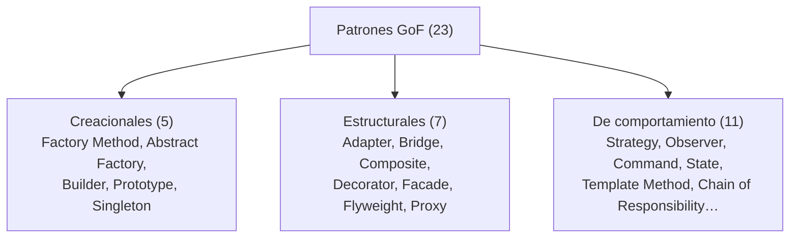
**Los 4 que más sirven:** **Strategy** (reemplaza `if/else` por tipo), **Adapter** (integrar legacy), **Proxy** (`@Transactional`), **Observer** (eventos). Tabla de dónde aplicarlos: [sección 04](README.md#s04).

### 14.2 · Arquitectura hexagonal

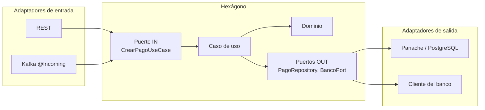
**Cuéntalo:** "El negocio está en el centro y no conoce frameworks. Define puertos, que son interfaces; REST, JPA y Kafka son adaptadores que los implementan. **La dependencia apunta hacia adentro.** Cambiar de base de datos es cambiar un adaptador."

### 14.3 · JPA: estados de una entidad

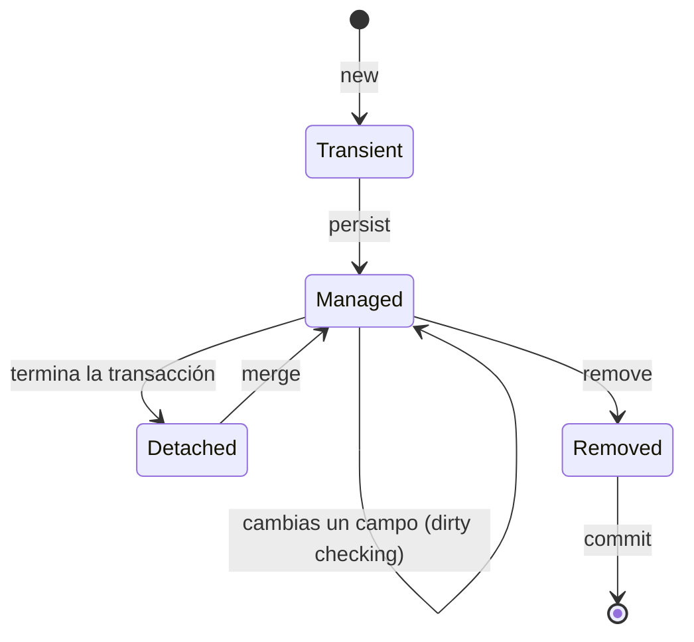
**Cuéntalo:** "Dentro de la transacción, una entidad *managed* está vigilada: si cambio un campo, Hibernate detecta el cambio y hace el `UPDATE` al hacer flush; no necesito `save`."

### 14.4 · El problema N+1

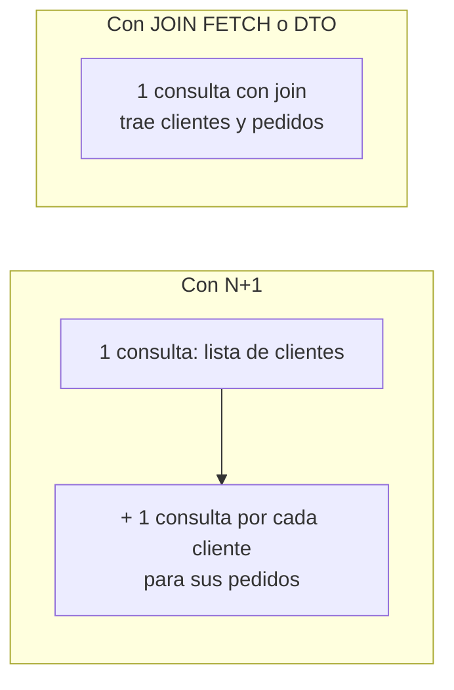
**Cuéntalo:** "Pido 50 clientes y, por cada uno, Hibernate hace otra consulta para sus pedidos: 51 consultas en lugar de una. Se arregla con `JOIN FETCH`, `@EntityGraph` o una proyección DTO. Lo detecto con el log de SQL."

### 14.5 · Pirámide de pruebas

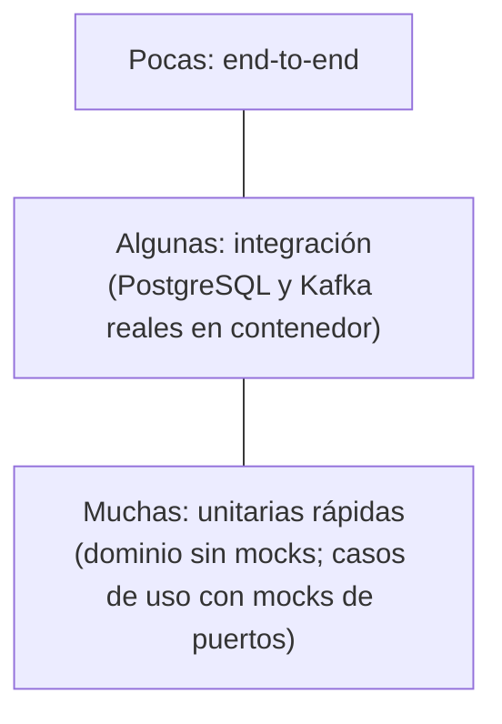
**Cuéntalo:** "Muchas unitarias porque son rápidas; el dominio sin frameworks y los casos de uso con mocks de los puertos. Integración con la base de datos real en contenedor, no H2. Pocas end-to-end."

### 14.6 · Quarkus: event loop y código bloqueante

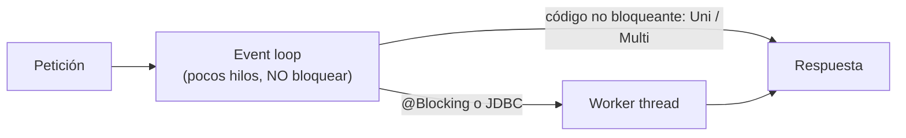
**Cuéntalo:** "Quarkus atiende con pocos hilos del event loop, que nunca deben bloquearse. Si mi código usa JDBC o Hibernate ORM, va a un worker thread con `@Blocking` o con un endpoint imperativo. Con Java 21, los virtual threads dan escala con código simple."

### 14.7 · SmallRye: de Kafka a tu código

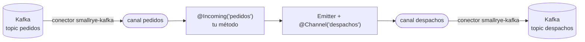
**Cuéntalo:** "Un canal es un nombre; el conector `smallrye-kafka` une el canal con un topic. `@Incoming` consume, `Emitter` produce. En Spring el equivalente es `@KafkaListener` más `KafkaTemplate`, o Spring Cloud Stream con bindings y `StreamBridge`."

### 14.8 · Kafka: topic, particiones y consumer groups

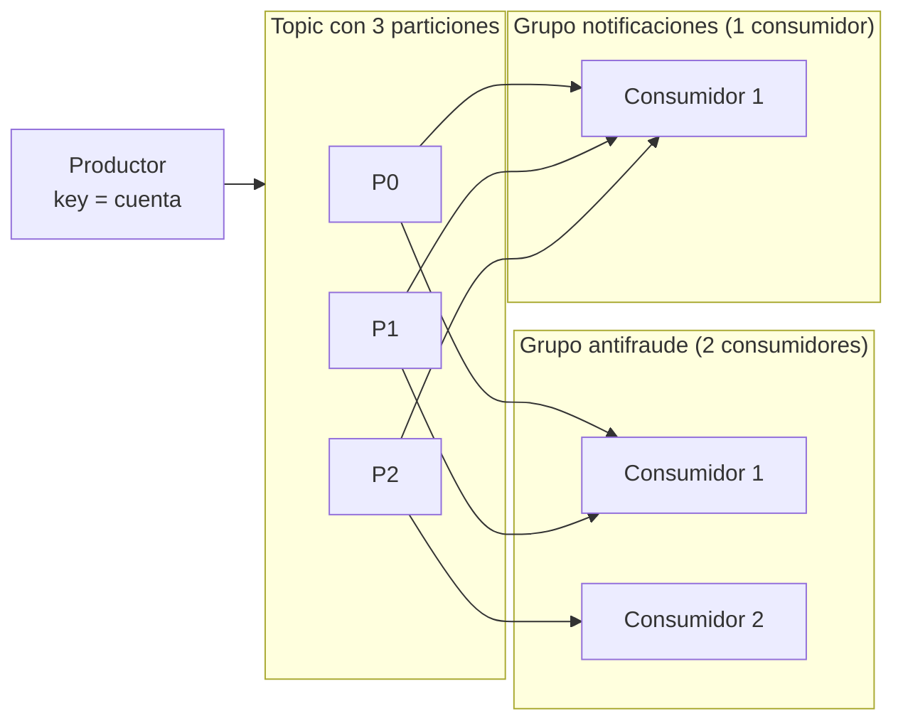
**Cuéntalo:** "El topic se divide en particiones; la key decide la partición, así que el orden vale **por partición**. Dentro de un grupo, cada partición la lee **un solo** consumidor; grupos distintos leen todo de forma independiente. Más consumidores que particiones, quedan ociosos."

### 14.9 · Kafka vs una cola

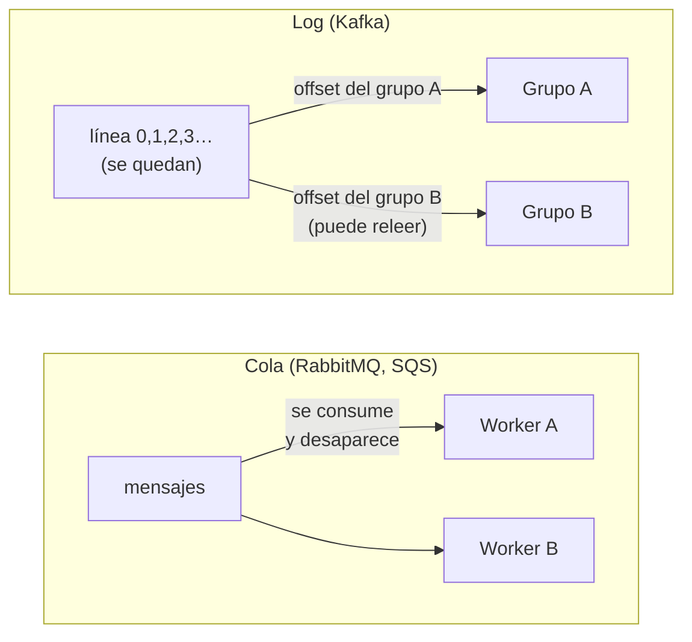
**Cuéntalo:** "En una cola, el mensaje es una tarea que se consume y desaparece, y los workers compiten por ella. En Kafka es un hecho que se queda; cada grupo lleva su offset y puede releer. Elijo por el problema: tareas, cola; hechos que varios consumen o quiero reprocesar, log."

### 14.10 · Outbox (guardar y publicar sin inconsistencias)

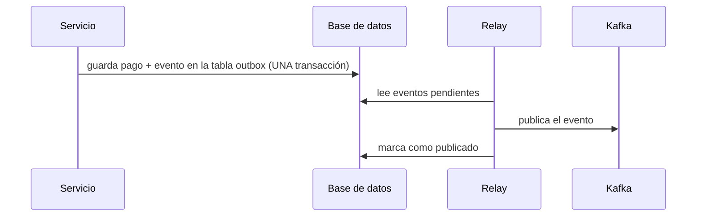
**Cuéntalo:** "Si guardo en la base de datos y publico a Kafka por separado, uno puede fallar y quedo inconsistente. Con Outbox guardo el dato y el evento en la misma transacción, y otro proceso publica después. La entrega queda *at-least-once*, así que el consumidor es idempotente."

### 14.11 · Circuit Breaker (estados)

```mermaid
stateDiagram-v2
    [*] --> CERRADO
    CERRADO --> ABIERTO: fallos superan el umbral
    ABIERTO --> SEMIABIERTO: pasa el tiempo de espera
    SEMIABIERTO --> CERRADO: las llamadas de prueba salen bien
    SEMIABIERTO --> ABIERTO: alguna llamada de prueba falla
```
**Cuéntalo:** "Cerrado: todo pasa y mido fallos. Si superan el umbral, abre: corto las llamadas y uso el fallback. Pasado un tiempo, semiabierto: dejo pasar unas pocas de prueba; si salen bien, cierro; si no, vuelvo a abrir." *(El fusible de la casa.)*

### 14.12 · Pago con timeout del banco (el estado que más se pregunta)

```mermaid
stateDiagram-v2
    [*] --> CREADO
    CREADO --> EN_PROCESO
    EN_PROCESO --> AUTORIZADO: el banco aprueba
    EN_PROCESO --> RECHAZADO: el banco rechaza
    EN_PROCESO --> PENDIENTE_CONFIRMACION: timeout del banco
    PENDIENTE_CONFIRMACION --> AUTORIZADO: consulta o conciliación
    PENDIENTE_CONFIRMACION --> RECHAZADO: consulta o conciliación
```
**Cuéntalo:** "Si el banco no responde no sé si cobró. **No reintento a ciegas**, porque podría cobrar dos veces: dejo el pago pendiente de confirmación y lo resuelvo consultando el estado o en la conciliación."

### 14.13 · CQRS

```mermaid
flowchart LR
    C["Comando<br/>CrearPago"] --> W["Modelo de escritura<br/>(reglas, transacción)"]
    W --> WDB[("BD de escritura")]
    WDB -->|"evento"| P["Proyector"]
    P --> RDB[("Vista de lectura<br/>desnormalizada")]
    Q["Consulta<br/>EstadoDelPago"] --> RDB
```
**Cuéntalo:** "Separo quién cambia el estado de quién lo consulta. Empiezo separando casos de uso en el mismo servicio, y solo muevo a bases distintas, con consistencia eventual, si la carga de lectura lo justifica."

### 14.14 · Pasarela de pagos (tu proyecto)

```mermaid
flowchart LR
    CAN[Canales] --> GW[API Gateway] --> PAY["Servicio de Pagos"]
    PAY --> DB[("BD: pago + outbox")]
    DB --> REL["Relay Outbox"] --> K[("Kafka")]
    SCH["Quartz (cluster)"] --> DB
    SCH --> K
    K --> PROC["Procesador"]
    PROC -->|"timeout + circuit breaker"| BANCO[Banco]
    PROC --> DB
    K --> NOTI[Notificaciones]
```
**Cuéntalo:** [sección 8](#c8). Detalle: [`caso-pasarela-pagos.md`](../../system-design/caso-pasarela-pagos.md).
