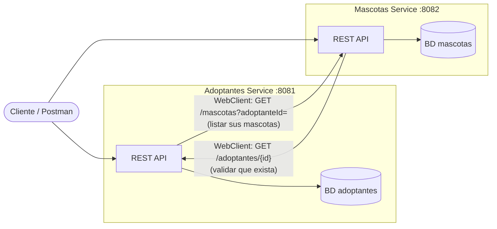
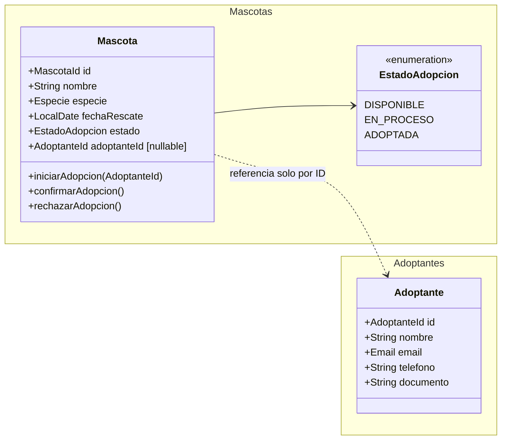
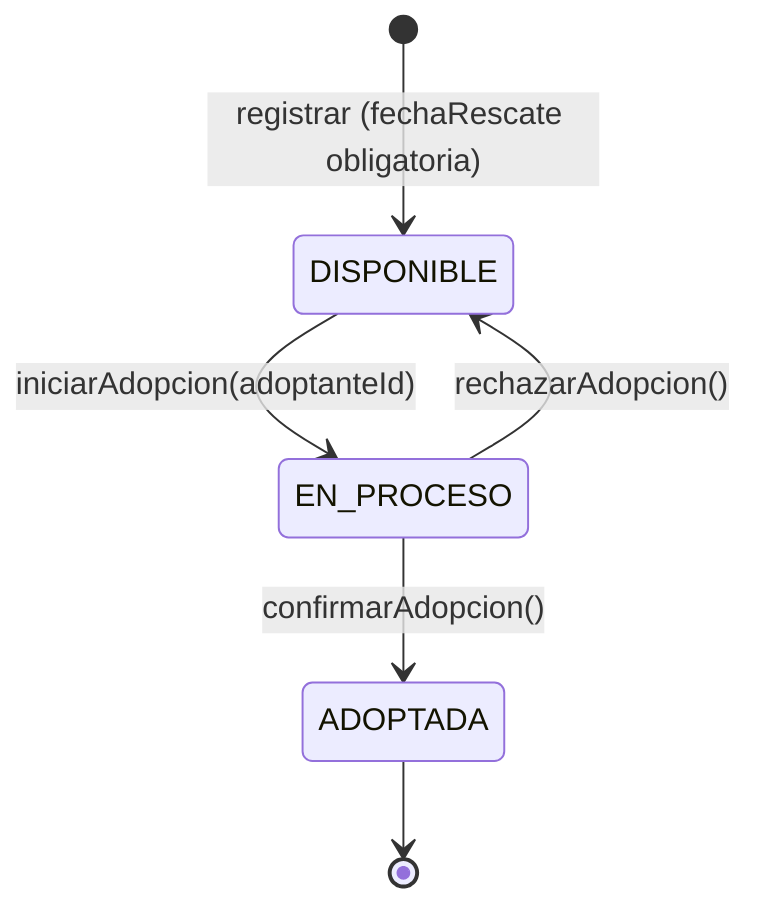
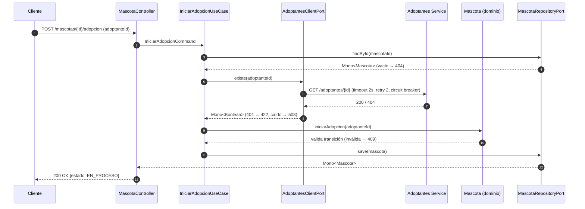

# Caso resuelto — Adoptantes y Mascotas (la entrevista ideal, paso a paso)

Reconstrucción de cómo tendría que haberse ejecutado una evaluación técnica en vivo con IA, sobre el **enunciado real** que me tocó. Es la versión "Senior / Tech Lead" del ejercicio: qué decir, qué dibujar, qué decidir, qué entregar y en qué minuto.

Metodología general (aplicable a cualquier enunciado): [`README.md`](README.md). Lo que salió mal la vez real: [`retrospectiva-2026-09-evaluacion-con-ia.md`](retrospectiva-2026-09-evaluacion-con-ia.md).

---

## 0. El enunciado

> Se requiere el desarrollo de una solución basada en **dos servicios principales: Adoptantes (Dueños) y Mascotas**.
>
> - **CRUD de Adoptantes.**
> - **CRUD de Mascotas.** Toda mascota debe tener asignada una **fecha de rescate** y debe poder **transicionar entre 3 estados**: "disponible", "en proceso" y "adoptada".
> - **Relación entre servicios:** relacionar a los adoptantes con las mascotas asignadas, **demostrando la comunicación o interacción entre ambos servicios**.
>
> Stack pedido: Spring WebFlux + Gradle.

### Lo que el enunciado evalúa (leer entre líneas)

| Frase del enunciado | Lo que en realidad están midiendo |
|---|---|
| "dos servicios principales" | ¿Entendés **límites de servicio** y que cada uno es dueño de sus datos? |
| "transicionar entre 3 estados" | ¿Modelás una **máquina de estados en el dominio** o hacés un `setEstado()` anémico? |
| "fecha de rescate" obligatoria | ¿Ponés **invariantes** en el dominio (no puede ser futura, no puede ser nula)? |
| "demostrando la comunicación entre ambos servicios" | ¿Sabés comunicar microservicios (sync/async), manejar **fallos** de la red y justificar la elección? |
| CRUD × 2 | Es el relleno. **No** es donde se gana la entrevista. |

> La trampa: el CRUD es el 70% del código y el 10% de la nota. El 90% de la nota está en los estados, la relación entre servicios y cómo lo explicás.

---

## 1. Línea de tiempo ideal (sesión de 60-90 min)

| Minuto | Fase | Qué se ve en pantalla | IA |
|---|---|---|---|
| 0-3 | Presentación | — | ❌ |
| 3-8 | **Entender**: reformular + preguntas | Notas en `DESIGN.md` | ❌ |
| 8-18 | **Modelar y dibujar** | 4 diagramas Mermaid en `DESIGN.md` | ❌ |
| 18-23 | **Decidir**: alternativas + ADRs cortos | Sección "Decisiones" en `DESIGN.md` | ❌ |
| 23-26 | **Plan**: cortes verticales y qué queda fuera | Lista de slices | ❌ |
| 26-65 | **Ejecutar** en slices chicos, revisando cada diff | Código + tests | ✅ |
| 65-72 | **Demostrar**: tests en verde + curl del flujo completo | Terminal | — |
| 72-80 | **Autocrítica**: qué cambiaría antes de producción | `DESIGN.md` → "Próximos pasos" | — |
| 80-90 | Preguntas del panel | — | — |

**Regla de oro:** durante los primeros ~25 minutos la IA **no se toca**. Ese es el tramo donde se ve la autonomía que pedía el feedback.

---

## 2. Paso 1 — Entender (min 3-8)

### 2.1 Reformular en voz alta

> "Entiendo que tengo que construir dos microservicios independientes, uno de Adoptantes y uno de Mascotas, cada uno con su CRUD. Lo interesante está en dos puntos: que la mascota tiene un ciclo de vida con tres estados, y que para asignarle una mascota a un adoptante los servicios tienen que hablarse. Voy a poner el foco ahí."

### 2.2 Preguntas al panel (elegir 3-4, no todas)

| Pregunta | Por qué importa | Supuesto si no responden |
|---|---|---|
| ¿Qué transiciones de estado son válidas? ¿Una adoptada puede volver a disponible (devolución)? | Define la máquina de estados | `DISPONIBLE → EN_PROCESO → ADOPTADA`, `EN_PROCESO → DISPONIBLE` (rechazo). `ADOPTADA` es terminal. |
| ¿Un adoptante puede tener varias mascotas? | Cardinalidad | Sí, 1 a N. |
| ¿Qué pasa si elimino un adoptante con mascotas en proceso o adoptadas? | Consistencia **entre servicios** | No se permite (409). |
| ¿Persistencia real o en memoria alcanza para hoy? | Alcance | Adapter en memoria detrás de un puerto; R2DBC + Postgres como siguiente paso. |
| ¿Dos repos o un monorepo? | Estructura | Monorepo Gradle multi-proyecto con dos apps desplegables por separado. |
| De todo esto, ¿qué es lo que más les interesa ver? | Priorizar el tiempo | La relación entre servicios y los estados. |

**Siempre anotar los supuestos en `DESIGN.md`.** Eso muestra criterio aunque nadie responda.

---

## 3. Paso 2 — Modelar y dibujar (min 8-18)

### 3.1 Contexto / componentes (C4 nivel 2)



> "Cada servicio es dueño de su base de datos (*database per service*). Nadie lee la tabla del otro: si Mascotas necesita saber algo de un adoptante, se lo pregunta por la API."

### 3.2 Modelo de dominio (dos bounded contexts)



Puntos a decir en voz alta:

- **Mascota referencia al adoptante solo por ID**, no por objeto. Son contextos distintos.
- **Invariantes en el dominio**, no en el controller:
  - `fechaRescate` obligatoria y no futura.
  - `adoptanteId` obligatorio en `EN_PROCESO` y `ADOPTADA`, y nulo en `DISPONIBLE`.
  - No se puede transicionar de forma inválida (`DISPONIBLE → ADOPTADA` directo, por ejemplo).
- **El dueño de la relación es Mascotas**, porque la asignación es una transición del ciclo de vida de la mascota.

### 3.3 Máquina de estados



> "No voy a exponer un `PATCH /estado` genérico donde el cliente manda el estado que quiera. Expongo **comandos con intención** (`iniciar`, `confirmar`, `rechazar`) y el dominio decide si la transición es válida. Si no lo es, devuelvo 409 Conflict."

### 3.4 Secuencia del flujo clave: asignar una mascota



### 3.5 Contrato de la API (esbozo)

| Servicio | Método y ruta | Notas |
|---|---|---|
| Adoptantes | `POST/GET/PUT/DELETE /adoptantes[/{id}]` | `DELETE` → 409 si tiene mascotas en proceso o adoptadas (consulta a Mascotas) |
| Adoptantes | `GET /adoptantes/{id}/mascotas` | **Composición:** llama a Mascotas `GET /mascotas?adoptanteId=` |
| Mascotas | `POST/GET/PUT/DELETE /mascotas[/{id}]` | `POST` crea siempre en `DISPONIBLE`. `PUT` **no** cambia estado. |
| Mascotas | `GET /mascotas?estado=&adoptanteId=` | Filtros |
| Mascotas | `POST /mascotas/{id}/adopcion` `{adoptanteId}` | `DISPONIBLE → EN_PROCESO` (valida adoptante contra el otro servicio) |
| Mascotas | `POST /mascotas/{id}/adopcion/confirmacion` | `EN_PROCESO → ADOPTADA` |
| Mascotas | `DELETE /mascotas/{id}/adopcion` | `EN_PROCESO → DISPONIBLE` (rechazo) |

---

## 4. Paso 3 — Decidir con alternativas (min 18-23)

Tres decisiones bastan. Cada una en formato **ADR corto** dentro de `DESIGN.md`:

### ADR-1 · Comunicación entre servicios: síncrona (WebClient) vs asíncrona (eventos)

- **Opción A — REST síncrono con WebClient:** simple, fácil de demostrar en vivo y con respuesta inmediata al cliente. Contra: acoplamiento temporal (si Adoptantes cae, no se puede adoptar).
- **Opción B — Eventos (Kafka/SQS):** desacopla y tolera caídas. Contra: consistencia eventual, más infraestructura, difícil de mostrar en 60 minutos.
- **Decisión:** A, porque necesito validar el adoptante **antes** de cambiar el estado (es una lectura, no una notificación) y el volumen no justifica un broker hoy. Mitigación: timeout + retry + circuit breaker (Resilience4j).
- **Evolución:** publicar `MascotaAdoptada` como evento cuando haya otros consumidores (notificaciones, facturación).

### ADR-2 · ¿Quién es dueño de la relación adoptante ↔ mascota?

- **Opción A — Mascotas guarda `adoptanteId`:** la asignación es parte del ciclo de vida de la mascota y la transición y la relación se actualizan en la misma transacción.
- **Opción B — Adoptantes guarda la lista de mascotas:** duplicaría el estado y obligaría a sincronizar dos escrituras entre servicios.
- **Decisión:** A. Adoptantes obtiene "mis mascotas" por **composición** (consulta a Mascotas).

### ADR-3 · Estructura del proyecto y persistencia

- **Proyecto:** monorepo Gradle multi-proyecto (`adoptantes-service`, `mascotas-service`), dos apps Spring Boot desplegables por separado, más `docker-compose.yml`.
- **Persistencia:** puerto `MascotaRepositoryPort` con un adapter en memoria para la demo. El siguiente paso es R2DBC + Postgres, **reactivo de punta a punta** (JPA bloquearía el event loop de WebFlux).
- **Arquitectura interna:** hexagonal (`domain` / `application` / `infrastructure`). Cambiar de memoria a Postgres = **escribir un adapter nuevo, sin tocar dominio ni casos de uso.**

---

## 5. Paso 4 — Plan de ejecución (min 23-26)

Cortar en **slices verticales**, de mayor a menor valor para la nota:

1. **Dominio Mascota + máquina de estados**, con tests unitarios puros (sin Spring). *Es el corazón.*
2. **Mascotas: caso de uso y API** (crear, consultar, transiciones) + tests con `WebTestClient`.
3. **Adoptantes: CRUD** (es lo más mecánico; acá la IA rinde al máximo).
4. **Comunicación:** `AdoptantesClientAdapter` con WebClient + tests con `MockWebServer` (200, 404, timeout).
5. **Composición:** `GET /adoptantes/{id}/mascotas`.
6. *(Si sobra tiempo)* Resilience4j, `docker-compose`, OpenAPI.

> Decirlo en voz alta: "Si el tiempo no alcanza, prefiero tener los slices 1, 2 y 4 impecables que los seis a medias."

---

## 6. Paso 5 — Ejecutar con IA, pero conduciendo yo (min 26-65)

### 6.1 El prompt: lo que hice vs lo que tenía que hacer

**Lo que usé (el que me descalificó):**

```text
Actua como arquitecto de soluciones y crea un proyecto spring webflux Gradle
[enunciado pegado completo]
```

→ Le delegué literalmente **el rol que me estaban evaluando** ("arquitecto de soluciones") y le pedí todo de una vez.

**Lo que tenía que usar (slice 1):**

```text
Contexto: DESIGN.md (adjunto). Arquitectura hexagonal, Java 21, sin Spring en el dominio.

Tarea SOLO del slice 1: el agregado Mascota en mascotas-service/domain.
1. Primero escribí los tests (JUnit 5, AssertJ) para estas reglas:
   - crear exige fechaRescate no nula y no futura; nace en DISPONIBLE sin adoptanteId
   - DISPONIBLE -> EN_PROCESO con iniciarAdopcion(adoptanteId)
   - EN_PROCESO -> ADOPTADA con confirmarAdopcion()
   - EN_PROCESO -> DISPONIBLE con rechazarAdopcion() (limpia adoptanteId)
   - cualquier otra transición lanza TransicionInvalidaException
2. Mostrame los tests y esperá mi OK antes de implementar.
No generes controllers, repositorios ni nada fuera del dominio.
```

La diferencia: **el diseño lo pongo yo** (reglas, estructura, límites) y la IA solo lo tipea. Además cada paso queda chico y revisable.

### 6.2 Cómo revisar cada diff en voz alta

Por cada entrega de la IA, decir **una de tres cosas**:

- "✅ Lo acepto porque..." (ej. "la transición está en el agregado, no en el servicio").
- "✏️ Lo corrijo: ..." (ej. "usó `Mono.just(repo.find())`, que evalúa ansiosamente; va `Mono.defer` o directamente el `Mono` del repo").
- "❌ Lo descarto: ..." (ej. "implementó sin test; volvemos atrás").

### 6.3 Errores típicos de la IA en **este** ejercicio (para cazarlos en vivo)

| Qué suele generar la IA | Por qué está mal | Corrección |
|---|---|---|
| `setEstado(Estado e)` público y `PATCH /estado` | Modelo anémico: cualquiera salta de `DISPONIBLE` a `ADOPTADA` | Métodos de comando en el agregado + endpoints con intención |
| `PUT /mascotas/{id}` que permite cambiar el estado | Salta la máquina de estados | `PUT` solo modifica datos descriptivos |
| Validaciones solo con `@Valid` en el DTO | La regla vive en el borde, no en el dominio | Invariantes en el constructor o fábrica del agregado; `@Valid` solo para el formato |
| Implementación antes de los tests | Rompe TDD (**me pasó en la entrevista**) | Frenar, borrar y pedir primero el test rojo |
| JPA / `spring-data-jpa` en un proyecto WebFlux | Bloquea el event loop | R2DBC o adapter en memoria |
| `.block()` dentro de un flujo reactivo | Bloqueo | Componer con `flatMap` |
| `map` donde se llama a otro `Mono` (el cliente HTTP) | Devuelve `Mono<Mono<T>>` | `flatMap` |
| `Mono` vacío sin manejar → 200 con body vacío | Debería ser 404 | `switchIfEmpty(Mono.error(new MascotaNoEncontrada(...)))` + handler global |
| WebClient sin timeout | Un servicio lento arrastra al otro | `.timeout(Duration.ofSeconds(2))` + retry con backoff solo en errores 5xx o de red |
| Un solo proyecto Spring con los dos "servicios" como paquetes | No demuestra la comunicación que pide el enunciado | Dos aplicaciones, dos puertos |

### 6.4 Tests que tienen que existir

- **Dominio:** tabla de transiciones válidas e inválidas (tests parametrizados). Sin Spring, en milisegundos.
- **Caso de uso:** `StepVerifier` con puertos mockeados (adoptante inexistente → error, mascota inexistente → error).
- **Adapter HTTP:** `MockWebServer` simulando Adoptantes con 200, 404 y respuesta lenta (timeout).
- **Controller:** `WebTestClient` verificando códigos 201 / 404 / 409 / 422.

---

## 7. Paso 6 — Demostrar (min 65-72)

1. `./gradlew test` en verde, **mostrando los tests del dominio primero**.
2. Levantar los dos servicios y recorrer el flujo con curl o HTTPie:
   - crear adoptante → crear mascota (queda `DISPONIBLE`)
   - `POST /mascotas/{id}/adopcion` → `EN_PROCESO`
   - intentar confirmar dos veces → la segunda da **409** (demuestra la máquina de estados)
   - `POST /adopcion` con un adoptante inexistente → **422** (demuestra la comunicación)
   - apagar Adoptantes y reintentar → **503** rápido, sin colgar (demuestra resiliencia)
   - `GET /adoptantes/{id}/mascotas` → composición entre servicios

---

## 8. Paso 7 — Autocrítica sin que la pidan (min 72-80)

> "Antes de producción cambiaría cinco cosas, en este orden:"

1. **Persistencia:** adapter R2DBC + Postgres (una base por servicio). Por el puerto, dominio y casos de uso no se tocan.
2. **Consistencia entre servicios:** hoy, si alguien borra un adoptante en paralelo a una adopción, hay una carrera. Lo resolvería con **borrado lógico** en Adoptantes y, a futuro, eventos `AdoptanteDesactivado` que Mascotas consuma.
3. **Resiliencia completa:** circuit breaker con Resilience4j y métricas del cliente HTTP.
4. **Observabilidad:** correlation ID propagado entre servicios (Micrometer Tracing) y logs estructurados.
5. **Seguridad:** los adoptantes tienen **datos personales** (documento, email). Hace falta autenticación entre servicios y no loguear PII.

Y lo que **a propósito dejé fuera**: paginación, auditoría y eventos. Decir *qué no hiciste y por qué* también es criterio.

---

## 9. Qué entregar al final

| Entregable | Contenido |
|---|---|
| `DESIGN.md` | Supuestos, 4 diagramas, 3 ADRs, plan por slices, próximos pasos |
| `settings.gradle` multi-proyecto | `adoptantes-service`, `mascotas-service` |
| Código hexagonal por servicio | `domain` / `application` / `infrastructure` (in: REST, out: repositorio y cliente HTTP) |
| Tests | Dominio (tabla de transiciones), casos de uso con StepVerifier, adapter con MockWebServer, controllers con WebTestClient |
| `README.md` | Cómo levantar, puertos, ejemplos curl del flujo completo |
| `docker-compose.yml` *(opcional)* | Los dos servicios (+ Postgres si llegué) |

Estructura esperada:

```text
adopciones/
├── DESIGN.md
├── README.md
├── settings.gradle
├── docker-compose.yml
├── adoptantes-service/
│   └── src/main/java/.../adoptantes/
│       ├── domain/            Adoptante, AdoptanteRepositoryPort
│       ├── application/       CrearAdoptanteUseCase, ...
│       └── infrastructure/
│           ├── in/rest/       AdoptanteController, DTOs
│           └── out/
│               ├── persistence/   InMemoryAdoptanteRepository
│               └── http/          MascotasClientAdapter
└── mascotas-service/
    └── src/main/java/.../mascotas/
        ├── domain/            Mascota, EstadoAdopcion, TransicionInvalidaException, ports
        ├── application/       IniciarAdopcionUseCase, ConfirmarAdopcionUseCase, ...
        └── infrastructure/
            ├── in/rest/       MascotaController, AdopcionController, GlobalErrorHandler
            └── out/
                ├── persistence/   InMemoryMascotaRepository
                └── http/          AdoptantesClientAdapter (WebClient + timeout/retry)
```

---

## 10. Preguntas probables del panel y respuestas modelo

**"¿Qué pasa si renombro o reemplazo la clase del repositorio en memoria?"** *(la que no entendí)*
> "Si la renombrás, solo cambia el adapter y el wiring de Spring, porque nadie depende de la clase concreta: el caso de uso depende de `MascotaRepositoryPort`. Si la **reemplazás** por Postgres, escribo `R2dbcMascotaRepository implements MascotaRepositoryPort` y el dominio y los casos de uso no se tocan. Esa es justamente la razón de usar hexagonal."

**"¿Por qué dos servicios y no uno?"**
> "Porque lo pide el enunciado y porque son dos contextos con ciclos de vida distintos. Aun así, en una startup chica arrancaría como **monolito modular** con los mismos límites y los separaría cuando haya un motivo real: equipos distintos, escalado distinto o despliegues independientes."

**"¿Y si el servicio de Adoptantes está caído?"**
> "La adopción falla rápido con 503 gracias al timeout y al circuit breaker, sin colgar hilos. Consultar y listar mascotas sigue funcionando porque no depende de Adoptantes. Si el negocio necesitara aceptar la solicitud igual, pasaría a un flujo asíncrono: `EN_PROCESO` pendiente de validación y confirmación por evento."

**"¿Dónde vive la lógica de las transiciones? ¿Por qué no en el service?"**
> "En el agregado `Mascota`. Si la pongo en el service, cualquier otro service puede saltársela. En el agregado, la única forma de cambiar el estado es pasando por las reglas."

**"¿Cómo testeás la comunicación entre servicios?"**
> "El caso de uso, con el puerto mockeado. El adapter, con `MockWebServer` simulando 200, 404 y lentitud. Y como siguiente paso, un **contract test** (Spring Cloud Contract o Pact) para que un cambio en Adoptantes no rompa a Mascotas sin enterarnos."

**"¿Aplicarías CQRS acá?"**
> "Hoy no, sería sobreingeniería. Tendría sentido si `GET /adoptantes/{id}/mascotas` se vuelve una consulta muy frecuente que cruza servicios: ahí armaría un read model alimentado por eventos para no componer en cada request."

**"¿Por qué WebFlux?"**
> "Este servicio espera I/O, sobre todo la llamada HTTP al otro servicio. Con WebFlux no bloqueo un hilo por request mientras espero. Pero exige que todo sea no bloqueante: R2DBC en vez de JPA y nada de `.block()`. Con Java 21, virtual threads + MVC sería una alternativa válida y más simple de depurar, y lo diría."

---

## 11. Senior vs Tech Lead: qué agrega cada nivel

| Dimensión | Senior | Tech Lead (además) |
|---|---|---|
| Análisis | Modela dominio, estados y contratos | Pregunta por el negocio y prioriza qué construir primero |
| Decisiones | Alternativas + trade-offs técnicos | Trade-offs de **equipo, costo y operación** ("¿quién mantiene el broker?") |
| Código | Limpio, testeado, hexagonal | Define **estándares** para que otros repliquen el patrón |
| IA | La usa con criterio y la corrige | Explica **cómo la adoptaría el equipo** (agentes compartidos, reglas de revisión) |
| Cierre | Autocrítica técnica | Roadmap: "esto en el sprint 1, esto en el 2, esto se habla con Producto" |
| Comunicación | Explica el porqué | Adapta el mensaje al público (dev, producto, negocio) |

---

## 12. Rúbrica de autoevaluación (usala después de cada simulacro)

Puntuá de 0 a 2 cada fila (0 = no lo hice, 1 = a medias, 2 = claro y en voz alta).

| # | Criterio | Real (2026-09) | Objetivo |
|---|---|---|---|
| 1 | Reformulé y pregunté antes de tocar la IA | 0 | 2 |
| 2 | Modelé el dominio (entidades, invariantes) | 0 | 2 |
| 3 | Dibujé al menos contexto + estados + secuencia | 0 | 2 |
| 4 | Planteé alternativas y decidí con trade-offs | 0 | 2 |
| 5 | La IA recibió **mi** diseño, en slices | 0 | 2 |
| 6 | Revisé cada diff y **corregí** al menos un error | 1 | 2 |
| 7 | Tests primero (TDD real, no mencionado) | 0 | 2 |
| 8 | Demostré el flujo funcionando, incluidos los errores | 1 | 2 |
| 9 | Autocrítica espontánea (3+ mejoras) | 0 | 2 |
| 10 | Conocimiento conceptual (reactivo, patrones, resiliencia) | 2 | 2 |
| 11 | Pedí aclaración ante preguntas ambiguas | 0 | 2 |
| | **Total** | **4 / 22** | **≥ 18 / 22** |

La lectura de la columna "Real" es la conclusión de todo este documento: **el conocimiento está (fila 10). Lo que falta es el proceso visible (filas 1-9).** Y el proceso se entrena.
