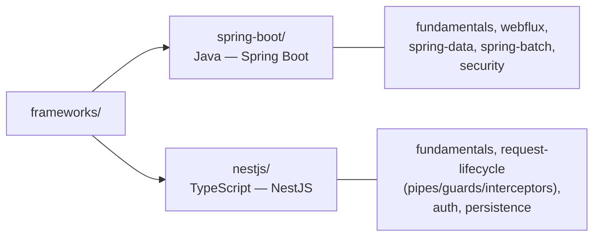

# Frameworks

Píldoras de framework de backend, una carpeta por framework — separadas de la teoría agnóstica de lenguaje (arquitectura, DDD, patrones) que vive en sus propias carpetas raíz. Acá va lo específico de **cómo se implementa** cada concepto en un framework concreto.

## Por qué esta carpeta existe separada de la teoría

- [`software-architectures/`](../software-architectures), [`ddd/`](../ddd) y [`design-pattern/`](../design-pattern) documentan **conceptos**, agnósticos de framework — un Aggregate o un puerto/adaptador existen conceptualmente sin importar si el código es Java o TypeScript.
- `frameworks/<nombre>/` documenta cómo esos conceptos **se cablean en código real** con un framework concreto: qué anotación/decorador usar, qué clase hereda de qué, qué trampa de configuración es específica de esa librería.
- Regla práctica para no duplicar contenido: si la explicación no cambiaría al cambiar de framework, va en la carpeta de teoría (con un link desde acá); si es "así es como Spring/Nest resuelve esto en particular", va en `frameworks/`.
- **Excepción explícita — Project Reactor**: en la práctica de este repo, Reactor solo se usa vía Spring WebFlux, así que la guía completa de `Mono`/`Flux`/operadores vive directamente en [`spring-boot/webflux.md`](spring-boot/webflux.md) + [`spring-boot/webflux-operators.md`](spring-boot/webflux-operators.md) en vez de en una carpeta de teoría separada — priorizar una sola guía de estudio ordenada pesó más que la pureza de la separación.

## Frameworks cubiertos

| Framework | Carpeta | Lenguaje/runtime | Cobertura |
|---|---|---|---|
| **Spring Boot** | [`spring-boot/`](spring-boot) | Java (JVM) | Fundamentos, WebFlux, Spring Data (JPA/R2DBC), Spring Batch, Spring Security. |
| **NestJS** | [`nestjs/`](nestjs) | TypeScript (Node.js) | Fundamentos, ciclo de vida del request (Pipes/Guards/Interceptors/Filters), Auth (Passport/JWT/Auth0), persistencia (TypeORM/Prisma). |

Cada carpeta trae su propio `README.md` con la tabla completa de temas documentados y pendientes.

## Cómo se leen en paralelo (analogía punto a punto)

Los dos frameworks resuelven los mismos problemas con vocabulario distinto — cuando ya conocés uno, el otro se aprende por analogía más que desde cero:

| Problema | Spring Boot | NestJS |
|---|---|---|
| Adaptador de entrada HTTP | `@RestController` | `@Controller()` |
| Lógica de negocio / orquestación | `@Service` | `@Injectable()` (Provider) |
| Contenedor de inyección de dependencias | `ApplicationContext` (IoC container) | Nest IoC Container |
| Validación de entrada | `@Valid` + Bean Validation | `ValidationPipe` + `class-validator` |
| Manejo centralizado de errores | `@RestControllerAdvice` | Exception Filters |
| Autenticación/autorización | Spring Security (`SecurityFilterChain`) | Passport (`AuthGuard`) + Guards custom |
| ORM | Spring Data JPA (Hibernate) / R2DBC | TypeORM / Prisma |
| Procesamiento reactivo | WebFlux + Project Reactor (`Mono`/`Flux`) | RxJS (`Observable`) — más acotado a Interceptors/streams, no a toda la capa web por defecto |

Relacionado: [`../ddd/`](../ddd) para el modelado de dominio que ambos frameworks terminan sirviendo, [`../software-architectures/hexagonal-architecture.md`](../software-architectures/hexagonal-architecture.md) para el layout de carpetas hexagonal (hoy documentado del lado Java — la variante TypeScript/NestJS de ese mismo layout queda pendiente de sumar ahí), [`spring-boot/webflux.md`](spring-boot/webflux.md) para Project Reactor en profundidad, y [`../microservices-patterns/`](../microservices-patterns) para patrones que aplican sin importar cuál de los dos frameworks esté detrás.
