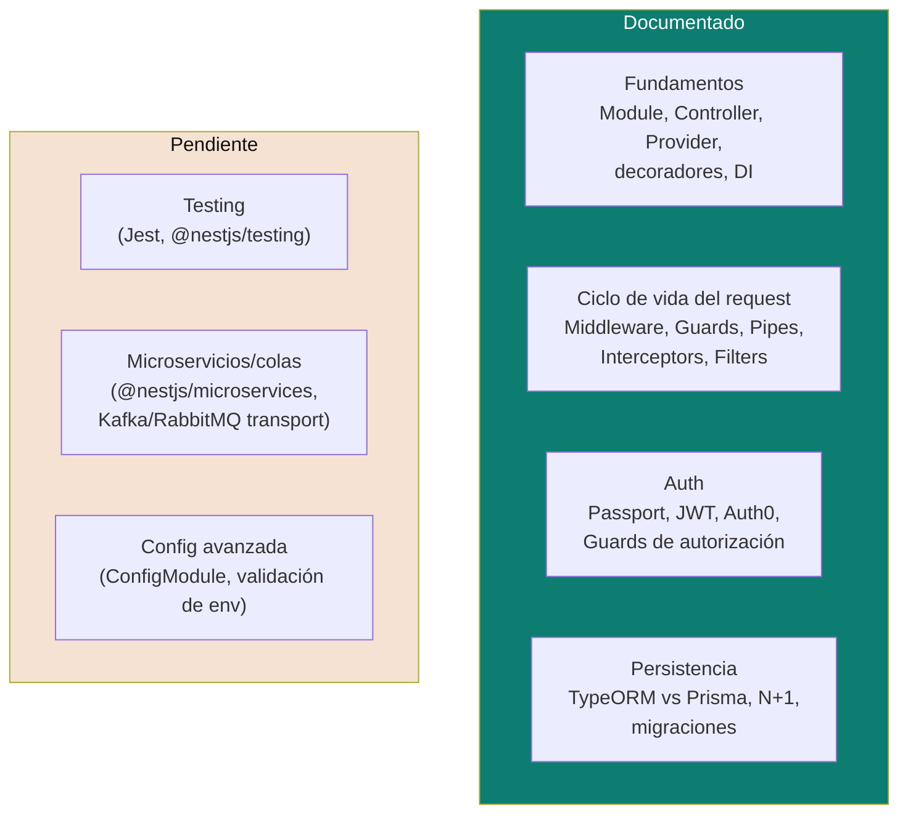

# NestJS

Píldoras de repaso de NestJS para entrevista de senior developer, con analogía directa a Spring Boot ([`../spring-boot/`](../spring-boot)) donde ayuda — mismos conceptos (IoC/DI, adaptador HTTP, ORM, autenticación), distinta sintaxis y ecosistema (TypeScript/Node en vez de Java/JVM).

## Cobertura actual

| Tema | Doc | Idea central en una línea |
|---|---|---|
| **Fundamentos** | [`fundamentals.md`](fundamentals.md) | Module/Controller/Provider y su equivalencia directa con Spring Boot, decoradores como mecanismo de metadata, DI por constructor, Providers custom (`useClass`/`useValue`) como base del patrón puerto/adaptador en Nest. |
| **Ciclo de vida del request** | [`request-lifecycle.md`](request-lifecycle.md) | El orden exacto Middleware → Guards → Interceptors → Pipes → Handler — qué mecanismo usar para autorización, validación, logging/transformación de respuesta, y mapeo de excepciones. |
| **Auth** | [`auth.md`](auth.md) | Passport + `JwtStrategy` + Auth0 (JWKS, audience/issuer), Guards de autenticación vs. autorización, y el caso de autorización a nivel de dato (Broken Object Level Authorization). |
| **Persistencia** | [`persistence.md`](persistence.md) | TypeORM vs Prisma, el problema N+1 en Node, por qué separar la entidad de persistencia del modelo de dominio, y el riesgo de `synchronize: true` en producción. |
| Testing | ⏳ Pendiente | `@nestjs/testing`, mockear Providers, testing de Guards/Pipes/Interceptors aislados. |
| Microservicios/colas | ⏳ Pendiente | `@nestjs/microservices`, transportes (Kafka, RabbitMQ, Redis), patrón request-response vs. event-based. |
| Config avanzada | ⏳ Pendiente | `ConfigModule` con validación de variables de entorno (`Joi`/`class-validator`), configuración por ambiente. |

## Cómo estudiar esta carpeta

1. [`fundamentals.md`](fundamentals.md) primero — resuelve el vocabulario base (Module/Controller/Provider) que todo lo demás asume.
2. [`request-lifecycle.md`](request-lifecycle.md) — la pregunta de entrevista más específica de NestJS (el orden Guards/Pipes/Interceptors/Filters no tiene un equivalente tan explícito en Spring).
3. [`auth.md`](auth.md) y [`persistence.md`](persistence.md) se leen en cualquier orden — proyectos satélite independientes entre sí.

Relacionado: [`../spring-boot/`](../spring-boot) para la analogía punto a punto con el otro framework de este repo, [`../../ddd/`](../../ddd) para el modelado de dominio (agnóstico de framework) que estos documentos asumen al hablar de Entity/Repository, y [`../../software-architectures/hexagonal-architecture.md`](../../software-architectures/hexagonal-architecture.md) para dónde encaja cada pieza dentro de un layout hexagonal.

## Referencias

- [NestJS — Documentation](https://docs.nestjs.com/) — fuente oficial de todo lo cubierto acá.
