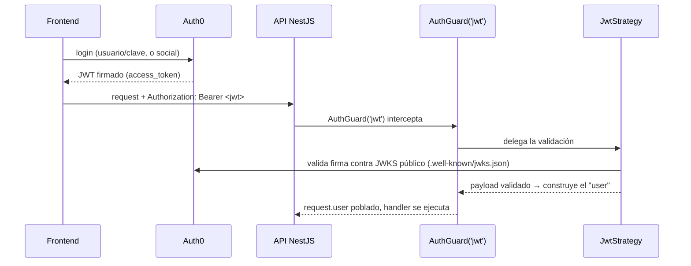

# Autenticación y autorización en NestJS — Passport, JWT, Auth0

La pregunta que dispara este documento: *"¿por qué mi `AuthGuard('jwt')` no encuentra ningún usuario en `request.user`?"* — casi siempre porque falta la `Strategy` que le dice a Passport **cómo** validar el token y **qué** poner en `request.user`. Nest no reinventa autenticación: se apoya en **Passport.js** (la librería estándar de Node) y expone sus estrategias como Guards (ver [`request-lifecycle.md`](request-lifecycle.md) para dónde encaja un Guard en el ciclo del request).

## El flujo completo con un Identity Provider externo (Auth0)



La API **nunca ve una contraseña** — igual principio que en Spring Security con OAuth2 Resource Server (ver [`../spring-boot/security.md`](../spring-boot/security.md)): Auth0 emite el JWT, la API solo valida la firma y lee los claims.

## `JwtStrategy` — el punto donde se valida el token

```typescript
@Injectable()
export class JwtStrategy extends PassportStrategy(Strategy, 'jwt') {
  constructor(configService: ConfigService) {
    super({
      secretOrKeyProvider: passportJwtSecret({
        jwksUri: `https://${configService.get('AUTH0_DOMAIN')}/.well-known/jwks.json`,
        cache: true,
        rateLimit: true,
      }),
      audience: configService.get('AUTH0_AUDIENCE'),
      issuer: `https://${configService.get('AUTH0_DOMAIN')}/`,
      algorithms: ['RS256'],
    });
  }

  validate(payload: JwtPayload) {
    // lo que retorna acá es exactamente lo que Nest pone en request.user
    return { userId: payload.sub, permissions: payload.permissions ?? [] };
  }
}
```

- `passportJwtSecret` con `jwksUri` es el equivalente exacto a `issuer-uri` en Spring Boot: descubre y cachea las claves públicas de Auth0 para validar la firma `RS256`, sin copiar una clave a mano.
- `validate()` corre **después** de que la firma ya se verificó — su único trabajo es decidir qué forma tiene `request.user` de ahí en adelante. Si retorna `null`/`undefined`, o lanza una excepción, Passport responde `401 Unauthorized` automáticamente.
- `audience`/`issuer` explícitos evitan aceptar un JWT válido pero emitido para **otra** aplicación (mismo Auth0 tenant, otra audiencia) — un error de configuración común que abre una brecha de autenticación cruzada entre apps.

## `AuthModule` — cómo se cablea

```typescript
@Module({
  imports: [PassportModule.register({ defaultStrategy: 'jwt' }), ConfigModule],
  providers: [JwtStrategy],
  exports: [PassportModule],
})
export class AuthModule {}

// uso en cualquier controller:
@UseGuards(AuthGuard('jwt'))
@Get('me')
getProfile(@Req() req) {
  return req.user; // { userId, permissions } — lo que devolvió JwtStrategy.validate()
}
```

`AuthGuard('jwt')` es un Guard **genérico** de `@nestjs/passport` que delega en la estrategia registrada con ese nombre (`'jwt'`) — no hay que escribir el Guard a mano, solo registrar la Strategy.

## Autorización — Guard custom + decorador `@Permissions()`

Una vez autenticado (`request.user` poblado), la autorización es un Guard **separado**, igual que en Spring (`RolesGuard` en [`request-lifecycle.md`](request-lifecycle.md)):

```typescript
export const Permissions = (...permissions: string[]) => SetMetadata('permissions', permissions);

@Injectable()
export class PermissionsGuard implements CanActivate {
  constructor(private reflector: Reflector) {}

  canActivate(context: ExecutionContext): boolean {
    const required = this.reflector.get<string[]>('permissions', context.getHandler());
    if (!required) return true;
    const { user } = context.switchToHttp().getRequest();
    return required.every((p) => user.permissions.includes(p));
  }
}

// uso:
@UseGuards(AuthGuard('jwt'), PermissionsGuard)
@Permissions('appointments:write')
@Post()
create(@Body() dto: CreateAppointmentDto) { ... }
```

**El orden de los Guards en `@UseGuards(...)` importa**: `AuthGuard('jwt')` primero (resuelve *quién*), `PermissionsGuard` después (resuelve *qué puede hacer*, usando el `request.user` que el primero ya dejó listo) — invertirlos rompe todo, porque `PermissionsGuard` necesitaría un `user` que todavía no existe.

## Autorización a nivel de dato — el caso que un entrevistador senior busca

Igual que en la nota de Spring Security sobre Broken Object Level Authorization (ver [`../spring-boot/security.md`](../spring-boot/security.md)): un `PermissionsGuard` que solo chequea el scope global (`appointments:write`) no evita que un paciente autenticado reagende el turno **de otro paciente** cambiando un `id` en la URL. Esa validación es más fina que un Guard genérico puede resolver con metadata estática — se hace explícitamente dentro del Service, comparando el dueño del recurso (`appointment.patientId`) contra `request.user.userId`, **no** delegándola completa a un Guard.

## Drills de repaso

| Tiempo | Pregunta |
|---|---|
| 4 min | "¿Por qué la API nunca valida la contraseña del usuario si el login pasa por Auth0?" |
| 5 min | "¿Qué se rompe si invertís el orden de `@UseGuards(PermissionsGuard, AuthGuard('jwt'))`?" |
| 4 min | "¿Dónde poner la validación de que un usuario solo puede modificar SU PROPIO turno, y por qué no alcanza con un Guard genérico?" |
| 4 min | "¿Qué hace `validate()` en una `JwtStrategy` y en qué momento del flujo se ejecuta respecto a la verificación de firma?" |

## Referencias

- [NestJS — Authentication](https://docs.nestjs.com/security/authentication) — integración con Passport, `JwtStrategy`, Guards.
- [NestJS — Authorization](https://docs.nestjs.com/security/authorization) — RBAC básico con Guards + `Reflector`.
- [Auth0 — Node.js/NestJS API Quickstart](https://auth0.com/docs/quickstart/backend) — configuración de JWKS, audience, issuer.

Relacionado: [`request-lifecycle.md`](request-lifecycle.md) para dónde encajan los Guards en el ciclo del request, y [`../spring-boot/security.md`](../spring-boot/security.md) para el mismo problema resuelto del lado de Spring Security (`SecurityFilterChain`, OAuth2 Resource Server).
