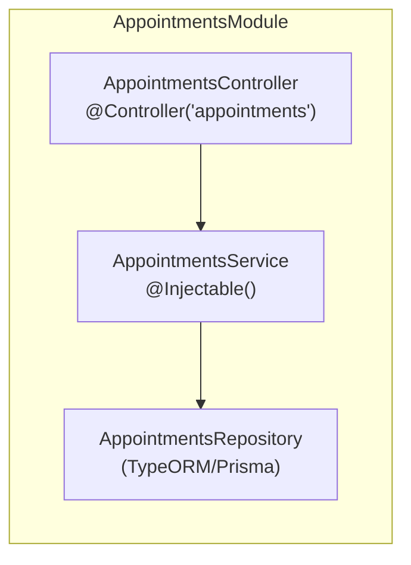

# NestJS — fundamentos (Módulos, Controllers, Providers)

La pregunta que dispara este documento: *"¿por qué mi `@Injectable()` aparece automáticamente en el constructor de mi controller, sin que yo lo instancie?"* — porque NestJS trae el mismo mecanismo de **Inversion of Control (IoC)** y **Dependency Injection (DI)** que Spring, aplicado sobre Node/Express (o Fastify) en vez de la JVM. Si ya conocés Spring Boot (ver [`../spring-boot/fundamentals.md`](../spring-boot/fundamentals.md)), este documento se lee más rápido por analogía directa.

## Mapa mental — equivalencias directas con Spring Boot

| NestJS | Spring Boot | Rol |
|---|---|---|
| `@Module()` | Un paquete + `@Configuration` | Agrupa Controllers/Providers relacionados y declara qué expone (`exports`) y qué importa de otros módulos. |
| `@Controller()` | `@RestController` | Adaptador de entrada HTTP — recibe el request, delega al Provider, devuelve la respuesta. |
| `@Injectable()` (Provider/Service) | `@Service` | Contiene la lógica — inyectado donde haga falta vía constructor. |
| `@Module({ providers: [...] })` | `@ComponentScan` + `@Bean` | Registra qué Providers existen y son inyectables dentro de ese módulo. |
| Nest IoC Container | `ApplicationContext` | Contenedor que instancia y cablea todo — vos nunca hacés `new UserService()`. |
| `main.ts` (`NestFactory.create(AppModule)`) | `@SpringBootApplication` + `main()` | Punto de entrada que arranca el contenedor. |

> **Frase para entrevista:** "NestJS le trae a Node.js la misma arquitectura de Angular/Spring: módulos, inyección de dependencias por constructor, y decoradores que declaran el rol de cada clase — en vez de Express puro, donde vos cableás todo a mano."

## Los 3 bloques que arman cualquier feature



```typescript
// appointments.module.ts
@Module({
  controllers: [AppointmentsController],
  providers: [AppointmentsService, AppointmentsRepository],
  exports: [AppointmentsService], // visible para otros módulos que lo importen
})
export class AppointmentsModule {}

// appointments.controller.ts
@Controller('appointments')
export class AppointmentsController {
  constructor(private readonly appointmentsService: AppointmentsService) {} // DI por constructor, igual que Spring

  @Get(':id')
  findOne(@Param('id') id: string): Promise<AppointmentDto> {
    return this.appointmentsService.findById(id);
  }

  @Post()
  create(@Body() dto: CreateAppointmentDto): Promise<AppointmentDto> {
    return this.appointmentsService.create(dto);
  }
}

// appointments.service.ts
@Injectable()
export class AppointmentsService {
  constructor(private readonly repository: AppointmentsRepository) {}

  async findById(id: string): Promise<AppointmentDto> {
    const appointment = await this.repository.findById(id);
    if (!appointment) throw new NotFoundException(`Appointment ${id} not found`);
    return toDto(appointment);
  }
}
```

- **`private readonly` en el constructor** es la forma estándar de Nest de declarar e inyectar una dependencia en una sola línea (TypeScript convierte el parámetro en propiedad de la clase automáticamente) — el equivalente a Lombok `@RequiredArgsConstructor` sobre campos `private final` en Spring.
- El `Controller` **no** debería tener lógica de negocio — solo mapear el request HTTP a una llamada al Service y el resultado a una respuesta. Igual regla que un `@RestController` en hexagonal (ver [`software-architectures/hexagonal-architecture.md`](../../software-architectures/hexagonal-architecture.md)): el adaptador de entrada orquesta, no decide.

## Decoradores — cómo Nest lee metadata en runtime

Nest usa **decoradores de TypeScript** (`@Controller`, `@Injectable`, `@Get`, `@Body`, `@Param`) para adjuntar metadata a clases/métodos/parámetros, que el framework lee en runtime vía `reflect-metadata` para saber cómo cablear todo — es el mecanismo equivalente a cómo Spring lee anotaciones vía reflexión de la JVM.

| Decorador | Para qué |
|---|---|
| `@Module()` | Declara un módulo — agrupa controllers/providers/imports/exports. |
| `@Controller(prefix)` | Marca la clase como adaptador HTTP, con un prefijo de ruta opcional. |
| `@Injectable()` | Marca la clase como Provider — inyectable vía constructor en otra clase. |
| `@Get()`/`@Post()`/`@Put()`/`@Delete()` | Mapea un método del controller a un verbo + ruta HTTP. |
| `@Param()`/`@Query()`/`@Body()`/`@Headers()` | Extraen datos del request hacia parámetros del método — equivalente a `@PathVariable`/`@RequestParam`/`@RequestBody` de Spring. |
| `@Injectable({ scope: Scope.REQUEST })` | Cambia el ciclo de vida del Provider — por defecto es singleton (una instancia para toda la app, igual que un bean de Spring); `REQUEST` crea una instancia nueva por cada request entrante (más costoso, solo cuando hace falta estado por-request). |

## Módulos — cómo se organiza una app más allá de un solo feature

```typescript
@Module({
  imports: [AppointmentsModule, PatientsModule, ConfigModule.forRoot()],
})
export class AppModule {}
```

- Un módulo solo puede inyectar Providers que **el propio módulo declara** o que otro módulo **exporta explícitamente** — esto es lo que da el equivalente a "límites de bounded context" a nivel de módulo (ver [`ddd/bounded-context.md`](../../ddd/bounded-context.md) para el concepto de fondo): `PatientsModule` no puede usar un Provider interno de `AppointmentsModule` que no esté en su array `exports`.
- `ConfigModule.forRoot()` es el patrón estándar para variables de entorno (`.env`) — equivalente a `application.yml` + `@ConfigurationProperties` en Spring Boot.
- Un módulo puede ser `@Global()` para estar disponible en toda la app sin que cada módulo lo importe explícitamente (uso típico: un módulo de logging o de config) — usar con moderación, rompe la ventaja de límites explícitos entre módulos si se abusa.

## DTOs y validación — `class-validator` + `ValidationPipe`

```typescript
export class CreateAppointmentDto {
  @IsUUID()
  patientId: string;

  @IsDateString()
  scheduledAt: string;

  @IsOptional()
  @IsString()
  @MaxLength(500)
  notes?: string;
}
```

Con un `ValidationPipe` global (`app.useGlobalPipes(new ValidationPipe())` en `main.ts`), Nest valida automáticamente el body contra estos decoradores **antes** de que el método del controller se ejecute — equivalente directo a `@Valid` + Bean Validation (`@NotNull`/`@Size`) en Spring. El detalle de Pipes como mecanismo general (no solo validación) está en [`request-lifecycle.md`](request-lifecycle.md).

## Providers más allá de Services — la generalización que confunde al principio

"Provider" en Nest es un concepto más amplio que "Service": cualquier cosa que el contenedor IoC puede inyectar. Un `@Injectable()` que envuelve un cliente HTTP, un logger custom, o una constante de configuración (`useValue`) son todos Providers, no solo las clases con lógica de negocio:

```typescript
@Module({
  providers: [
    AppointmentsService,
    { provide: 'APP_CONFIG', useValue: { timezone: 'America/Bogota' } }, // provider por valor, no por clase
    { provide: NotificationPort, useClass: EmailNotificationAdapter },    // provider por interfaz/token, igual a un port/adapter de hexagonal
  ],
})
export class AppointmentsModule {}
```

El patrón `{ provide: NotificationPort, useClass: EmailNotificationAdapter }` es exactamente el mecanismo que permite hexagonal en NestJS: el Service depende de `NotificationPort` (un token/interfaz), y el módulo decide en un solo lugar qué implementación concreta se inyecta — cambiar de adapter (de email a SMS, por ejemplo) no toca el Service.

## Drills de repaso

| Tiempo | Pregunta |
|---|---|
| 4 min | "¿Por qué un `AppointmentsController` no debería tener lógica de negocio, más allá de mapear el request al Service?" |
| 5 min | "¿Cómo lográs que dos módulos se comuniquen sin acoplarlos directamente al Provider interno del otro?" |
| 4 min | "¿Qué diferencia hay entre un Provider `useClass` y uno `useValue`? Dá un ejemplo de cada uno." |
| 5 min | "Explicá, con una analogía a Spring Boot, qué hace `@Module()` y por qué hace falta declarar `exports`." |

## Referencias

- [NestJS — Documentation: Modules](https://docs.nestjs.com/modules), [Controllers](https://docs.nestjs.com/controllers), [Providers](https://docs.nestjs.com/providers) — la fuente oficial de estos tres bloques.
- [NestJS — Custom Providers](https://docs.nestjs.com/fundamentals/custom-providers) — `useValue`/`useClass`/`useFactory`, la base del patrón puerto/adaptador en Nest.

Relacionado: [`request-lifecycle.md`](request-lifecycle.md) para Pipes/Guards/Interceptors/Filters (el ciclo de vida completo de un request), [`auth.md`](auth.md) para autenticación con Auth0/Passport, [`persistence.md`](persistence.md) para TypeORM/Prisma, y [`../spring-boot/fundamentals.md`](../spring-boot/fundamentals.md) para la analogía punto a punto con Spring Boot.
