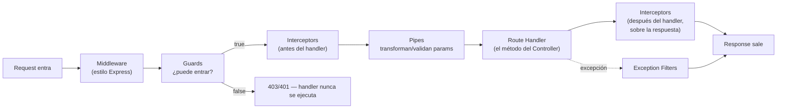

# Ciclo de vida de un request — Middleware, Guards, Pipes, Interceptors, Filters

La pregunta que dispara este documento: *"¿en qué orden se ejecutan un `Guard`, un `Pipe` y un `Interceptor` si los tres apuntan al mismo endpoint?"* — y la respuesta ordenada es exactamente el mapa de este documento. Es la pregunta más frecuente de entrevista sobre NestJS específicamente, porque a diferencia de Spring (donde el filtro de seguridad, la validación y el manejo de errores viven en mecanismos separados y menos visibles), Nest expone los 5 puntos de extensión como conceptos de primera clase con nombre propio.

## El orden de ejecución — la respuesta que hay que saber de memoria



**Middleware → Guards → Interceptors (pre) → Pipes → Handler → Interceptors (post) → [Exception Filters si algo lanzó]**. Cada uno responde una pregunta distinta — mezclarlos (ej. validar en un Guard, o autorizar en un Pipe) es la señal de diseño que un entrevistador senior detecta enseguida.

## Guards — "¿puede entrar esta request?" (autorización)

```typescript
@Injectable()
export class RolesGuard implements CanActivate {
  constructor(private reflector: Reflector) {}

  canActivate(context: ExecutionContext): boolean {
    const requiredRoles = this.reflector.get<string[]>('roles', context.getHandler());
    if (!requiredRoles) return true;
    const { user } = context.switchToHttp().getRequest();
    return requiredRoles.some((role) => user.roles?.includes(role));
  }
}

// uso:
@UseGuards(AuthGuard('jwt'), RolesGuard)
@Roles('admin')
@Delete(':id')
remove(@Param('id') id: string) { ... }
```

- Un Guard devuelve `true`/`false` (o lanza una excepción) — si devuelve `false`, el handler **nunca se ejecuta**, Nest responde automáticamente con `403 Forbidden`.
- `AuthGuard('jwt')` (de `@nestjs/passport`) es el Guard que resuelve **autenticación** (¿quién sos?) antes de que `RolesGuard` resuelva **autorización** (¿qué podés hacer?) — misma distinción que en Spring Security (ver [`../spring-boot/security.md`](../spring-boot/security.md)), solo que acá cada responsabilidad es un Guard separado y explícito en el orden del decorador `@UseGuards(...)`.
- El `Reflector` es cómo un Guard lee metadata puesta por un decorador custom (`@Roles('admin')`) sobre el handler — mecanismo general de Nest para leer decoradores propios en runtime.

## Pipes — "¿este dato es válido, y en qué forma lo necesito?" (validación/transformación)

```typescript
@Get(':id')
findOne(@Param('id', ParseUUIDPipe) id: string) { ... } // lanza 400 automático si "id" no es un UUID válido

@Post()
create(@Body(new ValidationPipe()) dto: CreateAppointmentDto) { ... } // valida contra los decoradores de class-validator
```

- Un Pipe transforma o valida **un argumento** antes de que llegue al handler — si falla, lanza una excepción (típicamente `BadRequestException`, 400) y el handler no se ejecuta.
- Pipes de transformación (`ParseIntPipe`, `ParseUUIDPipe`, `DefaultValuePipe`) vs. Pipes de validación (`ValidationPipe` contra un DTO con decoradores de `class-validator`, ver [`fundamentals.md`](fundamentals.md)) — la misma abstracción cubre ambos casos porque conceptualmente son lo mismo: "tomar un input crudo y producir un valor confiable, o rechazarlo".
- **Global vs. por-ruta**: `app.useGlobalPipes(new ValidationPipe())` en `main.ts` aplica a toda la app (el caso más común para validación de DTOs); `@Body(new ValidationPipe())` en un método puntual es la excepción cuando un endpoint necesita una regla distinta al resto.

## Interceptors — "¿qué hago antes Y después del handler?" (AOP)

```typescript
@Injectable()
export class LoggingInterceptor implements NestInterceptor {
  intercept(context: ExecutionContext, next: CallHandler): Observable<any> {
    const start = Date.now();
    const req = context.switchToHttp().getRequest();
    return next.handle().pipe(
      tap(() => console.log(`${req.method} ${req.url} — ${Date.now() - start}ms`)),
    );
  }
}
```

- Es el único de los cinco mecanismos que envuelve **ambos lados** del handler — antes de que corra (`context...` antes de `next.handle()`) y después, sobre el `Observable` de la respuesta (`.pipe(...)` después de `next.handle()`). Equivalente conceptual a AOP `@Around` en Spring, o a un middleware que también toca la respuesta de salida.
- Usos típicos: logging con timing, transformar la forma de la respuesta (envolver todo en `{ data: ... }`), cachear resultados, mapear el `Observable` de RxJS que Nest usa internamente para componer estos pasos.
- `ClassSerializerInterceptor` (built-in) aplica los decoradores `@Exclude()`/`@Expose()` de `class-transformer` sobre la entidad de respuesta — la forma estándar de Nest de garantizar que un campo sensible (`passwordHash`) nunca se serialice en el JSON de salida, sin tener que armar un DTO de respuesta a mano para cada caso.

## Exception Filters — "¿cómo se ve un error hacia afuera?"

```typescript
@Catch(AppointmentNotFoundException)
export class AppointmentNotFoundFilter implements ExceptionFilter {
  catch(exception: AppointmentNotFoundException, host: ArgumentsHost) {
    const response = host.switchToHttp().getResponse();
    response.status(404).json({
      statusCode: 404,
      message: exception.message,
      error: 'Not Found',
    });
  }
}

// global, en main.ts:
app.useGlobalFilters(new AppointmentNotFoundFilter());
```

- Equivalente directo a `@RestControllerAdvice` + `@ExceptionHandler` de Spring (ver [`../spring-boot/webflux.md`](../spring-boot/webflux.md)) — centraliza el mapeo excepción de dominio → respuesta HTTP, en vez de un `try/catch` repetido en cada controller.
- Una excepción de negocio (`AppointmentNotFoundException`) debería definirse en la capa de dominio/aplicación, no en `infrastructure` — el Filter (que sí es infraestructura HTTP) es quien la traduce a un status code, igual regla que en hexagonal Java: el hecho de negocio vive en el dominio, el mapeo a HTTP vive en el borde.
- `HttpException` (built-in de Nest, con sus subclases `NotFoundException`, `BadRequestException`, `ForbiddenException`) ya cubre el caso común sin necesitar un Filter custom — un Filter propio se justifica cuando la excepción es específica del dominio y no una de las genéricas HTTP.

## Middleware — el más parecido a Express puro

```typescript
@Injectable()
export class RequestIdMiddleware implements NestMiddleware {
  use(req: Request, res: Response, next: NextFunction) {
    req['requestId'] = req.headers['x-request-id'] ?? randomUUID();
    next();
  }
}

// configurado en el AppModule:
export class AppModule implements NestModule {
  configure(consumer: MiddlewareConsumer) {
    consumer.apply(RequestIdMiddleware).forRoutes('*');
  }
}
```

- Corre **antes que todo lo demás** (incluso antes que los Guards) — no tiene acceso al `ExecutionContext` de Nest, solo al request/response crudos de Express/Fastify. Por eso no es el lugar correcto para autorización (necesita el contexto de Nest para leer decoradores) ni para lógica de negocio — es para lo más genérico y transversal (correlación de requests, parseo de headers crudos, compresión).

## Cuál usar para qué — tabla de decisión rápida

| Necesito... | Uso |
|---|---|
| Verificar si el usuario puede acceder a este endpoint | **Guard** |
| Validar o transformar un parámetro/body antes del handler | **Pipe** |
| Loggear, medir tiempo, transformar la respuesta, cachear | **Interceptor** |
| Mapear una excepción a un formato de respuesta específico | **Exception Filter** |
| Algo transversal muy genérico, sin necesidad del contexto de Nest | **Middleware** |

## Drills de repaso

| Tiempo | Pregunta |
|---|---|
| 5 min | "Ordená de memoria: Middleware, Guard, Pipe, Interceptor, Exception Filter — ¿en qué secuencia corren en una request exitosa?" |
| 4 min | "¿Por qué la validación de un DTO va en un Pipe y no en un Guard?" |
| 5 min | "¿Qué hace distinto a un Interceptor de los otros 4 mecanismos, en términos de en qué momentos del ciclo puede actuar?" |
| 4 min | "Tenés que ocultar el campo `passwordHash` de toda respuesta JSON sin tocar cada controller. ¿Qué mecanismo usás?" |

## Referencias

- [NestJS — Guards](https://docs.nestjs.com/guards), [Pipes](https://docs.nestjs.com/pipes), [Interceptors](https://docs.nestjs.com/interceptors), [Exception Filters](https://docs.nestjs.com/exception-filters), [Middleware](https://docs.nestjs.com/middleware) — documentación oficial de cada mecanismo, con el diagrama de orden de ejecución.

Relacionado: [`fundamentals.md`](fundamentals.md) para dónde encajan estos mecanismos dentro de un módulo/controller, [`auth.md`](auth.md) para el Guard de autenticación (`AuthGuard('jwt')`) en detalle, y [`../spring-boot/security.md`](../spring-boot/security.md) para el equivalente Guard→autorización del lado de Spring (`SecurityFilterChain`/`@PreAuthorize`).
