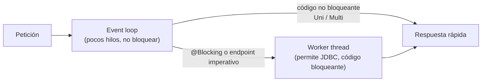

# Quarkus — guía de estudio (con Spring Boot como punto de comparación)

Quarkus es un framework Java para microservicios y cloud, pensado para arrancar rápido y gastar poca memoria. Si ya conoces Spring Boot, **ya sabes el 80%**: cambian los nombres de las anotaciones y *cuándo* se hace el trabajo de arranque.

> Mensajería con Kafka (SmallRye Reactive Messaging): [`smallrye-reactive-messaging.md`](smallrye-reactive-messaging.md) · Persistencia: [`persistencia-hibernate-postgresql.md`](persistencia-hibernate-postgresql.md) · Testing: [`../../tdd/junit5-mockito.md`](../../tdd/junit5-mockito.md) · Spring Boot: [`../spring-boot/`](../spring-boot)

## 🍎 Con manzanas (empieza aquí)

Imagina dos fruterías que abren a las 8:00.

- **Spring Boot** llega a las 7:00 y, **al abrir**, revisa qué hay que preparar: lee las etiquetas de cada caja, decide dónde va cada cosa y arma los estantes. Es flexible, pero tarda en abrir.
- **Quarkus** hizo ese trabajo **la noche anterior** (en el *build*): cuando abre la tienda, todo ya está acomodado. Abre en un instante y usa menos espacio.

Esa es toda la diferencia de fondo: **Quarkus mueve el trabajo pesado del arranque al momento de compilar**.

| Concepto | Spring Boot | Quarkus |
|---|---|---|
| Cuándo se configura la aplicación | Al arrancar (reflexión en runtime) | **En el build** (menos reflexión) |
| Inyección de dependencias | Spring DI | **CDI** (implementación: *ArC*) |
| Arranque y memoria | Más lento, más memoria | Más rápido, menos memoria; imagen nativa con GraalVM |
| Desarrollo | Reinicio con DevTools | **Dev mode** con recarga en vivo (`quarkus dev`) |
| Servicios de apoyo en desarrollo | Testcontainers manual | **Dev Services**: levanta Kafka o PostgreSQL en contenedor solo |

### Qué debes dominar según tu nivel

| Nivel | Debes poder explicar |
|---|---|
| 🟢 **Junior** | Qué es Quarkus; que usa CDI (`@Inject`, `@ApplicationScoped`); cómo se define un endpoint; qué es `application.properties`; dev mode |
| 🟡 **Mid** | Equivalencias con Spring; Panache; `@Transactional`; `@ConfigProperty`; Dev Services; Fault Tolerance con anotaciones; `@QuarkusTest` y `@InjectMock` |
| 🔴 **Senior** | Por qué el procesamiento en build mejora el arranque; imperativo vs reactivo y el modelo de hilos (event loop, `@Blocking`); imagen nativa y sus restricciones; cuándo elegir Quarkus y cuándo Spring |

## 1. Equivalencias Spring Boot → Quarkus (la tabla para salvar la entrevista)

| Spring Boot | Quarkus | Nota |
|---|---|---|
| `@Service`, `@Component` | `@ApplicationScoped` | Un solo bean compartido |
| `@Autowired` | `@Inject` | Inyección por constructor también vale |
| `@Value("${x}")` | `@ConfigProperty(name = "x")` | O `@ConfigMapping` para grupos |
| `@RestController` + `@GetMapping` | `@Path` + `@GET` | Jakarta REST (JAX-RS) |
| `@RequestBody`, `@PathVariable` | Cuerpo directo, `@PathParam`, `@QueryParam` | |
| `@ControllerAdvice` | `@ServerExceptionMapper` / `ExceptionMapper` | |
| `@Transactional` | `@Transactional` (Jakarta) | Igual de usado |
| `JpaRepository` | `PanacheRepository` o `PanacheEntity` | Ver [persistencia](persistencia-hibernate-postgresql.md) |
| `@Scheduled` | `@Scheduled` (`quarkus-scheduler`) o extensión Quartz | |
| `KafkaTemplate`, `@KafkaListener` | `Emitter`, `@Incoming` / `@Outgoing` | Ver [mensajería](smallrye-reactive-messaging.md) |
| Resilience4j | SmallRye Fault Tolerance (`@Retry`, `@CircuitBreaker`...) | MicroProfile |
| Actuator | `quarkus-smallrye-health`, Micrometer | `/q/health`, `/q/metrics` |
| springdoc | `quarkus-smallrye-openapi` | `/q/openapi`, `/q/swagger-ui` |
| `@SpringBootTest` | `@QuarkusTest` | |
| `@MockBean` | `@InjectMock` | `quarkus-junit5-mockito` |
| `application.yml` | `application.properties` (o YAML con extensión) | Perfiles `%dev.`, `%test.`, `%prod.` |

## 2. Un servicio mínimo

```java
@Path("/pagos")
@Produces(MediaType.APPLICATION_JSON)
@Consumes(MediaType.APPLICATION_JSON)
public class PagoResource {

    private final CrearPagoUseCase crearPago;          // puerto de entrada (hexagonal)

    @Inject
    public PagoResource(CrearPagoUseCase crearPago) { this.crearPago = crearPago; }

    @POST
    public Response crear(@Valid CrearPagoRequest req) {
        PagoId id = crearPago.ejecutar(req.toComando());
        return Response.status(Response.Status.CREATED)
                       .location(URI.create("/pagos/" + id.value())).build();
    }

    @GET @Path("/{id}")
    public PagoResponse obtener(@PathParam("id") UUID id) { ... }
}
```

```properties
# application.properties
quarkus.datasource.db-kind=postgresql
%prod.quarkus.datasource.jdbc.url=jdbc:postgresql://db:5432/pagos
quarkus.hibernate-orm.database.generation=none        # el esquema lo maneja Flyway
mp.messaging.outgoing.pagos-eventos.connector=smallrye-kafka
mp.messaging.outgoing.pagos-eventos.topic=pagos.solicitados.v1
```

## 3. Modelo de hilos: imperativo vs reactivo (la pregunta senior)

Quarkus corre sobre **Vert.x** y un **event loop**: pocos hilos que **nunca deben bloquearse** atendiendo muchísimas conexiones.



| Estilo | Cómo se escribe | Cuándo |
|---|---|---|
| **Imperativo** | Métodos normales que devuelven un objeto; Quarkus los ejecuta en un *worker thread* | Lo más común, más fácil de depurar. Con Hibernate ORM (JDBC bloqueante) |
| **Reactivo** | Métodos que devuelven `Uni<T>` o `Multi<T>` (Mutiny); corren en el event loop | Mucha concurrencia con I/O; con Hibernate Reactive o clientes reactivos |
| **Virtual threads** (Java 21) | Código imperativo con `@RunOnVirtualThread` | Escribir código simple y bloqueante con alta concurrencia |

**Regla de oro:** nunca bloquear el event loop (JDBC, `Thread.sleep`, llamadas HTTP síncronas). Si hay que bloquear, `@Blocking` o un endpoint imperativo.

### Mutiny: `Uni` y `Multi` (el equivalente de `Mono` y `Flux`)

| Reactor (Spring WebFlux) | Mutiny (Quarkus) | Significado |
|---|---|---|
| `Mono<T>` | `Uni<T>` | 0 o 1 resultado |
| `Flux<T>` | `Multi<T>` | 0 a N resultados |
| `map` | `onItem().transform(...)` | Transformar el valor |
| `flatMap` | `onItem().transformToUni(...)` | Encadenar otra operación asíncrona |
| `onErrorReturn` | `onFailure().recoverWithItem(...)` | Valor por defecto ante error |
| `retry(3)` | `onFailure().retry().atMost(3)` | Reintentar |
| `subscribe()` | `subscribe().with(...)` | Nada corre hasta suscribirse (perezoso) |

```java
public Uni<PagoResponse> obtener(UUID id) {
    return pagos.buscar(id)                                          // Uni<Pago>
        .onItem().ifNull().failWith(() -> new NotFoundException())
        .onItem().transform(PagoResponse::from);
}
```

Todo lo de Reactor que ya conoces ([`../spring-boot/webflux.md`](../spring-boot/webflux.md), [`../spring-boot/webflux-operators.md`](../spring-boot/webflux-operators.md)) aplica: **perezoso, no bloquear, `map` vs `flatMap`**. Solo cambian los nombres.

## 4. Resiliencia: SmallRye Fault Tolerance (MicroProfile)

| Anotación | Qué hace |
|---|---|
| `@Timeout` | Corta si tarda demasiado |
| `@Retry` | Reintenta (`maxRetries`, `delay`, `jitter`, `retryOn`) |
| `@CircuitBreaker` | Abre el circuito tras un umbral de fallos (`requestVolumeThreshold`, `failureRatio`, `delay`, `successThreshold`) |
| `@Bulkhead` | Limita llamadas concurrentes |
| `@Fallback` | Método alternativo si todo falla |
| `@Asynchronous` | Ejecuta de forma asíncrona |

```java
@Retry(maxRetries = 3, delay = 200, jitter = 100)
@Timeout(2000)
@CircuitBreaker(requestVolumeThreshold = 10, failureRatio = 0.5, delay = 10000)
@Fallback(fallbackMethod = "pendiente")
public ResultadoBanco cobrar(Pago pago) { return bancoClient.cobrar(pago); }

ResultadoBanco pendiente(Pago pago) { return ResultadoBanco.pendienteConfirmacion(pago.id()); }
```

**Cómo interactúan (la trampa que preguntan):** un `TimeoutException` **dispara el reintento** si hay `@Retry`, y **cuenta como fallo** para el `@CircuitBreaker`. Por eso se combinan con cuidado. Los patrones (estados del Circuit Breaker, backoff, bulkhead) están en [`../../entrevistas/archivo/arkano-senior-java-developer/README.md`](../../entrevistas/archivo/arkano-senior-java-developer/README.md) sección 16.

## 5. Otras piezas que conviene nombrar

| Pieza | Para qué |
|---|---|
| **Dev Services** | Levanta PostgreSQL, Kafka, etc. en contenedor automáticamente en dev y test |
| **Dev UI** (`/q/dev`) | Panel de desarrollo con extensiones, config, bean graph |
| **Extensiones** | Cada capacidad es una extensión (`quarkus extension add ...`) |
| **Perfiles** | `%dev.`, `%test.`, `%prod.` en `application.properties` |
| **Imagen nativa** | GraalVM/Mandrel compila a ejecutable: arranque en milisegundos, menos memoria. Costo: build más lento y restricciones con reflexión |
| **Health y métricas** | `/q/health/live`, `/q/health/ready`, `/q/metrics` |
| **OpenAPI** | `/q/openapi` generado de las anotaciones |
| **Seguridad** | `quarkus-oidc`, `@RolesAllowed` |
| **Rest Client** | `@RegisterRestClient` con una interfaz (como Feign) |

## 6. Preguntas de entrevista con escalera de respuesta

| Pregunta | 🟢 Junior | 🟡 Mid | 🔴 Senior |
|---|---|---|---|
| **¿Qué es Quarkus y por qué se usa?** | "Un framework Java que arranca rápido y gasta poca memoria, bueno para microservicios y contenedores." | "Hace el trabajo de configuración en el build y usa CDI; tiene dev mode, Dev Services y soporta imagen nativa." | "Optimiza arranque y memoria, que en Kubernetes con autoescalado y serverless importa en costo; a cambio el ecosistema es menor que el de Spring." |
| **Diferencia con Spring Boot** | "Spring usa `@Autowired`, Quarkus `@Inject`; arranca más rápido." | "Spring configura en runtime con reflexión; Quarkus en build. DI con CDI/ArC. Panache vs Spring Data." | "Elijo según el contexto: Spring si el equipo y el ecosistema ya están ahí; Quarkus si el arranque, la memoria o lo nativo son críticos. Los conceptos (hexagonal, resiliencia, mensajería) son los mismos." |
| **¿Reactivo o imperativo?** | "Imperativo es lo normal; reactivo usa `Uni` y `Multi`." | "El reactivo corre en el event loop y no puede bloquear; el imperativo en un worker thread. Hibernate ORM es bloqueante." | "Reactivo solo si hay mucha concurrencia de I/O y todo el camino es no bloqueante; con Java 21 los virtual threads dan escala con código simple." |
| **¿Cómo pruebas?** | "Con `@QuarkusTest` y JUnit." | "`@InjectMock` para mockear beans, RestAssured para HTTP, Dev Services para la BD y Kafka." | "Pirámide: unitarios puros del dominio sin Quarkus (rápidos), pocos `@QuarkusTest` de integración con Dev Services, y `InMemoryConnector` para mensajería." |

## Referencias

- [Quarkus: guía de Kafka](https://quarkus.io/guides/kafka)
- [Quarkus: SmallRye Fault Tolerance](https://quarkus.io/guides/smallrye-fault-tolerance)
- [Quarkus vs Spring Boot (comparativa)](https://rollbar.com/blog/quarkus-vs-spring-boot)
