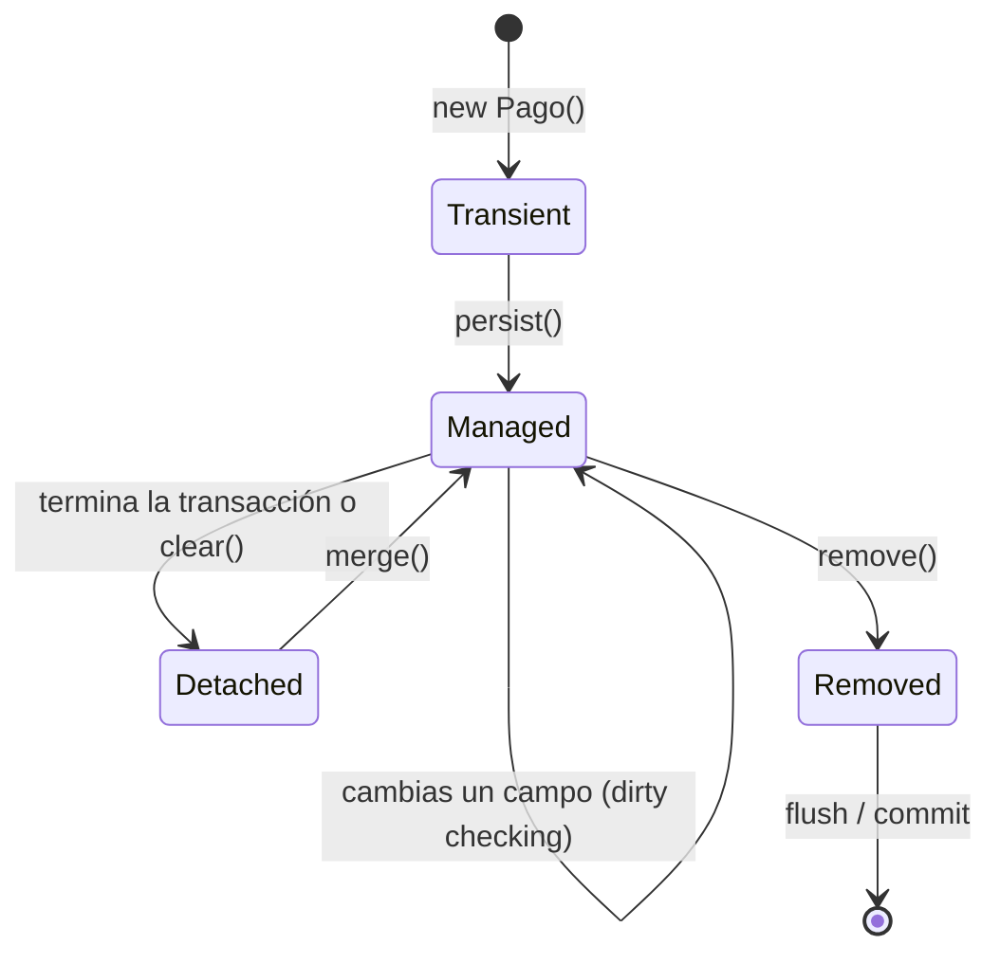

# PostgreSQL con JPA / Hibernate (con Panache en Quarkus)

Lo que se pregunta cuando dicen "PostgreSQL con JPA/Hibernate": cómo se mapean las entidades, qué hace Hibernate por debajo, los problemas típicos (N+1, lazy loading, transacciones) y qué aporta PostgreSQL. Aplica igual en Spring Data JPA y en Quarkus.

> Más sobre bases de datos: [`../../system-design/02-databases-sql-vs-nosql.md`](../../system-design/02-databases-sql-vs-nosql.md) · Spring Data: [`../spring-boot/spring-data.md`](../spring-boot/spring-data.md) · Quarkus: [`README.md`](README.md)

## 🍎 Con manzanas (empieza aquí)

- **PostgreSQL** es el **archivo de la frutería**: fichas ordenadas en cajones (tablas), con un índice por nombre para encontrar una ficha sin revisar todas.
- **JPA** es el **reglamento** que dice cómo pasar de "una manzana en el código" (objeto) a "una ficha en el archivo" (fila). **Hibernate** es el **empleado** que lo cumple.
- Hibernate lleva una **libreta de lo que tocaste** (el *persistence context*): cuando terminas el trabajo (la transacción), compara la libreta con el archivo y **escribe solo los cambios**.
- **N+1:** pides la lista de 50 clientes (1 consulta) y, por cada uno, el empleado va al archivo a buscar sus pedidos (50 consultas más). Mejor: pedir todo junto en un solo viaje.

### Qué debes dominar según tu nivel

| Nivel | Debes poder explicar |
|---|---|
| 🟢 **Junior** | `@Entity`, `@Id`, `@Table`, `@Column`; relaciones `@OneToMany` y `@ManyToOne`; qué es `@Transactional`; qué es un repositorio |
| 🟡 **Mid** | Lazy vs eager; el problema N+1 y `JOIN FETCH`/`@EntityGraph`; estados de una entidad; `@Version`; DTOs y proyecciones; Flyway; Panache |
| 🔴 **Senior** | Persistence context y *dirty checking*; flush; niveles de aislamiento y MVCC de PostgreSQL; índices y `EXPLAIN ANALYZE`; bloqueo optimista vs pesimista, `SKIP LOCKED`; pool de conexiones; batch inserts y secuencias; cuándo **no** usar el ORM |

## 1. Mapeo básico

```java
@Entity
@Table(name = "pago")
public class PagoEntity {

    @Id
    @GeneratedValue(strategy = GenerationType.SEQUENCE)   // mejor que IDENTITY para batch
    private Long id;

    @Column(nullable = false, unique = true)
    private String idempotencyKey;

    @Column(nullable = false, precision = 19, scale = 2)
    private BigDecimal monto;                             // dinero: nunca double

    @Enumerated(EnumType.STRING)                           // nunca ORDINAL
    private EstadoPago estado;

    @Version
    private long version;                                  // bloqueo optimista

    @OneToMany(mappedBy = "pago", cascade = CascadeType.ALL, orphanRemoval = true)
    private List<PagoEventoEntity> eventos = new ArrayList<>();
}
```

| Anotación | Para qué |
|---|---|
| `@Entity`, `@Table`, `@Column` | Mapear clase a tabla y campo a columna |
| `@Id` + `@GeneratedValue` | Clave primaria; `SEQUENCE` en PostgreSQL permite insertar en lote |
| `@ManyToOne`, `@OneToMany`, `@ManyToMany`, `@OneToOne` | Relaciones |
| `@Enumerated(STRING)` | Guardar el nombre del enum, no su posición |
| `@Version` | Bloqueo optimista |
| `@Embeddable` / `@Embedded` | Value objects (por ejemplo `Dinero`) |
| `@JdbcTypeCode(SqlTypes.JSON)` | Columna `jsonb` de PostgreSQL |

## 2. Estados de una entidad y el persistence context



- **Transient:** objeto nuevo que Hibernate no conoce.
- **Managed (persistent):** dentro de la transacción, Hibernate lo vigila. **Si cambias un campo, no necesitas llamar a `save`**: al hacer *flush* detecta el cambio (**dirty checking**) y emite el `UPDATE`.
- **Detached:** fuera de la transacción; los cambios no se guardan solos.
- **Primer nivel de caché:** dentro de una transacción, buscar la misma entidad dos veces no repite la consulta.
- **Flush:** momento en que se envían los cambios a la base de datos (antes de una consulta o al hacer commit).

## 3. Los problemas clásicos (lo que más se pregunta)

### N+1

```java
List<Cliente> clientes = repo.findAll();                 // 1 consulta
clientes.forEach(c -> c.getPedidos().size());            // +N consultas (una por cliente)
```

**Soluciones:**

| Solución | Cómo |
|---|---|
| `JOIN FETCH` | `select c from Cliente c join fetch c.pedidos` |
| `@EntityGraph` | Declara qué relaciones traer en esa consulta |
| `@BatchSize` | Trae las relaciones por lotes (`IN (...)`) |
| **Proyección / DTO** | `select new ...Resumen(c.id, c.nombre) from ...` o `select ... ` plano: lo más rápido para lecturas |
| Evitar `EAGER` global | Hace el problema permanente |

**Cómo detectarlo:** activar el log de SQL en desarrollo (`quarkus.hibernate-orm.log.sql=true`) y contar las consultas.

**Ojo con `JOIN FETCH` de colecciones + paginación:** Hibernate pagina en memoria. Para listados paginados, paginar ids primero o usar proyecciones.

### Lazy vs Eager y `LazyInitializationException`

- `LAZY` (por defecto en `@OneToMany` y `@ManyToMany`): la relación se carga cuando la usas.
- `EAGER` (por defecto en `@ManyToOne` y `@OneToOne`): se carga siempre. **Se suele cambiar a `LAZY`.**
- `LazyInitializationException`: accedes a una relación lazy **fuera de la transacción**. Se resuelve trayéndola en la consulta (`JOIN FETCH`), o devolviendo un DTO ya armado. **No** con "open session in view".

### `equals` y `hashCode` en entidades

No usar todos los campos ni el `id` autogenerado nulo antes de persistir. Opciones: una clave natural o un UUID asignado al crear, o `equals` basado en `id` solo si no es nulo.

### Dinero y tiempo

`BigDecimal` con `precision` y `scale`; `Instant` / `OffsetDateTime` en UTC (`timestamptz` en PostgreSQL).

## 4. Transacciones

| Tema | Respuesta |
|---|---|
| `@Transactional` | Abre la transacción, hace commit al terminar o rollback si hay una **excepción no controlada (runtime)**; las checked no hacen rollback por defecto |
| Propagación | `REQUIRED` (por defecto: se une a la existente o crea una), `REQUIRES_NEW` (siempre nueva; suspende la actual), `MANDATORY`, `SUPPORTS`, `NEVER` |
| Dónde ponerla | En los **servicios o casos de uso** (capa de aplicación), no en el controlador ni en el dominio |
| Autoinvocación | Llamar un método `@Transactional` desde la misma clase **no** pasa por el proxy: la anotación no se aplica |
| Transacciones largas | Evitar llamadas HTTP dentro de una transacción: mantienen conexiones y bloqueos |

**Niveles de aislamiento (PostgreSQL):**

| Nivel | Evita | Nota |
|---|---|---|
| `READ COMMITTED` (por defecto en PostgreSQL) | Lecturas sucias | Cada consulta ve lo confirmado hasta ese instante |
| `REPEATABLE READ` | + lecturas no repetibles y fantasmas (en PostgreSQL) | Usa un snapshot; puede fallar con error de serialización |
| `SERIALIZABLE` | Todo | Puede abortar transacciones: hay que reintentar |

PostgreSQL usa **MVCC**: las lecturas **no bloquean** a las escrituras ni al revés, porque cada transacción ve una versión (*snapshot*) de los datos. Las versiones antiguas se limpian con **VACUUM** (autovacuum).

### Concurrencia: dos formas de evitar pisarse

| | Bloqueo optimista (`@Version`) | Bloqueo pesimista (`SELECT ... FOR UPDATE`) |
|---|---|---|
| Idea | Asumes que no habrá conflicto; al guardar, si la versión cambió, falla (`OptimisticLockException`) | Bloqueas la fila mientras trabajas |
| Cuándo | Conflictos poco frecuentes (lo más común) | Conflictos frecuentes o secciones críticas (saldos) |
| Costo | Reintentar al fallar | Esperas y riesgo de *deadlock* |
| `FOR UPDATE SKIP LOCKED` | | Cada worker toma filas distintas: ideal para colas en tabla y jobs (ver Quartz) |

## 5. Panache en Quarkus

Panache simplifica Hibernate ORM con dos estilos:

```java
// Estilo repositorio (recomendado para hexagonal: separa dominio de persistencia)
@ApplicationScoped
public class PagoRepositoryImpl implements PagoRepository, PanacheRepository<PagoEntity> {

    public Optional<Pago> buscarPorId(PagoId id) {
        return find("id", id.value()).firstResultOptional().map(PagoMapper::toDomain);
    }

    public List<Pago> pendientes(int limite) {
        return find("estado", EstadoPago.PENDIENTE).page(0, limite).list()
                .stream().map(PagoMapper::toDomain).toList();
    }
}

// Estilo Active Record: la entidad extiende PanacheEntity y trae sus métodos
// Pago.findById(1L), Pago.listAll(), pago.persist()    (cómodo, pero mezcla dominio y persistencia)
```

| Spring Data | Panache |
|---|---|
| `JpaRepository<T, ID>` | `PanacheRepository<T>` |
| `findByEstado(...)` (derivadas) | `find("estado", valor)` |
| `@Query` | `find("from PagoEntity where ...")` o HQL |
| `Page`, `Pageable` | `.page(i, tamaño)` |

**Hibernate ORM (bloqueante) vs Hibernate Reactive (`Uni`):** el segundo se usa con un stack totalmente reactivo; con JDBC y `@Transactional`, los métodos corren en un worker thread, no en el event loop.

## 6. PostgreSQL: lo que aporta

| Tema | Detalle |
|---|---|
| **Índices** | B-tree (por defecto), GIN (jsonb, arrays, texto), parciales (`WHERE estado = 'PENDIENTE'`), compuestos (respetan el orden de columnas) |
| **`EXPLAIN (ANALYZE)`** | Ver el plan real: `Seq Scan` (recorre toda la tabla) vs `Index Scan` |
| **`jsonb`** | Documentos JSON indexables, útil para payloads de eventos |
| **Upsert** | `INSERT ... ON CONFLICT (...) DO NOTHING / UPDATE` (clave para idempotencia) |
| **`SKIP LOCKED`** | Tomar filas libres sin esperar |
| **Secuencias** | `SEQUENCE` con `allocationSize` para insertar en lote |
| **Constraints** | `UNIQUE`, `CHECK`, `FOREIGN KEY`: la base de datos como última defensa de consistencia |
| **Particionado** | Dividir tablas grandes por fecha |
| **Réplicas de lectura** | Escalar lecturas |
| **Pool** | Quarkus usa **Agroal**; Spring, **HikariCP**. Más conexiones no es mejor |

### Migraciones: Flyway o Liquibase

Cada cambio de esquema es un script versionado (`V1__crear_pago.sql`). `quarkus.hibernate-orm.database.generation=none` en producción: **el esquema lo gobierna la migración**, no Hibernate. Cambios compatibles hacia atrás: añadir columna antes de quitar la anterior.

## 7. Rendimiento: buenas prácticas

- **Leer con DTOs/proyecciones**, escribir con entidades.
- **Evitar N+1** y no traer columnas que no usas.
- **Insertar en lote** (`hibernate.jdbc.batch_size`) con `SEQUENCE`, no `IDENTITY`.
- **Paginar** siempre; por cursor/keyset en tablas grandes (`OFFSET` degrada).
- **Índices** según las consultas reales; revisar con `EXPLAIN ANALYZE`.
- **Transacciones cortas**, sin llamadas de red adentro.
- **No usar el ORM para todo:** reportes y consultas complejas, con SQL nativo o jOOQ.

## 8. Preguntas de entrevista con escalera de respuesta

| Pregunta | 🟢 Junior | 🟡 Mid | 🔴 Senior |
|---|---|---|---|
| **¿Qué es JPA y qué es Hibernate?** | "JPA es la especificación para mapear objetos a tablas; Hibernate es la implementación." | "Hibernate lleva un persistence context, detecta cambios y genera el SQL." | "Sé que el ORM abstrae pero no esconde SQL: reviso el SQL generado, los planes y evito el ORM donde estorba." |
| **¿Qué es el problema N+1?** | "Una consulta de lista que dispara una consulta extra por cada elemento." | "Se arregla con `JOIN FETCH`, `@EntityGraph` o `@BatchSize`." | "Prefiero proyecciones para lecturas; lo detecto contando consultas en test y vigilando la paginación con `JOIN FETCH` de colecciones." |
| **¿Lazy o eager?** | "Lazy carga cuando se usa; eager siempre." | "Pongo todo en `LAZY` y traigo lo necesario en cada consulta." | "Y evito `LazyInitializationException` devolviendo DTOs y no abriendo la sesión en la vista." |
| **¿Cómo evitas que dos usuarios pisen el mismo registro?** | "Con un campo de versión." | "`@Version` (optimista) y reintento si falla." | "Optimista por defecto; pesimista con `FOR UPDATE` (o `SKIP LOCKED` para colas) cuando hay mucha contención, como saldos." |
| **¿Cómo manejas las transacciones?** | "Con `@Transactional` en el servicio." | "Rollback en runtime exceptions; propagación `REQUIRED`; cuidado con la autoinvocación." | "Transacciones cortas, sin red adentro; Outbox para publicar eventos de forma atómica; aislamiento según el caso." |
| **¿Qué índice crearías?** | "Uno en la columna por la que busco." | "Compuesto respetando el orden; reviso con `EXPLAIN`." | "Índices parciales y de cobertura; sé que cada índice cuesta escrituras y espacio." |

## Referencias

- [Quarkus: Hibernate ORM con Panache](https://quarkus.io/guides/hibernate-orm-panache)
- [Documentación de PostgreSQL: aislamiento de transacciones](https://www.postgresql.org/docs/current/transaction-iso.html)
- [Hibernate ORM: guía de usuario](https://hibernate.org/orm/documentation/)
