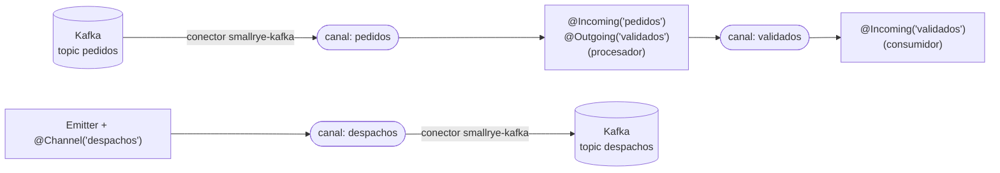

# SmallRye Reactive Messaging con Kafka (Quarkus)

La forma de Quarkus de producir y consumir mensajes. En la entrevista te pidieron "Kafka, que haya usado **SmallRye Reactive Messaging o equivalente**": aquí tienes qué es, cómo se usa y cuál es el equivalente en Spring.

> Conceptos de Kafka (particiones, offsets, grupos, `acks`, DLT): [`../../messaging-streaming/kafka.md`](../../messaging-streaming/kafka.md). Resumen de Quarkus: [`README.md`](README.md). Glosario: [`../../messaging-streaming/glosario.md`](../../messaging-streaming/glosario.md).

## 🍎 Con manzanas (empieza aquí)

En tu frutería, Kafka es el libro de ventas. **SmallRye Reactive Messaging es el empleado que sabe escribir y leer ese libro por ti**, para que tú solo digas: *"lo que llegue al libro de pedidos, procésalo"* (`@Incoming`) y *"lo que yo termine, anótalo en el libro de despachos"* (`@Outgoing`).

| Concepto | En la frutería |
|---|---|
| **Canal (channel)** | Una cinta transportadora con nombre ("pedidos") por donde pasan las notas |
| **Conector** | El adaptador que conecta la cinta con el libro de Kafka (`smallrye-kafka`) |
| **`@Incoming("pedidos")`** | "Quien reciba lo que llegue a esta cinta" |
| **`@Outgoing("despachos")`** | "Lo que yo produzca va a esta cinta" |
| **Emitter** | Un botón para enviar una nota **desde tu código normal**, cuando tú decides |
| **Acknowledgment (ack)** | Marcar la nota como "ya la leí y la procesé bien" |
| **Failure strategy** | Qué haces con una nota que no se pudo procesar: parar, ignorar o mandarla a la bandeja "revisar a mano" |

**¿Por qué "reactive"?** Está construido sobre flujos reactivos (Reactive Streams y Mutiny): los mensajes se tratan como un flujo que se procesa sin bloquear. **Pero puedes usarlo en estilo normal**, con métodos simples. No hace falta saber programación reactiva avanzada para usarlo.

### Qué debes dominar según tu nivel

| Nivel | Debes poder explicar |
|---|---|
| 🟢 **Junior** | Qué es un canal; `@Incoming` y `@Outgoing`; que se configura con `mp.messaging.*`; qué es el ack |
| 🟡 **Mid** | `Emitter`; estrategias de ack, commit y fallo (DLQ); `@Blocking`; serialización JSON; probar con `InMemoryConnector` |
| 🔴 **Senior** | Idempotencia al ser at-least-once; qué commit-strategy elegir y por qué; reintentos con delayed-retry-topic; Outbox; orden por key; backpressure; equivalente en Spring y trade-offs |

## 1. Qué es exactamente

- **SmallRye Reactive Messaging** es la implementación de **MicroProfile Reactive Messaging** que usa Quarkus.
- Modelo: **mensajes** que viajan por **canales**; un **conector** une un canal con un broker (Kafka, AMQP, MQTT...).
- Los **métodos** con `@Incoming` y/o `@Outgoing` se conectan entre sí por el nombre del canal, aunque no haya broker en medio.



## 2. Consumir: `@Incoming`

```java
@ApplicationScoped
public class PedidoConsumer {

    // Forma simple: recibe el payload; se confirma (ack) al terminar el método
    @Incoming("pedidos")
    public void procesar(PedidoCreado evento) {
        service.procesar(evento);
    }
}
```

```properties
mp.messaging.incoming.pedidos.connector=smallrye-kafka
mp.messaging.incoming.pedidos.topic=pedidos.creados.v1
mp.messaging.incoming.pedidos.group.id=bodega
mp.messaging.incoming.pedidos.auto.offset.reset=earliest
mp.messaging.incoming.pedidos.value.deserializer=io.quarkus.kafka.client.serialization.ObjectMapperDeserializer
```

Firmas que soporta (se elige según cuánto control necesitas):

| Firma | Para qué |
|---|---|
| `void consumir(T payload)` | Lo más simple. Ack al terminar |
| `Uni<Void> consumir(T payload)` | Procesamiento asíncrono; ack al completarse el `Uni` |
| `CompletionStage<Void> consumir(Message<T> msg)` | **Control manual** del ack/nack |
| `void consumir(ConsumerRecord<K,V> r)` / `Record<K,V>` | Acceso a la clave y metadatos |
| `@Inject @Channel("x") Multi<T>` | Consumir como un flujo reactivo |

**Acceder a headers, key, partición y offset:**

```java
@Incoming("pedidos")
public CompletionStage<Void> procesar(Message<PedidoCreado> msg) {
    IncomingKafkaRecordMetadata<String, PedidoCreado> meta =
        msg.getMetadata(IncomingKafkaRecordMetadata.class).orElseThrow();
    String key = meta.getKey();
    long offset = meta.getOffset();
    Header correlationId = meta.getHeaders().lastHeader("correlation-id");
    service.procesar(msg.getPayload());
    return msg.ack();
}
```

## 3. Producir: `@Outgoing` y `Emitter`

**Declarativo** (un método que genera mensajes):

```java
@Outgoing("despachos")
public Multi<Despacho> generar() { ... }
```

**Imperativo con `Emitter`** (lo más común en servicios REST: "cuando pase X, publico un evento"):

```java
@ApplicationScoped
public class DespachoPublisher {

    @Inject @Channel("despachos")
    Emitter<DespachoCreado> emitter;

    public void publicar(DespachoCreado evento) {
        emitter.send(evento);        // devuelve CompletionStage<Void>
    }
}
```

```properties
mp.messaging.outgoing.despachos.connector=smallrye-kafka
mp.messaging.outgoing.despachos.topic=despachos.creados.v1
mp.messaging.outgoing.despachos.acks=all
mp.messaging.outgoing.despachos.enable.idempotence=true
```

**Con key y headers** (orden por entidad y trazabilidad):

```java
OutgoingKafkaRecordMetadata<String> meta = OutgoingKafkaRecordMetadata.<String>builder()
    .withKey(evento.cuentaId())
    .withHeaders(new RecordHeaders().add("correlation-id", id.getBytes(UTF_8)))
    .build();
emitter.send(Message.of(evento).addMetadata(meta));
```

**Transaccional:** `KafkaTransactions<T>` permite escribir en varias particiones o topics de forma atómica.

## 4. Acknowledgment, commit y fallos (lo que más se pregunta)

### Ack: ¿cuándo se considera procesado un mensaje?

| Estrategia | Significado |
|---|---|
| `POST_PROCESSING` (por defecto con payload) | Se confirma **al terminar** el método. La más segura |
| `PRE_PROCESSING` | Se confirma **al llegar**, antes de procesar. Si falla, se pierde |
| `MANUAL` | Tú llamas `msg.ack()` o `msg.nack(error)` |
| `NONE` | Sin confirmación |

### Commit de offsets

| `commit-strategy` | Qué hace |
|---|---|
| `throttled` (por defecto) | Confirma periódicamente el **mayor offset consecutivo** ya procesado. Buen equilibrio y at-least-once |
| `latest` | Confirma cada mensaje al ackearse. Más seguro, más lento |
| `ignore` | Deja el commit al `enable.auto.commit` de Kafka |

Quarkus **desactiva el auto commit de Kafka** si no lo habilitas explícitamente: la confirmación depende del ack de SmallRye.

### Si falla el procesamiento: `failure-strategy`

| Estrategia | Qué pasa | Cuándo |
|---|---|---|
| `fail` (por defecto) | La aplicación **se detiene** (el canal falla) | Cuando un error debe ser visible y no perderse |
| `ignore` | Registra el error y **continúa** | Mensajes de poco valor |
| `dead-letter-queue` | Escribe el mensaje fallido en otro topic, con headers como `dead-letter-reason` | **El estándar en banca**: no bloquea y no pierde |
| `delayed-retry-topic` | Reintenta con retardos configurables antes de rendirse | Fallos transitorios |

```properties
mp.messaging.incoming.pedidos.failure-strategy=dead-letter-queue
mp.messaging.incoming.pedidos.dead-letter-queue.topic=pedidos.creados.v1.dlt
```

Para errores de **deserialización** (mensaje corrupto) se puede interceptar con un bean `DeserializationFailureHandler<T>` identificado con `@Identifier`, para que un mensaje malformado no tumbe el consumidor.

**Cómo se rechaza un mensaje a mano:** `msg.nack(new RuntimeException("..."))` aplica la `failure-strategy` configurada.

## 5. Código bloqueante: `@Blocking`

Los consumidores corren en el **event loop** (no se debe bloquear). Si el método usa JDBC, Hibernate ORM o `@Transactional`:

```java
@Incoming("pedidos")
@Blocking                       // se ejecuta en un worker thread
@Transactional
public void procesar(PedidoCreado evento) {
    repo.persist(PedidoEntity.from(evento));
}
```

En Java 21: `@RunOnVirtualThread`. Si olvidas `@Blocking` con JDBC, Quarkus lanza un error por bloquear el event loop.

## 6. Serialización

- **JSON** con Jackson (`ObjectMapperSerializer`/`ObjectMapperDeserializer`) o JSON-B.
- **Avro** con Schema Registry (hay que configurarlo explícitamente).
- Quarkus **infiere** el serializador cuando el tipo es claro; si no, se configura `value.serializer` y `key.serializer` por canal.

## 7. Probar sin broker: `InMemoryConnector`

```java
// InMemoryLifecycleManager es una clase tuya (QuarkusTestResourceLifecycleManager) que llama a
// InMemoryConnector.switchIncomingChannelsToInMemory("pedidos") y switchOutgoingChannelsToInMemory("despachos")
@QuarkusTest
@QuarkusTestResource(InMemoryLifecycleManager.class)
class PedidoConsumerTest {

    @Inject @Any InMemoryConnector connector;

    @Test
    void procesaPedido() {
        InMemorySource<PedidoCreado> entrada = connector.source("pedidos");
        InMemorySink<DespachoCreado> salida = connector.sink("despachos");

        entrada.send(new PedidoCreado(...));

        await().until(() -> salida.received().size() == 1);
    }
}
```

También hay **Dev Services**: en dev y test, Quarkus levanta un Kafka en contenedor automáticamente (`quarkus.kafka-dev-services.*`) para pruebas de integración reales.

## 8. Garantías y buenas prácticas

- Es **at-least-once**: el consumidor debe ser **idempotente** (tabla de eventos procesados por `eventId`).
- **Key = identificador de la entidad** para conservar el orden.
- **`acks=all` + `enable.idempotence=true`** en el productor.
- **No publicar directo después de guardar en la base de datos**: usar **Outbox** (misma transacción; luego un relay o CDC publica). Ver [`../../microservices-patterns/`](../../microservices-patterns).
- **DLQ con alerta** y monitoreo del lag.
- **Esquemas compatibles** (Schema Registry) y eventos versionados.
- **Backpressure:** el flujo reactivo regula la velocidad de consumo; con `@Blocking` los consumos se procesan según los workers disponibles.

## 9. El equivalente en Spring

| Quarkus (SmallRye) | Spring |
|---|---|
| `@Incoming("canal")` | `@KafkaListener(topics = "...")` |
| `Emitter<T>` + `@Channel` | `KafkaTemplate<K,V>` |
| `mp.messaging.incoming.x.*` | `spring.kafka.consumer.*` |
| `failure-strategy=dead-letter-queue` | `DefaultErrorHandler` + `DeadLetterPublishingRecoverer` |
| Canales encadenados `@Incoming` + `@Outgoing` | **Spring Cloud Stream** (funciones `Function<A,B>`) |
| `InMemoryConnector` | `EmbeddedKafka` / Testcontainers |
| `msg.ack()` / `nack()` | `Acknowledgment.acknowledge()` |

**Frase para la entrevista si no lo has usado:** *"Con Spring usé spring-kafka con `@KafkaListener` y `KafkaTemplate`. SmallRye Reactive Messaging es el equivalente en Quarkus: `@Incoming` consume de un canal, `Emitter` publica, y el conector `smallrye-kafka` los une con el topic. Los conceptos son los mismos: grupos de consumidores, commit de offsets, DLQ e idempotencia, así que lo que cambia es la configuración."* Cuéntalo solo si es cierto.

## 10. Preguntas de entrevista con escalera de respuesta

| Pregunta | 🟢 Junior | 🟡 Mid | 🔴 Senior |
|---|---|---|---|
| **¿Qué es SmallRye Reactive Messaging?** | "La librería de Quarkus para enviar y recibir mensajes de Kafka con `@Incoming` y `@Outgoing`." | "Implementa MicroProfile Reactive Messaging: canales, conectores y mensajes; el conector `smallrye-kafka` une un canal con un topic." | "Un modelo de flujos reactivos sobre Mutiny que abstrae el broker; el mismo código sirve con Kafka, AMQP o en memoria para pruebas." |
| **¿Cómo publicas un mensaje desde un endpoint REST?** | "Inyecto un `Emitter` con `@Channel` y llamo a `send`." | "Con key y headers usando `OutgoingKafkaRecordMetadata`, y configuro `acks=all`." | "Pero guardo y publico con Outbox para que no queden inconsistentes la base de datos y Kafka." |
| **¿Qué pasa si falla el procesamiento?** | "Depende de la `failure-strategy`: por defecto se detiene." | "Uso `dead-letter-queue` para mandar el mensaje a otro topic sin bloquear, o `delayed-retry-topic` si es transitorio." | "Distingo fallo transitorio de permanente, alerto sobre la DLT, y el consumidor es idempotente porque el reproceso es inevitable." |
| **¿Cómo evitas procesar dos veces?** | "Guardo un identificador del mensaje ya procesado." | "Tabla de `eventId` procesados con restricción única, en la misma transacción que el efecto." | "Es at-least-once: lo diseño idempotente de punta a punta, y confirmo el offset solo tras persistir el resultado." |
| **¿Cómo pruebas el consumidor?** | "Con un test que envía un mensaje." | "`InMemoryConnector` para unitarios y Dev Services para integración con Kafka real." | "Pirámide: dominio sin Quarkus, `InMemoryConnector` en pruebas del adaptador, y pocas pruebas con Kafka en contenedor." |
| **¿Qué usarías en Spring?** | "`@KafkaListener` y `KafkaTemplate`." | "Spring Cloud Stream si quiero el mismo estilo de canales." | "Spring Kafka si quiero control fino; Spring Cloud Stream si quiero portabilidad entre brokers." |

## Referencias

- [Quarkus: guía de Apache Kafka](https://quarkus.io/guides/kafka)
- [Quarkus: Kafka, cómo fallar con elegancia (failure strategies)](https://quarkus.io/blog/kafka-failure-strategy/)
- [SmallRye Reactive Messaging: acknowledgement](https://smallrye.io/smallrye-reactive-messaging/4.5.0/concepts/acknowledgement)
