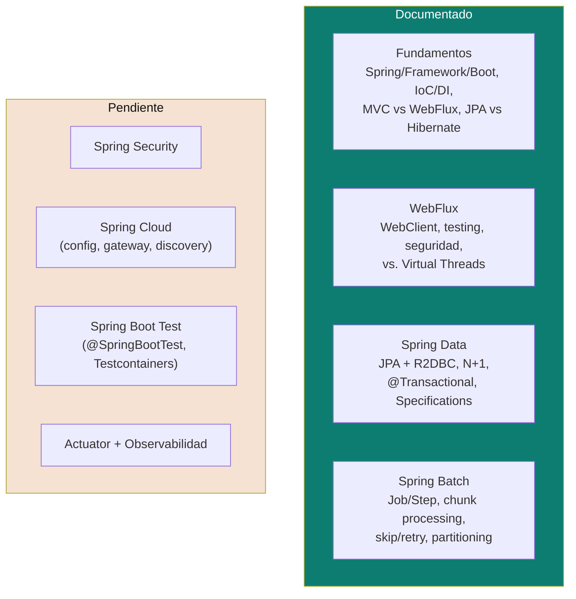

# Spring Boot

Píldoras de repaso del ecosistema Spring Boot para entrevista de senior developer: qué es cada proyecto satélite, en qué se diferencia del siguiente, y qué preguntas de entrevista dispara cada uno. Cada documento asume [`fundamentals.md`](fundamentals.md) como base.

## Cobertura actual

| Tema | Doc | Idea central en una línea |
|---|---|---|
| **Fundamentos** | [`fundamentals.md`](fundamentals.md) | Spring vs Spring Framework vs Spring Boot, IoC/DI, MVC vs WebFlux, JPA vs Hibernate, auto-configuración y las anotaciones que hay que saber explicar sin dudar. |
| **WebFlux** | [`webflux.md`](webflux.md) | Cómo se cablea Reactor como framework web dentro de Spring Boot: controllers vs endpoints funcionales, `WebClient`, `WebTestClient`, seguridad reactiva, y la decisión frente a Spring MVC + Virtual Threads (JEP 444). |
| **Spring Data** | [`spring-data.md`](spring-data.md) | Repositorios generados por convención de nombre, `@Query`, Specifications, el problema N+1 y sus soluciones, `@Transactional` (y por qué no aplica igual en reactivo), Spring Data R2DBC. |
| **Spring Batch** | [`spring-batch.md`](spring-batch.md) | Job/Step, chunk-oriented processing (Reader/Processor/Writer), `skip`/`retry`, reinicio ante fallo vía `JobRepository`, partitioning. |
| Spring Security | ⏳ Pendiente | Autenticación/autorización, `SecurityFilterChain` vs `SecurityWebFilterChain`, OAuth2/JWT. |
| Spring Cloud | ⏳ Pendiente | Config Server, API Gateway, service discovery — relevante para microservicios (ver [`microservices-patterns/`](../microservices-patterns)). |
| Spring Boot Test | ⏳ Pendiente | `@SpringBootTest`, slices de test (`@WebFluxTest`, `@DataJpaTest`), Testcontainers. |
| Actuator + Observabilidad | ⏳ Pendiente | Health checks, métricas, `/actuator`, integración con tracing distribuido. |

## Cómo estudiar esta carpeta

1. Empezá por [`fundamentals.md`](fundamentals.md) — resuelve las confusiones de vocabulario (Spring vs Spring Boot, JPA vs Hibernate) que todo lo demás asume resueltas.
2. [`webflux.md`](webflux.md) y [`spring-data.md`](spring-data.md) se leen en cualquier orden — cubren proyectos satélite independientes entre sí (aunque se combinan en la variante reactiva: WebFlux + Spring Data R2DBC).
3. [`spring-batch.md`](spring-batch.md) es el más aislado — solo hace falta cuando el problema es específicamente de procesamiento masivo, no de servir requests.
4. Los temas ⏳ se van a ir completando a medida que aparezcan en la práctica o en preparación de entrevista — mismo criterio que el resto del repo: nada de documentos teóricos sin un caso concreto detrás.

Relacionado: [`reactive-programming/`](../reactive-programming) para el detalle de Project Reactor que [`webflux.md`](webflux.md) asume conocido, [`ddd/`](../ddd) para cómo modelar el dominio que estos frameworks terminan sirviendo/persistiendo, y [`software-architectures/hexagonal-architecture.md`](../software-architectures/hexagonal-architecture.md) para dónde encaja cada pieza (`@RestController`, `JpaRepository`, `@Entity`) dentro del layout de carpetas.

## Referencias

- [Spring Boot — Reference Documentation](https://docs.spring.io/spring-boot/documentation.html)
- [Spring Framework — Reference Documentation](https://docs.spring.io/spring-framework/reference/)
