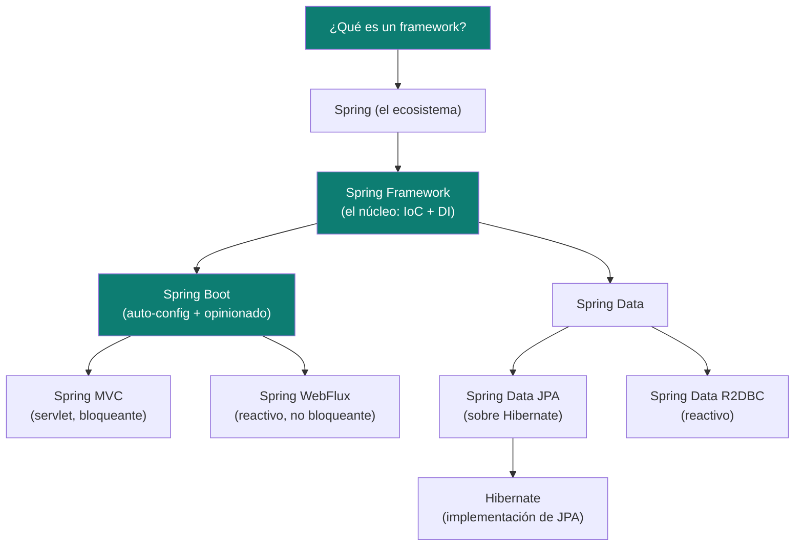

# Fundamentos — el ecosistema Spring de un vistazo

Píldoras rápidas de repaso: qué es cada cosa, en qué se diferencia de la
siguiente capa, y una analogía corta para poder explicarlo sin jerga en una
entrevista. Es la base sobre la que se apoyan las demás píldoras de esta
carpeta — [`webflux.md`](webflux.md), [`spring-data.md`](spring-data.md),
[`spring-batch.md`](spring-batch.md) — que profundizan cada proyecto
satélite. Para el detalle de operadores de Reactor (`map`/`flatMap`, manejo
de errores, `StepVerifier`) ver [`reactive-programming/`](../reactive-programming).

## Mapa mental (de lo general a lo concreto)



## 1 · ¿Qué es un framework?

Un **framework** es código de terceros que define el **esqueleto y el flujo
de control** de tu aplicación — vos completás los huecos (tu lógica de
negocio), pero el framework es quien llama a tu código, no al revés. Esto se
llama **Inversion of Control (IoC)**: en una librería normal *vos* llamás a
las funciones de la librería; en un framework, *el framework* llama a las
tuyas en los momentos que él decide (ej: cuando llega un HTTP request, cuando
arranca la aplicación).

> **Analogía para entrevista:** una librería es una caja de herramientas que
> vos usás cuando querés. Un framework es una fábrica: vos ponés las piezas
> (tu código) en los lugares que la fábrica define, y ella hace andar la
> línea de producción completa.

## 2 · Spring vs Spring Framework vs Spring Boot — la confusión más común

| Término | Qué es realmente |
|---|---|
| **Spring** (a secas) | El **ecosistema completo**: Spring Framework + todos los proyectos satélite (Spring Boot, Spring Data, Spring Security, Spring Cloud, Spring Batch...). Cuando alguien dice "sé Spring" se refiere a este ecosistema en general. |
| **Spring Framework** | El **núcleo original** (desde 2003/2004): el contenedor **IoC** y la **Inyección de Dependencias (DI)** — `ApplicationContext`, beans, `@Component`/`@Autowired`, AOP. Todo lo demás en el ecosistema se construye sobre esto. |
| **Spring Boot** | Una capa **encima** de Spring Framework que agrega **auto-configuración** ("convención sobre configuración") y **starters** (`spring-boot-starter-web`, `-webflux`, `-data-jpa`...) para no tener que cablear manualmente cada bean. Es "Spring, pero opinionado y con menos XML/configuración manual". Trae también el servidor embebido (Tomcat/Netty) — no hace falta desplegar un WAR en un servidor externo. |

> **Frase para repetir en la entrevista:** "Spring Framework me da el contenedor de inyección de dependencias; Spring Boot me da auto-configuración y arranque rápido encima de eso — no son competidores, Boot **es** Spring Framework con menos fricción para empezar."

### IoC y DI, sin jerga

- **IoC (Inversion of Control):** el framework controla el ciclo de vida y el
  cableado de tus objetos, no tu código con `new`.
- **DI (Dependency Injection):** la técnica concreta con la que Spring
  resuelve el IoC — en vez de que una clase construya sus dependencias
  (`new MiRepositorio()`), se las **inyectan** desde afuera (constructor,
  setter, o campo). La documentación oficial de Spring recomienda
  **siempre constructor injection** (nunca `@Autowired` en campos: oculta
  dependencias, impide `final`, complica testear sin el contenedor) —
  opcionalmente con Lombok `@RequiredArgsConstructor` sobre campos
  `private final` para no escribir el constructor a mano.

## 3 · Spring MVC vs Spring WebFlux — el otro par que se confunde

| | Spring MVC | Spring WebFlux |
|---|---|---|
| Modelo | **Bloqueante**, un hilo por request (servlet clásico) | **No bloqueante**, reactivo (`Mono`/`Flux`, Project Reactor) |
| Servidor embebido | Tomcat/Jetty | Netty (por defecto) |
| Cuándo elegirlo | Stack tradicional, JDBC/JPA bloqueante, equipo sin experiencia reactiva | Alta concurrencia con I/O (muchas llamadas a otros servicios/DB), o ya hay drivers reactivos (R2DBC, WebClient) |
| Persistencia típica | Spring Data JPA (Hibernate) | Spring Data R2DBC (no bloqueante) |

Los operadores de Reactor (`Mono`/`Flux`, `map` vs `flatMap`, manejo de
errores, testing con `StepVerifier`) están en
[`reactive-programming/`](../reactive-programming). Cómo se integra WebFlux
específicamente con Spring Boot (`WebClient`, endpoints funcionales,
`WebTestClient`, seguridad reactiva) está en [`webflux.md`](webflux.md).

## 4 · JPA vs Hibernate — la pregunta clásica de entrevista

| | JPA | Hibernate |
|---|---|---|
| Qué es | Una **especificación** (interfaz/contrato de Jakarta EE): `@Entity`, `@Id`, `EntityManager`, JPQL. | Una **implementación concreta** de esa especificación — la más usada, pero no la única (EclipseLink es otra). |
| Analogía | JPA es la interfaz `List`. | Hibernate es `ArrayList` — una implementación concreta de esa interfaz. |
| Quién lo trae | `jakarta.persistence.*` | `org.hibernate.*` |
| Uso típico en Spring | Casi nunca se usa JPA "pelado" — se usa **Spring Data JPA**, que agrega repositorios (`JpaRepository<T, ID>`) encima de JPA/Hibernate para no escribir `EntityManager` a mano. |

> **Frase para repetir:** "JPA es el contrato, Hibernate es quien lo implementa. Spring Data JPA es una capa más arriba todavía, que me da repositorios listos (`findById`, `save`, queries derivadas del nombre del método) sin escribir SQL ni JPQL a mano para lo básico."

### ¿Qué es una Entidad (`@Entity`)?

Una clase Java anotada con `@Entity` que **mapea una tabla de base de
datos** — cada instancia es una fila, cada campo (anotado o no) es una
columna. Requisitos técnicos de JPA (no de DDD): constructor sin argumentos,
un campo `@Id` (clave primaria), no puede ser `final` la clase, los getters/
setters son convención (aunque no obligatorios).

```java
@Entity
@Table(name = "orders")
public class OrderJpaEntity {
    @Id
    @GeneratedValue(strategy = GenerationType.UUID)
    private UUID id;

    @Enumerated(EnumType.STRING)
    private Status status;

    @OneToMany(mappedBy = "order", cascade = CascadeType.ALL)
    private List<LineItemJpaEntity> items;
    // constructor vacío + getters/setters — requisito de JPA, no de DDD
}
```

**Ojo con la confusión de nombres:** "Entity" en JPA (mapeo objeto-relacional)
**no es lo mismo** que "Entity" en DDD (identidad + ciclo de vida, ver
[`ddd/entities-vs-value-objects.md`](../ddd/entities-vs-value-objects.md)).
En una arquitectura hexagonal bien hecha, la Entidad de **dominio**
(`Order`, sin anotaciones de framework) y la Entidad **JPA**
(`OrderJpaEntity`, con `@Entity`/`@Table`/`@Column`) son **clases distintas**,
mapeadas entre sí por un `Mapper` en el adaptador de persistencia — el
dominio nunca debe saber que existe JPA/Hibernate. Ver
[`hexagonal-architecture.md`](../software-architectures/hexagonal-architecture.md#convención-de-paquetes-de-referencia)
para la convención `persistence/entity/` + `persistence/mapper/`.

### JPA/Hibernate vs R2DBC

JPA/Hibernate es **bloqueante** (usa JDBC por debajo) — no se debe usar
dentro de un pipeline reactivo de WebFlux, porque bloquea el event loop de
Netty. Para persistencia reactiva se usa **Spring Data R2DBC** (no es JPA,
es una API distinta, más simple, sin lazy-loading ni caché de primer nivel —
justamente porque esas features requieren bloquear).

## 5 · Auto-configuración y starters — cómo "adivina" Spring Boot

Un `spring-boot-starter-X` es solo un POM/`build.gradle` con las dependencias
correctas ya resueltas (versión compatible entre sí). La **auto-configuración**
(`@EnableAutoConfiguration`, activada por `@SpringBootApplication`) escanea
el classpath: si detecta la librería de Postgres + R2DBC, configura
automáticamente un `ConnectionFactory`; si detecta `spring-webflux` en vez de
`spring-web`, levanta Netty en vez de Tomcat. Se puede ver exactamente qué se
auto-configuró con `--debug` al arrancar, o inspeccionando
`org.springframework.boot.autoconfigure.condition` en logs.

## 6 · Anotaciones que hay que saber explicar sin dudar

| Anotación | Para qué |
|---|---|
| `@SpringBootApplication` | Combina `@Configuration` + `@EnableAutoConfiguration` + `@ComponentScan`. El punto de entrada. |
| `@Component` / `@Service` / `@Repository` / `@RestController` | Todas son `@Component` con semántica distinta (estereotipos) — Spring las detecta igual (component scan), pero el nombre documenta el rol de la clase. `@Repository` además traduce excepciones de persistencia a `DataAccessException`. |
| `@Configuration` + `@Bean` | Define beans manualmente cuando no alcanza con `@Component` (ej: una librería de terceros que no podés anotar). |
| `@Autowired` | Inyección — evitar en campos, preferir constructor (ver sección 2). Desde Spring 4.3, innecesario en el constructor si la clase tiene uno solo. |
| `@Transactional` | Delimita una transacción — en WebFlux/R2DBC se usa `TransactionalOperator` en vez de esta anotación clásica, porque `@Transactional` depende de `ThreadLocal`, incompatible con el modelo reactivo. |
| `@Valid` / `@Validated` | Dispara Bean Validation (`jakarta.validation`) sobre un `@RequestBody`/parámetro. |
| `@ControllerAdvice` / `@RestControllerAdvice` | Manejador global de excepciones — centraliza el mapeo excepción → respuesta HTTP. |

## Referencias

- [Spring Framework — Reference Documentation](https://docs.spring.io/spring-framework/reference/) — IoC container, DI, AOP.
- [Spring Boot — Reference Documentation](https://docs.spring.io/spring-boot/documentation.html) — auto-configuración, starters.
- [Jakarta Persistence (JPA) Specification](https://jakarta.ee/specifications/persistence/) — la especificación en sí.
- [Hibernate ORM — User Guide](https://hibernate.org/orm/documentation/) — la implementación de referencia de JPA.
- [Spring Data R2DBC — Reference Documentation](https://docs.spring.io/spring-data/r2dbc/reference/) — persistencia reactiva, sin JPA.

Relacionado: [`webflux.md`](webflux.md) y [`spring-data.md`](spring-data.md) para el detalle de esos dos proyectos satélite, [`reactive-programming/`](../reactive-programming) para WebFlux/Reactor en profundidad, [`software-architectures/hexagonal-architecture.md`](../software-architectures/hexagonal-architecture.md) para dónde encaja cada pieza (entity/mapper/adapter) dentro de una arquitectura hexagonal, y [`ddd/`](../ddd) para la distinción Entity/Value Object del lado del dominio (no de JPA).
