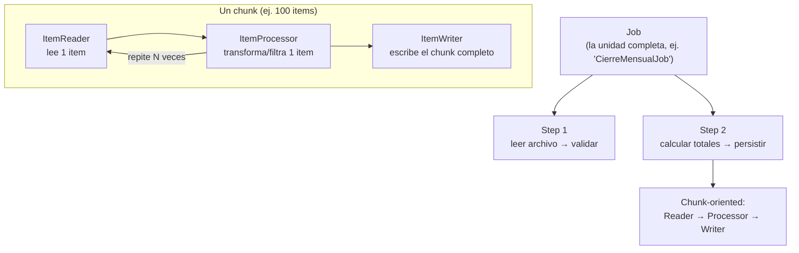

# Spring Batch — procesamiento por lotes, no por request

La pregunta que dispara este documento: *"¿por qué no proceso 500,000 registros con un `for` dentro de un `@Scheduled`?"* — porque un `for` no te da reinicio ante fallo (retomar donde quedó, no desde cero), ni control de memoria (cargar todo en RAM), ni tracking de qué se procesó y qué no. Spring Batch resuelve exactamente esos tres problemas.

## Cuándo usar Batch vs. un endpoint/mensaje normal

| | Spring Batch | REST/WebFlux, Spring Data | Mensajería (Kafka/SQS) |
|---|---|---|---|
| Volumen | Grandes volúmenes (miles a millones de registros) en una ejecución. | Un registro (o pocos) por request. | Un mensaje por evento, procesado a medida que llega. |
| Disparo | Programado (cron) o bajo demanda — nunca "en vivo" por un usuario esperando respuesta. | Sincrónico, el cliente espera. | Asíncrono, dirigido por evento. |
| Caso típico | Cierre de fin de mes, migración de datos, generar reportes masivos, reconciliación contra un archivo externo. | CRUD de negocio normal. | Reaccionar a un `OrderPaid` (ver [`ddd/domain-events.md`](../../ddd/domain-events.md)). |

Señal de que hace falta Batch y no un simple `for` en un `@Scheduled`: el proceso puede fallar a mitad de camino y **no** es aceptable reprocesar todo desde cero, o el volumen no entra cómodo en memoria.

## Los bloques — Job, Step, y el modelo chunk-oriented



- **`Job`**: la unidad de trabajo completa (ej. "procesar el archivo de transacciones del día"). Se compone de uno o más `Step`.
- **`Step`**: una fase independiente y reiniciable dentro del Job (ej. "leer y validar" es un Step, "calcular y persistir" es otro). Cada `Step` tiene su propio estado de ejecución guardado en el `JobRepository`.
- **Chunk-oriented processing**: dentro de un `Step`, el `ItemReader` lee un ítem a la vez, el `ItemProcessor` lo transforma o lo descarta (`return null` filtra el ítem), y cuando se junta un **chunk** completo (ej. 100 ítems), el `ItemWriter` los escribe todos juntos en una sola transacción. Esto es lo que da el control de memoria (nunca hay más de un chunk en RAM) y el punto de reinicio (si falla a mitad del chunk 4,500, los chunks 1-4,499 ya están commiteados).

## Código de referencia (Spring Batch 5, API basada en `Job`/`Step` con `JobRepository`)

```java
@Bean
Job closeMonthJob(JobRepository jobRepository, Step readAndValidateStep, Step calculateAndPersistStep) {
    return new JobBuilder("closeMonthJob", jobRepository)
        .start(readAndValidateStep)
        .next(calculateAndPersistStep)
        .build();
}

@Bean
Step readAndValidateStep(JobRepository jobRepository, PlatformTransactionManager txManager,
                          ItemReader<RawTransaction> reader,
                          ItemProcessor<RawTransaction, ValidTransaction> processor,
                          ItemWriter<ValidTransaction> writer) {
    return new StepBuilder("readAndValidateStep", jobRepository)
        .<RawTransaction, ValidTransaction>chunk(100, txManager)
        .reader(reader)
        .processor(processor)
        .writer(writer)
        .faultTolerant()
        .skip(ValidationException.class).skipLimit(50)
        .retry(TransientDataAccessException.class).retryLimit(3)
        .build();
}
```

- `chunk(100, txManager)` fija el tamaño del chunk y la transacción que lo envuelve.
- `.faultTolerant().skip(...).skipLimit(50)` — hasta 50 ítems con `ValidationException` se saltan (se registran como skip) sin abortar el Step completo; superado el límite, el Step falla. Esto es lo que permite procesar un archivo con algunas filas corruptas sin descartar el lote entero.
- `.retry(...).retryLimit(3)` — reintenta automáticamente un ítem que falló por una causa transitoria (ej. un deadlock momentáneo de base de datos), antes de contarlo como fallo real.

## `JobRepository` — el estado persistido que hace posible el reinicio

Spring Batch guarda metadata de cada ejecución (`BATCH_JOB_INSTANCE`, `BATCH_JOB_EXECUTION`, `BATCH_STEP_EXECUTION`, `BATCH_STEP_EXECUTION_CONTEXT`) en tablas propias de base de datos. Esto es lo que permite:

- **Reiniciar un Job fallido** (`JobOperator.restart(jobExecutionId)`) desde el último `Step` que no completó — no desde el principio. Un `Step` ya marcado `COMPLETED` no se vuelve a ejecutar en un restart, salvo que se configure explícitamente como reiniciable.
- **Consultar el historial**: cuántos ítems se leyeron/procesaron/escribieron/saltaron en cada ejecución — auditoría real, no logs sueltos a interpretar.
- **Garantizar que un mismo `JobInstance`** (Job + sus `JobParameters`, ej. `fecha=2026-09-01`) no se ejecute dos veces con éxito — si ya corrió OK, un segundo intento con los mismos parámetros falla explícitamente (protección nativa contra reprocesar el mismo lote por error).

## `ItemReader`/`ItemWriter` — de dónde vienen los datos, típicamente

| Fuente/destino | Implementación típica |
|---|---|
| Archivo CSV/fixed-width | `FlatFileItemReader`/`FlatFileItemWriter` (con un `LineMapper` que parsea cada línea). |
| Base de datos (paginado) | `JdbcPagingItemReader`/`JpaPagingItemReader` — pagina automáticamente, no carga todo en memoria. |
| Otro sistema vía API | Un `ItemReader` custom que implementa `read()` llamando a un cliente HTTP, paginando manualmente. |
| Múltiples destinos a la vez | `CompositeItemWriter` (ej. escribir en base de datos **y** publicar un evento por chunk). |

## Partitioning — paralelizar un Step

Cuando un solo `Step` secuencial no alcanza en tiempo (ej. un archivo de 10 millones de líneas), `PartitionHandler` divide el trabajo en particiones (ej. por rango de fechas, o por rango de IDs) que corren en paralelo, cada una como una ejecución independiente del mismo `Step` — el equivalente batch a "escalar horizontalmente" un único proceso secuencial.

## Drills de repaso

| Tiempo | Pregunta |
|---|---|
| 4 min | "¿Por qué no conviene un simple `for` con un `@Scheduled` para procesar un archivo de un millón de líneas?" |
| 5 min | "Explicá qué pasa en un chunk-oriented Step cuando el ítem 57 de un chunk de 100 falla con una excepción de validación." |
| 5 min | "Tu Job falló en el Step 3 de 4, a mitad de un archivo grande. ¿Cómo lo reiniciás sin reprocesar todo desde el Step 1?" |
| 4 min | "¿Qué diferencia hay entre `skip` y `retry` en la configuración `.faultTolerant()` de un Step?" |

## Referencias

- [Spring Batch — Reference Documentation](https://docs.spring.io/spring-batch/reference/) — Job/Step, chunk processing, fault tolerance (`skip`/`retry`), partitioning.
- [Spring Batch — Domain Language](https://docs.spring.io/spring-batch/reference/domain.html) — definición formal de `Job`, `Step`, `JobInstance`, `JobExecution`, `StepExecution`.

Relacionado: [`fundamentals.md`](fundamentals.md) para dónde encaja Batch dentro del ecosistema Spring, [`microservices-patterns/README.md`](../../microservices-patterns/README.md) para la idempotencia y consistencia eventual que también aplican a un Job que se reintenta, y [`ddd/domain-events.md`](../../ddd/domain-events.md) para el caso alternativo (mensajería dirigida por evento) cuando el volumen no justifica un proceso batch.
