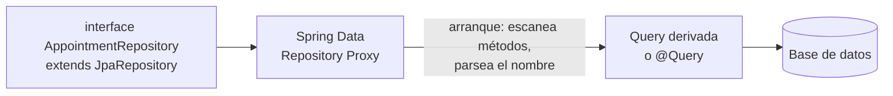

# Spring Data — repositorios sin escribir SQL a mano (JPA y R2DBC)

La pregunta que dispara este documento: *"¿por qué mi `AppointmentRepository extends JpaRepository<Appointment, UUID>` ya tiene `save`, `findById`, `findAll` sin que yo escriba una sola línea de implementación?"* — porque Spring Data genera la implementación del repositorio en tiempo de arranque, a partir de la interfaz y las convenciones de nombre de método.

Para la diferencia JPA/Hibernate y qué es una `@Entity`, ver [`fundamentals.md`](fundamentals.md) — este documento asume esa base y profundiza en repositorios, queries, transacciones y la variante reactiva (R2DBC).

## Cómo genera la implementación — el mecanismo



Al arrancar, Spring Data crea un **proxy dinámico** que implementa la interfaz. Para cada método no heredado de `JpaRepository`, parsea el **nombre del método** siguiendo una gramática fija (`findBy`, `And`, `OrderBy`, `Between`...) y genera la query JPQL/SQL correspondiente — sin que exista una clase `AppointmentRepositoryImpl` con ese código escrito a mano.

## Queries derivadas del nombre del método

```java
public interface AppointmentRepository extends JpaRepository<AppointmentJpaEntity, UUID> {

    List<AppointmentJpaEntity> findByPatientIdAndStatus(UUID patientId, AppointmentStatus status);

    List<AppointmentJpaEntity> findByScheduledAtBetweenOrderByScheduledAtAsc(Instant from, Instant to);

    boolean existsByPatientIdAndScheduledAtBetween(UUID patientId, Instant from, Instant to);

    long countByStatus(AppointmentStatus status);
}
```

- El nombre **es** el contrato de la query — `findByPatientIdAndStatus` genera `WHERE patient_id = ? AND status = ?` sin escribirlo.
- Útil hasta cierto punto de complejidad; una condición con 4-5 campos encadenados (`findByPatientIdAndStatusAndScheduledAtBetweenAndPractitionerIdIn(...)`) es una señal de que conviene pasar a `@Query` explícito o a Specifications (ver más abajo) — el nombre del método deja de ser legible antes de dejar de funcionar.

## `@Query` — cuando el nombre del método no alcanza

```java
@Query("""
    SELECT a FROM AppointmentJpaEntity a
    WHERE a.practitionerId = :practitionerId
      AND a.status = 'CONFIRMED'
      AND a.scheduledAt >= :from
    """)
List<AppointmentJpaEntity> findUpcomingConfirmed(UUID practitionerId, Instant from);
```

- JPQL opera sobre **entidades y sus campos**, no sobre nombres de tabla/columna — por eso `AppointmentJpaEntity a` y `a.practitionerId`, no `appointments` y `practitioner_id`.
- `nativeQuery = true` en `@Query` cae a SQL nativo cuando hace falta una función específica del motor (ej. una función de Postgres) que JPQL no expone — el trade-off es perder portabilidad entre motores de base de datos.

## Specifications — queries dinámicas y type-safe

Cuando los filtros son opcionales y combinables (un endpoint de búsqueda con 5 parámetros, todos opcionales), ni el nombre del método ni un `@Query` fijo alcanzan sin explotar en combinaciones. `JpaSpecificationExecutor` resuelve esto:

```java
public interface AppointmentRepository extends JpaRepository<AppointmentJpaEntity, UUID>,
        JpaSpecificationExecutor<AppointmentJpaEntity> {}

public class AppointmentSpecifications {
    public static Specification<AppointmentJpaEntity> hasPatientId(UUID patientId) {
        return (root, query, cb) -> patientId == null ? null : cb.equal(root.get("patientId"), patientId);
    }
    public static Specification<AppointmentJpaEntity> hasStatus(AppointmentStatus status) {
        return (root, query, cb) -> status == null ? null : cb.equal(root.get("status"), status);
    }
}

// uso: repository.findAll(hasPatientId(patientId).and(hasStatus(status)));
```

Devolver `null` cuando el filtro no aplica es la convención — Spring Data lo ignora al componer el `and()`, evitando un `if` por cada combinación posible de filtros presentes/ausentes.

## El problema N+1 — la pregunta que más se repite en entrevistas

```java
List<AppointmentJpaEntity> appointments = repository.findAll(); // 1 query
for (var a : appointments) {
    a.getPatient().getName(); // 1 query MÁS por cada appointment, si patient es LAZY
}
```

Con `@ManyToOne(fetch = FetchType.LAZY)` (el default recomendado — `EAGER` trae relaciones que no siempre hacen falta), acceder a `getPatient()` dispara una query separada **por cada fila** del resultado original — N+1 queries en vez de 1 o 2. Soluciones, de más a menos preferida:

| Solución | Cuándo |
|---|---|
| `JOIN FETCH` en un `@Query` explícito (`SELECT a FROM AppointmentJpaEntity a JOIN FETCH a.patient WHERE ...`) | El caso general — trae todo en una sola query, sin cambiar el fetch type global de la entidad. |
| `@EntityGraph(attributePaths = "patient")` sobre el método del repositorio | Alternativa declarativa a `JOIN FETCH` cuando no querés escribir JPQL a mano. |
| Proyección DTO directa (`SELECT new com.x.PatientSummary(a.patient.id, a.patient.name) FROM ...`) | Cuando ni siquiera hace falta la entidad completa — trae solo los campos que el caso de uso necesita (conecta con CQRS nivel 1, ver [`ddd/cqrs.md`](../ddd/cqrs.md)). |
| Batch fetching (`@BatchSize` o `spring.jpa.properties.hibernate.default_batch_fetch_size`) | Cuando no se puede tocar la query (código de terceros) — agrupa los N+1 en unas pocas queries `IN (...)`, no lo elimina del todo pero lo mitiga. |

## `@Transactional` — límites y la trampa en reactivo

```java
@Transactional
public void confirmAndNotify(UUID appointmentId) {
    Appointment appointment = repository.findById(appointmentId).orElseThrow();
    appointment.confirm();
    repository.save(appointment);
    notificationClient.send(appointment); // si esto falla, ¿hace rollback del save anterior?
}
```

- `@Transactional` envuelve el método en una transacción **de base de datos** — un fallo después de `repository.save(...)` (ej. `notificationClient.send` lanzando excepción) sí revierte el `save`, porque el commit ocurre al final del método, no línea por línea. Pero si `notificationClient` es una llamada HTTP a otro servicio, esa llamada **no** es transaccional ni se revierte — solo lo que tocó la base de datos. Mezclar I/O externo dentro de un método `@Transactional` es una señal de diseño a revisar: mejor publicar un Domain Event después del commit (`@TransactionalEventListener(phase = AFTER_COMMIT)`) y que la notificación ocurra fuera de la transacción de escritura (ver [`ddd/domain-events.md`](../ddd/domain-events.md)).
- `@Transactional` depende de `ThreadLocal` para propagar el contexto transaccional — **incompatible con WebFlux/Reactor**, donde una cadena `Mono`/`Flux` puede saltar entre hilos del event loop. Para transacciones reactivas se usa `TransactionalOperator`:

```java
transactionalOperator.execute(tx ->
    repository.save(appointment)
        .then(auditRepository.save(auditEntry))
);
```

## Spring Data R2DBC — la variante reactiva, y qué se pierde

| | Spring Data JPA | Spring Data R2DBC |
|---|---|---|
| Modelo | Bloqueante (JDBC por debajo). | No bloqueante (driver reactivo nativo por motor: `r2dbc-postgresql`, etc.). |
| Lazy loading | Sí (`FetchType.LAZY`). | **No existe** — no hay forma de "cargar después" de forma no bloqueante sin una query explícita nueva. |
| Caché de primer nivel (persistence context) | Sí — `EntityManager` trackea cambios (`dirty checking`). | **No existe** — cada entidad es un DTO plano, sin tracking automático de cambios. |
| Relaciones (`@OneToMany`, etc.) | Soportadas de forma declarativa. | **No soportadas** — hay que resolverlas manualmente con queries separadas y componerlas con `flatMap`/`zip`. |
| Repositorio | `JpaRepository<T, ID>` | `ReactiveCrudRepository<T, ID>` — mismos métodos derivados por nombre, pero devolviendo `Mono`/`Flux`. |

```java
public interface AppointmentR2dbcRepository extends ReactiveCrudRepository<AppointmentR2dbcEntity, UUID> {
    Flux<AppointmentR2dbcEntity> findByPatientIdAndStatus(UUID patientId, String status);
}
```

**Frase para entrevista:** "R2DBC no es 'JPA pero reactivo' — es una API más simple y de más bajo nivel a propósito, porque lazy-loading y dirty checking requieren bloquear en algún punto, y eso contradice el objetivo de no bloquear el event loop de Netty (ver [`webflux.md`](webflux.md))."

## Auditing automático

```java
@EntityListeners(AuditingEntityListener.class)
@Entity
public class AppointmentJpaEntity {
    @CreatedDate private Instant createdAt;
    @LastModifiedDate private Instant updatedAt;
    @CreatedBy private String createdBy;
}
```

Requiere `@EnableJpaAuditing` (o `@EnableR2dbcAuditing` en la variante reactiva) en la configuración — Spring completa estos campos automáticamente en `save()`, sin lógica manual dispersa por los Services.

## Drills de repaso

| Tiempo | Pregunta |
|---|---|
| 4 min | "¿Cómo genera Spring Data la implementación de un método como `findByPatientIdAndStatus` sin que exista código escrito?" |
| 6 min | "Tenés un problema N+1 en un listado. Nombrá 3 formas de resolverlo y sus trade-offs." |
| 5 min | "¿Por qué `@Transactional` no funciona igual en un flujo WebFlux/R2DBC? ¿Qué usás en su lugar?" |
| 5 min | "¿Por qué Spring Data R2DBC no soporta lazy loading? ¿Qué harías en su lugar para traer una relación?" |

## Referencias

- [Spring Data JPA — Reference Documentation](https://docs.spring.io/spring-data/jpa/reference/) — queries derivadas, Specifications, auditing.
- [Spring Data R2DBC — Reference Documentation](https://docs.spring.io/spring-data/r2dbc/reference/) — modelo reactivo, limitaciones frente a JPA.
- [Hibernate ORM — User Guide](https://hibernate.org/orm/documentation/) — detalle de fetch strategies y el problema N+1.

Relacionado: [`fundamentals.md`](fundamentals.md) para JPA vs Hibernate y qué es una `@Entity`, [`webflux.md`](webflux.md) para el contexto reactivo donde aplica R2DBC, [`ddd/repository-pattern.md`](../ddd/repository-pattern.md) para la diferencia entre este repositorio técnico (Spring Data) y el Repository de DDD (puerto que persiste un Aggregate completo), y [`ddd/cqrs.md`](../ddd/cqrs.md) para las proyecciones DTO como alternativa al N+1.
