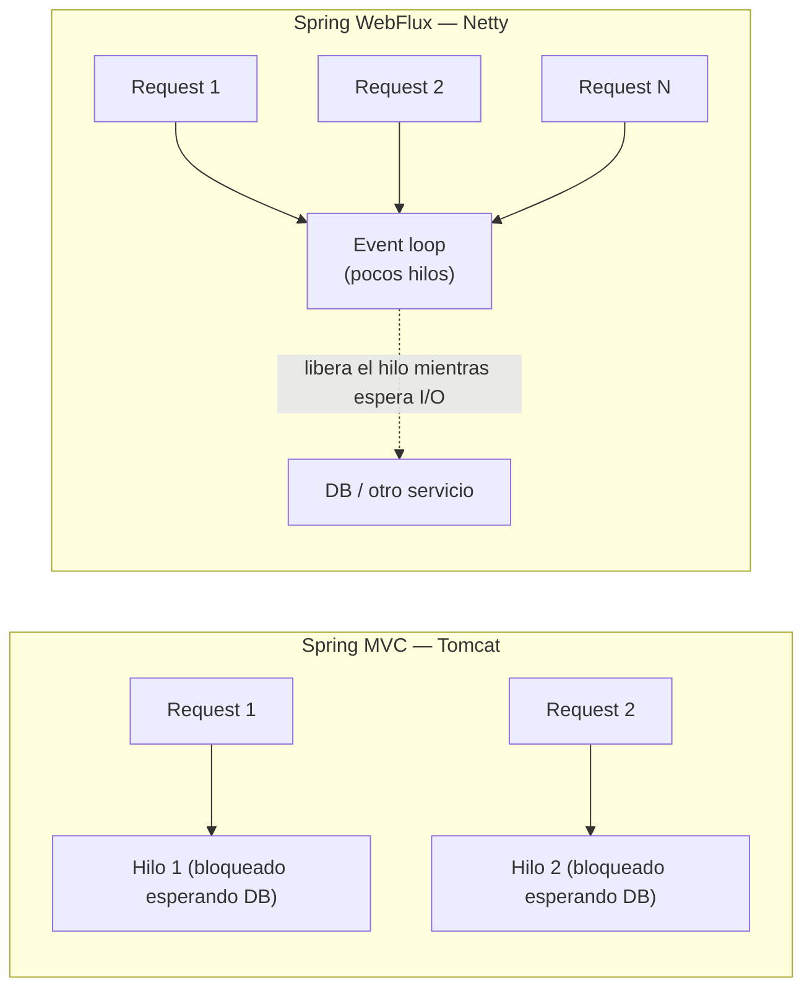
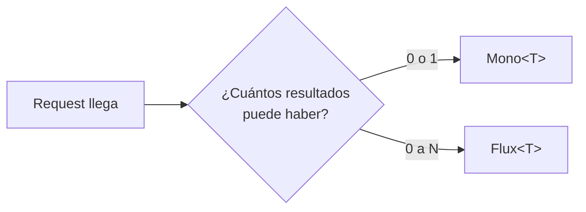
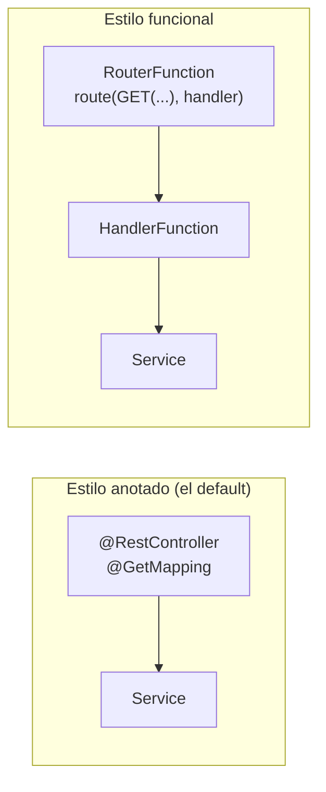

# Spring WebFlux — guía de estudio (Parte 1: el framework y Reactor)

Guía pensada para leerse **en orden**, de arriba hacia abajo — no es una referencia dispersa por sub-temas. Empieza en lo que ya conocés (un controlador), sigue en por qué existe WebFlux, y de ahí entra a Reactor (`Mono`/`Flux`) como el motor que hace posible que ese controlador no bloquee nada. La [Parte 2 — catálogo de operadores](webflux-operators.md) continúa esta guía con todo lo que no es `map`/`flatMap` (creación, combinación, contexto, side-effects).

## 1 · El controlador — esto ya lo sabés

Un controlador de WebFlux se ve casi idéntico a uno de Spring MVC. Los mismos componentes (`@RestController`, mapeos HTTP, inyección del service) — lo único que cambia es **qué tipo devuelve el método**.

```java
@RestController
@RequestMapping("/appointments")
public class AppointmentController {

    private final AppointmentService appointmentService; // el mismo Service de siempre, inyectado por constructor

    public AppointmentController(AppointmentService appointmentService) {
        this.appointmentService = appointmentService;
    }

    @GetMapping("/{id}")
    public Mono<AppointmentResponse> findById(@PathVariable UUID id) {   // <- en MVC sería AppointmentResponse directo
        return appointmentService.findById(id);
    }

    @PostMapping
    public Mono<AppointmentResponse> create(@RequestBody CreateAppointmentRequest request) {
        return appointmentService.create(request);
    }

    @GetMapping
    public Flux<AppointmentResponse> findAll() {                        // <- en MVC sería List<AppointmentResponse>
        return appointmentService.findAll();
    }
}
```

| Elemento | Igual que en Spring MVC | Lo que cambia en WebFlux |
|---|---|---|
| `@RestController`, `@RequestMapping`, `@GetMapping`/`@PostMapping`/... | Sí, idéntico. | — |
| `@PathVariable`, `@RequestParam`, `@RequestBody` | Sí, idéntico. | — |
| Inyección del `Service` por constructor | Sí, idéntico. | El `Service` ahora devuelve `Mono`/`Flux` en vez del tipo directo. |
| Tipo de retorno del método | — | `T` → `Mono<T>` (0 o 1 resultado). `List<T>` → `Flux<T>` (0..N resultados). |

Si esto ya lo tenés claro de [`fundamentals.md`](fundamentals.md), el único salto real está en el tipo de retorno — y ese salto es lo que el resto de esta guía explica.

## 2 · Por qué existe WebFlux (y no alcanza con "cambiar el tipo de retorno")

Un controlador MVC corre sobre Tomcat: **un hilo por request**. Si ese hilo espera una respuesta de otro servicio o de la base de datos, el hilo queda bloqueado — ocupado, pero sin hacer nada — hasta que la respuesta llega.

WebFlux corre sobre **Netty**, con un puñado fijo de hilos (el *event loop*) atendiendo miles de requests. Ningún hilo se queda esperando: cuando una operación es de I/O (red, disco, DB), el hilo se libera para atender otro request, y vuelve a esta tarea cuando el dato está listo. Esto es lo que hace posible atender mucho más tráfico concurrente con los mismos recursos — a costa de que el código ya no puede ser "llamada tras llamada" secuencial, tiene que declararse como un pipeline.



Ese pipeline declarativo es exactamente lo que `Mono`/`Flux` representan — no son "otra forma de escribir listas", son la forma en que Reactor modela "esto va a llegar más adelante, sin bloquear a nadie mientras tanto".

## 3 · El motor debajo: Project Reactor — `Mono` vs `Flux`

WebFlux no inventa su propio modelo reactivo — usa **Project Reactor** como librería. Toda la programación reactiva de este ecosistema se reduce a dos tipos:

| Tipo | Cardinalidad | Ejemplo típico |
|---|---|---|
| **`Mono<T>`** | 0 o 1 elemento. | Un `findById`, el resultado de un `POST`, la respuesta de otro servicio. |
| **`Flux<T>`** | 0..N elementos. | Un `findAll`, un stream de eventos, una lista paginada. |



Ninguno de los dos "contiene" el valor ya calculado — son una **promesa de que el valor va a llegar**, y nada pasa hasta que alguien se suscribe (`subscribe()`, o Spring suscribiéndose por vos al devolver el `Mono`/`Flux` desde el controlador). Esa es la diferencia mental más importante frente a trabajar con `Optional<T>`/`List<T>` directamente: **no hay valor todavía**, hay un plan de cómo obtenerlo.

## 4 · `map` vs `flatMap` — la decisión más frecuente de todas

| Operador | Cuándo | Firma mental |
|---|---|---|
| `map` | Transformación **síncrona** pura, sin I/O. Cambiás el tipo o el valor, nada más. | `T -> R` |
| `flatMap` | La transformación **devuelve otro `Mono`/`Flux`** — otra llamada reactiva (otro servicio, otra query R2DBC). | `T -> Mono<R>` |
| `flatMapMany` | Desde un `Mono`, expandís a `Flux` (ej: traés una orden y devolvés sus líneas). | `T -> Flux<R>` |
| `concatMap` | Como `flatMap` pero preserva el orden de emisión — más lento, útil cuando el orden importa (auditoría, pagos). | `T -> Mono<R>` ordenado |

> **Señal de alarma:** un `Mono` anidado dentro de un `map` (`map(x -> otroServicio.buscar(x))`, que da `Mono<Mono<R>>`) siempre debía ser `flatMap`. Es el error más común y el más fácil de detectar en un code review.

```java
// map: transformación pura, sin llamada externa
Mono<AppointmentResponse> response = appointment
    .map(a -> new AppointmentResponse(a.id(), a.status()));

// flatMap: encadena otra llamada reactiva
Mono<InventoryData> inventory = inventoryPort.check(sku)   // ya es Mono<InventoryData>
    .flatMap(data -> pricingService.calculate(data));       // calculate() devuelve Mono<Price>
```

El resto del catálogo de operadores (`fromCallable`, `zip`, `switchIfEmpty`, `deferContextual`, `then`/`thenReturn`, `collectList`, `doOnNext`) sigue en la [Parte 2](webflux-operators.md) — acá solo queda instalado `map` vs `flatMap` porque es la base de todo lo demás.

## 5 · Manejo de errores — cheat sheet

| Operador | Uso |
|---|---|
| `onErrorResume` | Recuperar con un valor/flujo alternativo (ej: fallback a caché si el servicio externo falla). |
| `onErrorMap` | Traducir una excepción de infraestructura (timeout, `IOException`) a una excepción de dominio (`ServiceUnavailableException`). |
| `onErrorReturn` | Devolver un valor fijo ante error. Con cuidado: nunca sin loggear antes, o se traga el error silenciosamente. |
| `retryWhen(Retry.backoff(...))` | Reintentar llamadas externas inestables con backoff exponencial — el caso típico de un `WebClient` hacia otro microservicio. |
| `doOnError` | Side-effect (logging) sin alterar el flujo — no "consume" el error. |

```java
inventoryPort.check(sku)
    .retryWhen(Retry.backoff(3, Duration.ofMillis(200)))
    .onErrorMap(WebClientResponseException.class,
        ex -> new ServiceUnavailableException("Inventario no disponible", ex))
    .doOnError(ex -> log.error("Fallo consultando inventario: {}", sku, ex));
```

## 6 · Anotado vs funcional — las dos formas de exponer un endpoint



| | Anotado (`@RestController`) | Funcional (`RouterFunction`/`HandlerFunction`) |
|---|---|---|
| Cómo se ve | `@GetMapping("/appointments/{id}")` sobre un método. | `RouterFunctions.route(GET("/appointments/{id}"), handler::findById)` en una clase `@Configuration`. |
| Cuándo preferirlo | Caso general — más legible, mejor soporte de IDE/OpenAPI (springdoc), lo que ya usa el equipo en Spring MVC. | Rutas muy dinámicas/condicionales, o cuando se quiere ver **todo** el mapeo de rutas en un solo lugar en vez de repartido en varios controllers. |
| Trade-off | Menos control explícito sobre el request/response crudo. | Más verboso para el caso simple; menos "magia" de anotaciones. |

**Frase para entrevista:** "el estilo anotado y el funcional son dos formas de definir el mismo `HandlerMapping` internamente — no hay diferencia de performance, es una preferencia de legibilidad/control." La inmensa mayoría del código en producción usa el estilo anotado; el funcional aparece en libs internas o casos con ruteo muy dinámico.

## 7 · `WebClient` — el cliente reactivo, y sus trampas típicas

`WebClient` reemplaza a `RestTemplate` (deprecado, bloqueante). Se configura una sola vez como bean, nunca `new WebClient()` disperso por el código:

```java
@Bean
WebClient inventoryClient(WebClient.Builder builder) {
    return builder
        .baseUrl("http://inventory-service")
        .filter(logRequest())
        .build();
}
```

Errores comunes que un entrevistador senior espera que sepas señalar:

- **`.block()` sobre el resultado de un `WebClient` dentro de un controller reactivo** — anula toda la ventaja de no bloquear el event loop de Netty. Si aparece, es porque alguien mezcló código bloqueante donde no correspondía (ver la nota de Virtual Threads más abajo).
- **No configurar timeouts.** Sin un timeout explícito (`.responseTimeout(Duration.ofSeconds(3))` o vía `HttpClient` de Reactor Netty), una llamada colgada consume un canal de Netty indefinidamente. Combinar con `retryWhen(Retry.backoff(...))` (sección 5).
- **No manejar `WebClientResponseException`** — un 4xx/5xx del downstream levanta esta excepción por defecto; sin un `onStatus(...)` o `onErrorMap`, se propaga como una excepción genérica de infraestructura en vez de una excepción de dominio legible.

## 8 · Manejo de errores HTTP — `@RestControllerAdvice` + `ProblemDetail` (RFC 7807)

```java
@RestControllerAdvice
public class GlobalErrorHandler {

    @ExceptionHandler(AppointmentNotFoundException.class)
    public ResponseEntity<ProblemDetail> handleNotFound(AppointmentNotFoundException ex) {
        ProblemDetail problem = ProblemDetail.forStatusAndDetail(HttpStatus.NOT_FOUND, ex.getMessage());
        problem.setTitle("Appointment not found");
        return ResponseEntity.status(HttpStatus.NOT_FOUND).body(problem);
    }
}
```

- `ProblemDetail` (Spring 6+, RFC 7807) es el formato estándar de error — reemplaza los `ErrorResponse` custom hechos a mano.
- El handler funciona igual en WebFlux que en MVC — Spring resuelve la anotación `@ExceptionHandler` sin importar si el retorno se envuelve en `Mono<ResponseEntity<...>>` o va directo.
- **Trampa clásica de WebFlux**: un `Mono` vacío devuelto por un endpoint `GET` (ej. `findById` que no encontró nada) **no se traduce automáticamente a 404** — hay que mapearlo explícitamente (`.switchIfEmpty(Mono.error(new NotFoundException(...)))`, ver Parte 2). Si no se hace, WebFlux devuelve 200 con body vacío, lo cual confunde a cualquier consumidor del API.

## 9 · Testing — `StepVerifier` y `WebTestClient`

Son complementarios, no alternativas: `StepVerifier` testea el `Mono`/`Flux` que devuelve un *service*/*use case* directamente; `WebTestClient` testea el endpoint HTTP completo (serialización, status codes, headers).

```java
// StepVerifier — el pipeline reactivo en sí, sin HTTP de por medio
StepVerifier.create(appointmentService.findById(id))
    .expectNextMatches(r -> r.status() == AppointmentStatus.CONFIRMED)
    .verifyComplete();

StepVerifier.create(appointmentService.findById(idInexistente))
    .expectError(AppointmentNotFoundException.class)
    .verify();
```

```java
// WebTestClient — es a WebFlux lo que MockMvc es a Spring MVC, y también sirve contra un servidor real (bindToServer())
@SpringBootTest(webEnvironment = SpringBootTest.WebEnvironment.RANDOM_PORT)
class AppointmentControllerTest {

    @Autowired
    WebTestClient webTestClient;

    @Test
    void shouldReturn404WhenAppointmentDoesNotExist() {
        webTestClient.get().uri("/appointments/{id}", UUID.randomUUID())
            .exchange()
            .expectStatus().isNotFound();
    }
}
```

**Nunca `.block()` en un test de un flujo real de producción** — el equivalente sería testear código async con una espera fija (`Thread.sleep`), en vez de dejar que `StepVerifier` maneje la suscripción.

## 10 · Seguridad reactiva — `SecurityWebFilterChain`

Spring Security en WebFlux usa un modelo distinto al de Spring MVC (`SecurityFilterChain` clásico basado en servlets no aplica):

```java
@Bean
SecurityWebFilterChain securityWebFilterChain(ServerHttpSecurity http) {
    return http
        .authorizeExchange(exchanges -> exchanges
            .pathMatchers("/actuator/health").permitAll()
            .anyExchange().authenticated())
        .oauth2ResourceServer(oauth2 -> oauth2.jwt(Customizer.withDefaults()))
        .build();
}
```

`ServerHttpSecurity` (reactivo) en vez de `HttpSecurity` (servlet); `ReactiveAuthenticationManager` en vez de `AuthenticationManager` si hace falta autenticación custom. La validación de JWT (`oauth2ResourceServer().jwt()`) es no bloqueante por diseño — no hay equivalente a bloquear el hilo para verificar el token. Detalle completo de OAuth2/JWT en [`security.md`](security.md).

## 11 · WebFlux vs. Spring MVC + Virtual Threads — la decisión de arquitectura (JEP 444)

Con Virtual Threads (Java 21, JEP 444) estable, Spring MVC dejó de ser automáticamente "la opción bloqueante que no escala": un Virtual Thread por request bloqueado en I/O libera el hilo transportador (*carrier thread*) mientras espera, logrando una escalabilidad de I/O comparable a WebFlux **sin reescribir el código en estilo reactivo**.

| | Spring MVC + Virtual Threads | Spring WebFlux |
|---|---|---|
| Estilo de código | Imperativo, secuencial — igual que siempre. | Declarativo con `Mono`/`Flux`, curva de aprendizaje real. |
| Debugging/stack traces | Un stack trace normal, por request. | Stack traces fragmentados entre operadores — más difícil de leer. |
| Backpressure | No nativo — cada request consume un Virtual Thread completo. | Nativo — `Flux` puede aplicar backpressure real al productor. |
| Cuándo preferirlo | Equipos sin experiencia reactiva, código bloqueante existente (JPA/JDBC) que no vale la pena migrar. | Alto volumen con backpressure real necesario, o ya se tiene un stack 100% no bloqueante (R2DBC, WebClient) de punta a punta. |

**No se combinan dentro del mismo pipeline**: activar Virtual Threads en un servidor Tomcat (`spring.threads.virtual.enabled=true`) no vuelve "gratis" bloquear dentro de un flujo `Mono`/`Flux` de WebFlux — BlockHound y las validaciones de no-bloqueo de Reactor no distinguen si el hilo subyacente es virtual o de plataforma; siguen marcando el `.block()` como violación. La elección se hace **una vez, a nivel de framework web** (MVC+VT o WebFlux), no se mezcla operador por operador. Detalle completo de esta decisión en [`stacks-java/SKILL.md`](../../ia-agentes/.claude/skills/stacks-java/SKILL.md).

## 12 · Otros puntos frecuentes

- **Cold vs hot:** un `Flux` cold empieza a emitir recién cuando alguien se suscribe (cada suscriptor recibe su propia secuencia); un hot flux emite independientemente de si hay suscriptores (ej: eventos de un sensor).
- **R2DBC vs JPA:** JPA/JDBC es bloqueante — usarlo dentro de un pipeline reactivo bloquea el event loop de Netty. R2DBC es el driver no bloqueante para SQL — detalle en [`spring-data.md`](spring-data.md).
- **`Schedulers.boundedElastic()`:** único caso válido para envolver una llamada legada bloqueante que no se puede evitar — nunca como solución por defecto.

## Drills de repaso (5–10 min, cronometrados)

| Tiempo | Ejercicio |
|---|---|
| 4 min | "¿Por qué un `Mono` vacío en un `GET` no se traduce solo a 404? ¿Cómo lo arreglás?" |
| 5 min | "Tu `WebClient` no tiene timeout configurado y una llamada se cuelga. ¿Qué impacto tiene y cómo lo prevenís?" |
| 6 min | "Un equipo sin experiencia reactiva necesita escalar I/O. ¿WebFlux o MVC + Virtual Threads? Justificá con trade-offs." |
| 7 min | Explicá en voz alta, con un ejemplo de cada uno, la diferencia entre `map` y `flatMap` — como si se lo explicaras a alguien no técnico. |
| 8 min | Dado un `Flux<Cliente>`, filtrá por una condición, mapealos a un DTO con `record`, y devolvé un `Flux<ClienteDto>` ordenado. |

## Referencias

- [Spring Framework — WebFlux Reference](https://docs.spring.io/spring-framework/reference/web/webflux.html) — modelo de programación, `WebClient`, testing.
- [Spring Security — Reactive Applications](https://docs.spring.io/spring-security/reference/reactive/index.html) — `ServerHttpSecurity`, OAuth2 resource server reactivo.
- [Project Reactor — Reference Documentation](https://projectreactor.io/docs/core/release/reference/) — fuente oficial de `Mono`/`Flux` y los operadores.

Relacionado: [`webflux-operators.md`](webflux-operators.md) — Parte 2 de esta guía, el catálogo completo de operadores (`fromCallable`, `zip`, `switchIfEmpty`, `deferContextual`, `then`/`thenReturn`, `collectList`, `doOnNext`) con frecuencia real de uso en microservicios en producción — [`webflux-advanced.md`](webflux-advanced.md) — Parte 3, `WebFilter`, HTTP/2, streaming/SSE, performance y testing de integración con Testcontainers — y [`fundamentals.md`](fundamentals.md) para dónde encaja WebFlux dentro del ecosistema Spring.
